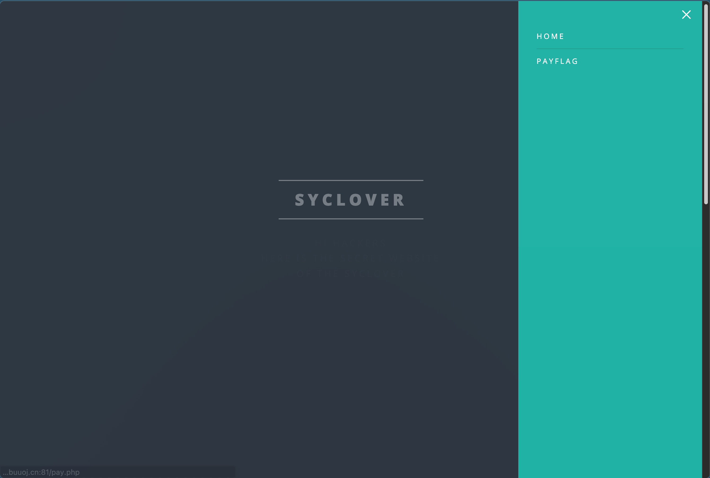
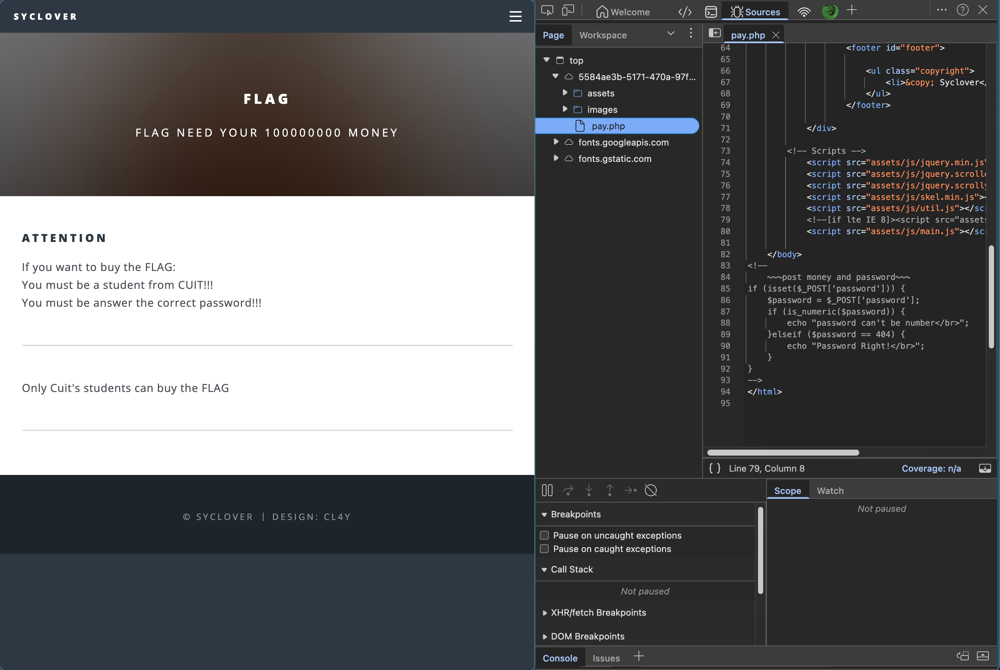
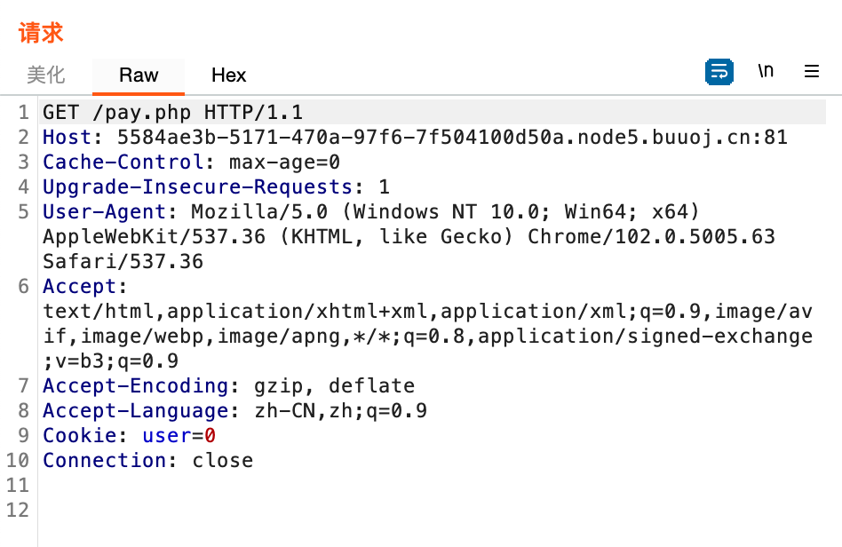
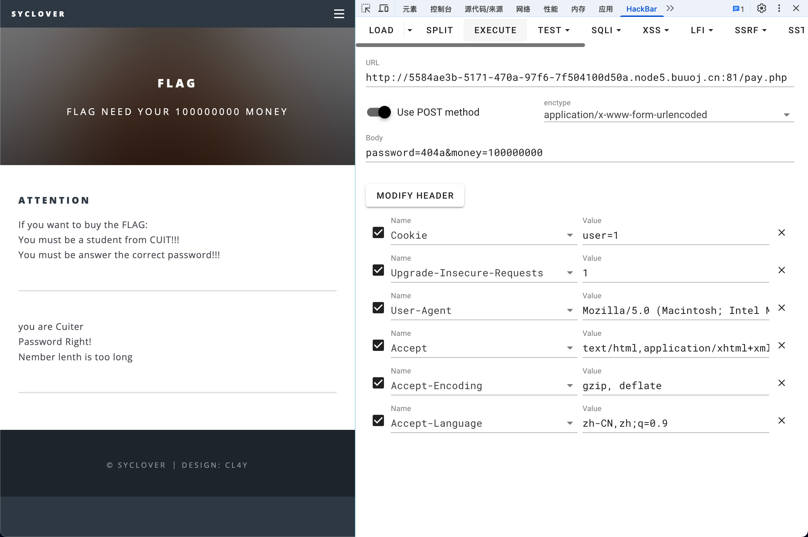
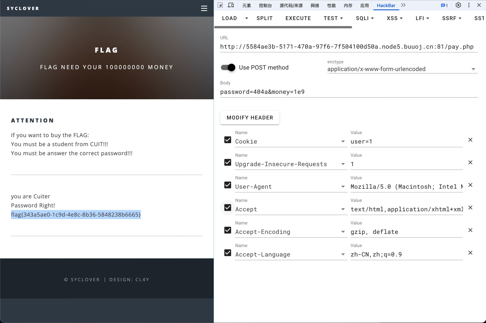

# [极客大挑战 2019]BuyFlag

## Tag

Http + PHP 弱比较

***

## Writeup

看到右上角有一个 PayFlag 入口：

点进去看到：

因此抓包查看：

里面有一个 user=0，我们改成 1，即可通过 CUIT 检查，同时使用密码 404a（PHP 弱比较绕过既不能为数字又要与 404 相等）：

接下来需要付钱，传递 money 参数为 100000000 过去发现：

传递科学计数法即可获得 flag：

