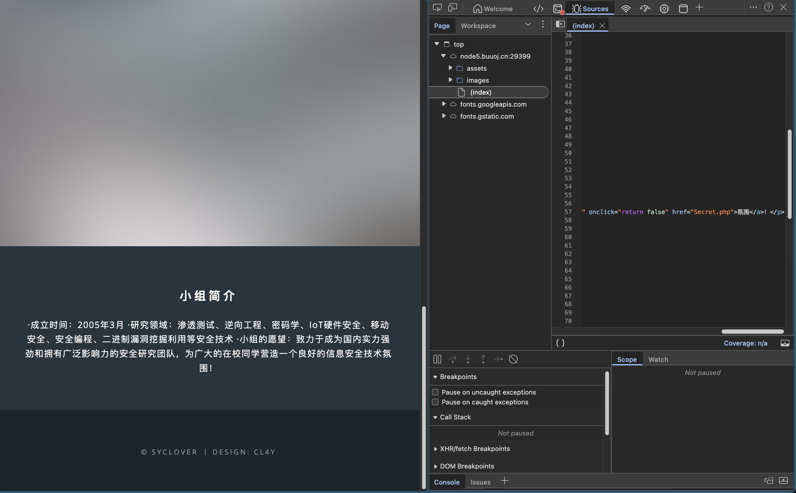
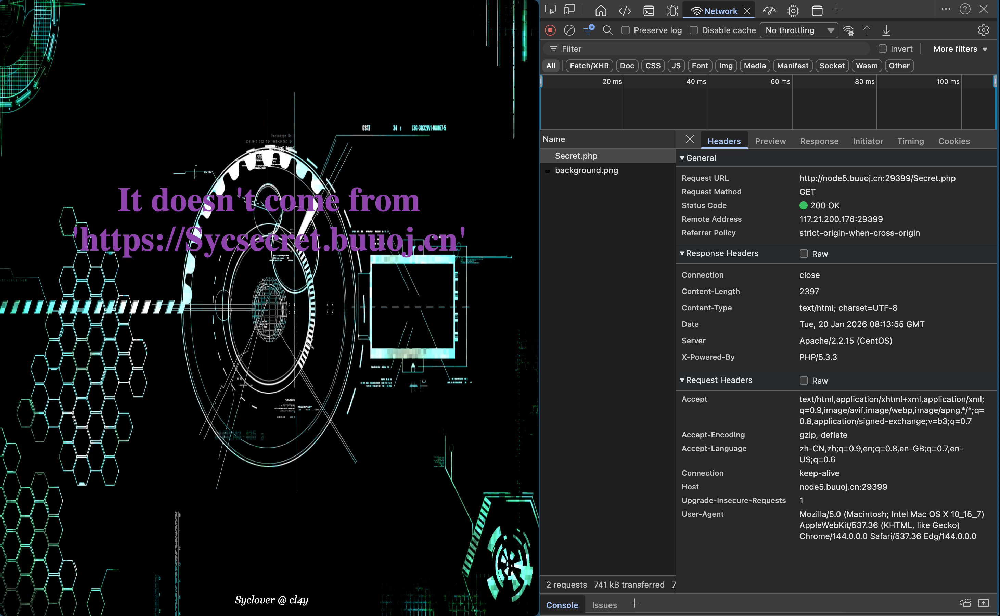
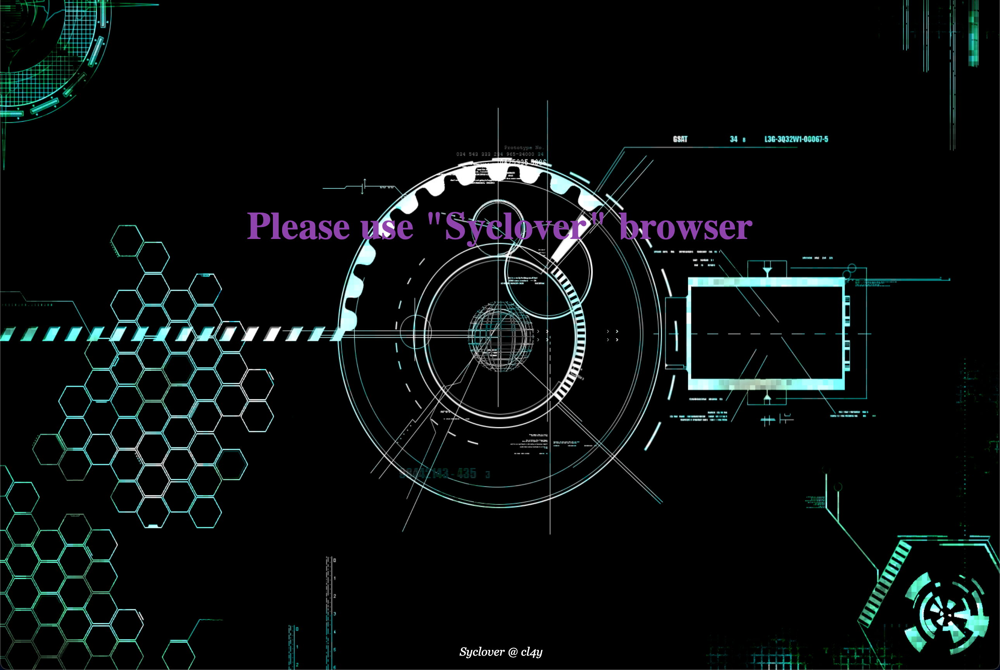
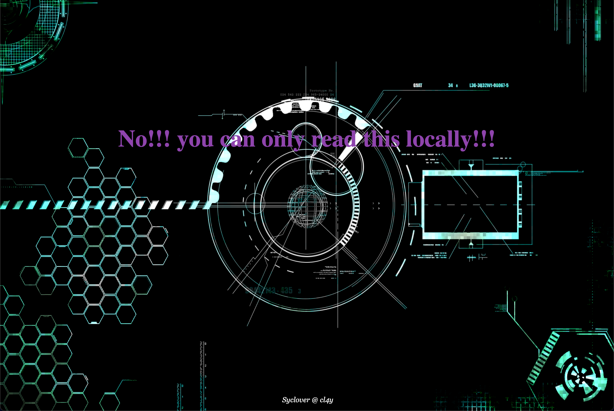
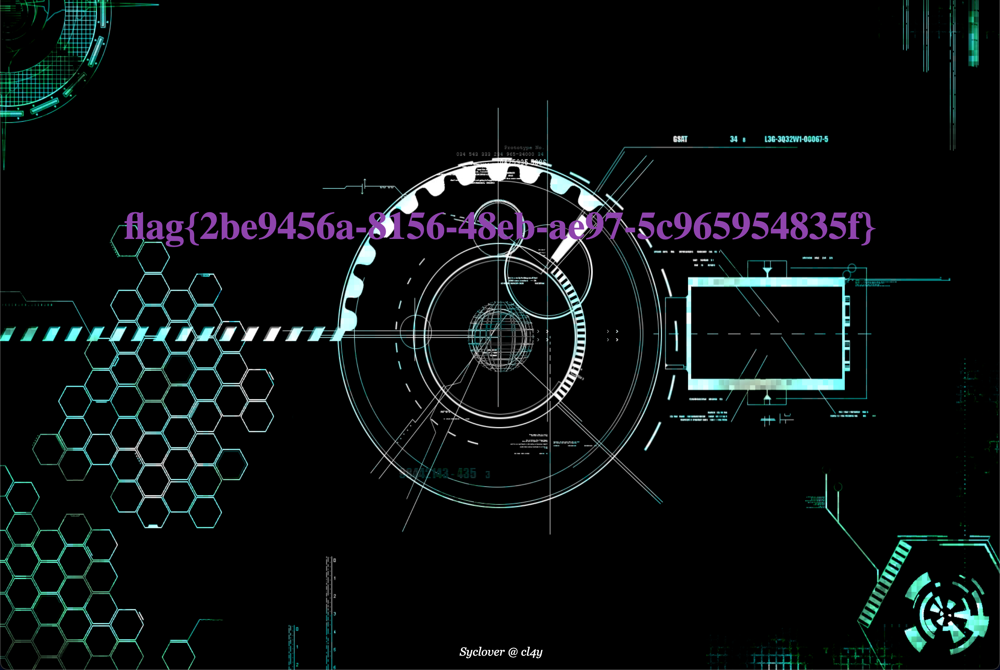

# [极客大挑战 2019]Http

## Tag

HTTP 包拦截篡改

***

## Writeup

查看源代码发现藏了个 Secret.php：

直接访问发现：

说明我们需要从 https://Sycsecret.buuoj.cn 来，合理猜测用 Referer（Referer: https://Sycsecret.buuoj.cn）：

再添加 Browser 为 Syclover（User-Agent: Syclover）：

Local 需要我们用 X-Forwarded-For: 127.0.0.1：

