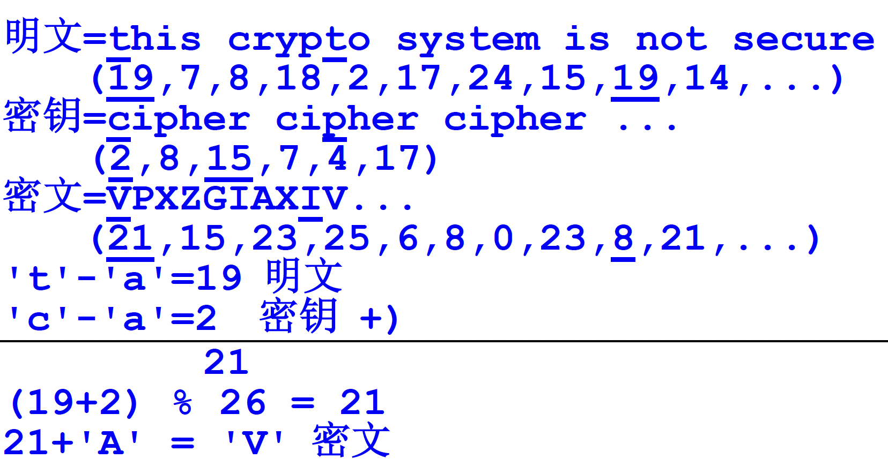

---
hide:
  #- navigation # 显示右
  #- toc #显示左
  - footer
  - feedback
comments: true
--- 

# Chapter 02 : 古典密码

> 加密过程（Encryption）为明文经过密钥通过加密算法进行加密变为密文的过程
> 
> 解密过程（Decryption）为密文解密还原成明文的过程

## 单表密码

> 单表密码只使用一张密码字母表，且明文字母与密文字母有固定的对应关系，我们可以使用频率分析法可以解决单表密码

### 加法密码

典型例子：凯撒加密

- 加密：$c = (p-$'$A$'$+3)\text{ mod }26+$'$A$'
- 解密：$p = (c-$'$A$'$-3)\text{ mod }26+$'$A$' 或 $p = (c-$'$A$'$+23)\text{ mod }26+$'$A$'
***
### 乘法密码

- 加密：$c = p\times k\text{ mod }n$
- 解密：$p = c\times k^{-1}\text{ mod }n$，其中 $k^{-1}$ 为 $k$ 的乘法逆元
***
### 仿射密码

- 加密：$c = (p\times k_1+k_2)\text{ mod }n$
- 解密：$p = (c-k_2)\times k_1^{-1}\text{ mod }n$
***
## 多表密码

> 多表密码是对每个明文字母采用不同的单表代换，即同一明文字母对应多个密文字母

典型例子：[Playfair](https://en.wikipedia.org/wiki/Playfair_cipher)、[Vigenere](https://en.wikipedia.org/wiki/Vigen%C3%A8re_cipher)、[Beaufort](https://en.wikipedia.org/wiki/Beaufort_cipher)、[Vernam](https://en.wikipedia.org/wiki/One-time_pad)、[Hill](https://en.wikipedia.org/wiki/Hill_cipher)、[Enigma](https://en.wikipedia.org/wiki/Cryptanalysis_of_the_Enigma)

### Vigenere

- 加密：$c_i = (p_i+k_i)\text{ mod }26$
- 解密：$p_i = (c_i-k_i)\text{ mod }26$

!!! example "Example"

	
***
### Enigma

> Enigma 是德国在二战时期使用的密码机，它由接线板、转子、反射器和键盘组成，使用了多表密码的原理

!!! question "Enigma 的工作方式是怎么样的？"

	- 发送方随机想出 3 个齿轮的外部状态（MessageKey），例如 ABC，以明文的形式把 ABC 发送给对方
	- 再想出要用到密钥即真正用来加密的齿轮初始状态为 ZJU
	- 在当前齿轮初始状态为 ABC 的情况下，在键盘上连续按下 ZJU 得到 ZJU 的密文，设为 Z'J'U' 发送给对方
	- 对方在齿轮初始状态为 ABC 的情况下，输入 Z'J'U' 一定可以解密出 ZJU

理想情况下，Enigma 的加密过程要经过 5 个元件形成一个循环，我们假定明文为 A 经过以下步骤：

- 接线板（Plugboard）：Enigma 会指定一些字母对（常规为 10 对），这些字母对在加密和解密时会互换，我们这里假定 A 和 B 互换，C 和 D 互换，明文加密为 B

	```c
	char plug[27] ="BADCEFGHIJKLMNOPQRSTUVWXYZ";
				  //ABCDEFGHIJKLMNOPQRSTUVWXYZ
	char c='A', e;
	e = plug[c-'A']; // e='B';
	```

- 齿轮（Rotor）1～3
	- 查表，各齿轮的转换表为（一般 IV 和 V 不常用）：
	
	```c
	char rotor_1[27]="EKMFLGDQVZNTOWYHXUSPAIBRCJ";//I
	char rotor_2[27]="AJDKSIRUXBLHWTMCQGZNPYFVOE";//II
	char rotor_3[27]="BDFHJLCPRTXVZNYEIWGAKMUSQO";//III
	char rotor_4[27]="ESOVPZJAYQUIRHXLNFTGKDCMWB";//IV
	char rotor_5[27]="VZBRGITYUPSDNHLXAWMJQOFECK";//V
					//ABCDEFGHIJKLMNOPQRSTUVWXYZ
	```
	
	- 假设分别经过齿轮 I，II，III，加密过程为 $B\Rightarrow K\Rightarrow L\Rightarrow V$

- 反射板（Reflector）

	```c
	char reflector[27]="YRUHQSLDPXNGOKMIEBFZCWVJAT";
				      //ABCDEFGHIJKLMNOPQRSTUVWXYZ
	```
	
	- 经过映射器后加密为 W

- 逆向齿轮
	- 反向查表（即从数组 rotor 查询字符，字符下标 `+ 'A'` 即为加密结果）
	- 经过齿轮 III，II，I，解密过程为 $W\Rightarrow R\Rightarrow G\Rightarrow F$
- 接线板
	- 通过接线板再次互换，根据我们的假设最终结果为 F

事实上，我们将 F 重新走一遍上面的流程，最终得到的结果一定是 A，这样就完成了加密和解密的过程

!!! note "实际情况"

	=== "MessageKey"
	
		在实际情况下对于每一个齿轮都有两个状态：
		
		- 初始状态（RingSetting）：在齿轮转动时不会发生变化
		- 外部状态（MessageKey）：随着每一次按键时都会发生变化
		
		当按下 A 键时，齿轮的外部状态因为旋转（即 MessageKey + 1）会发生变化（请谨记，<font color="red">每个齿轮都是先旋转再进行接下来的加密操作</font>），例如齿轮 I 的RingSetting = C, MessageKey = A，当按下 A 键时，MessageKey 变为 B，需要进行如下运算：
		
		```c
		char c = 'A';
		int delta = MessageKey - RingSetting;
		c = ((c - 'A') + delta + 26) % 26 + 'A';
		```
		
		这时候 A 被加密为 Z，查表过后为 J，我们还需要进行逆偏移运算：
		
		```c
		c = ((c - 'A') - delta + 26) % 26 + 'A';
		```
		
		这时候 J 变为了 K，其他所有的齿轮同理
	
	=== "Stepping"
	
		在实际情况下，并非每个齿轮是独立旋转的，在达到某个字母时，它会让下一个齿轮随之转动（有点像进位），当 rotor I、II、III、IV、V 为 Q、E、V、J、Z 时，若再键入字符，则下一个 rotor 会转动一格。（当然，这个 rotor 也会转动一格，分别变为 R、F、W、K、A，小白老师的记忆方法是 Royal Flag Wave Kings Above），5 个 rotor 的 QEVJZ 称为“**使进位字母**”，又敲键能使下一个 rotor 转动
		
		由 Enigma 的机械结构决定，中间的 rotor 有两种情况会转动: 
		 
		1. 右边的 rotor 在自身的“使进位字母”，又敲键，右边的使中间的转动  
		2. 中间的 rotor 在自身的“使进位字母”，又敲键，中间的反常转动（不论右边在什么位置）（反常机制，只有中间的 rotor 具有）
		
		!!! example "Example"
		
			假定 III = 1 = A, II = 4 = D, I = 17 = Q
			
			现在 I 旋转，从 Q 变成 R，一定会带动 II 旋转: III = 1 = A, II = 5 = E, I = 18 = R  
			
			此时再旋转 I 的话，I 本来是不应该带动 II 转的（因为当前 I 不在 Q 这个位置），但是 II 还会立即再转，同时 II 正常带动 III 旋转: III = 2 = B, II = 6 = F, I = 19 = S


