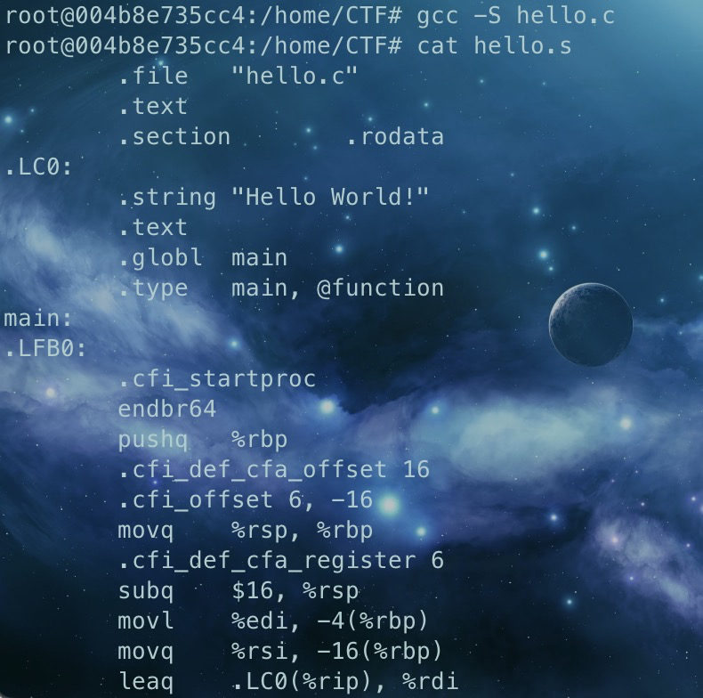
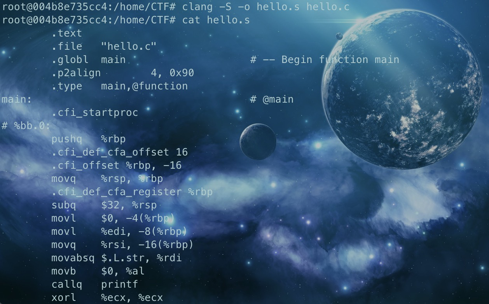
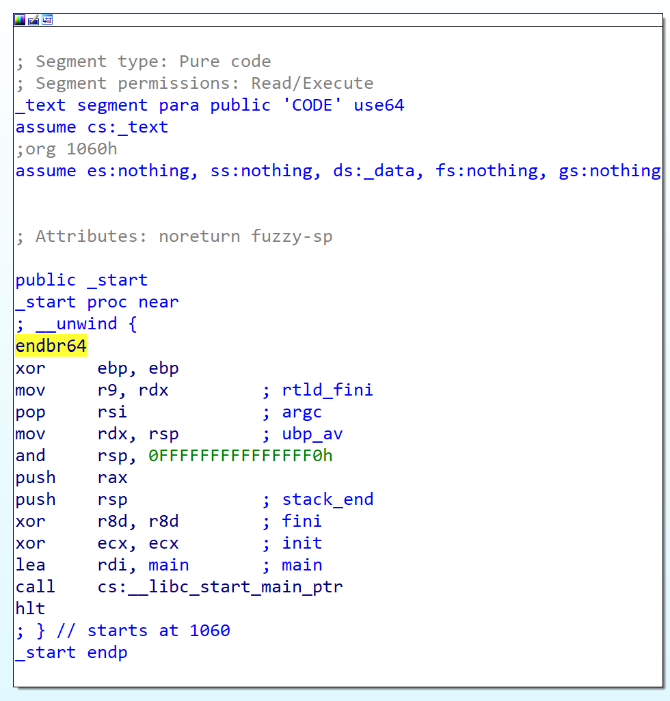
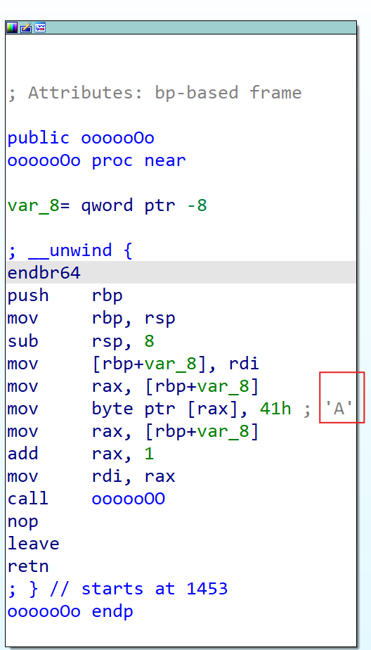
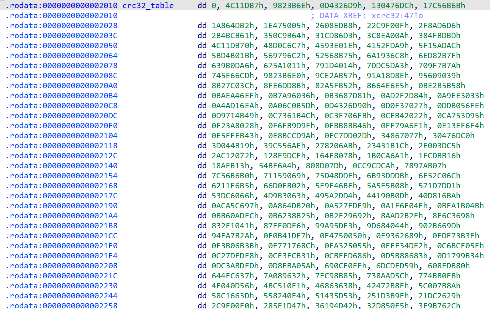

# Lab1-Rev Report

## Task 1

### Case 1:gcc+as




编译与汇编均成功。

### Case 2:gcc+llvm-mc


编译同上，汇编成功。

### Case 3:clang+as




编译成功，汇编失败。这其中的原因在于 Clang 默认使用的是 AT&T 汇编语言语法，而 as 期望的是 Intel 语法，这样就产生了上图的 errors：unknown...

### Case 4:clang+llvm-mc


编译同上，汇编成功。

## Task 2

拿到 elf，毫不犹豫直接丢进 IDA 反汇编，可以看到入口函数 _start 的结构：



其伪代码如下：


这里没有什么关键信息，但是我们发现 IDA 有显示一堆奇奇怪怪的字符串：


一个个点开，拼起来我们就直接得到 flag 了？！（也太快了吧）



最后拼接成的 flag 为：AAA{hope_u_have_fun~}

## Task 3

将 challenge2.bc 文件使用命令行 `clang challenge2.bc -o challenge2` 进行编译，将生成的 elf 放进 IDA 中反汇编。

其主程序如下：


根据这里，我们发现需要一个重要的数组：target，用于检测，我们翻找发现 target 数组：


此外，还有一个函数 xcrc32 也需要我们寻找，其程序如下：


这其中还有一个 crc32_table，查找可得：



注意到 xcrc 这个函数，我们关注 a3 的末 8 位，当 `a3 << 8` 时整体的末 8 位均为 0，那么执行一次赋值操作就将 crc32_table 中某个元素的末八位给 a3。

而且根据~~观察~~大胆猜测 crc32_table 每个元素的末 8 位不同，可以知道执行操作的 crc_table 元素的完整数据，那么根据异或操作 `a ^ b = c` 可推出 `b = a ^ c` ，即可获得前一次操作 `a3 << 8` 的值。

将 a3 右移八位，同之前的道理，还是可以得到最初的 crc_table 元素的完整数据，此时我们也知道初始的 a3 为 `0x414243` ，那么异或一下我们就可以得到中间算出的 a3 完整数据，这样对应的字符也就迎刃而解了！（撒花！）

编写 Python 程序如下：

```python
target = [0x3636336A, 0x4D5F57D7, 0x44DD6CB9, 0x253245B6, 0x3636336A,0x253245B6, 0x8883FD60, 0x85C0DBB9]
crc_table = [
    0x0, 0x4C11DB7, 0x9823B6E, 0xD4326D9, 0x130476DC, 0x17C56B6B, 0x1A864DB2, 0x1E475005,... #直接从 IDA copy 过来
]

def search_crc_table(num):
    for i in range(256):
        if (crc_table[i] & 0xFF) == num:
            return i

con = 0x414243

for i in range(8):
    low1 = target[i] & 0xFF;
    index1 = search_crc_table(low1)
    temp = target[i] ^ crc_table[index1]
    temp = temp >> 8

    low2 = temp & 0xFF
    index2 = search_crc_table(low2)
    real = crc_table[index2] ^ (con << 8)
    high1 = real >> 24

    ans1 = chr(index1 ^ high1)
    ans0 = chr(index2)

    print(ans0 + ans1, end="")
```

最后得到 flag：

