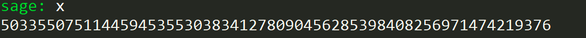
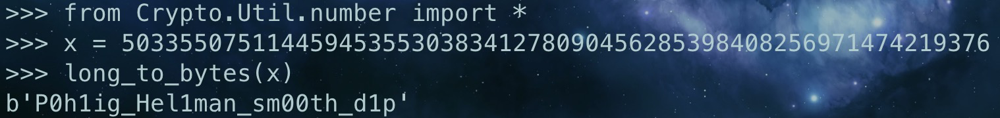

# Lab3-Crypto Report

## BabyDLP

根据 Pohlig-Hellman 算法，我们可以将算法分为以下几步：

- 质因数分解 p - 1
- 检查 g 的阶，更新 order
- 再次质因数分解 order，得到 m 个因子组成的数组 pr
- 对于 pr 的每个 $p_i^{k_i}$ ，离散对数算出 $(g^x)^{\frac{p-1}{p_i^r}}\equiv a^{\frac{p-1}{p_i^r}}(mod\space p)$ 的解
- 得到 m 个关于 x 的式子，利用中国剩余定理计算出最后 x 的值

编写 sage 代码如下：

```python
p = 22874236765582512818346580947708667745188778288884101219751361699392149989458510773797824610944321686257783426829474659298957510513578978620495392070614563
g = 12992966891086556058043617860106952736598816342586014149483372202900857379441187722193997976148795991526844581149548123484519204440052676174785545786320297
c = 4006948706881298103593084841644986324930377713436980291670378524564662999515313693489885343780490631115314181593435331209712709857825836348345723998675361

factors, ex = zip(*factor(p - 1))
order = p - 1
for i in factors:
    if pow(g, (p - 1) // i, p) == 1:
        order //= i
fac, ew1 = zip(*factor(order))
pr = [fac[i] ^ ew1[i] for i in range(len(fac))][:-1]
ans = []
G = GF(p)
for fa in pr:
    t = order // int(fa)
    d = discrete_log(pow(c, t, p), pow(g, t, p))
    ans.append(d)

x = crt(ans, pr)
```

运行得到：



在 python 里面将其转换为字符串：



所以最后的 flag 为：ZJUCTF{P0h1ig_Hel1man_sm00th_d1p}