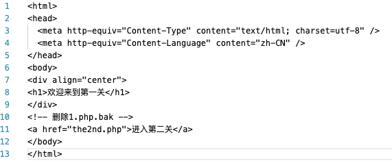
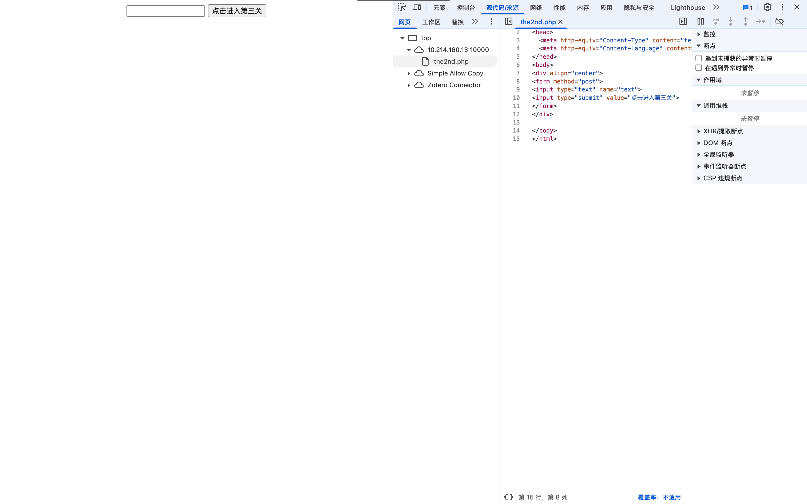
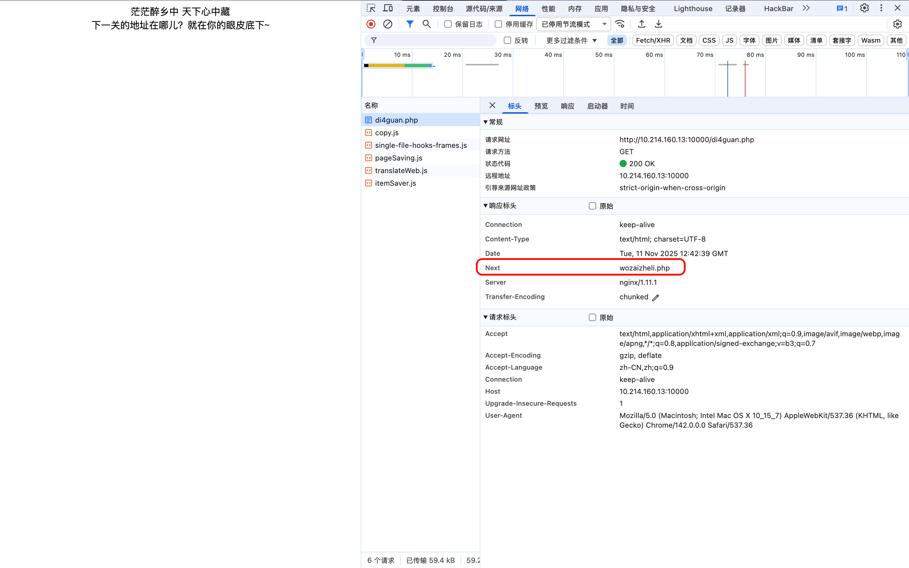
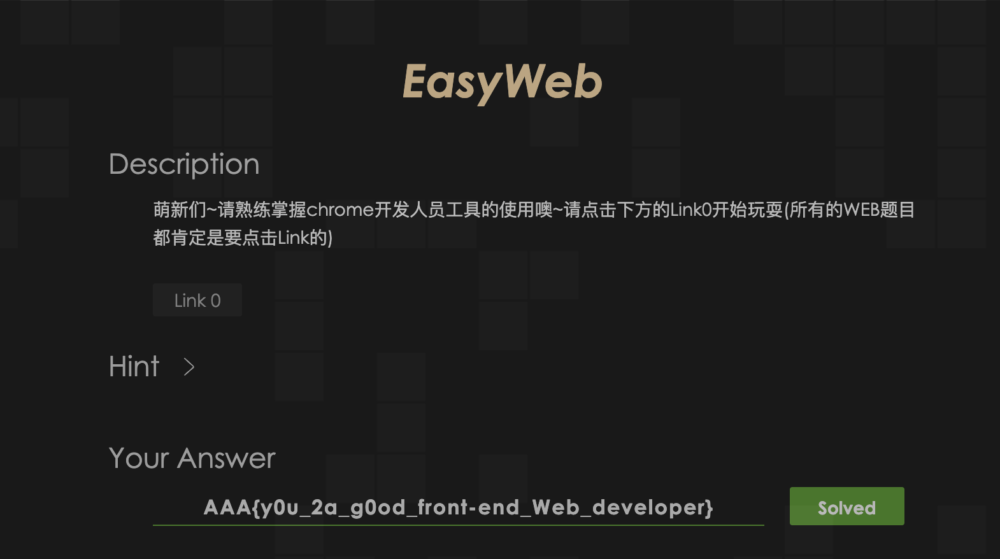

# EasyWeb

## Tag

.bak，F12，反射型 XSS
***
## Writeup

F12 查看第一关源码，能看到有一个 1.php.bak：


下载并查看隐藏的 11 行内容：



就可以看到第二关的 php：



就是一个表单， 随便输一个东西，在 F12 会发现跳出脚本：

```javascript
<script>
	function jump(url){
		document.body.appendChild(document.createElement('iframe')).src='javascript:"<script>top.location.replace(\''+url+'\')<\/script>"';
	}
	setInterval("jump('3rd.php')",2000);
</script>
```

然后跳转到 3rd.php，提示“你从哪里来？”，然后又跳回原来的地方，这是一个反射型 XSS 漏洞，在提交表单时通过 Header 的 Referer 来确定了你是从 the2nd.php 跳转而来，这样是过不了检查的，可以看到我们输入的东西被直接注入到这个 jump 函数里面，我们可以输入一些脚本去除 Referer，例如 `<iframe srcdoc="<script>top.location='3rd.php'</script>" referrerpolicy="no-referrer"></iframe>`

可以进入到下一关：


查看请求包头能找到下一关的 php 地址：



访问进入下一关：


题目设置了按钮，鼠标悬停就会彻底消失，想要点击按钮，可以通过按 tab，然后回车来点击按钮，也可以通过控制台执行 `document.getElementById('submit').click();` 来实现点击，获得 flag：



