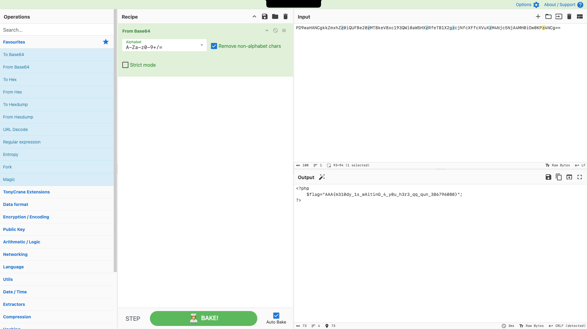

# Php Include

## Tag

文件包含绕过
***
## Writeup

有一个非预期，直接使用 `?f=php://filter/read=convert.base64-encode/resource=flag.php` 即可直接读取 flag.php 内容，cyberchef 解码即可获得 flag：

正常做法就是做一个图片马，包含一句话木马上传（直接以 jpg 格式上传），然后蚁剑连 `/index.php?f=upload/20251113775817.jpg` 即可 getshell

