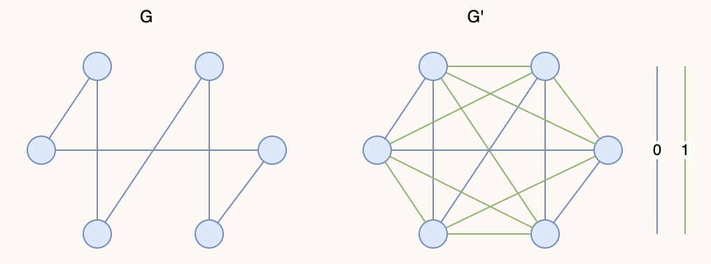

---
hide:
  #- navigation # 显示右
  #- toc #显示左
  - footer
  - feedback
# comments: true
--- 

# Chapter 10 : NP Completeness

## Abstract

!!! Abstract

	正巧，Bruce 在数模课上面学过一点 NP 完全性了（虽然一点都没学懂），ADS 再来一遍，数模有关的笔记可转至 [数模 NP 笔记](https://brucejqs.github.io/MyNotebook/blog/ACEE/Mathematical%20Modeling/Chapter%203/#_9)
***
## Introduction

根据问题的难度，由不同的定义划分，问题可以分为：

- **P** 问题（Polynomial Time）
- **NP** 问题（Nondeterministic Polynomial Time）
- **NPC** 问题（NP Complete）
- **NPH** 问题（NP Hard）
- 不可计算问题（Undecidable）
***
### P Problems

P 取自 Polynomial Time，指的是可以用**确定型图灵机**在**多项式**时间内**解决**的问题。

也就是我们通常意义下所说的，可以在**多项式**时间内**解决**的问题。

!!! note "Turing Machine"

	图灵机有一些变体，而我们在这里引入图灵机是为了介绍 P/NP，只介绍**[确定型图灵机](https://en.wikipedia.org/wiki/Turing_machine)**和**[非确定型图灵机](https://en.wikipedia.org/wiki/Nondeterministic_Turing_machine)**。

	> 图灵机由一个**无限长的纸带**和一个**读写头**组成。纸带被划分为一个个**格子**，每个格子上有一个**符号**，读写头可以在纸带上移动，读写头可以读取当前格子上的符号，也可以改变当前格子上的符号。图灵机的**状态**是一个有限集合，每个状态都有一个**转移函数**，转移函数的输入是当前状态和当前格子上的符号，输出是下一个状态、下一个格子上的符号和读写头的移动方向。
	
	确定型图灵机每次都能执行一个指令，并且<font color="red">根据当前指令跳转到下一个唯一的指令</font>，非确定型图灵机<font color="red">可以从有限集中随意选择下一步</font>，如果当前得到了一个答案，那么<font color="red">它一直都会选择正确的那一步</font>。
	
	更本质的来说，图灵机是一种**计算模型**，我们可以用它来表示任何有限逻辑数学过程。确定型图灵机与我们常规理解的计算机逻辑类似，即下一步要做什么可以根据当前状态确定。而非确定型图灵机则类似于能够进行无限并行，并且最终总是选择通向正确答案的方向的那条路（有点类似于它能开平行宇宙，并且总是让你观测到正确的那一个平行宇宙）。
***
### NP Problems

NP 即 Nondeterministic Polynomial Time，指的是可以用非确定型图灵机**在**多项式**时间内**解决**的问题。这个说法等价于可以用确定型图灵机**在**多项式**时间内**验证**（判断答案是否正确）。

也就是我们通常意义下所说的，可以在**多项式**时间内**验证**的问题。
***
### NP-Complete Problems

NPC 即 NP complete，NP 完全，是 NP 中最难的**决定性**问题（并不是无限定词的最难的问题！）。而我们称满足如下条件的问题为 NPC 问题：

1. 是一个 NP 问题；
2. 所有 NP 问题都可以**多项式时间归约**为该问题；

!!! note "Polynomial Reduce"

	我们引入 P/NP 等这些概念，是为了衡量问题的复杂程度，而如何在具体的“问题”间传递、比较这种“复杂程度”，就是**[多项式时间归约（Polynomial Reduce）](https://en.wikipedia.org/wiki/Polynomial-time_reduction)**的目的。
	
	
	
	如果我们能在多项式时间的复杂度内，将问题 A 转化为问题 B，则称问题 A 可以**多项式时间归约**为 B，记为 $A\leq_p B$，表示 A 不会比 B 难。

	而采取数学语言来描述，则是：
	
	$$
	\begin{gather}
	A\leq_p B\Leftrightarrow \exists f() \text{ which runs in polynomial time},\\
	s.t.\forall x\in A,f(x)\in B\\
	\text{and }\forall f(x)\in B,y\in A
	\end{gather}
	$$
	
	

由 2 可以有结论，所有的 NPC 问题难度相同——一旦有一个 NPC 问题被解决，那么所有 NPC 问题，乃至所有 NP 问题都能被解决。

如果我们试图证明一个问题是 NPC 问题，我们可以通过这种手段：

1. 判定该问题是一个 NP 问题；
2. 判定一个已知的 NPC 问题可以**多项式时间归约**为该问题，或判定该问题是 NPH 问题；

> 第一个被证明是 NPC 的问题是 **Circuit-SAT** 问题。

!!! note "Circuit-SAT"

	Circuit-SAT 又叫 [Circuit Satisfiability Problem](https://en.wikipedia.org/wiki/Circuit_satisfiability_problem)，它是最早被证明是 NPC 的问题，即通过 NPC 问题的定义证明。
	
	Circuit-SAT 即为确定给定布尔电路是否具有使输出为真的输入分配的决策的问题。
	
	
	
	上图中，左侧电路满足条件，右侧电路不满足条件。
	
	或者，更抽象的来说，是判断一个具有 $n$ 个布尔变量的布尔表达式是否具有结果为 True 的解。(这跟离散当中的 [Propositional Satisfiability](https://brucejqs.github.io/MyNotebook/blog/Math/Discrete%20mathmatics/Discrete%20mathmatics%20notes-Ch01/#propositional-satisfiability) 对应上了)
	
	特别地，[3-SAT](https://en.wikipedia.org/wiki/Boolean_satisfiability_problem#3-satisfiability) 是 Circuit-SAT 问题的一个特例，它对布尔电路，或者说布尔表达式的形式有特殊要求，具体来说，它要求布尔表达式形如：
	
	$$
	(x_1​\lor x_2\lor x_3​)\land(x_4​\lor x_5​\lor x_6​)\land...\land(x_{n−2}​\lor x_{n−1}\lor x_n​)
	$$
	
	- 变量是否重复、是否取非不是重点，$x_1​$ 可以和 $x_6$​ 是同一个变量，也可以是某个变量的非，重点是这里的三个一组的形式。

??? question "P=NP & NPC?"

	关于 P 和 NP 的关系，我们仍然不知道 P 是否能等于 NP，即我们仍然不知道是否存在多项式算法可以解决一切 NP 问题。
	
	而其中的关键就是，如果我们能找到 NPC 问题的多项式解法，那么就可以证明 P = NP。
***
### NP-Hard Problems

NPH 即 NP hard，NP 困难，它不一定需要是 NP 问题。而所有 NP 问题都可以**多项式时间归约**为 NPH 问题。

也就是说 $NPC=NP\bigcap NPH$。
***
我们可以用这样一张图来表示这前四个概念的关系：


这体现了 NP–hard 可以是 NP 问题，也可以不是 NP 问题。
***
### Undecidable Problems

**不可判定问题（Undecidable Problem）**是一类特殊的[决定性问题](https://en.wikipedia.org/wiki/Decision_problem)，它的特点是我们无法设计一个算法来求解它的结果。

其中一个比较典型的例子就是[图灵停机问题](https://en.wikipedia.org/wiki/Halting_problem)。

!!! note "图灵停机问题"

	停机问题是一个典型的不可计算问题，它指的是，对于任意一个程序，我们无法设计一个算法来判断它是否会在有限时间内停机（即判断程序是否会死循环）。
	
	我们通过反证法可以证明：
	
	假设存在函数 `willHalt(func F)` 可以判断函数 F 是否会停机，如果会，则返回 `true`，否则返回 `false`。那么我们可以构造一个这样的函数 `foo()`：
	
	```c
	void foo() {
		if ( willHalt(foo) ) {
			while (true) {} // Endless loop.
		}
		return;
	}
	```

	接下来，如果我们想知道 `foo()` 是否会停机，就会执行 `willHalt(foo)`。然而在 `foo()` 内部也有一个 `willHalt(foo)`，如果它认为 `foo()` 会停机，则构造一个死循环；而如果它认为 `foo()` 不会停机，则选择让它立刻停机，于是这里就产生了矛盾。

	理解上面这段内容的关键就是，这里虽然不存在事实意义上的“死循环”，但可以理解为这里存在一个逻辑上的递归，而这种“逻辑上的递归”，正是导致停机问题成为一个不可计算问题的原因。
***
## Other Examples

### Hamilton Cycle Problem

[汉密尔顿回路问题](https://en.wikipedia.org/wiki/Hamiltonian_path_problem) 即为给定一个图，判断是否存在一条路径，使得它经过图中的每个点恰好一次，且最后回到起点，它是一个 NPC 问题。
***
### Traveling Salesman Problem

[旅行商问题（Traveling Salesman Problem）]([https://en.wikipedia.org/wiki/Travelling_salesman_problem](https://en.wikipedia.org/wiki/Travelling_salesman_problem))有两种定义，前者是 NPH，而被称为“判定版本”的后者是 NPC。

- 原始定义：给定一个**完全**图，判断是否存在一条路径，使得它经过图中的每个点恰好一次，且最后回到起点，且路径**长度最短**。该定义常出现在组合优化的语境中。
- 判定版本：给定一个**完全**图，判断是否存在一条路径，使得它经过图中的每个点恰好一次，且最后回到起点，且路径**长度不超过** $k$。该定义常出现在复杂度理论的语境中。

!!! note "判定版本 NPC 证明"

	现在，假设我们已知 Hamilton Cycle Problem 问题是一个 NPC 问题，尝试通过**多项式时间归约**的方式来证明 TSP 也是一个 NPC 问题。
	
	首先回顾证明 NPC 的步骤：
	
	1. 判定该问题是一个 NP 问题；
	2. 判定一个已知的 NPC 问题可以**多项式时间归约**为该问题，或者说判定该问题是 NPH 问题；
	
	代入到这个问题中，也就是我们需要证明：
	
	1. TSP 是一个 NP 问题；
	2. Hamilton Cycle Problem 可以**多项式时间归约**为 TSP；
	
	!!! note "TSP 的 NP 证明"
	
		证明 TSP 是一个 NP 问题即证明 TSP 的解可以在多项式时间内被验证。而验证一个解是 TSP 问题的解，需要证明下面两个点：

		1. 这条路径经过了所有节点恰好一次；
		2. 这条路径长度不超过 $k$；
		
		显然，这两条都只需要 $O(N)$ 的开销就能验证。
		
		于是，我们得到结论：$TSP\in NP$。
	
	!!! note "TSP 的 NPH 证明"
	
		要证明 TSP 是一个 NPH 问题，我们可以通过证明 Hamilton Cycle Problem(HCP) 可以**多项式时间归约**为 TSP。
		
		为此，我们需要对比 HCP 和 TSP 的差异。
		
		以 HCP 为基础描述 TSP，实际上就是在一张**完全图**上寻找**总长不超过** $k$ 的哈密顿环路，具体来说：
		
		|   **HCP**    |      **TSP**       |
		|:------------:|:------------------:|
		| 图 $G(V,E)$ | 完全图 $G'(V',E')$ |
		|    无边权    |       有边权       |
		|      -       |  $\sum v_i\leq k$  |
		
		而为了证明 $HCP\leq_p TCP$，我们设计一个**多项式时间**的方法 `f()` 实现 $G(V,E)\rightarrow G'(V',E')$，具体来说，它做这些事：

		1. 连接 $G$ 中所有没连上的边，使 $G$ 成为一张无权完全图；
		2. 对于无权完全图中的每一条边 $v_i^c​$，如果在 $G$ 中也有这条边，那么令它边权为 0，否则令它边权为 1，于是得到有权完全图 $G'(V',E')$；
		
		
		
		> 右图中所有的蓝边边权都为 0，绿边边权都为 1。
		
		由于完全图的边数为 $\frac{n(n−1)}{2}$​，所以这个步骤显然是多项式时间的。
		
		接下来，我们发现，原问题为在 $G$ 上寻找哈密顿环，等价于在 $G'=f(G)$ 上做 $k=0$ 的 TSP。由此证明 $HCP\leq_p TSP$，即 $TSP\in NPH$。

综上所述，由于 $TSP\in NP$ 且 $TSP\in NPH$，所以 $TSP\in NPC$。
***
### A Formal-Language Framework

在形式语言中，我们将问题分为两类：**抽象问题**（Abstract Problem）和**具体问题**（Concrete Problem）。

- 抽象问题 $Q$ 是一个关于集合 $I$ 和集合 $S$ 的一个二元关系。其中 $I$ 表示问题**实例**（Instance），$S$ 表示问题的**解**（Solution）
- 具体问题实际上是对抽象问题的一种**编码**（Encoding)——将 $I$ 映射到一个位串上（用一个 01 串 $\{0,1\}^∗$ 表示），$Q$ 就变成了具体问题

!!! example

	对于最短路问题来说：
    
    - $I=\{<G,u,v>:G=(V,E)\text{ is an undirected graph}; u,v\in V\}$
    - $S=\{<u,w_1,w_2,…,w_k,v>:<u,w_1>,…,<w_k,v>\in E\}$
    - 则 $\forall i\in I,\text{SHORTEST-PATH}(i)=s\in S$
    
	而对于路径决策问题：
	
	- $I=\{<G,u,v,k>:G=(V,E)\text{ is an undirected graph}; u,v\in V;k\geq 0\text{ is an integer}\}$
	- $S=\{0,1\}$
	- 则 $\forall i\in I,\text{PATH}(i)=1\text{ or }0$

形式语言的正式定义：

- 字母表 $\Sigma$ 表示一个有限符号集
- 语言 $L$ 表示由 $\Sigma$ 中的字符构成的字符串集
- 记空字符串为 $\epsilon$，空语言为 $\phi$
- 包含所有字符串的语言记作 $\Sigma^∗$
- $L$ 的**补**(complement) 记作 $\overline{L}=\Sigma^∗−L$
- $L_1$ 和 $L_2$​ 的**拼接**（Concatation）为 $L=\{x_1x_2:x_1\in L_1\land x_2\in L_2\}$
- $L$ 的克莱尼闭包（Kleene Closure） 为 $L^∗=\{\epsilon\}\bigcup L\bigcup L^2\bigcup L^3\bigcup…$，其中 $L_k$ 表示连续拼接 $k$ 个 $L$

> 在决策问题当中，$\Sigma=\{0,1\},L=\{x\in\Sigma^∗:Q(x)=1\}$

- 若 $A(x)=1$，称算法 $A$ **接受**了字符串 $x\in\{0,1\}^∗$；若 $A(x)=0$，称算法 $A$ **拒绝**了字符串 $x$
- 如果 $L$ 的每一个位串都能够被算法 $A$ 接受或拒绝，称语言 $L$ 能够被算法 $A$ **判定**

因此 $P$ 类问题可以用形式语言表述为：

$$
P=\{L\subseteq \{0,1\}^∗\}:\text{ there exists an algorithm A that decides L in polynomial time}
$$

- **验证算法**（Verification Algorithm） 是一个由两个参数的算法，第一个参数是一个输入字符串 $x$，另一个参数是一个位串 $y$，称为**证书**（Certificate）（其实就是问题的解）
    - 如果对于输入字符串 $x$，存在证书 $y$，使得 $A(x,y)=1$ 成立，则称双参数算法 $A$ 能够验证 $x$
    - 如果对于 $L=\{x\in\{0,1\}^∗\}$，存在 $y\in\{0,1\}^∗$ 使得 $A(x,y)=1$ 成立，则称验证算法 $A$ 能够验证语言 $L$

!!! example

	对于 SAT 问题，令 $x=(\overline{x_1}\lor x_2\lor x_3)\land(x_1\lor \overline{x_2}\lor x_3)\land(x_1\lor x_2\lor x_4)\land(\overline{x_1}\lor\overline{x_3}\lor\overline{x_4})$，那么证书 $y=\{x_1=1,x_2=1,x_3=0,x_4=1\}$

所以，语言 $L$ 为 NP 问题的充要条件为：存在一个多项式复杂度的双参数算法 $A$ 和一个常数 $c$，使得 $L=\{x\in\{0,1\}^∗:\text{ there exists a certificate }y\text{ with }|y|=O(|x|^c)\text{ such that }A(x,y)=1\}$，我们称算法 $A$ 能够在多项式时间内验证 $L$ 的解的正确性。

假如已知 $L\in NP$，那么我们是否能够得出 $\overline{L}\in NP$ 的结论（这类问题被称为 [co-NP 问题](https://en.wikipedia.org/wiki/Co-NP)）呢？目前有以下四种猜想：


---

如果存在多项式复杂度的可计算的函数 $f:\{0,1\}^∗\rightarrow\{0,1\}^∗,\forall x\in\{0,1\}^∗,x\in L_1$​ 的充要条件为 $f(x)\in L_2$​，则称语言 $L_1​$ 是可以多项式时间内归约为语言 $L_2​$ 的，记为 $L_1\leq_P L_2$（$L_1$​ 的难度不大于 $L_2​$），称 $f$ 为**归约函数**（Reduction Function），称计算 $f$ 的多项式时间算法 $F$ 为**归约算法**（Reduction Algorithm）。

现在可以用形式语言描述 NP 完全问题：如果满足下列条件，称语言 $L\subseteq\{0,1\}^∗$ 为 NP 完全问题：

- $L\in NP$
- $\forall L'\in NP,L'\leq_P L$

!!! example

	=== "Question"
	
		假设我们已经知道**团问题**(Clique Problem) 是 NP 完全问题，请证明**顶点覆盖问题**(Vertex Cover Problem) 也是 NP 完全问题。

		- 团问题：给定无向图 $G=(V,E)$ 和整数 $K$，$G$ 是否存在一个（至少）包含 $K$ 个顶点的**完全子图（团）**
		- 顶点覆盖问题：给定无向图 $G=(V,E)$ 和整数 $K$，$G$ 是否存在一个顶点子集 $V'\subseteq V$，使得 $∣V'∣\leq K$ 且 $G$ 中的每条边上的顶点被包含在 $V'$ 中（顶点覆盖）
	
	=== "Proof"
	
		先用抽象问题来描述：

		- $CLIQUE=\{<G,K>: G\text{ is a graph with a clique of size }K\}$
		- $VERTEX-COVER=\{<G,K>: G\text{ has a vertex cover of size }K\}$
		
		我们需要证明两件事：
		
		- $VERTEX-COVER\in NP$：
		    
		    - $\forall x=<G,K>$，令证书 $y$ 为顶点子集 $V'\subseteq V$
		    - 归约算法为：
		        - 检查是否满足 $∣V'∣=K$
		        - 检查是否 $\forall edge (u,v)$，使得 $u\in V'$ 或 $v\in V'$
	        - 时间复杂度：$O(N^3)$（遍历所有边（$N^2$）× 每条边至少检验其中一点是否在 $V'$ 内（$N$））
		- CLIQUE$\leq_P$VERTEX-COVER，即证 $G$ 有一个大小为 $K$ 的**团**的充要条件为 $\overline{G}$ 有一个大小为 $∣V∣−K$ 的**顶点覆盖**
		    
		    - 充分性：
		        - 令 $(u,v)$ 为 $\overline{E}$ 上的任意一边，可以得到以下结论：
			        - $u,v$ 中至少有一点不属于 $V'$，且至少有一点属于 $V−V'$
			        - 每条在 $\overline{G}$ 内的边，它的一个顶点在 $V−V'$ 内
			        - 因此大小为 $∣V∣−K$ 的集合 $V−V'$ 构成了 $\overline{G}$ 的一个顶点覆盖
		    - 必要性：
		        - $\forall u,v\in V$，如果 $(u,v)\not\in E$，那么 $u\in V'$ 或 $v\in V'$，或两者皆满足
		        - $\forall u,v\in V$，如果 $u\not\in V'$ 且 $v\not\in V'$，则 $(u,v)\in E$
		        - 所以 $V−V'$ 是一个大小为 $∣V∣−∣V'∣=K$ 的团
***
## Homework

!!! question "Question 01"

	If $L_1\leq_p​ L_2$​ and $L_2​\in NP$, then $L_1​\in NP$.
	
	??? note "Answer"
	
		True. 因为 $L_2$ 为 NP 问题（即可以在非确定性图灵机上多项式时间解决），而 $L_1$ 不比 $L_2$ 难，那么 $L_1$ 可以先多项式归约到 $L_2$，再在非确定性图灵机上多项式时间解决 $L_2$，即 $L_1$ 也可以在非确定性图灵机上多项式时间解决，即 $L_1$ 也为 NP 问题

!!! question "Question 02"

	If a problem can be solved by dynamic programming, it must be solved in polynomial time.
	
	??? note "Answer"
	
		False. 0-1 背包问题是可以用动规解的，但是并不能在多项式时间内解决（因为背包问题的时间复杂度是 $O(nW)$，而 $W$ 是根据输入规模指数型变化的）

!!! question "Question 03"

	Suppose Q is a problem in NP, but not necessarily NP-complete. Which of the following is FALSE?
	
	- A. A polynomial-time algorithm for SAT would sufficiently imply a polynomial-time algorithm for Q.
	- B. A polynomial-time algorithm for Q would sufficiently imply a polynomial-time algorithm for SAT.
	- C. If $Q\not\in P$, then $P\not=NP$.
	- D. If Q is NP-hard, then Q is NP-complete.
	
	??? note "Answer"
	
		B. A polynomial-time algorithm for Q would sufficiently imply a polynomial-time algorithm for SAT.
		
		- A 选项：如果说作为 NPC 的 SAT 问题都有多项式时间算法，那么就有 $P=NP$，那么作为 NP 问题的 Q 有多项式时间算法
		- B 选项：当且仅当 Q 为 NPC 问题才可以这么说
		- C 选项：如果 Q 不是 P 问题，那么根据上面的图可以得知 $P\not=NP$
		- D 选项：NPH 问题和 NP 问题的交集即为 NPC 问题，所以可以得到 Q 为 NPC 问题


