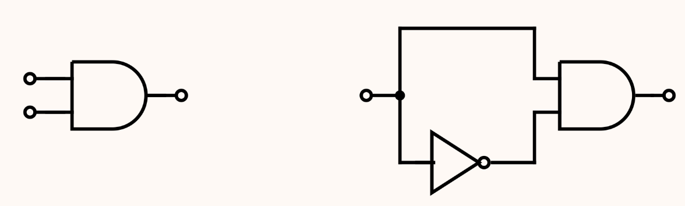

---
hide:
  #- navigation # 显示右
  #- toc #显示左
  - footer
  - feedback
comments: true
--- 

# Chapter 10 : NP Completeness

## Abstract

!!! Abstract

	正巧，Bruce 在数模课上面学过一点 NP 完全性了（虽然一点都没学懂），ADS 再来一遍，数模有关的笔记可转至 [数模 NP 笔记](https://brucejqs.github.io/MyNotebook/blog/ACEE/Mathematical%20Modeling/Chapter%203/#_9)
***
## Introduction

根据问题的难度，由不同的定义划分，问题可以分为：

- **P** 问题（Polynomial Time）
- **NP** 问题（Nondeterministic Polynomial Time）
- **NPC** 问题（NP Complete）
- **NPH** 问题（NP Hard）
- 不可计算问题（Undecidable）
***
### P Problems

P 取自 Polynomial Time，指的是可以用**确定型图灵机**在**多项式**时间内**解决**的问题。

也就是我们通常意义下所说的，可以在**多项式**时间内**解决**的问题。

!!! note "Turing Machine"

	图灵机有一些变体，而我们在这里引入图灵机是为了介绍 P/NP，只介绍**[确定型图灵机](https://en.wikipedia.org/wiki/Turing_machine)**和**[非确定型图灵机](https://en.wikipedia.org/wiki/Nondeterministic_Turing_machine)**。

	> 图灵机由一个**无限长的纸带**和一个**读写头**组成。纸带被划分为一个个**格子**，每个格子上有一个**符号**，读写头可以在纸带上移动，读写头可以读取当前格子上的符号，也可以改变当前格子上的符号。图灵机的**状态**是一个有限集合，每个状态都有一个**转移函数**，转移函数的输入是当前状态和当前格子上的符号，输出是下一个状态、下一个格子上的符号和读写头的移动方向。
	
	确定型图灵机每次都能执行一个指令，并且<font color="red">根据当前指令跳转到下一个唯一的指令</font>，非确定型图灵机<font color="red">可以从有限集中随意选择下一步</font>，如果当前得到了一个答案，那么<font color="red">它一直都会选择正确的那一步</font>。
	
	更本质的来说，图灵机是一种**计算模型**，我们可以用它来表示任何有限逻辑数学过程。确定型图灵机与我们常规理解的计算机逻辑类似，即下一步要做什么可以根据当前状态确定。而非确定型图灵机则类似于能够进行无限并行，并且最终总是选择通向正确答案的方向的那条路（有点类似于它能开平行宇宙，并且总是让你观测到正确的那一个平行宇宙）。
***
### NP Problems

NP 即 Nondeterministic Polynomial Time，指的是可以用非确定型图灵机**在**多项式**时间内**解决**的问题。这个说法等价于可以用确定型图灵机**在**多项式**时间内**验证**（判断答案是否正确）。

也就是我们通常意义下所说的，可以在**多项式**时间内**验证**的问题。
***
### NP-Complete Problems

NPC 即 NP complete，NP 完全，是 NP 中最难的**决定性**问题（并不是无限定词的最难的问题！）。而我们称满足如下条件的问题为 NPC 问题：

1. 是一个 NP 问题；
2. 所有 NP 问题都可以**多项式时间归约**为该问题；

!!! note "Polynomial Reduce"

	我们引入 P/NP 等这些概念，是为了衡量问题的复杂程度，而如何在具体的“问题”间传递、比较这种“复杂程度”，就是**[多项式时间归约（Polynomial Reduce）](https://en.wikipedia.org/wiki/Polynomial-time_reduction)**的目的。
	
	
	
	如果我们能在多项式时间的复杂度内，将问题 A 转化为问题 B，则称问题 A 可以**多项式时间归约**为 B，记为 $A\leq_p B$，表示 A 不会比 B 难。

	而采取数学语言来描述，则是：
	
	$$
	\begin{aligned}
	A \leq_{p} B 
	\;\;\Leftrightarrow\;\;
	& \exists f() \text{ which runs in polynomial time}, \\
	& s.t.    \;\; \forall x \in A,\; f(x) \in B \\
	& \text{and}\; \forall f(x) \in B,\; y \in A
	\end{aligned}
	$$
	​

由 2 可以有结论，所有的 NPC 问题难度相同——一旦有一个 NPC 问题被解决，那么所有 NPC 问题，乃至所有 NP 问题都能被解决。

如果我们试图证明一个问题是 NPC 问题，我们可以通过这种手段：

1. 判定该问题是一个 NP 问题；
2. 判定一个已知的 NPC 问题可以**多项式时间归约**为该问题，或判定该问题是 NPH 问题；

> 第一个被证明是 NPC 的问题是 **Circuit-SAT** 问题。

!!! note "Circuit-SAT"

	Circuit-SAT 又叫 [Circuit Satisfiability Problem](https://en.wikipedia.org/wiki/Circuit_satisfiability_problem)，它是最早被证明是 NPC 的问题，即通过 NPC 问题的定义证明。
	
	Circuit-SAT 即为确定给定布尔电路是否具有使输出为真的输入分配的决策的问题。
	
	
	
	上图中，左侧电路满足条件，右侧电路不满足条件。
	
	或者，更抽象的来说，是判断一个具有 $n$ 个布尔变量的布尔表达式是否具有结果为 True 的解。(这跟离散当中的 [Propositional Satisfiability](https://brucejqs.github.io/MyNotebook/blog/Math/Discrete%20mathmatics/Discrete%20mathmatics%20notes-Ch01/#propositional-satisfiability) 对应上了)
	
	特别地，[3-SAT](https://en.wikipedia.org/wiki/Boolean_satisfiability_problem#3-satisfiability) 是 Circuit-SAT 问题的一个特例，它对布尔电路，或者说布尔表达式的形式有特殊要求，具体来说，它要求布尔表达式形如：
	
	$$
	(x_1​\lor x_2\lor x_3​)\land(x_4​\lor x_5​\lor x_6​)\land...\land(x_{n−2}​\lor x_{n−1}\lor x_n​)
	$$
	
	- 变量是否重复、是否取非不是重点，$x_1​$ 可以和 $x_6$​ 是同一个变量，也可以是某个变量的非，重点是这里的三个一组的形式。

??? question "P=NP & NPC?"

	关于 P 和 NP 的关系，我们仍然不知道 P 是否能等于 NP，即我们仍然不知道是否存在多项式算法可以解决一切 NP 问题。
	
	而其中的关键就是，如果我们能找到 NPC 问题的多项式解法，那么就可以证明 P = NP。
***
### NP-Hard Problems

NPH 即 NP hard，NP 困难，它不一定需要是 NP 问题。而所有 NP 问题都可以**多项式时间归约**为 NPH 问题。

也就是说 $NPC=NP\bigcap NPH$。
***
我们可以用这样一张图来表示这前四个概念的关系：


这体现了 NP–hard 可以是 NP 问题，也可以不是 NP 问题。
***
### Undecidable Problems

**不可判定问题（Undecidable Problem）**是一类特殊的[决定性问题](https://en.wikipedia.org/wiki/Decision_problem)，它的特点是我们无法设计一个算法来求解它的结果。

其中一个比较典型的例子就是[图灵停机问题](https://en.wikipedia.org/wiki/Halting_problem)。

!!! note "图灵停机问题"

	停机问题是一个典型的不可计算问题，它指的是，对于任意一个程序，我们无法设计一个算法来判断它是否会在有限时间内停机（即判断程序是否会死循环）。
	
	我们通过反证法可以证明：
	
	假设存在函数 `willHalt(func F)` 可以判断函数 F 是否会停机，如果会，则返回 `true`，否则返回 `false`。那么我们可以构造一个这样的函数 `foo()`：
	
	```c
	void foo() {
		if ( willHalt(foo) ) {
			while (true) {} // Endless loop.
		}
		return;
	}
	```

	接下来，如果我们想知道 `foo()` 是否会停机，就会执行 `willHalt(foo)`。然而在 `foo()` 内部也有一个 `willHalt(foo)`，如果它认为 `foo()` 会停机，则构造一个死循环；而如果它认为 `foo()` 不会停机，则选择让它立刻停机，于是这里就产生了矛盾。

	理解上面这段内容的关键就是，这里虽然不存在事实意义上的“死循环”，但可以理解为这里存在一个逻辑上的递归，而这种“逻辑上的递归”，正是导致停机问题成为一个不可计算问题的原因。
***
## Other Examples

### Hamilton Cycle Problem

[汉密尔顿回路问题](https://en.wikipedia.org/wiki/Hamiltonian_path_problem) 即为给定一个图，判断是否存在一条路径，使得它经过图中的每个点恰好一次，且最后回到起点，它是一个 NPC 问题。
***
### Traveling Salesman Problem

