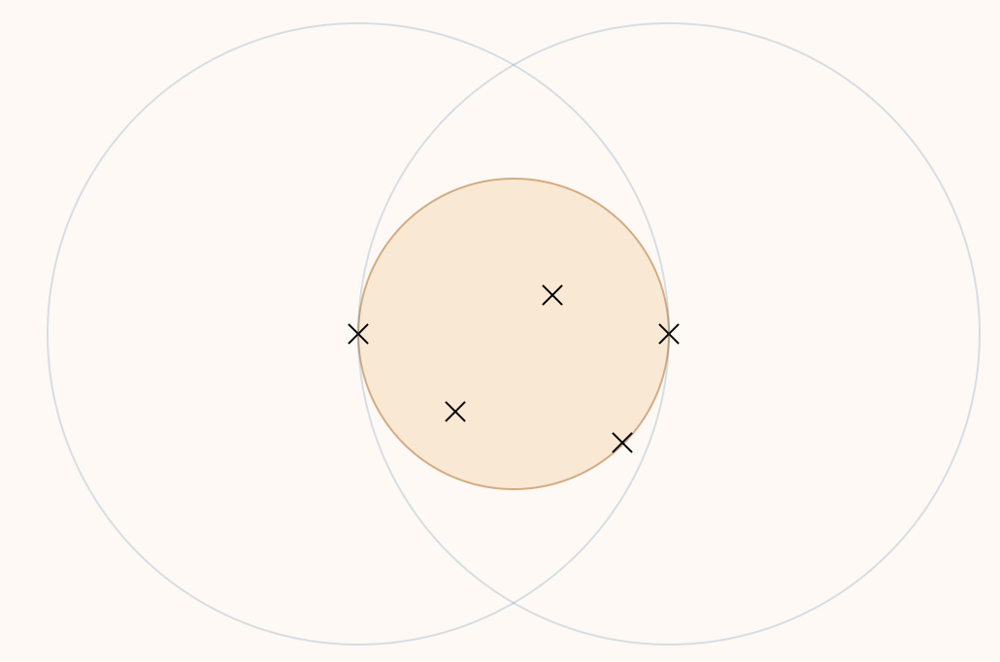

---
hide:
  #- navigation # 显示右
  #- toc #显示左
  - footer
  - feedback
comments: true
--- 

# Chapter 11 : Approximation

## Introduction

在上一章中我们介绍了 P/NP 问题，而大家普遍认为 $P \not= NP$，这就意味着对于某些问题，我们无法使用多项式时间解决，而在问题规模变大时，越发不可接受。

因此，我们考虑能否退而求其次，在多项式时间内求一个**比较优**的解。更具体的来说，我们尝试寻找一种多项式算法，使得其结果始终在关于准确解的可接受偏差范围内，对于这种算法，我们称之为**近似算法（Approximation Algorithm）**。

我们设 $f(n,x)$ 是对输入大小为 $n$ 的情况下，对结果 $x$ 的**最坏情况**的一个直观量化（例如 dist, weight...），若设 $x^∗$ 为准确解，$x$ 为给定算法结果，则我们定义**近似比（Approximation Ratio）**$\rho$：

$$
\forall n,\rho = \max\bigg\{\frac{f(n,x)}{f(n,x^*)},\frac{f(n,x^*)}{f(n,x)}\bigg\}
$$

则称给定算法为 $\rho$ 近似算法（$\rho$-approximation Algorithm）。
***
### Approximation Scheme

近似范式（Approximation Scheme）指的是对于某个优化问题的一族相同模式的算法，它们满足对于确定的 $\epsilon>0$，算法的近似比为 $1+\epsilon$。

>可以粗糙地理解为：“范式”是一个输出为算法的特殊函数，而 $\epsilon$ 是“范式”的一个参数，对于特定的 $\epsilon$，“范式”输出一个特定的算法（这些算法有着相同的模式），而这些“范式”输出的算法，都解决同一个问题，并且对于任意固定的 $\epsilon$ 其近似比为 $1+\epsilon$。
>
>而关于 $\epsilon>0$ 这个约束，是因为近似比必定大于 1。

而此时，这一族的算法的复杂度可以表示为 $O(f(n,\epsilon))$，如 $O(n^{\frac{2}{\epsilon}}),O((\frac{1}{\epsilon})^2n^3)$。当 $f(n,\epsilon)$ 关于 $n$ 是多项式时，我们称其为**多项式时间近似范式（Polynomial-time Approximation Scheme, PTAS）**，时间复杂度可以记为 $O(n^{f(\frac{1}{\epsilon})})$；当 $f(n,\epsilon)$ 关于 $n$ 和 $\frac{1}{\epsilon}$​ 都是多项式时，我们称其为**完全多项式时间近似范式（Fully Polynomial-Time Approximation Scheme, FPTAS）**，时间复杂度可以记为 $O(n^{O(1)}(\frac{1}{\epsilon})^{O(1)})$。

??? question "为什么要区分 PTAS 和 FPTAS？"

	我们观察 $\epsilon$ 对算法的影响：随着 $\epsilon$ 的减小，近似比逐渐变小，即准确度提高；而 $\frac{1}{\epsilon}$​ 变大，而通常来说 $\frac{1}{\epsilon}$​ 与算法复杂度都是正相关的，因此会导致算法复杂度升高。如果说这个近似范式是 FPTAS，那么为了提高准确度而缩小 $\epsilon$，导致的复杂度变化是相对可接受的（多项式级的变化，如 $(\frac{1}{\epsilon})^2n^3$ 关于 $\frac{1}{\epsilon}$​ 是多项式级的）；然而如果它不是 FPTAS，那么 $\epsilon$ 的缩小可能带来恐怖的复杂度增加（如 $n^{\frac{2}{\epsilon}}$ 关于 $\epsilon$ 是指数级的）。
***
## Examples

### Bin Packing

装箱问题指的是，给定 $N$ 个 item，第 $i\in[1,N]$ 个 item 的 size 为 $S_i\in(0,1]$，一个 bin 的大小为 1，尝试寻找最少的，能够装载所有 item 的 bin 的数量。

!!! example "Example"

	给定 7 个 item，size 分别为 0.2,0.5,0.4,0.7,0.1,0.3,0.8，则最少需要 3 个 bin（准确解）：
	
	- bin 1: 0.2+0.8;
	- bin 2: 0.7+0.3;
	- bin 3: 0.4+0.1+0.5;

这是一个 NP Hard 问题，我们一共有四种近似解法。需要注意的是，前三种都是在线（Online）解法，即处理 $item_i$ 时我们不知道 $item_{i+1}∼item_N$ 的情况。最后一个则是一种离线（Offline）解法，也就是我们知道所有 item 的情况以后再给出策略。

> 该问题的变种（决策问题）：给定 $K$ 个桶，我们能否装下 $N$ 个物品。这是个 NP Complete 问题。
***
#### Online Algorithm

!!! note "Online Algorithm"

	=== "Next Fit(NF)"
	
		NF 策略总是选择当前最后一个 bin，若能够容纳，则将当前 item 放入其中，否则新开一个 bin。
		
		```c title="Pseudo Code"
		void NextFit() {
		    read item1;
		    while (read item2) {
		        if (item2 can be packed in the same bin as item1)
		            place item2 in the bin;
		        else
		            create a new bin for item2;
		        item1 = item2;
		    } // end-while
		}
		```
		
		- 时间复杂度：$O(N)$
		- NF 策略总是使用不超过 $2M−1$ 个 bin，其中 $M$ 表示准确解的 bin 个数。因此该算法是一个 2-近似算法。
		
		!!! note "Proof"
		
			我们从 NF 的结果出发，证明当 NF 的结果为需要 $2M−1$ 或 $2M$ 个 bin 时，准确解为至少需要 $M$ 个 bin。
			
			假设 $S(B_i)$ 表示第 $i$ 个 bin 的 size，则根据 NF 的定义，有：$S(B_i)+S(B_{i+1})>1$（是 NF 的必要不充分条件）。稍作解释，使用反证法，假设 $S(B_i)+S(B_{i+1})\leq 1$，这说明无论 $B_{i+1}$​ 中有多少 item，都一定能放进 $B_i$​，而这与 NF “$B_i$​ 放不下了才开始放 $B_{i+1}$​” 的性质相违背。于是我们将所有桶两两配对：
			
			1.当 NF 的结果是需要 $2M−1$ 个 bin 时：
			
			$$
			\begin{cases}
			S(B_1)+S(B_2)>1\\
			S(B_3)+S(B_4)>1\\
			\vdots\\
			S(B_{2M-3})+S(B_{2M-2})>1\\
			S(B_{2M-1})\leq 1
			\end{cases}
			$$
			
			$$
			\begin{gather}
			\therefore\sum\limits_{i=1}^{2M-1}S(B_i)>\sum\limits_{i=1}^{2M-2}S(B_i)>M-1\\
			\therefore\sum\limits_{i=1}^{2M-1}S(B_i)\geq M
			\end{gather}
			$$
			
			即 item 的总 size 至少为 M，即至少需要 M 个 bin。
			
			2.而当 NF 的结果是需要 $2M$ 个 bin 时，可以转化为 $2M−1$ 的情况，至少需要 $M+1$ 个 bin。
	
	=== "First Fit(FF)"
	
		FF 策略总是选择第一个能放下当前 item 的 bin，若所有 bin 都无法容纳当前 item，则新开一个 bin。
		
		```c title="Pseudo Code"
		void FirstFit() {
		    while (read item) {
		        scan for the first bin that is large enough for item;
		        if (found)
		            place item in that bin;
		        else
		            create a new bin for item;
		    } // end-while
		}
		```
		
		- 时间复杂度：$O(N\log N)$（循环内扫描桶的时间复杂度可优化至 $O(\log⁡ N)$）
		- FF 策略总是使用不超过 $\lfloor 1.7M\rfloor$ 个 bin，并且存在一族能对边界取等的输入，其中 $M$ 表示准确解的 bin 个数。因此该算法是一个 1.7-近似算法。
	
	=== "Best Fit(BF)"
	
		BF 策略总是选择能够容纳当前 item 且剩余空间最小的 bin（即 tightest），若所有 bin 都无法容纳当前 item，则新开一个 bin。
		
		- 时间复杂度：$O(N\log⁡ N)$
		- BF 策略也总是使用不超过 $\lfloor 1.7M\rfloor$ 个 bin，并且存在一族能对边界取等的输入，其中 $M$ 表示准确解的 bin 个数。因此该算法是一个 1.7-近似算法。

由于在线算法无法得知输入何时结束，因此始终无法得到最优解。具体来说，有以下定理：对于本题的所有近似算法，得到的近似解桶数至少是最优解桶数 $\frac{5}{3}$​ 倍。因此，我们需要采用**离线算法**来提升近似的准确度。
***
#### Offline Algorithm

离线做法的优势在于它能够获得所有 item 的信息以求统筹规划。这里给出的近似做法（First Fit/Best Fit Decreasing）是，将 item 按照 size 降序排序，而后使用 FF（或 BF，由于单调性，两者等价）。

!!! example "Example"

	给定 7 个 item，size 分别为 $0.2,0.5,0.4,0.7,0.1,0.3,0.8$，经过排序后，它们的 size 分别为 $0.8, 0.7, 0.5, 0.4, 0.3, 0.2, 0.1$，则最少需要 3 个 bin（准确解）：
	
	- bin 1: 0.8+0.2;
	- bin 2: 0.7+0.3;
	- bin 3: 0.5+0.4+0.1;

FFD 策略总是使用不超过 $\frac{11}{9}M+\frac{6}{9}$ 个 bin，并且存在一族能对边界取等的输入，其中 $M$ 表示准确解的 bin 个数。因此该算法是一个 1.2-近似算法。
***
### Knapsack Problem

一个与装箱问题很像的问题是背包问题。其大致描述如下：给定一个容量为 $M$ 的背包，以及 $N$ 个 item，第 $i$ 个 item 的重量为 $w_i$，其利润为 $p_i$。要求在不超过背包容量的前提下，使得背包中的利润最大化。

!!! warning "Warning"

	请注意，我们这里讨论的背包问题有一个非常重要的特点就是，容量和利润都是**实数**，更直白的来说，我们没办法通过将容量或利润作为状态来 dp 求准确解。

而根据每一个物品能否自由拆分，背包问题分为 fractional version 和 0-1 version 两类。
***
#### Fractional Version

如果我们记 $x_i\in [0,1]$ 为第 $i$ 个 item 的选中量（即假设 item 都是连续可分的），则约束条件可以表述为 $\sum\limits_{i=1}^nw_ix_i\leq M$，现在求 $\sum\limits_{i=1}^Np_ix_i$ 的最大值。

!!! example "Example"

	假设现在 $M=20.0$，并且 $N=3$，分别是：
	
	- item 1: $w_1=18.0,p_1=25.0$;
	- item 2: $w_2=15.0,p_2=24.0$;
	- item 3: $w_3=10.0,p_3=15.0$;
	
	则最优解为 $x_1=0,x_2=1,x_3=\frac{1}{2}$​，此时 $\sum\limits_{i=1}^Np_ix_i=31.5$。

由于 $x_i\in[0,1]$，给了我们极大的选择自由，我们可以选择任意多的某个物品。那么非常朴素的一个想法就是，尽可能多地选择“性价比”高的物品。也就是说，我们可以按照 $\frac{p_i}{w_i}$（即性价比）降序排序，而后从大到小依次选择物品，直到背包装满为止。

不过该做法已经是准确解了，所以我们不对它进行关于近似算法的讨论。
***
#### 0-1 Version

相较于 fractional version，0-1 version 要求 $x_i\in\{0,1\}$，换句话说每一个物品要么选要么不选。这是一个经典的 NPH 问题（0-1 背包的判定问题才是一个 NPC 问题），我们尝试使用近似算法来求较优解。

!!! note "solution"

	=== "贪心"
	
		我们可以使用贪心算法，贪心策略可以是总是选**利润最大**的或 $\frac{p_i}{w_i}$​​ **最大**的。这些做法的近似比都是 2。
		
		!!! note "Proof"
		
			通过已知条件，可以得到下列不等式：
			
			$$
			\begin{aligned}
			p_{max}& \leq P_{optimal}\leq P_{frac}\\
			p_{max}& \leq P_{greedy}\\
			P_{optimal}& \leq P_{greedy}+p_{max}
			\end{aligned}
			$$
			
			其中，$p_{max}=\max\limits_{1\leq i\leq n}\{p_i\}$，$P_{optimal}$​ 表示本题的最优解，$P_{frac}$​ 表示上一类背包问题的解，$P_{greedy​}$ 表示本题的贪心解。

			- 第一个不等式：左边的不等号显然成立，右边的不等号是因为分数版本的背包问题可以取部分物品，那么它一定能够在 0-1 背包的基础上，通过塞入部分物品将背包塞满，所以分数背包的解一定不小于 0-1 背包的最优解
			- 第二个不等式也是显然成立的
			- 第三个不等式：不等号两边同时减去 $P_{greedy}​$，即最优解与贪心解之差一定不超过最大价值
			
			根据这三个不等式，可以推出：
			
			$$
			\frac{P_{opt}}{P_{greedy}}\leq 1+\frac{p_{max}}{P_{greedy}}\leq 2
			$$
			
	=== "动态规划"
	
		令 $W_{i,p}$​ 为物品 1 到物品 $i$ 之间的最小质量，总价值为 $p$
		
		- 分类讨论：
		    - 取物品 $i$：$W_{i,p}=w_i+W_{i−1,p−p_i}$
		    - 不取物品 $i$：$W_{i,p}=W_{i−1,p}​$
		    - 不可能得到价值 $p$：$W_{i,p}=\infty$
		- 状态转移方程：
		
		$$
		W_{i,p}=\begin{cases}
		\infty,i=0\\
		W_{i-1,p},p_i>p\\
		\min\{W_{i-1,p},w_i+W_{i-1,p-p_i}\},\text{otherwise}
		\end{cases}
		$$
		
		- 其中，$i=1,…,n,p=1,…,np_{max}​$，因此时间复杂度为 $O(n^2p_{max})$
		- 如果 $p_{max}$​ 很大，可以考虑将它们近似取整，类似于将浮点数向上取整。
		
		??? question "Question"
		
			从上面的分析来看，似乎 DP 能以多项式时间复杂度解决问题了，为什么还叫 0-1 背包问题为 NPH 问题呢？
			
			这其实是因为所谓的“多项式时间内”，指的是关于输入数据规模 $n$ 的多项式。而上面给出的时间复杂度中还有一项 $p_{max}$，它与数据规模 $n$ 独立，因此这个数可以很大很大，超出 $n$ 的指数级倍。因此，我们无法保证 DP 解法能够在多项式时间内产生解。
			
			一种（也许）可行的做法是只保留 $p_i$​ 的高位，但保证能够区分这些 $p_i$​ 的大小：
			
			- 但这种做法会损失价值的精度，且如果所有价值的位数一致时，这种做法就不太有效了
			- 对于上述方法，有 $(1+\epsilon)P_{alg}\leq P$，其中 $\epsilon$ 为精度参数
***
### K-Center Problem

（二维）K 中心问题指：给定平面上的一系列 site（即点），在平面中找出 $k$ 个不同的 center，记 $site_i$​ 到离它最近的 center 的距离为 $dis_i$，求 $\max⁡\{dis_i\}$ 的最小值。

用数学化的语言来表示，设 $C=\{c_1,c_2,...,c_k\}$ 为 $k$ 个 center，$S=\{s_1,s_2,...,s_n\}$ 为 $n$ 个 site，我们定义 site 到关于 center 的集合 $C$ 的距离为 $dis(s_i​,C)=\min\limits_{c_i\in C}\{dis(s_i​,c_i​)\}$，即 $s_i$ 到距离它最近的 center 的距离。定义最大的最小覆盖半径为：$r(C)=\max\limits_{s_i\in S}​\{dis(s_i​,C)\}$，现在要寻找一个 $C$ 使得 $r(C)$ 最小。

对于这里的距离（其实就是数学意义上的距离），有如下三个性质：

- 同一性（Identity）：$dist(x,x)=0$
- 对称性（symmetry）：$dist(x,y)=dist(y,x)$
- 三角不等式（Triangle Inequality）：$dist(x,y)\leq dist(x,z)+dist(z,y)$
***
#### Naive Greedy

一种最简单的贪心做法是，我们每次都选择最可能成为中心的那个点，具体来说：

1. 我们选取所有点的中心作为第一个中心点；
2. 随后的中心点我们选取最能让 $r(C)$ 下降的点；

但是，如下图所示，假设整个点集包括两个相距很远的子集，且 $K=2$。此时第一个中心点就会被放在两个子集的中间，但最优解应该是中心点位于子集的中间位置的时候，所以这种贪心策略就失效了。


***
#### 2r-Greedy

既然正向做很困难，那我们能不能反着做呢？有一种套路叫二分答案，即先猜答案，再验证是否是答案。在这个问题中我们可以迁移这个思想，即先猜一个 $r$，然后尝试用 $k$ 个半径为 $r$ 的圆去覆盖剩下的所有点。

更具体的来说，假设准确解对应的一个 center 集合为 $C^∗$，那么 $\forall r(C_x)≥r(C^∗)$ 的 $C_x​$ 都必定存在覆盖方案；反过来说，如果我们能够验证对于 $C_x$​ 能够覆盖所有的点，那么就可以约束准确解 $r(C^∗)≤r(C_x)$。

那么我们再次梳理一下这个算法，它包含内外两层，首先外部通过在答案的候选区间（即 $(0,r_{max}]$，$r_{max}$​ 为最远的两个点的距离）二分候选值，接着通过判定算法来判定接下来的二分方向，伪代码如下所示：

```c title="Pseudo Code"
Centers Greedy-2r(Sites S[], int n, int K, double r) {
    Sites S1[] = S[];  // S1 is the set of the remaining sites
    Centers C[] = NULL;
    while (S1[] != NULL) {
        Select any s form S1 and add it to C;
        Delete all s1 from S1 that are at dist(s1, s) <= 2r;
    } // end-while
    if (|C| <= K) 
        return C;
    else
        ERROR("No set of K centers with covering radius at most r");
}
```

!!! note "Explanation"

	在改进的贪心算法中，我们直接挑选某个地址作为中心点。这种做法之所以可行，是因为某个中心点覆盖半径为 $r$ 的区域，可以近似为以（接近）区域边界上一点 $s$ 为新的中心点，$2r$ 为半径的区域。虽然这个区域明显比原区域大，但它保证能够覆盖原区域所能覆盖的点。这样的话我们就不必通过繁琐的计算算出中心点，而是从原有的地址中选择中心点，这样就方便了很多。
	
	下面来解释一下上面的伪代码：
	
	设 $C_x​$ 表示选中的 center，$S_x$ 表示尚未被任何圆覆盖的 site，$r_x$​ 表示当前二分出来的，要我们判断的半径，$S$ 依然表示所有 site 的集合：

	1. 初始化 $C_x=\phi$；
	2. 当 $S_x\not=\phi$ 时（即还有点没被覆盖时），重复这些操作：
	    1. 随机选取一个 site $s_i\in S_x​$，将其插入 $C_x$​（即将 $s_i​$ 当作一个 center），并从 $S_x$​ 中将 $s_i$​ 删除（即 $s_i$​ 必定被覆盖）；
	    2. 删除 $S_x$​ 中所有距离 $s_i$​ 不足 $r_x$​ 的点（即删除满足 $dis(s_i,s_j)\leq r_x$ 的所有 $s_k\in S_x$​）；
	3. 当所有点都被覆盖后：
	    1. 如果 $∣C_x∣\leq k$，则返回 yes；
	    2. 否则返回 no；
	
	如果返回 yes，则下一个 $r_x$​ 应当取更小的 $r_x$​；如果返回 no，下一次应该取更大的 $r_x$（这里的时间复杂度为 $O(\log r_{max})$
	
	这是一个启发式的做法，旨在每次寻找还没被覆盖的点作为新的 center，用一个半径为 $2r_x$​ 的圆去覆盖剩下的点。通过判断这样所需要的 center 数量是否超过 $k$ 来判断是否能够覆盖。
	
	1. 当这个启发式搜索成功时，说明 $2r_x\geq r(C^∗)$，即 $k$ 个 $2r_x$​ 的圆可以覆盖所有点；
	2. 当这个启发式搜索失败时，**不能**说明 $2r_x\geq r(C^∗)$，即 $k$ 个 $2r_x$​ 的圆不能覆盖所有点，因为启发式方案并不是最优方案；**但是能说明必定不存在 $r_x$​ 的覆盖，即 $r_x\leq r(C^∗)$**（证明见下方 Lemma）
	
	!!! tip "Lemma"
	
		假设半径为 $r$，以 $c$ 为圆心的圆 $C$ 覆盖了 $S$ 中的所有点，那么，对于固定的半径 $r'$，要想取任意的 $s_i\in S$ 为圆心，形成的圆 $C_i​$，**总是**能覆盖 $S$ 中的所有点，则 $r'\geq 2r$。
		
		这个引理的附加结论就是：$\forall i,C\subset C_i$，即以 $r$ 为半径的最优覆盖圆，一定能被以任意 $s_i$​ 为圆心、$2r$ 为半径的圆所覆盖。
		
		
	
	当我们发现我们处于上述情况 1 时，我们开心的发现我们确实得到了一个距离 $r(C^∗)$ 更近的上界 $2r_x$，由于二分的性质，我们每次通过情况 1 确定的上界，总是越来越紧的。

	当我们处于上述情况 2 时，我们不知道 $2r_x$​ 和 $r(C^∗)$ 的大小关系，但是知道 $r_x$ 和 $r(C^∗)$ 的关系，由于二分的性质，我们每次通过情况 2 确定的下界，也总是越来越紧的。
	
	而最终，我们会得到一个最终的 $r_{x_0}$，满足：$r_{x_0}\leq r(C^∗)\leq 2r_{x_0}$（式中哪边能取等取决于最后落在情况 1 还是 2）。
	
	而我们最终给出的**答案**是 $2r_{x_0}$（因为 $r_{x_0}$​​ 不满足条件，不是解，更不是近似解）。
	
	我们有：
	
	$$
	\begin{gather}
	\because r_{x_0}\leq r(C^*)\leq 2r_{x_0}\\
	\frac{1}{2}\leq \frac{r(C^*)}{2r_{x_0}}\leq 1\\
	1\leq \frac{2r_{x_0}}{r(C^*)}\leq 2\\
	\therefore \rho=\max\bigg\{\frac{r(C^*)}{2r_{x_0}},\frac{2r_{x_0}}{r(C^*)}\bigg\}=2
	\end{gather}
	$$
	
***
#### Smarter Greedy

我们关注到，上面那个做法总是随机的选取新的 $c_i​$，但是对于 center 的选取，我们其实可以总是选择距离已有的 center 最远的点，此外，当 $∣C∣>k$ 时，我们也没必要继续做了。伪代码如下：

```c title="Pseudo Code"
Centers Greedy-Kcenter(Sites S[], int n, int K) {
    Centers C[] = NULL;
    Select any s from S and add it to C;
    while (|C| < K) {
        Select s from S with maximum dist(s, C);
        Add s to C;
    }  // end-while
    return C;
}
```

由于这个做法实际上只是优化了一下启发式的策略，并没有改变内核，所以其近似比仍然是 2。

??? question "存在 $\rho<2$ 的近似算法吗？"

	实际上是不存在的，用归谬法证明：
	
	- 假如存在多项式时间的 $2−\epsilon$ 的近似算法，那么我们也能在多项式时间内解决[支配集 (dominating-set) 问题](https://en.wikipedia.org/wiki/Dominating_set)（它是一个 NPC 问题，这一结论来自 NPC 问题的[性质](https://brucejqs.github.io/MyNotebook/blog/Computer%20Science/ADS/Chapter%2010/#np-complete-problems)）
	- 当前仅当存在中心选择问题的最优中心点集半径 $r(C^∗)=1$ 时，规模为 $K$ 的支配集存在解
***
## Summary

关于算法的设计，我们考虑这三个维度：

1. 最优性（Optimality）：即能求准确解；
2. 高效性（Efficiency）：即算法是否高效；
3. 普遍性（All Instances）：即算法是否普遍适用于所有的情况；

倘若一个解法：

1. 同时满足最优性和高效性，那么这个算法对特殊情况能高效求准确解；
2. 同时满足最优性和普遍性，那么这个算法对所有情况都能求准确解；
3. 同时满足高效性和普遍性，那么这个算法可能是个近似算法；

就算 P=NP 成立，我们仍然无法保证三个愿望一次满足。
***
## Homework

!!! question "Question 01"

	Suppose ALG is an $\alpha$-approximation algorithm for an optimization problem $\prod$ whose approximation ratio is tight. Then for every $\epsilon>0$ there is no $(\alpha−\epsilon)$-approximation algorithm for $\prod$ unless P = NP.
	
	??? note "Answer"
	
		False. 对于一种算法而言，近似比为 $\alpha$，那么 $\forall\beta>\alpha$，都可以说 $\beta$ 是其近似比。如果 $\alpha$ 是 tight 的，则 $\alpha$ 是一个下确界
		
		但这都只是对这一种算法的分析，一个 tight 的近似比只能说明我们对这种算法的分析到位了，而不能说明这个问题没有更好的算法

!!! question "Question 02"

	As we know there is a 2-approximation algorithm for the Vertex Cover problem. Then we must be able to obtain a 2-approximation algorithm for the Clique problem, since the Clique problem can be polynomially reduced to the Vertex Cover problem.
	
	??? note "Answer"
	
		False. 在 Clique problem 约化成的 Vertex Cover problem 中得到的解虽然符合 Vertex Cover problem 的 Cost 标准下的 2-近似，却并不一定符合 Clique problem 标准下的 2-近似。
		
		具体来说，设 Vertex Cover problem 的 2-近似算法得到的顶点覆盖规模为 $T$，最优规模为 $T^∗$，则：
		
		$$
		\rho_{VCP}=\frac{T}{T^*}=2,\rho_{CP}=\frac{|V|-T^*}{|V|-T}=1+\frac{1}{\frac{V}{T^*}-2}
		$$
		
		可以看出 $\rho_{CP}$ 是不可控的，并不一定是 2

!!! question "Question 03"

	For the bin-packing problem: let $S=\sum S_i$​. Which of the following statements is FALSE?
	
	- A. The number of bins used by the next-fit heuristic is never more than $\lceil 2S\rceil$
	- B. The number of bins used by the first-fit heuristic is never more than $\lceil 2S\rceil$
	- C. The next-fit heuristic leaves at most one bin less than half full
	- D. The first-fit heuristic leaves at most one bin less than half full
	
	??? note "Answer"
	
		C. The next-fit heuristic leaves at most one bin less than half full
		
		对于 A 选项，因为我们根据上面的证明知道当实际使用了 $2M$ 或 $2M+1$ 个 bin 时 $S=\sum\limits_{i=1}^{2M+1}S(B_i)>M$，所以有 $2S>2M\Rightarrow\lceil 2S\rceil\geq 2M+1\geq\text{The number of bins used}$
		
		而 B 选项因为 first-fit 比 next-fit 优（1.7 近似算法）所以 A 对 B 铁对
		
		C 选项非常简单，只要少于半满的 bin 不相邻出现就可以（例如 item 大小分别为 0.2, 0.9, 0.2, 0.9）
		
		D 选项根据定义，如果出现两个少于半满的 bin，不可能不会将这两个 bin 合并，所以是正确的

!!! question "Question 04"

	To approximate a maximum spanning tree $T$ of an undirected graph $G=(V,E)$ with distinct edge weights $w(u,v)$ on each edge $(u,v)\in E$, let's denote the set of maximum-weight edges incident on each vertex by $S$. Also let $w(E')=\sum\limits_{(u,v)\in E'}​w(u,v)$ for any edge set $E'$. Which of the following statements is TRUE?
	
	- A. $S=T$ for any graph G
	- B. $S\not=T$ for any graph G
	- C. $w(T)\geq w(S)/2$ for any graph G
	- D. None of the above
	
	??? note "Answer"
	
		C. $w(T)\geq w(S)/2$ for any graph G
		
		AB 两个选项是很好排除的，S 可能和 T 一样也有可能不一样（感性理解一下就是取和每个顶点有关的最大边不一定能组成一棵树，如果能组成那就是等于，否则就是不等于），反例如下：
		
		- $V=\{a,b,c,d\},E=\{(a,b),(b,c),(c,d),(b,d)\}$，边长度分别为 3,1,5,4，那么此时 $S=\{(a,b),(b,d),(c,d)\}=T$
		- $V=\{a,b,c,d\},E=\{(a,b),(b,c),(c,d)\}$，边长度分别为 3,1,5，那么此时 $S=\{(a,b),(c,d)\}\not=T$
		
		对于 C 选项，首先，因为每条边长度都不一样，我们很容易得到 S 中的某一条边最多是两个顶点有关的最大边（因为一条边就俩端点），所以有 $|S|\geq|V|/2\Rightarrow|T\backslash S|\leq|V|/2\leq|S|$
		
		而因为 $T\backslash S$ 中的每一条边对应都会小于 $S$ 中的任意一条边，我们设 $m$ 为 $S$ 中最小的边权，那么有 $w(T\backslash S)\leq m|S|\leq w(S)$，因此 $w(T)\leq w(S)+w(T\backslash S)\leq 2w(S)$