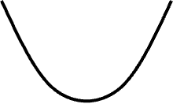

---
hide:
  #- navigation # 显示右
  #- toc #显示左
  - footer
  - feedback
comments: true
--- 

# Chapter 12 : Local Search

## Introduction

> 局部搜索（Local Search）是近似算法的一大门类，它<font color="red">通过局部最优解得到全局最优解</font>

!!! example "Example"

	假设我们想要找到一只碗的底部，我们可以按照下面的步骤进行寻找：
	
	- 先在碗中任取一点（称为猜测点，Guess）
	- 以该点为中心，在一定范围内（邻居，Neighbor）搜寻该范围内的最低点（局部最优解）
	- 接着以这个最低点为中心，在新的范围内搜寻范围内的最低点
	- 以此类推，直到在局部范围内无法再找到更低的点为止，此时发现的最低点应为整个碗的最低点（全局最优解）
	
	这便是局部搜索的大致思想，当然，如果碰到像下面的图形，如果搜索的范围选取不适当，单从这个算法就很大概率找不到最低点了：
	
	
	
	??? question "搜索范围对结果有什么影响？"
	
		根据上面的例子，我们可以看出，调整搜索的”一定范围“对达到全局最优解有很大的影响，如果搜索范围过小，算法可能就会误以为那些“小坑”是最优解，而不会继续搜索下去；如果搜索范围过大，算法可能跳过了最优解，最坏的情况下算法可能陷入死循环，因为算法始终无法确定是否不存在更低的点（比如在最低点两边来回跳，就是找不到最低点）

局部搜索的框架结构：

- **局部**（Local）：
    - 在一个可行的集合内定义**邻居**（Neighborhoods）
    - **局部最优解**（Local Optimum）是邻居内的最佳解
- **搜索**（Search）：
    - 从一个可行解开始，在邻居范围内找到一个更好的解
    - 如果没有改进空间，则将当前的局部最优解视为整个问题的解
- **邻居关系**（Neighbor Relation）
	- $S∼S'$：$S'$ 是 $S$ 的邻居解（Neighboring Solution），它来自于对原集合 $S$ 的较小修改
	- $N(S)$：$S$ 的邻居，即集合 $\{S':S∼S'\}$

局部搜索的思想其实就是“梯度下降法”（Gradient Descent），顾名思义，就是沿梯度下降的方向不断进行局部的搜索。

局部搜索算法的伪代码如下：

```c title="Pseudo Code.c"
Solution Type Gradient_descent() {
    Start from a feasible solution S in FS;
    // FS: the feasible solution set
    MinCost = cost(S);
    while (1) {
        S` = Search(N(S));     // find the best S' in N(S)
        CurrentCost = cost(S`);
        if (CurrentCost < MinCost) {
            MinCost = CurrentCost;
            S = S`;
        }
        else break;
    } 
    return S;
}
```
***
## Examples

### Vertex Cover Problem

在 [Chapter 10](https://brucejqs.github.io/MyNotebook/blog/Computer%20Science/ADS/Chapter%2010/#__tabbed_1_1) 当中我们已经提及过顶点覆盖问题并证明了它是一个 NPC 问题，但是这仅仅是它的判定版本，它还有一个最优版本：给定一个无向图 $G=(V,E)$，请找到一个最小的子集 $S\subseteq V$，使得 $E$ 中的任意一边 $(u,v)$，$u$ 和 $v$ 至少有一个属于 $S$。我们接下来考虑的是最优版本。

先定义一些量：

- 可行解集 $FS$：所有的顶点覆盖
- $cost(S)=|S|$
- $S∼S'$：每个顶点覆盖 $S$ 至多有 $|V|$ 个邻居

搜索步骤：

- 从 $S=V$ 开始
- 删除一个节点得到新的顶点覆盖 $S'$
- 检查 $S'$ 的成本是否更低

!!! warning "局部搜索的弊端"

	根据上面所述的算法我们固然能解决一些情况（比如下面的 Case 1），但是单纯用梯度下降法我们也不一定能得到全局最优解：
	
	=== "Case 1"
	
		
		
		可以看到，这张图只有顶点没有边，因此最优解就是去掉所有顶点，即 $S=\phi$。显然，用梯度下降法能够解决此类情况。
		
		如果用最开始给出的那个碗的例子来类比，对应的碗的剖面大概长这样（很平滑，因此一步步找总能找到最优解）：
		
		
	
	=== "Case 2"
	
		
		
		从肉眼来看，我们只需要保留中间那个点，去掉所有其他的点即可。然而，如果算法一开始选择删除的是中间的点，那就得不到最优解了，这是因为梯度下降法不具备撤销操作，所以这么一删后，无论之后怎么做都无法得到最优解了。
		
		如果用最开始给出的那个碗的例子来类比，对应的碗的剖面大概长这样（边上有一小块凹下去的地方，使算法误以为这个局部最优无法得到进一步提升，视其为全局最优，从而得到错误的结果）：
		
		
	
	=== "Case 3"
	
		
		
		这种例子也不难发现最优解即为选取第 2、4、6 个点，然而，若算法在执行过程中一不小心删掉了这三个红点中的任意一个，则无法得到最优解，而会得到各种各样的错误：
		
		
		
		如果用最开始给出的那个碗的例子来类比，对应的碗的剖面大概长这样（这个碗有很多“坑点”，算法很容易会掉入其中的一个“坑”里无法爬出来）
		
		

对此，我们必须要对梯度下降法进行优化，便有了 [**Metropolis 算法**](https://en.wikipedia.org/wiki/Metropolis%E2%80%93Hastings_algorithm)，其伪代码如下：

```c title="Metropolis Algorithm.c"
SolutionType Metropolis() {
    Define constants k and T;
    Start from a feasible solution S in FS;
    MinCost = cost(S);
    while (1) {
        S` = Randomly chosen from N(S);
        CurrentCost = cost(S`);
        if (CurrentCost < MinCost) {
            MinCost = CurrentCost;
            S = S`;
        } else {
            With a probability e^{-\Delta cost / (kT)}, let S = S`;
            otherwise break;
        }
    }
    return S;
}
```

根据第 6 行我们能看出新的 $S'$ 是从 $S$ 的 Neighbor 选取而来，这就导致从宏观来说 $S'$ 既可以来自删掉任意一点后的 $S$，也可以来自增加任意一点后的 $S$（这就实现了撤销操作）

- 再来看前面给出的例子：
    - 对于 Case 2，该算法有一定概率可以跳出局部最优，得到正确解
    - 而对于 Case 1，有可能在 +1 和 -1 之间无限振荡
- 这一算法与梯度下降法最大的不同之处在于：如果新的顶点覆盖 $S'$ 的成本更大，它不会马上就会被抛弃掉，而是通过某个特殊的概率 $e^{\frac{\Delta\cos t}{kT}}$ 来决定它是否可以被保留下来
	- 其中 $T$ 代表的是温度，当温度很高时，这个概率接近 1，容易引起底部振荡（也就是说无论何种情况最优解会一直更新）；当温度接近于 0 时，这个概率也接近于 0，此时该算法接近原始的梯度下降法
- 设计该算法的一大难点在于寻找合适的温度值——这里我们采用[**模拟退火**](https://en.wikipedia.org/wiki/Simulated_annealing)（Simulated Annealing）的算法。该算法的名称来自于冶金学术语“退火”：让材料从很高的温度开始**慢慢**冷却，使我们有充足的时间在一系列不断减小的中间温度值 $T=\{T_1,T_2,...\}(T_1\geq T_2\geq...)$ 中找到平衡点（Equilibrium，即最优解）
***
### Hopfield Neural Networks

> Wikipedia：[Hopfield Neural Networks](https://en.wikipedia.org/wiki/Hopfield_network)

??? Question "问题描述"

	给定一张图（或者称为网络，Network）$G=(V,E)$，每条边都有一个整数（不论正负）的权重 $w$，每个顶点的取值（称为状态，State）$s$ 为 $\pm 1$。权重的绝对值 $|w|$ 称为需求强度（Strength of Requirement）。
	
	对于边 $e=(u,v)$：

	- 如果 $w_e<0$，那么 $u$ 和 $v$ 具备相同的状态（即都为 -1 或都为 1）
	- 如果 $w_e>0$，那么 $u$ 和 $v$ 具备不同的状态（即一个为 -1，一个为 1）
	
	题目的输出为：网络的一种布局（Configuration）$S$——所有顶点的状态集合，每个顶点 $u$ 都被赋予一个状态 $s_u​$。
	
	当然，这样的问题也不一定一定有解，比如：
	
	
	
	因此，我们需要找到一种**足够好**的布局：

- 在一种布局中，如果 $w_es_us_v<0$，称边 $e=(u,v)$ 是一条**好边**，否则称其为一条**坏边**
    - $w_e<0\Leftrightarrow s_u=s_v​$
    - $w_e>0\Leftrightarrow s_u\not= s_v$​
- 在一种布局中，如果一个顶点的关联（Incident，即该点作为某条边的端点）好边的总权重不小于关联坏边的总权重，称这个点为**满意（Satisfied）点**，即满足：

$$
\sum\limits_{v:e=(u,v)\in E}w_es_us_v\leq 0
$$

- 如果一张图的所有顶点都是满意点，那么称这个布局是稳定的（Stable）

!!! example "Example"

	=== "Question"
	
		
	
	=== "Answer"
	
		这里给出其中一种可能的稳定布局：
		
		
		
		可以看到，除了 -5 那条边是一条坏边外，其他所有边都是好边。下面我们来检验一下是否所有的点都是满意点。由于只有一条坏边，因此只需检验坏边的两个端点即可：
		
		这里用蓝笔标出坏边。通过计算发现坏边的两个端点的总权重均小于 0，满足定义，因此所有点都是满意点，这种布局是稳定的。

要解决这类方法我们有状态翻转（State-Flipping）算法，其伪代码如下：

```c title="State-Flipping Algorighm.c"
ConfigType State_flipping() {
    Start from an arbitrary configuration S;
    while (!IsStable(S)) {
        u = GetUnsatisfied(S);
        s_u = -s_u;
    }
    return S;
}
```

算法非常简单：只要这个布局不是稳定的，算法就会找出不满意点并翻转它的状态，这样就能使其变成满意点（很容易验证），直到所有的点都是满意点为止。

??? question "这个算法是否总是能够停下来？"

	先说结论：该算法在至多 $W=\sum_e|w_e|$ 次迭代后终止
	
	!!! note "Proof"
	
		这里引用摊还分析中的**势能函数法**来证明该结论。
		
		令势能函数 $\Phi(S)=\sum\limits_{e\text{ is good}}|w_e|$，当顶点 $u$ 翻转状态时（$S$ 会变成 $S'$）:
		
		- 所有与 $u$ 关联的好边都变成了坏边
		- 所有与 $u$ 关联的坏边都变成了好边
		- 其他边保持不变
		
		因此 $\Phi(S') = \Phi(S) - \sum\limits_{e:e=(u,v) \in E \atop e \text{ is bad}}|w_e| + \sum\limits_{e:e=(u,v) \in E \atop e \text{ is good}}|w_e|$
		
		由于每次翻转操作针对的是不满意点，因此翻转之后，该等式右边的最后两项权重和之差至少是 1。在最坏的情况下，一个布局的所有边都是坏边，最后都变成了好边，那么所需要的迭代次数就是 $W$ 了。因此可以得到 $0\leq \Phi(S)\leq W$。证毕。

从局部搜索的角度来说，算法的步骤如下：

- 问题：找到最大的 $\Phi$
- 可行解集 $FS$：某种布局
- $S∼S'$：$S'$ 可通过对 $S$ 的某个顶点的状态翻转后得到

结论：任意一种在状态翻转算法中得到的局部最大的 $\Phi$ 的最优布局是一种稳定的布局。

由于该算法的时间复杂度与边的绝对值权重和相关，而权重的绝对值可以很大很大，因此该算法不是多项式复杂度的，而且至今还未找到多项式时间下（对于 $n$ 和 $\log ⁡W$，或者仅对于 $n$ 的）构建稳定布局的算法。
***
### Maximum Cut Problem

> Wikipedia：[Maximum Cut Problem](https://en.wikipedia.org/wiki/Maximum_cut#Approximation_algorithms)

??? Question "问题描述"

	给定一张无向图 $G=(V,E)$，每条边都有一个正整数权重 $w_e$，请找到一种顶点划分（Node Partition）$(A,B)$（即对于所有顶点，要么属于集合 $A$，要么属于集合 $B$），使得割之间的所有边的权重和 $w(A,B)=\sum\limits_{u\in A,v\in B}w_{uv}​$ 最大。
	
	!!! note "实际应用"
	
		想象这样一种情况：
		
		- $n$ 个顶点表示活动，顶点的划分表示活动的时段（上午或下午）
		- $m$ 条边表示参与者，每位参与者想要参加两项活动，但规定一个时段内只能参加一项活动
		- 因此最大割问题就是：合理安排活动举办的时段（即确定一种合理的划分），使得尽可能多的参与者能够参加两项活动
		
		其他现实生活中的应用：电路排布、统计物理学等

现在我们从局部搜索的角度来看这道题：

- 问题：使 $w(A,B)$ 尽可能大
- 可行解集 $FS$：任意划分 $(A,B)$
- $S∼S'$：通过将 $S$ 中的某个顶点从划分 $A$ 移动到划分 $B$，或从划分 $B$ 移动到划分 $A$ 来得到 $S'$

由此来看，这跟 Hopfield Neural Networks 十分相似，它其实就是 Hopfield Neural Networks 所有边权重均为正数的版本，我们同样也可以用之前的势能函数和 State-Flipping 算法解决这个问题。

如上面所述，State-Flipping 算法并不能在多项式时间复杂度情况下解决这个问题，具有一定的局限性，我们需要考虑以下问题：

??? question "局部最优解有多好？"

	先说结论，令 $(A,B)$ 为一种局部最优的划分，$(A^∗,B^∗)$ 为一种全局最优的划分，那么 $w(A,B)\geq\frac{1}{2}w(A^∗,B^∗)$。
	
	!!! note "Proof"
	
		因为 $(A,B)$ 是局部最优划分，所以 $\forall u\in A$，可以得到：
		
		$$
		\sum\limits_{v\in A}w_{uv}\leq\sum\limits_{v\in B}w_{uv}​
		$$
		
		将所有的顶点 $u\in A$ 累加起来，得到：
		
		$$
		\begin{gather}
		2\sum\limits_{\{u,v\}\subseteq A}​w_{uv}​=\sum\limits_{u\in A}\sum\limits_{​v\in A}​w_{uv}​\leq\sum\limits_{u\in A}\sum\limits_{​v\in B}​w_{uv}​=w(A,B)​
		\end{gather}
		$$
		
		同理我们有：
		
		$$
		\begin{gather}
		2\sum\limits_{\{u,v\}\subseteq B}​w_{uv}\leq w(A,B)​
		\end{gather}
		$$
		
		(1)+(2) 并化简，得到：
		
		$$
		w(A^∗,B^∗)\leq\sum\limits_{\{u,v\}\subseteq A}​w_{uv}​+\sum\limits_{\{u,v\}\subseteq B}​w_{uv​}+w(A,B)\leq 2w(A,B)
		$$
		
	- 所以，状态翻转算法在本题是一种 2-近似算法
	- 对于最大割问题，存在一种 1.1382-近似算法（即 $\min\limits_{⁡0\leq\theta\leq\pi}\frac{\pi}{2}\frac{1−\cos\theta⁡}{\theta}$）
	- 若能够证出 $P=NP$，那么存在一种 $\frac{17}{16}(\approx 1.0625)$-近似算法

??? question "能否在多项式时间内得到结果？"

	- 一种策略是：如果算法找不到有“足够大”提升的解，那么算法就会终止迭代，称这种算法为大提升翻转（Big-Improvement-Flip）。具体来说，该算法挑选那些能够提升至少 $\frac{2\epsilon}{|V|} w(A,B)$ 割值的顶点来翻转
	- 相关结论：
	    - 算法中止后会返回一个割集 $(A,B)$，满足：$(2+\epsilon)w(A,B)\geq w(A^∗,B^∗)$
	        - 因此该算法是一个 $(2+\epsilon)$-近似算法
	    - 该算法能够在至多 $O(\frac{n}{\epsilon}\log ⁡W)$ 次翻转后终止

??? question "是否存在一个更好的局部？"

	- 一个好的「局部」需要满足：
	    - 解的邻居需要足够大，使得算法不会陷入局部最优解而“出不来”
	    - 但解的邻居也不能太大，因为我们希望能够在有限的步数内，在邻居集中高效地寻找最优解
	- 改进方法：$k$ 翻转算法（一种启发式算法），时间复杂度为 $\Theta(n^k)$，执行步骤如下：
	    - 第 1 步：对整个顶点集使用状态翻转算法（单顶点的翻转），此时得到的最优解为 $(A_1,B_1)$，被翻转的那个顶点记为 $v_1$
	        - 时间复杂度：$O(n)$
	    - 第 k 步：对尚未翻转过的顶点集使用状态翻转算法，此时得到的最优解为 $(A_k,B_k)$，被翻转的顶点有 $v_1,...,v_k$
	        - 时间复杂度：$O(n−k+1)$
	    - 第 n 步：$(A_n,B_n)=(B,A)$
	    - 因此，划分 $(A,B)$ 的邻居集为 $\{(A_1,B_1),...,(A_{n−1},B_{n−1})\}$，时间复杂度为 $O(n^2)$