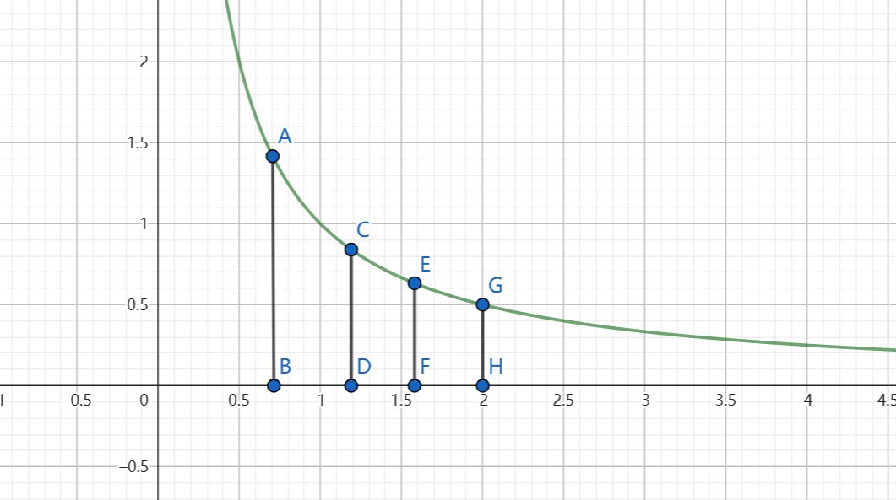

---
hide:
  #- navigation # 显示右
  #- toc #显示左
  - footer
  - feedback
comments: true
--- 

# Chapter 13 : Randomized Algorithm

## Introduction

??? Question "Questions"

	=== "什么东西要随机化？"
	
		- **数据**的随机化：传统的算法可根据随机生成的输入数据得到结果
		    - 由于数据是随机的（可以理解为数据是等概率分布的），因此对这种算法的分析称为**平均情况分析**（Average-Case Analysis）
		- **算法**的随机化：算法在处理最坏情况的输入时会做出**随机的决策**
		    - 我们称这样的算法为**随机算法**（Randomized Algorithm）
	
	=== "为什么要随机化？"
	
		- 事实上，我们可以将那些能够始终得到正确答案的高效可确定 (Efficient Deterministic) 的算法（就是传统意义上的算法）视为随机算法的一种**特殊情况**
		- 将随机算法分为两大类：
		    - 高效性：只需在**较高概率**下得到正确解的**高效**随机算法
		    - 确定性：只需在**预期**效率内始终得到**正确解**的随机算法
		- 例如，分布式系统对所有进程进行**对称分解**（Symmetry-Breaking） 这一随机算法，实现整个系统的负载均衡（Load Balance），这种方法相对比较简单。

!!! note "Definition"

	我们先定义一些量：
	
	- $Pr[A]$：事件 $A$ 发生的**概率**
	- $\overline{A}$：事件 $A$ 的**补**（Complement），可以得到：$Pr[A]+Pr[\overline{A}]=1$
	- $E[X]$：随机变量 $X$ 的**期望**（Expectation）
	    - $E[X]=\sum\limits_{j=0}^{\infty}j⋅Pr[X=j]$
***
## Hiring Problems

??? Question "问题描述"

	- 从猎头那边雇佣一位办公室助理
	- 在 $N$ 天时间内，每天需要面试一位不同的助理
	- 面试成本 $C_i<<$ 雇佣成本 $C_h$
	- 这里我们并不关心算法的运行时间，关注的是面试和雇佣的**成本**
	    - 假设雇佣了 $M$ 人，那么总成本为 $O(NC_i+MC_h)$

### Naive Solution

- 采取策略：每次能被雇佣的候选者需要有高于已被雇佣的候选者的能力
- 最坏情况：候选者按照能力的顺序进行面试，此时时间复杂度为 $O(NC_h)$（由于 $C_i$​ 很小，直接忽略掉）

```c title="Naive Solution.c"
int Hiring ( EventType C[ ], int N )
{   /* candidate 0 is a least-qualified dummy candidate */
    int Best = 0;
    int BestQ = the quality of candidate 0;
    for ( i=1; i<=N; i++ ) {
        Qi = interview( i ); /* Ci */
        if ( Qi > BestQ ) {
            BestQ = Qi;
            Best = i;
            hire( i );  /* Ch */
        }
    }
    return Best;
}
```

***
### Offline Randomized Solution

我们考虑以下随机分布的数据的情况：

- 假设候选者是按随机的能力顺序依次面试的，且规定：前 $i$ 个候选者等可能地具备最佳能力
- 令 $X$ 为雇佣人数，那么 $E(X)=\sum\limits_{j=1}^Nj⋅Pr[X=j]$，接下来需要确定 $Pr[X=j]$ 的值
- 令 $X_i=\begin{cases}1 & \text{if candidate i is hired}\\0 & \text{if candidate i is NOT hired}\end{cases}$，那么 $E[X_i]=Pr[\text{candidate i is hired}]=\frac{1}{i}$
- 那么 $E[X]=E[\sum\limits_{i=1}^NX_i]=\sum\limits_{i=1}^NE[X_i]=\sum\limits_{i=1}^N\frac{1}{i}=\ln ⁡N+O(1)$
- 所以总成本为 $O(C_h\ln ⁡N+NC_i)$

```c title="Offline Randomized Solution.c"
int RandomizedHiring ( EventType C[ ], int N )
{   /* candidate 0 is a least-qualified dummy candidate */
    int Best = 0;
    int BestQ = the quality of candidate 0;
    randomly permute the list of candidates;
    for ( i=1; i<=N; i++ ) {
        Qi = interview( i ); /* Ci */
        if ( Qi > BestQ ) {
            BestQ = Qi;
            Best = i;
            hire( i );  /* Ch */
        }
    }
```

这样，我们仅需在处理数据前先对数据进行**随机排列**（Randomized Permutation），即可得到随机排序的数据，从而避免了最坏情况；但缺点在于随机排列数据需要额外的时间成本。

!!! note "Randomized Permutation Algorithm"

	随机排列思想非常简单，我们为数组 `A[]` 的每个元素 `A[i]` 预先赋予一个**随机的优先值** `P[i]`，然后对数组进行排序。代码实现如下：
	
	```c title="Randomized Permutation Algorithm"
	void PermuteBySorting (ElemType A[], int N) {
	    for (i = 1; i <= N; i++) 
	        // makes it more likely that all priorities are unique
	        A[i].P = 1 + rand() % (N * N * N);
	    Sort A, using P as the sort keys;
	}
	```
	
	我们假定数组元素的优先级都是唯一的，那么该算法能够产生一个基于原输入数据的**均匀随机排列**（Uniform Random Permutation）（即等可能地从所有可能的排列中选取其中一种排列）。
***
### Online Randomized Solution

离线算法（Offline Algorithm）在正式处理数据前需要知道所有的输入数据，它虽然能够确保计算结果总是正确的，但是效率并不是很高。现在我们考虑一种更高效的**在线算法**（Online Algorithm）

我们先面试前 k 个候选者，找到他们之中最高的能力值，但并不会雇佣他们；然后面试后面的候选者，以先前确定的最高能力值作为阈值筛选这些候选者，如果高于这个阈值，就雇佣这个人并不再面试后面的人。

对于该算法，我们需要探讨两个问题：

- 对于给定的 $k$，我们能雇佣到能力最高的候选者的概率是多少？
    - 记 $S_i$​ 为事件“第 $i$ 位候选者的能力最佳”
    - 如何让事件 $S_i​$ 发生的：${A\bigcap B}$
        - 事件 $A$：能力最佳的人在位置 $i$
        - 事件 $B$：在位置 $k+1∼i−1$ 的候选者不会被雇佣
        - 这两个事件是相互独立的
    - 计算概率：
	    
	    $$
	    \begin{aligned}
	    Pr[S_i] & = Pr[A \cap B] = \underbrace{Pr[A]}_{\frac{1}{N}} \cdot \underbrace{Pr[B]}_{\frac{k}{i-1}} = \frac{k}{N(i-1)} \\
	    Pr[S] & = \sum\limits_{i=k+1}^N Pr[S_i] = \sum\limits_{i=k+1}^N \frac{k}{N(i-1)} = \frac{k}{N} \sum\limits_{i=k}^{N-1}\frac{1}{i}
	    \end{aligned}
	    $$
	    
	- 根据不等式 $\int_k^N \frac{1}{x} dx \le \sum\limits_{i=k}^{N-1} \frac{1}{i} \le \int_{k-1}^{N-1} \frac{1}{x}dx$，最终可以得到：
		
		$$ 
		\frac{k}{N} \ln(\frac{N}{k})\leq Pr[S] \leq\frac{k}{N} \ln(\frac{N-1}{k-1}) 
		$$
		
		!!! note "不等式证明"
		
			回归微积分最原始的概念，积分即曲线围成的面积
			
			
			
			我们假设用 $C,G$ 两点的曲线与坐标轴围成的面积为 $\int_k^N\frac{1}{x}$，用 $A,E$ 两点的曲线与坐标轴围成的面积为 $\int_{k-1}^{N-1}\frac{1}{x}$ ，而 $\sum\limits_{i=k}^{N-1}\frac{1}{i}=\sum\limits_{i=k}^{N-1}\frac{1}{i}\times 1$，那么我们有：
			
			- 相比于 $\int_k^N\frac{1}{x}dx$，原来的求和相当于每次用长边（比如 CDFE 中的 CD）作为矩形的高，因此比实际面积大。
			- 相比于 $\int_{k−1}^{N−1}\frac{1}{x}dx$，原来的求和相当于每次用短边（比如 ABCD 中的 CD）作为矩形的高，因此比实际面积小。
			
- 最佳的 $k$ 值（即能够得到最大的概率）是多少？
	- 根据前面的分析，可以将该问题转化为：求函数 $f(k)=\frac{k}{N}\ln⁡(\frac{N}{k})$ 的最大值下对应的 $k$ 值
	- 对该函数求导，得 $\frac{d}{dk}[\frac{k}{N}\ln⁡(\frac{N}{k})]=\frac{1}{N}(\ln ⁡N−\ln ⁡k−1)=0$，解得 $k=\frac{N}{e}$
	- 结论：通过上述算法雇佣到能力最佳的候选者的概率至少为 $\frac{1}{e}$

代码如下所示：

```c title="Online Randomized Solution"
int OnlineHiring ( EventType C[ ], int N, int k)
{
    int Best = N;
    int BestQ = - INT_MAX ;
    for ( i=1; i<=k; i++ ) {
        Qi = interview( i );
        if ( Qi > BestQ )   BestQ = Qi;
    }
    for ( i=k+1; i<=N; i++ ) {
        Qi = interview( i );
        if ( Qi > BestQ ) {
            Best = i;
            break;
        }
    }
    return Best;
}
```

!!! warning "注意"

	如果能力最佳的候选者出现在前 $k$ 个人里面，那么这种在线算法就无法得到正确结果，因此该算法**无法保证**总是能够找到正确解。
***


