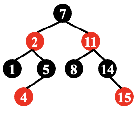

---
hide:
  #- navigation # 显示右
  #- toc #显示左
  - footer
  - feedback
comments: true
--- 

# Chapter 02 : Red-Black Trees and B+ Trees

## Red-Black Trees

### Why?

> 跟 AVL 树和 Splay 树一样，红黑树被发明出来也是希望能维护一个相对平衡的二叉搜索树

***
### Definition

!!! Definition "Red-Black Tree"

	红黑树是满足如下性质的一种二叉搜索树：
	
	- 每个节点不是红色就是黑色
	- 根节点为黑色
	- NIL 节点（空叶子节点）为黑色
	- 如果一个节点是红色，那么它的两个子节点都是黑色
	- 从根节点到 NIL 节点的每条路径上的黑色节点数量相同
	
	下图为一合法的红黑树：
	
	

!!! Definition "Black-Height"

	对于任何一个节点 $x$，它的黑高（Black-Height），记作 $bh(x)$，等于该节点到 NIL 结点的简单路径中（不包括自身）黑色节点的数量。$bh(Tree)=bh(root)$

!!! Lemma

	=== "Lemma"
	
		一个有 $N$ 个内部节点（不包括 NIL 结点）的红黑树，其高度最大为 $2log⁡_2(N+1)$。
	
	=== "Proof"
	
		我们首先证明 $bh(Tree)\leq log_2(N+1)$，即对于任意节点 $x$，$sizeof(x)(以 x 为根节点的子树的内部节点个数)\geq 2^{bh(x)}-1$，用数学归纳法来证明：
		
		如果 $h(x)=0$，$x$ 为 NULL $\Rightarrow sizeof(x)=2^0-1=0$，成立。
		
		假设如果对于每一个满足 $h(x)\leq k$ 的 $x$ 结论都成立：
		
		对于 $h(x)=k+1$ 的节点 $x$，$bh(child)=bh(x)或bh(x)-1$
		
		很容易可以得到 $h(child)\leq k$，而根据数学归纳法的假设，此时 $sizeof(child)\geq 2^{bh(child)}-1\geq 2^{bh(x)-1}-1$
		
		这样我们就有 $sizeof(x)=1+2sizeof(child)\geq 2^{bh(x)}-1$，证毕。
		
		***
		
		再接着我们来证明 $bh(Tree)\geq\frac{h(Tree)}{2}$
		
		对于每一个红节点，由红黑树性质其两个孩子节点一定都是黑节点，因此每一条从根节点到 NIL 的简单路径中，至少有一半的节点（不包含根节点）是黑色的，那么就能证明这个命题。
		
		***
		
		综合以上两个命题的证明，我们有 $h(Tree)\leq 2bh(Tree)\leq 2log_2(N+1)$，证毕。

!!! Example "Example 01"

	=== "Question"
	
		下图的红黑树是否合法？
		
		
	
	=== "Answer"
	
		不合法。
		
		16 号节点的右儿子是一个黑 NIL 节点，而这个 NIL 节点到根的路径上只有 3 个黑节点，而其他 NIL 节点到根都有 4 个黑节点。
		
		所以我们需要**警惕只有一个非 NIL 节点儿子的红色节点**。

根据 Example 01，我们得到这样一个结论：合法红黑树不存在只有一个非 NIL 节点儿子的红色节点！，换句话说，合法红黑树的红色节点的两个子节点一定都是 NIL 节点或都不是 NIL 节点！

!!! Example "Example 02"

	=== "Question"
	
		下图的红黑树是否合法？
		
		
	
	=== "Answer"
	
		合法。

***
### Operations

#### Insertion

