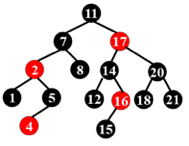

---
hide:
  #- navigation # 显示右
  #- toc #显示左
  - footer
  - feedback
comments: true
--- 

# Chapter 02 : Red-Black Trees and B+ Trees

## Red-Black Trees

### Why?

> 跟 AVL 树和 Splay 树一样，红黑树被发明出来也是希望能维护一个相对平衡的二叉搜索树

***
### Definition

!!! Definition "Red-Black Tree"

	红黑树是满足如下性质的一种二叉搜索树：
	
	- 每个节点不是红色就是黑色
	- 根节点为黑色
	- NIL 节点（空叶子节点）为黑色
	- 如果一个节点是红色，那么它的两个子节点都是黑色
	- 从根节点到 NIL 节点的每条路径上的黑色节点数量相同
	
	下图为一合法的红黑树：
	
	

!!! Definition "Black-Height"

	对于任何一个节点 $x$，它的黑高（Black-Height），记作 $bh(x)$，等于该节点到 NIL 结点的简单路径中（不包括自身）黑色节点的数量。$bh(Tree)=bh(root)$

!!! Lemma

	=== "Lemma"
	
		一个有 $N$ 个内部节点（不包括 NIL 结点）的红黑树，其高度最大为 $2log⁡_2(N+1)$。
	
	=== "Proof"
	
		我们首先证明 $bh(Tree)\leq log_2(N+1)$，即对于任意节点 $x$，$sizeof(x)(以 x 为根节点的子树的内部节点个数)\geq 2^{bh(x)}-1$，用数学归纳法来证明：
		
		如果 $h(x)=0$，$x$ 为 NULL $\Rightarrow sizeof(x)=2^0-1=0$，成立。
		
		假设如果对于每一个满足 $h(x)\leq k$ 的 $x$ 结论都成立：
		
		对于 $h(x)=k+1$ 的节点 $x$，$bh(child)=bh(x)或bh(x)-1$
		
		很容易可以得到 $h(child)\leq k$，而根据数学归纳法的假设，此时 $sizeof(child)\geq 2^{bh(child)}-1\geq 2^{bh(x)-1}-1$
		
		这样我们就有 $sizeof(x)=1+2sizeof(child)\geq 2^{bh(x)}-1$，证毕。
		
		***
		
		再接着我们来证明 $bh(Tree)\geq\frac{h(Tree)}{2}$
		
		对于每一个红节点，由红黑树性质其两个孩子节点一定都是黑节点，因此每一条从根节点到 NIL 的简单路径中，至少有一半的节点（不包含根节点）是黑色的，那么就能证明这个命题。
		
		***
		
		综合以上两个命题的证明，我们有 $h(Tree)\leq 2bh(Tree)\leq 2log_2(N+1)$，证毕。

!!! Example "Example 01"

	=== "Question"
	
		下图的红黑树是否合法？
		
		
	
	=== "Answer"
	
		不合法。
		
		16 号节点的右儿子是一个黑 NIL 节点，而这个 NIL 节点到根的路径上只有 3 个黑节点，而其他 NIL 节点到根都有 4 个黑节点。
		
		所以我们需要**警惕只有一个非 NIL 节点儿子的红色节点**。

根据 Example 01，我们得到这样一个结论：合法红黑树不存在只有一个非 NIL 节点儿子的红色节点！换句话说，合法红黑树的红色节点的两个子节点一定都是 NIL 节点或都不是 NIL 节点！

!!! Example "Example 02"

	=== "Question"
	
		下图的红黑树是否合法？
		
		
	
	=== "Answer"
	
		合法。

***
### Operations

#### Insertion

我们知道，对**黑高**有贡献的只有黑色节点，因此 NIL 节点被一个**红色**节点置换并不会改变一颗红黑树的黑高，因为红色节点还会有一层 NIL 子节点；然而对于红色节点，却有着红色结点互不相邻的限制。

因此，“插入”操作的主要思路就是，先将整个红黑树当作一个普通的二叉搜索树，将目标数据插入到树的末端（也就是置换一个 NIL 节点），并将它染为红色，再调整使之在保证**黑高不变**的情况下，满足**红色节点不能相邻**的要求。

现在，我们记这个被插入的节点为 $x$，任意一个节点 $node$ 的家长节点为 $node.p$，则：

1. 如果 $x.p$ 是黑色的，那么我们不需要做任何调整；
2. 如果 $x.p$ 是红色的，那么我们需要进行调整；
    - 此时因为原来的树符合红黑性质，$x.p.p$ 必定存在（红 $x.p$ 不能是根）且必定是黑色的；

在插入节点后，有可能会破坏红黑树的红黑性质（即上面第二条的情况），我们需要进行调整，并且在调整过程中，有一部分需要进行递归转移，也有可能再次出现类似的情况，我们将所有可能出现的情况归纳成下图 3 种情况（这张图中的叶子节点指 NIL 节点，“被插入的红色节点”也可能是在调整过程中**红黑性质被破坏的红根子树**）：

接下来我们来看该如何处理这三种情况（由于 case 之间可能出现互相转化，下面采取 case 3$\rightarrow$case 1 的顺序进行介绍，这样更为合理）：

!!! Operation

	=== "Case 3"
	
		对于 Case 3，我们只需要进行重新染色，并且进行一次旋转即可。
		
		
	
	=== "Case 2"
	
		对于 Case 2，我们直接进行一次 Rotation 操作即可将其变为 Case 3。
		
		事实上，整个 Case 2 到最后调整完成的过程其实就是一个 LR Rotation。
		
		
	
	=== "Case 1"
	
		对于 Case 1，图中两种情况是等价的。
		
		我们只需要将图中的根节点**染红**，将根的两个子节点**染黑**，类似于将黑节点“下放”。
		
		通过第一步操作，我们可以保证这整个子树必定**平衡**、**不影响家长节点的黑高**（除了家长是根的情况）且**红点不邻**的。
		
		然而我们并不知道这个根的家长节点是否是红色节点，因此要作如下图的分类讨论。倘若其根的家长节点是红色节点，那么我们还需要向上递归，继续调整，根据实际情况转化为其他 case；若这子树的根没有家长节点，则直接染黑红根即可；而倘若子树根节点的家长节点是黑节点，那么我们就调整完毕了。
		
		
		

总结起来，我们可以用一个状态机来概括：

其中 $C$ 表示染色操作，$R$ 表示旋转操作；状态机中的**粗线**表示转换过程中，我们关注的“子树”向上攀升了一级；而**细线**表示我们关注的子树仍然是这一层的那一棵。

其中，任何一个情况都可以作为一个初始情况。所以可以数出，到达 finish 的路径中，最多出现 2 次 Rotation（case 2 $\rightarrow$ case 3 $\rightarrow$ finish）。
***
#### Deletion

对于删除操作，我们先不管红黑性质，按照常规二叉搜索树的删除操作将其删除：

- 首先通过二分找到我们要删除的元素，这里需要 $O(\log N)$ 的时间复杂度
- 对这个节点进行分类讨论：
	- 没有非 NIL 子节点 $\rightarrow$ 直接用 NIL 节点代替
	- 有一个非 NIL 子节点 $\rightarrow$ 直接删除，用子节点来代替它
	- 有两个非 NIL 子节点 $\rightarrow$ 用左子树最大值节点或右子树最小值节点来代替它，然后从子树删除代替的那个节点

这其中，每一项操作都会导致一个点的消失，如果消失的是红色节点，那么将不会影响黑高；如果消失的是黑色节点，那么将会导致黑高减少一，此时我们需要做进一步操作。

我们还是将情况分为 4 种（同样的，这里的叶子节点指 NIL 节点；“需要被删除的目标点”由于递归转移，也可能是**由于删除了某个结点，黑高 -1 的子树**【请记住这个点，Bruce 因为这个没明白倒腾了一下午也没搞清楚删除操作的 qwq】）：

??? Question "x 到底何时删去？"

	如上面所说的，在一开始我们就可以找到 x 并根据不同情况将其删去，但是后续的操作我们仍旧保留了这个“需要被删除的目标点” 概念，是为了更便于理解，更直观地能看出操作的进程（可以把这个点当作一个虚空的点，或者就是 NIL 节点）
	其实我们可以统一这个定义为“由于删除了某个结点，黑高 -1 的子树”（因为删除了这个黑目标点就等价于以这个节点为根节点的子树黑高 -1 了，在第一轮调整时就需要以这个节点为 x 进行调整）

类似于我们在「Insertion / case 1」里提到的“下放”黑节点，删除操作的思路基本上是“上放”黑节点，或者说“吸纳”黑节点。这个“吸纳”的行为，指的是一个黑点，原来只为右子树中的所有路径提供了黑高，现在由于它的 sibling 子树中少了一个黑色节点，我们将这个黑色节点转移到它们的家长节点，于是这个节点同时为左右子树的所有路径都贡献了黑高，保证为左子树再提供一个黑高的同时右子树黑高不变。

接下来我们逐个分析这四种情况（请记住，在每一轮调整结束之后我们要寻找那个黑高 -1 的子树【值得注意的是，我们只需要在删掉的点到根路径上面的这一些树根寻找，因为在前面的交换操作中没有改变树的形态，只有在最后删除这里减少了一个黑点。所以后续的平衡维护的过程中其实都是在调整这一条链上的树】，将它作为 x 再来看这四种情况该用哪一种【这是删除的关键！】）：

!!! Operation

	=== "Case 1"
	
		Case 1 根据 $a$ 的红黑还可以继续分为两种情况：
		
		
		
		=== "Case 1.1"
		
			当 a 为红根时，由于 x 贡献了（相对于原红黑树）-1 的黑高，为了保证整个子树贡献的黑高不变，我们考虑把 w 的黑高“上放”到 a 上，也就是从下面“吸纳”上来。
			
			
		
		=== "Case 1.2"
		
			当 a 为黑根时，我们没有空余的位置来“吸纳” w 的黑高，但是左子树和右子树的不平衡是必须解决的，而我们绝不能寄希望于“在不知道有没有红色节点的 b 和 c 的子树中去寻找红色节点”这个想法。
			
			所以我们可以将整个树标记为灰色（即将 a 作为 x），然后进一步根据其家长节点的情况递归到其他 case。其中，当我们递归到 a 是整个树的根时可以退出，因为这相当于整个树的黑高 -1，不影响红黑性质。
			
			
	
	=== "Case 2"
	
		Case 2 操作如下：
		
		1. 将 w 染为 a 的颜色，再将 a 和 c 染成黑色；
		2. 将 a 左旋，使 w 成为这个子树新的根，a 成为 w 的左儿子，b 成为 a 的右儿子；
		3. 调整结束；
	
		
	
	=== "Case 3"
	
		Case 3 操作如下：
		
		1. 交换 b 和 w 的颜色；
		2. 将 w 右旋，使 b 成为 a 的右儿子，w 成为 b 的右儿子，b 的右儿子成为 w 的左儿子；
		3. 此时情况转化为 case 2；
	
		
	
	=== "Case 4"
	
		Case 4 操作如下：
		
		1. 交换 a 和 w 的颜色；
		2. 将 a 左旋，使 w 成为这个子树新的根，a 成为 w 的左儿子，b 成为 a 的右儿子；
		3. 此时根据子树 a 的情况，转化为 case 1.1 / case 2 / case 3；
	
		

我们同样可以用状态机来概括这个过程：

其中 $C$ 表示染色操作，$R$ 表示旋转操作；状态机中的**粗线**表示转换过程中，我们关注的“子树”向上或向下转移了一级（由 case 4 出发时下降，由 case 1.2 出发时上升）；而**细线**表示我们关注的子树仍然是这一层的那一棵。

其中，任何一个情况都可以作为一个初始情况。所以可以数出，到达 finish 的路径中，最多出现 3 次 Rotation（case 4 $\rightarrow$ case 3 $\rightarrow$ case 2 $\rightarrow$ finish）。

***

根据前面状态机的相关内容，我们不难得到这张表格，它统计的是 Rotation 在不同数据结构、不同操作中出现的数量：

| **Option** | **AVL Tree** | **RB Tree** |
| ---------- | ------------ | ----------- |
| Insertion  | $\leq 2$     | $\leq 2$    |
| Deletion   | $O(\log N)$  | $\leq 3$    |

***
## B+ Tree

