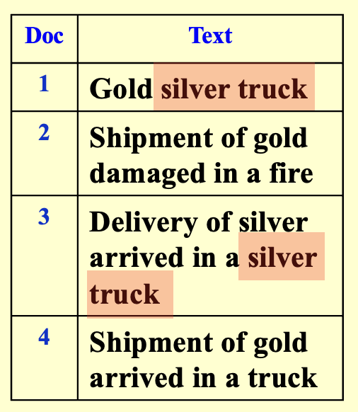
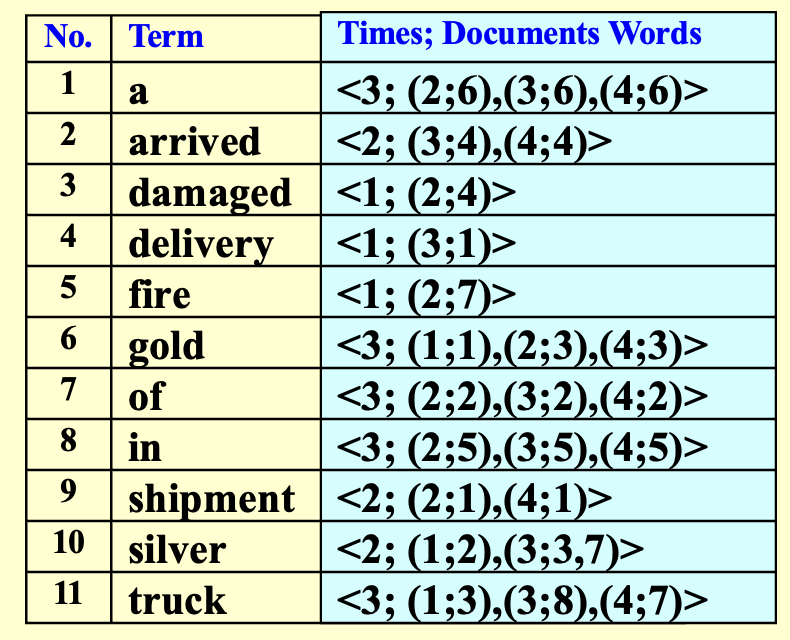

---
hide:
  #- navigation # 显示右
  #- toc #显示左
  - footer
  - feedback
comments: true
--- 

# Chapter 03 : Inverted File Index

> 倒排索引（Inverted File Index）是一种常见的文本检索技术，用于快速查找包含特定单词或短语的文档。它通过将单词或短语作为关键字，并将它们出现在文档中的位置记录在一个索引中，从而支持快速的文本检索。在搜索过程中，系统可以快速地定位包含指定单词或短语的文档，并返回它们的相关信息。倒排索引广泛应用于搜索引擎、数据库系统和信息检索等领域。
> 
> —— ChatGPT

所谓的倒排索引，所有的思想都凝结在了“倒”，也就是 Inverted。这里的索引对象指的是“文档”和“单词”之间的关系，而倒排索引的意思是，对于每一个单词，我们记录它出现在哪些文档中，以及记录他们出现的次数（频率）。

搜索引擎是一个非常常见的，倒排索引的应用案例，我们通过输入我们关注的词语，来索引包含这个词的所有文档。 当然，在这里我们考虑的是英文。
***
## Realization

知道了倒排索引的思想之后，其实现就变得非常直观了。我们可以用一个字典来描述一类关系，其主键为单词，键值为这个单词出现的所有位置。

最朴素的版本就是让键值为单词出现过的文档的序号序列，而如果我们还需要知道词汇出现的位置，则可以让键值是一个二元组的序列，其中第一个元素是文档的序号，第二个元素是单词在文档中出现的位置。

!!! Example

	=== "文档集"
	
		我们有如下文档集：
		
		
	
	=== "倒排索引"
	
		我们可以得到如下倒排索引：
		
		

***
### Accessing a term

我们通常会使用以下数据结构来存储倒排索引：

- **搜索树**（尤指 B 类树（B- 树、B+ 树等）、字典树 (Tries) 等）
- **散列**（Hashing）：相较于前者，它有以下优缺点：
    - 优点：查找单个词汇的速度非常快（$O(1)$）
    - 缺点：查找多个词汇的速度相对较慢，因为多个词汇出现在散列表的位置是不确定的，有可能相距较远；而像字典树之类的搜索树，可能会将词汇按照联系程度的紧密来确定这些词汇的相对位置，因此查找在某个句子的一串词汇可能会更快一些
***
### Memory Measurement

- 我们将填满的内存放入磁盘的一个存储块内，然后释放内存，继续用来装剩下的倒排索引
- 最后我们需要将这些装有倒排索引的存储块，以及内存里剩下的倒排索引合并在一起，合并的时候最好要排个序
***
## Techniques

那么到此为止了吗？非也。倘若毫无节制的将所有词都存到倒排索引中，那么我们的倒排索引就会变得非常大，其中必然有很多冗余信息存在，所以我们需要对倒排索引进行一些改进。
***
### Stop Words

我们观察到，我们存下来的这些内容中，有一些东西频繁地出现在所有文档中，在特定情况下，这些词可能并不会成为一个索引，例如正常的英文文章中的 `a`，`the` 等。所以，对于这一类词——我们称之为**停用词（Stop Words)**，对于停用词，我们就不需要将他们存下了。

??? Question "哪些词可以被认为是停用词？"

	一般一个词成为停用词，是因为它无法成为一个有效的检索关键字，它可能是在大量资料中大量出现，导致我们无法利用它找出我们想要的资料。换句话来说，一个共通点是它们**通常**都有着相当高的出现频率。
***
### Word Stemming

**词干分析（Word Stemming）** 是一种将单词转换为其词干的技术。例如，词干分析可以将单词 `trouble`，`troubled`，`troubles`，`troubling` 都转换为 `trouble`（甚至是 `troubl`，核心目的是让它们变成同一个单词）。相同词干的词有着类似的含义，在检索 `troubled` 的时候，当然也可能想找到包含 `trouble` 的文档。这种技术也可以让多个单词共享同一条索引记录，在存和找的过程中都能优化效果。

不过在具体操作方面，这个东西就显得比较繁杂和暴力了，我们只能根据语法规范进行暴力匹配和判断。
***
### Distributed Indexing

可想而知，对于一个搜索引擎来说，它所需要索引的文料是非常庞大的，所以我们通常需要将其分布式地存储和索引。

而这里有两种分布式的策略，其一是根据单词的字典序进行分布式，其二是根据文档进行分布式。

显然根据单词的内容进行分布式，能够提高索引效率，但是这样的话，我们就需要将所有形式接近的单词都存储在一个地方，这样就会造成单点故障，容灾能力很差，所以这种方式并不是很好。

而第二种办法则有较强的容灾性能。即使一台机器无法工作，也不会剧烈影响到整个系统的工作。
***
### Dynamic Indexing

在实际应用中，可能会遇到以下问题：

- 文档可能会随时被添加进去：如果按照原来的方法，倒序索引就需要根据插入的文档来实时更新，这样的话效率太低
- 文档也有被删掉的可能

解决方法：

- 我们称原来存储索引的地方为**主索引**（Main Index）
- 现在新增一个存储少量索引的空间，叫做**辅助索引**（Auxiliary Index）（可以理解为一个 cache）
- 新插入的文档对应的索引会暂时存放在辅助索引内
- 如果要搜索网页的话，搜索引擎会同时在主索引和辅助索引内查找对应的索引，查找辅助索引的速度更快一些
- 在适当的时候将辅助索引内的内容合并到主索引内（即归档），随后清空该索引，继续用于存放新插入的文档
***
### Compression

这里有几种可压缩存储空间的场景：

- 关于词汇
    - 一个简单的想法是将所有的词汇放在一个数组内，但是它的存储空间除了取决于词汇数量，可能还取决于最长词汇的位数，如果某个词汇很长，浪费的空间就特别多了
    - 因此一种压缩的策略是：
        - 先去除停用词
        - 然后将所有的词汇放在同一个存储块内，词汇之间没有任何间隔，所以看起来就是一长串字符串
        - 为了从这个长字符串中区分词汇，我们还需要另一张表来记录每个词汇的开头的位置
        - 这样我们将一个很大的数组压缩成两张相对较小的表
- 关于索引
	- 如果我们有大量的文档，那么词汇的倒排索引可能无法表示特别大的整数（即使`long long`也救不了）
	- 因此我们不再记录文档的绝对序号，而是记录某个词汇所在的两个最近的文档的间距，也就是说记录基于绝对序号的**差分（Difference）序列**。根据实际经验可知，大多数的间距值不会超过 20 bit，因而能够存储更大的文档序号

***
### Threshold

设置**阈值**（Threshold）的原因是：让搜索引擎查找或检索所有相关的网页是没有必要的，因为我们人类的时间精力有限，即使搜出来的网页都有价值（而实际上只有很少的一部分网页是有意义的），我们也不会将所有给出的网页都阅读一遍；而且检索所有网页这一行为所消耗的时间较多，所以需要设定一个阈值，我们只要这个范围内的网页就行了。下面将会从两个角度阐述这一思想：

- **文档**：只检索根据权重排名下来的前 x 个文档
    - 缺点：对于布尔查询（用到与、或等布尔运算），可能会错过一些有意义的文档。比如我们要搜索 `Computer & Science`，搜索引擎只会搜与这两者的交集相关的文档，可能会忽略与`Computer` 相关或与 `Science` 相关的文档
- **查询**（Query）
    - 将查询中的词汇按它们出现的频率升序排序
    - 搜索的时候只会根据序列前面的几个词汇（也就是出现频率相对较少的词汇）搜索，因为通常而言出现频率少的词汇的价值高于出现频率多的词汇（换句话说，在倒排索引中，词汇对应的倒排列表的长度越长，它蕴含的意义可能更少）
    - 根据实际情况确定阈值的大小：如果对于不同的阈值，搜索的准确度差不多，那么就取较小的阈值，否则取更大的阈值
***
##  Measurement

我们可以从以下几个角度来测量搜索引擎的性能：

- 排索引的速度：每小时处理的文档数
- 搜索的速度
    - 潜伏期（Latency）：等待搜索结果出现的时间
    - 如果仅比较潜伏期是不太合理的，因为潜伏期的大小与索引的大小有关。因此将潜伏期看作关于索引大小的一个函数，在此基础上再做比较
- 查询语句的可表达性（Expressiveness）：即能够表达复杂信息的能力，我们会比较搜索引擎在这类复杂查询下的搜索速度
- 用户满意度：
    - **数据**检索性能评估（Data Retrieval Performance Evaluation）：主要考虑响应时间、索引占用空间等指标
    - **信息**检索性能评估（Information Retrieval Performance Evaluation）：主要考虑回答的相关程度等

相关性的测量还需要以下几部分：

- 一个作为基准文档集
- 一套作为基准的查询语句
- 一个对于每个查询 - 文档对的二维评估
    
	评估中会用到两个指标：**精确度**（Precision）和**召回率**（Recall）
    
    - 如果精确度高而召回率低，那么我们会错过很多有价值的网页
    - 如果召回率高而精确度低，那么我们会得到很多无意义的网页
    - 因此理想情况是同时具备较高的精确度和召回率，但实际应用中可能无法同时兼顾两者，需要做好权衡