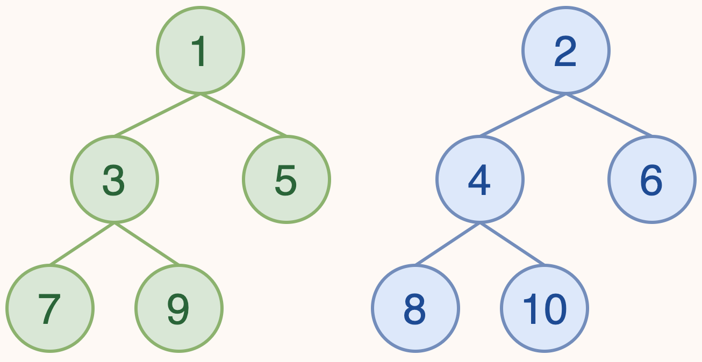

---
hide:
  #- navigation # 显示右
  #- toc #显示左
  - footer
  - feedback
comments: true
--- 

# Chapter 04 : Leftist Heaps and Skew Heaps

## Leftist Heap

### Why?

> 对于普通的两个堆合并操作，我们都需要将其中一个堆的每个元素一个一个地拷贝到某一个地方（无论是拷贝到另一个堆里面还是拷贝到一个新的堆里面），这样的时间复杂度为 $O(N)$，那有没有方法或者一个新的堆结构能让其合并地快一些呢？
***
### Definition

!!! Definition

	**左偏堆(Leftist Heap)**，它相比于普通的堆，更好的一点在于它支持快速的堆合并操作。“左偏”，并不断将新的东西往右侧合并（来更好实现堆的平衡），来实现每次都是往相对小的那一侧塞进东西。
	
	由于左偏堆不再是一个完全二叉树，所以我们不能再像维护大根堆小根堆那样用数组来维护它了。
	
	一个左偏堆的结点维护了左右子堆的地址、自身的键值、和一个“空路径距离（Null Path Length）”。

!!! note "Null Path Length"

	- 如果一个结点的左孩子或右孩子为空结点，则该结点的 NPL 为 $0$，这种结点被称为外结点
	
	- 如果一个结点的左孩子和右孩子都不为空，则该结点的 NPL 为 $\min⁡\{\text{NPL}(\text{left child}),\text{NPL}(\text{right child})\}+1$；
	
	或者更为直接地，定义 $\text{NPL}(\text{NULL})=-1$，那么有 $\text{NPL}(X)=\min\{\text{NPL}(C)+1\}，C 为 X 的孩子$
	
	

- 有了空路径距离这个定义，我们也可以得到左偏堆的一个性质：对于堆中的每一个节点 $X$，其左孩子的空路径距离一定不小于其右孩子的空路径距离。


我们还可以得到如下扩展性质：

!!! Properties

	- 结点的 NPL 等于 $\text{NPL}(\text{right child})+1$（假设 $\text{NPL}(\text{NULL})=−1$）

	- 如果 $\text{NPL}(i)=N$，则以 $i$ 为根的子树**至少**是一个 $N+1$ 层的满二叉树，即这个子树至少有 $2^{N+1}−1$ 个结点；
	
	

为什么左偏堆会这么设计呢？实际上，合并堆需要考虑的非常重要的一个点就是要能在之后的操作中尽可能地维护堆的“平衡”，否则我们把堆维护成了一个链，那显然是非常糟糕的。

而左偏堆通过维护整个堆“左偏”，并不断往右侧合并，来实现每次都是往 NPL 相对小的那一侧塞进东西，进而保证了这个堆的相对平衡性。
***
### Operations

左偏堆的核心操作就是合并。而其它操作（如插入、删除）都可以看作是合并的特殊情况。因此我们首先讨论任意两个左偏堆的合并。
***
#### Merge

作为左偏堆的核心操作，合并操作自然就是要在满足性质的条件下，合并两个左偏堆。大致思路就是**先维护堆的性质**，在**回溯时维护左偏性质**，所以实际上它是一个先自上而下再自下而上的过程。

按照实现方法，左偏堆的合并可以分为**递归式**和**迭代式**两种。其中前者可能更为直觉，而后者可视化后则更为直观。

!!! Merge

	=== "递归式"
	
		递归式先比较当前两个待合并子树的根结点的键值，选择较小（较大）的那个作为根结点，其左子树依然为左子树，右子树更新为「右子树和另一个待合并子树的合并结果」。
		
		当然，在递归地更新完后，我们需要检查左子树和右子树是否满足 $\text{NPL}(\text{left child})\geq\text{NPL}(\text{right child})$ 的性质，如果不满足，我们则需要**交换左右子树**来维持性质。
		
		```c
		LeftistHeapNode * merge(LeftistHeapNode * x, LeftistHeapNode * y) {
		    // Recursive exit. If any is NULL, return the other as the new root of subtree.
		    if (x == NULL) return y;
		    if (y == NULL) return x;
		
		    // If x's val is smaller than y's, swap them, which means we always operates on x.
		    if (x->val > y->val) {
		        swap(x, y);
		    }
		
		    // Merge x's right subtree and y, and set x's right subtree to the result.
		    x->rchild = merge(x->rchild, y);
		
		    // If x's left subtree's NPL is smaller than x's right subtree's NPL, swap them.
		    if (x->lchild->NPL == NULL || x->lchild->NPL < x->rchild->NPL) {
		        swap(x->lchild, x->rchild);
		    }
		
		    // Update x's NPL.
		    x->NPL = x->rchild->NPL + 1;
		
		    // Return x as the new root of subtree.
		    return x;
	    }
		```
		
		!!! Example
		
			现在我们模拟一下这个过程，现在我们有下面两个左偏堆，尝试合并它们。
			
			
			
			=== "Step 1"
			
				
				
				我们发现，经过比较，1 更小，所以我们将 1 作为合并后的根结点，左子树不变，右子树更新为「绿树右子树和蓝树的合并结果」。
			
			=== "Step 2"
			
				
				
				经过比较，2 更小，所以我们将 2 作为合并后的根结点，左子树不变，右子树更新为「蓝树右子树和绿树的合并结果」。
				
			=== "Step 3"
			
				
				
				最后还剩下两个结点啦！实际上这里直接模拟了两个步骤，首先是比较 5 和 6，并选择了 5 作为新根；接下来在递归的过程中发现需要合并 `NULL` 和 6，所以直接返回了 6。
				
				然而还没有结束，我们还需要处理左右子树 NPL 大小关系问题。
			
			=== "Step 4"
			
				
				
				我们发现 5 的左孩子为 `NULL`，我们记 $NPL(NULL)=−1$，右孩子 6 有 $NPL(right child)=0$，所以需要交换两个孩子。
			
			=== "Step 5"
			
				
				
				这里也跳过了两个步骤：
				
				往回走，发现 5 的 dist 小于 4 的 dist，满足性质，不需要改变。
				
				继续往回走，发现 2 和 3 的 dist 相同，满足性质，也不需要改变。
				
				从这里也可以看出来，并不是看上去更大的子树一定在左侧。
	
	=== "迭代式"
	
		迭代式维护两个额外的指针，分别指向两棵树还没被合并的子树的根，并不断选择较小的那个合并进去，直到两个指针都为空。可以发现，这个过程和归并排序的后半部分非常相似，实际上当我们从可视化的角度去看这件事以后，会发现这里做的**就是一个归并**。
		
		```c
		LeftistHeapNode * merge(LeftistHeapNode * x, LeftistHeapNode * y) {
		    // tx & ty are the pointers to the roots of the subtrees that haven't been merged.
		    LeftistHeapNode * tx = x, * ty = y;
		    // res is the root of the merged final tree, while cur is the latest node that has been merged.
		    LeftistHeapNode * res = NULL, * cur = NULL;
		
		    // Begin merging.
		    while (tx != NULL && ty != NULL) {
		        // If tx's val is smaller than ty's, swap them, which means we always operates on tx.
		        if (tx->val > ty->val) {
		            swap(tx, ty);
		        }
		
		        // Specially mark the root on the first merge.
		        if (res == NULL) {
		            res = tx;
		            cur = tx;
		        } else {
		            cur->rchild = tx;
		            cur = cur->rchild;
		        }
		
		        // Go on.
		        tx = tx->rchild;
		    }
		
		    // Merge the rest of the tree.
		    while (ty != NULL) {
		        // Specially mark the root on the first merge. (rarely happens but not impossible)
				if (res == NULL) {
					res = ty;
					cur = ty;
				} else {
					cur->rchild = ty;
					cur = cur->rchild;
				}
		
				// Go on.
				ty = ty->rchild;
			}
		
			// Adjust the left and right subtrees of all the nodes according to the properties of NPL. 
			// It does the same work as the adjust part in the recursive version. I ignore it here.
			res = adjust(res);
		
			return res;
		}
		```
		
		!!! Example
		
			首先，我们对图片的排版稍微做一些改变，我们不再按照之前画堆的方式去画，而是“左偏”地去画：
			
			
			
			=== "Step 1"
			
				
				
				绿色和蓝色的箭头分别表示两个待合并子树尚未合并的子树的根，紫色箭头表示最近的合并发生的位置。
			
			=== "Step 2"
			
				
				
				比较 1 和 2，发现 1 更小，所以我们将 1 作为合并后的根结点，左子树随之合并进去，同时更新绿色箭头指向尚未合并进去的 5。
			
			=== "Step 3"
			
				
				
				和上一步类似的，比较 5 和 2，发现 2 更小，所以我们将 2 作为合并后的根结点，左子树随之合并进去，同时更新蓝色箭头指向尚未合并进去的 6。
			
			=== "Step 4"
			
				
				
				依然类似地，比较 5 和 6，发现 5 更小，所以我们将 5 作为合并后的根结点，左子树随之合并进去，同时更新绿色箭头指向 `NULL`。
			
			=== "Step 5"
			
				
				
				这时候我们发现已经有一个指针空了，也就是绿色指针已经指向了 `NULL`，这个时候我们只需要按顺序把蓝色指针指向的内容都推进去即可。
			
			=== "Step 6"
			
				
				
				接下来我们还需要维护 NPL 信息并根据性质交换左右子树。这一部分和之前一样，就不再赘述了。
	
		!!! note "从归并排序角度来看"
		
			联想我们之前发现它和归并排序很像，我们还可以用一个更加直观的方式来看这个过程：
		
			=== "Step 1"
			
				
				
				同样从这张图开始，由于我们之前提到的，它类似于一个递归排序的后半部分，具体来说是指合并两个有序数列的过程。
				
				也就是说，我们可以将这两个左偏堆改写成两个有序数列！
			
			=== "Step 2"
			
				
				
				由于我们在合并过程中总是找右孩子，所以我们就沿着最右沿路径把没个左偏堆拆成这种“悬吊”的带状形式，每一“条”的值取决于根的键值，也就是这一“条”的最顶部。
				
				在这张图中，我们得到的两个**有序**数组分别是 <font color="green">[1, 5]</font> 和 <font color="blue">[2, 6]</font>，接下来我们将它们进行排序。
			
			=== "Step 3"
			
				
				
				经过排序，就会发现它们刚好符合我们在上面步骤得到的结果（可以对比着上面的 Step 5 看）。实际上，只要你回顾一下归并排序的过程，再对比着看上面的过程，就会发现一模一样。
***
#### Insertion

插入结点可以看作合并一个只有一个结点的左偏堆，所以我们可以直接复用合并过程。

***
#### Deletion

让我们一般性地考虑一个结点，与它相关的主要有三个方向：父结点和两个孩子结点。

而单点删除的操作也很简单，只需要合并需要被删除的结点的两个子结点，然后将这个新的树的根代替被删除的结点，再在回溯的过程中 bottom-up 地更新 NPL 即可。

```c
LeftistHeapNode * del(LeftistHeapNode * cur, ElementType x) {
    if (cur->val == x) {
        // Just return the merge of the children.
        return merge(cur->l, cur->r);
    } else {
        // Not this subtree.
        if (cur->val > x) return cur;

        // Otherwise, search the x.
        if (cur->lchild != NULL) del(cur->lchild, x);
        if (cur->rchild != NULL) del(cur->rchild, x);

        // Adjust the dist bottom-up.
        adjust(cur);
    }
}
```

可以看到，合并操作并没有对每个节点都进行访问，时间复杂度为 $O(\log N)$（插入和删除因为基于合并也同样）
***
## Skew Heap

### Why?

>左偏堆由于需要自下而上地维护 NPL，所以我们无法进行并发操作。回顾 AVL 树，同样为了维护它比较严格的平衡性质，我们也无法进行并发操作，而红黑树则通过一个能够仅仅通过变色就能调整的黑高来规避了必须自下而上维护的问题，实现了并发。
>
>换句话来说，要想将左偏堆改变地能够进行自上而下维护，就需要改变甚至放弃它的左偏性质的严格性——而这就是斜堆的由来。
***
### Definition

斜堆(Skew Heap)是比左偏堆更为一般的数据结构，它同样有着能够快速合并的性质。

斜堆也需要满足大根堆（小根堆）的性质，而它的合并和左偏堆的合并也十分类似，只不过我们这次**无条件的交换左右子树**，换句话来说，不管左偏性质如何变化，我们都会选择交换参与合并的左右子树，这样我们就不需要在回溯的时候才进行左右子树的交换，于是就实现了完全的自上而下。

!!! Example "递归式"

	=== "Origin"
	
		
		
		这是我们需要合并的两个堆。
	
	=== "Result"
	
		
		
		省略了中间的步骤，可以尝试模拟一下，每一次合并操作结束之后都交换左右子树。
		
		我们总是先往右侧子树递归下去地合并，每完成一次合并就交换这个子树和它的兄弟姐妹，而它的兄弟姐妹在这次交换完以后就不会再发生改变，而这个子树则会继续进行下一次合并。

!!! Example "迭代式"

	
	
	
	
	迭代法和之前的做法也类似，我们可以排序每一“条”，然后再合并。上面的过程图有点自下而上的意思，但是实际上自上而下做也是一样的。
***
### Correctness Analysis

首先进行感性的理解。我们每合并两个堆都是沿着最右侧路径合并（虽然中间会被不停转到左边），即每次会被改变的子树左右顺序的节点都是最右侧的节点，而再合并过程中如果每次合并都将发生的变化转到左侧，以此来减小合并操作带来的高度“累积”。

以每次只插入一个点为例子说明问题。

进一步对递归旋转到左侧做解释，递归性地转到左侧，使得本来最右侧的路径变到最左侧，即使之后交换会重新访问到这个子树，但此时除了根，其他部分依然是最左侧的路径，也不会再轻易地访问到这次路径。

用图来作解释的话，就是这样：


我们只关注一开始作为最右侧的这三个红点，可以发现，在两次操作后，除了直接作为根的子树的那个节点被转了过来，其他的之后的节点都是作为“最左侧”的节点出现的，虽然图中只有这一个，但是当树的规模变大后，这个优势会更加明显。

这只是我们感性的想法，接下来我们从摊还分析的角度来分析其正确性，即其均摊复杂度为 $O(\log⁡N)$。
***
### Amortized Analysis

这里我们采用势能法进行分析。

分析 skew heap 的均摊复杂度，主要就是分析**合并**操作的复杂度，因为其他操作都可以转化为合并操作。

接下来我们需要定义势能函数：

$$
\Phi(\text{Heap})=\text{number of heavy node in Heap}。
$$

!!! Definition "Heavy Node & Light Node"

	对于一个子堆 $H$，如果 $\text{size}(H.\text{right}_{\text{descendant}})\geq\frac{1}{2}\text{size}(H)$，则 $H$ 是 heavy node，否则是 light node。

!!! Properties

	- 如果一个节点是 heavy node，并且在其右子树发生了合并（包括翻转），那么它**一定**变为一个 light node；
	- 如果一个节点是 light node，并且在其右子树发生了合并（包括翻转），那么它**可能**变为一个 heavy node；
	- 合并过程中，如果一个节点的 heavy/light 发生变化，那么它**原先**一定在堆的最右侧路径上；

列出公式：

$$
\hat{c}=c+\Phi(H_\text{merged})−\Phi(H_x)−\Phi(H_y)
$$

其中，$c$ 为合并操作的（最坏）复杂度，$H_\text{merged}$ 为合并后的堆，$H_x$ 和 $H_y$​ 分别为合并前的两个堆。

根据 property 3，在合并过程中并非所有节点都受到影响。我们可以单独记录 $l_x$ 为 $H_x$​ 最右侧路径上的 light node 数量，$h_x$ 为 $H_x$​ 最右侧路径上的 heavy node 数量，$h_x^0$​ 为 $H_x$ 所有不在最右侧路径上的 heavy node 数量（即 $\text{count of heavy nodes of }H_x=h_x+h_x^0$​）。

于是，我们可以将上式写开：

$$
\begin{cases}
\begin{aligned}
c &= l_x+h_x+l_y+h_y \space\space(1)\\
\Phi(H_\text{merged})&\leq l_x+h_x^0+l_y+h_y^0\space\space(2)\\
\Phi(H_x)&=h_x+h_x^0\space\space\space\space\space\space\space\space\space\space\space\space\space\space\space\space\space\space(3)\\
\Phi(H_y)&=h_y+h_y^0\space\space\space\space\space\space\space\space\space\space\space\space\space\space\space\space\space\space(4)
\end{aligned}
\end{cases}
$$

其中稍微做一些解释：

- (1)：c 为合并操作的（最坏）复杂度，即我们的枚举涉及了两个堆所有的右侧路径；
- (2)：在合并操作以后，根据 property 1 和 property 2，可以得到这个不等式；
- (3) 和 (4)：根据势能函数的定义得到；

于是，将它们代入得到结果：

$$
\begin{aligned}
\hat{c}&=c+\Phi(H_\text{merged}​)−\Phi(H_x​)−\Phi(H_y​)\\
&\leq(l_x​+h_x​+l_y​+h_y​)+(l_x​+h_x^0​+l_y​+h_y^0​)−(h_x​+h_x^0​)−(h_y​+h_y^0​)\\
&\leq 2(l_x​+l_y​)\\
\hat{c}&=O(\log N)
\end{aligned}​
$$
***
## Homework

!!! question "Question 01"

	The result of inserting keys 1 to $2^k−1$ for any $k>4$ in order into an initially empty skew heap is always a full binary tree.
	
	??? note "Answer"
	
		True. 这个模拟一下会发现真的很对，Skew Heap 都能很巧妙地将两边平衡，当结论记了（问就是不会证 hhh）

!!! question "Question 02"

	The right path of a skew heap can be arbitrarily long.
	
	??? note "Answer"
	
		True. 对于 Skew Heap 来说，其对于右路径的限制在于其长度需要小于左路径，而并没有具体数值的限制，所以自然可以做到无限长。（如我加一个左儿子后给这个左儿子加一个右儿子，再给这个右儿子加一个左儿子，如此左右左右往复，可以构成一个右路径任意大小的斜堆）
		
		但对于 Leftist Heap 就不一样了，因为 NPL 的存在它只能被限制在 $O(\log N)$ 里面
