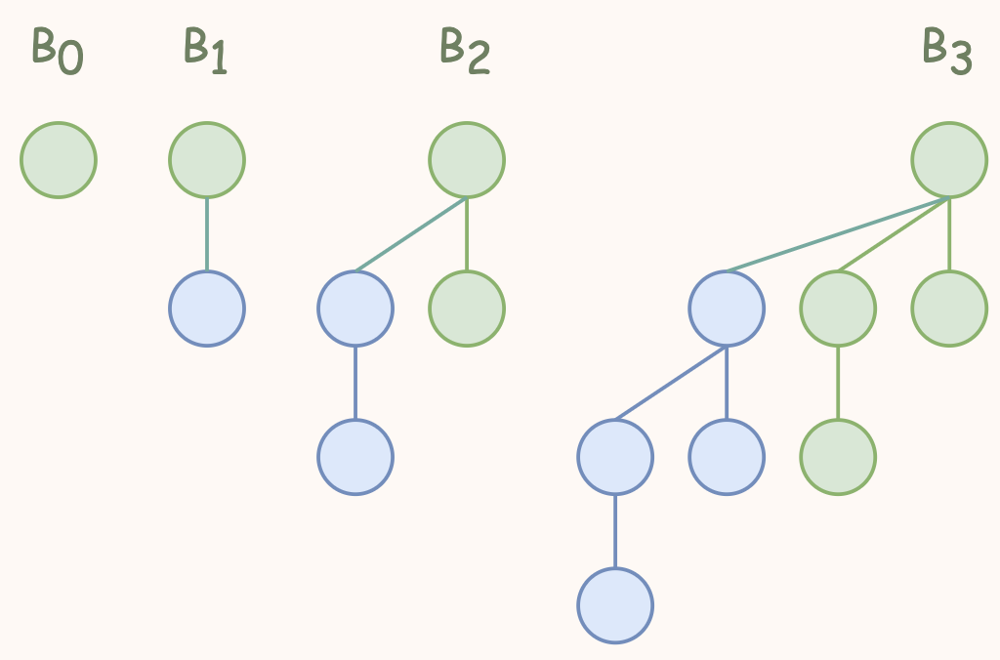

---
hide:
  #- navigation # 显示右
  #- toc #显示左
  - footer
  - feedback
comments: true
--- 

# Chapter 05 : Binomial Queue

## Binomial Queue

堆的其中一个应用就是优先队列。二项队列(Binomial Queue)也是优先队列的一种实现，只不过不同于之前我们用一个堆维护优先队列，二项队列同时维护了具有不同特征的若干队列。
***
### Definition

二项队列(Binomial Queue)本质上是一系列二项树(Binomial Tree)的集合。

!!! Definition

	二项树满足堆的性质，即 parent 节点的值小于（大于） child 节点的值。
	
	一个非常关键的性质是，$k$ 阶二项树都是同构的，且 $k$ 阶二项树是两个 $k−1$ 阶二项树合并得到的。而其合并方式是直接令其中一棵成为另外一棵的根的新 child，这也决定了二项树的根每一个 child 本身也都是一个二项树。
	
	
	
	显然能够得到，**二项树并非二叉树**；更进一步的，$k$ 阶二项树 $B_k$​ 的根有 $k$ 个 child，$2k$ 个节点；再进一步的，$B_k$​ 的第 $d$ 层一共有 $C_k^d$ 个节点，有趣的是，所有层的节点加起来刚好符合二项式定理，此条定理可以由数学归纳法很容易地证明，不再赘述。

可以发现，二项树是一个 $N$ 叉树，所以通常我们使用链表 sibling 的形式来表示一个节点的 children。

再对二项树做一个简单的总结，$k$ 阶二项树结构唯一确定，两个 $k$ 阶二项树合并后得到一个 $k+1$ 阶二项树，而二项树本身也具有堆的性质。

但是，虽然二项树具有堆的性质，看似能独立完成优先队列的功能，但是二项树对点的数量具有比较严格的要求，只有点的数量符合 $2k$ 时，才能使用二项树表示。因此，观察一个二项树能承载的点的数量特征，我们联想到二进制对数的表示——我们可以用一系列二项树来维护 $N$ 个节点的优先队列，而具体用几阶二项树，则取决于 $N$ 的二进制表达中，为 `1` 的是哪几位。

