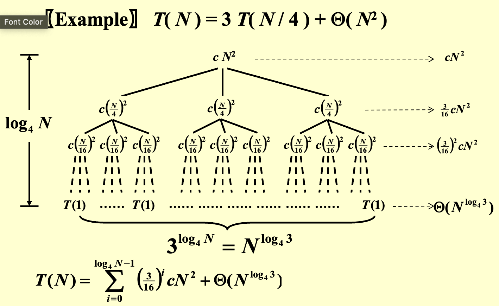

---
hide:
  #- navigation # 显示右
  #- toc #显示左
  - footer
  - feedback
comments: true
--- 

# Chapter 07 : Divide and Conquer

## Introduction

>分治法(Divide-and-conquer algorithm)属于一种算法范型，它的基本思想是将一个问题分解为若干个规模较小的相同问题，然后递归地解决这些子问题，最后将这些子问题的解合并得到原问题的解，一个比较经典的案例就是归并排序和快速排序。

!!! Example "Closest Points Problem"

	二维最近点问题(Closest Points Problem)，指的是给定平面上的 n 个点，找出其中距离最近的两个点。
	
	=== "朴素方法"
	
		最朴素的做法当然是枚举所有的点对，一共需要 $C_N^2=\frac{N(N−1)}{2}$​ 即复杂度为 $O(N^2)$。
	
	=== "分治方法"
	
		现在我们类比最大子序列和问题的分治做法。
		
		!!! note "最大子序列和的分治做法"
		
			1. 将序列分为左右两部分，分别求解最大子序列和；
			2. 求解跨越中点的最大子序列和；
			3. 比较三者的大小，取最大值；
		
		我们可以将整个平面分为两个部分，即如图中绿色线将点对划分为两个部分。
		
		
		
		接下来我们同样分为这么三步：
		
		1. 将点对分为左右两部分，分别求解最近点对；
		2. 寻找跨越分界线的点对，从中寻找最近点对；
		3. 比较三者的大小，取最小值；
		
		显然，我们现在需要解决的就是要如何设计第二步的实现，以求更优的复杂度。
		
		首先我们假设在第一步中，我们求得两边求得的最小距离中较小的那个为 $\delta$，换句话来说，如果答案在第二步中被更新，那么它的距离需要小于 $\delta$。而我们知道，在第二步中被拿出来的点对，一定是一个在分界线左侧一个在分界线 L 右侧。朴素的来想，在距离分界线 $\delta$ 以外的点对中，我们是不需要考虑的。而在距离分界线 $\delta$ 以内的点，都存在成为答案点对的可能。
		
		
		
		如图，现在我们知道，只有落在两条深绿色之间的点才可能会更新答案。
		
		现在我们需要做的是，从分界线左侧的区域里拿一个点，和分界线右边的一个点做匹配，然后取所有结果中的最小点。不过这件事仍然可以优化——在二维的数据中，仅对一个纬度做约束往往会导致事情变得不那么稳定，所以我们同样考虑在另外一个方向做约束。
		
		也是基于范围约束的考虑。假设我们以左侧的点为基准，从上往下做遍历这些点，那么对于点 $p_{l_i}$​​，具有能够更新答案的，$dis(p_{l_i​}​,p_{r_j}​​)\leq\delta$ 的 $p_{r_j}​​$，一定有 $dis_{||bound}(p_{l_i},p_{r_j})\leq\delta$（直角三角形斜边最长）。
		
		因此，对于选定点 $p_{l_i}$，其所有可能导致答案更新的点都被框定在一个 $2\delta×\delta$ 的矩形中。
		
		而更奇妙的是，这个由参数 $\delta$ 指定的矩形，巧妙地约束了落在矩形中的点的最大数量。
		
		
		
		在这样一个区域中，我们需要约束所有落在 $\delta×\delta$ 的 L 区域中的点，互相的距离都大于等于 $\delta$，对 R 区域中的点也有相同的约束。不难发现，在最理想最理想的情况下——闭区间、允许点重合的情况下，这个矩形最多也只能放八个点（两边各四个）：
		
		
		
		而更一般的情况下，最多也只能放六个点（两边各三个）。
		
		无论如何，我们可以得到结论，在这种情况下，对于每一个选定的 $p_{l_i}$，寻找其可能导致答案更新的点的复杂度都是常数级的。
		
		而枚举这些“选定点”，也就是枚举 $p_{l_i}$，其复杂度（撑死）是 $O(N)$。
		
		于是我们能得到这个分治的时间复杂度计算递推公式：
		
		$$
		T(N)=2T(\frac{N}{2})+O(N)=O(N\log N)
		$$
		

## Solving Recurrences

在开始接下来的内容之前，我们需要给出更一般的，我们想要解决的问题，即求解时间复杂度递推公式形如下式的算法的时间复杂度：

$$
T(N)=aT(\frac{N}{b})+f(N),a,b\in\Z^+
$$

例如，上面的最近点对问题，就是 $a=2,b=2,f(N)=O(N)$ 的情况。
***
### Substitution Method

> 代换法(Substitution Method)的思路非常直白，首先我们通过某些手段（~~比如大眼观察法👀~~）来得到一个预设的结果，接下来通过代入、归纳的方法来证明这个结果。

简单来说，就是大胆猜测，小心求证（先猜后证）！

!!! Example

	=== "Question"
	
		求解复杂度：
		
		$$
		T(N)=2T(\frac{N}{2})+N
		$$
		
	
	=== "Answer"
	
		大胆猜测 $T(N)=O(N\log N)$
		
		对于足够小的 $m<N$，有：
		
		$$
		T(\frac{m}{2})=O(\frac{m}{2}\log\frac{m}{2})\leq c\frac{m}{2}\log\frac{m}{2}
		$$
		
		将上式代入得：
		
		$$
		T(m)=2T(\frac{m}{2})+m\leq c\frac{m}{2}\log\frac{m}{2}+m\leq cm\log m\text{ for }c\geq 1
		$$
		
		对于足够小的 $m=2$ 式子就可以成立，由归纳法得结论成立

不过很显然，在某些情况下我们求证了一个复杂度的假设成立，但它并不一定足够紧，这是猜解法的通病。
***
### Recursion-tree Method

>递归树法(Recursion-tree Method)的思路是，我们通过画出递归树来分析算法的时间复杂度，实际上和直接数学推理的区别不是很大，主要就是通过观察递归过程中数据增长的模式来进行分析。

就类似于直接展开式子，只不过通过树状图的形式或许更加直观。

对于一个递推式，我们将它不断展开以后，其形式大概会是这样：

$$
T(N)=...=\underbrace{\sum\limits_{leaf_i}^{leaves}T(N_{leaf_i})}_{conquer}+\underbrace{\sum\limits_{node_i}^{non-leaf-nodes}f(N_{node_i})}_{combine}
$$

其中，由于末端子问题的规模一般都足够小，可以认为 $T(N_{leaf_i})$ 都是常数，于是上式又可以变化为：

$$
T(N)=...=\underbrace{cN_{leaves}}_{conquer}+\underbrace{\sum\limits_{node_i}^{non-leaf-nodes}f(N_{node_i})}_{combine}
$$

具体来说解释其含义，combine 部分就是在每一次“分治”的处理时间，如合并当前的子问题分治后的结果，体现在递推式的 $f(N)$ 部分；而 conquer 部分指的是当“分治”的“治”在“分”的末端的体现，即对于足够小的规模的问题，不再需要继续“分”的时候，对其处理的开销。

实际上在代码层面这两部分可能区别不大（可能就是一个分支的事情），不过在数学意义上，对于一个递推式子求解我们一般是需要“首项”的，或者说是“最底层”的，而这个“最底层”的部分就是 conquer 部分。

!!! Example

	
	
	!!! note "对于 $3^{\log_4 N}=N^{\log_4 3}$ 的证明"
	
		一般化这个问题，我们有 $a^{\log_b N}=e^{\frac{\ln N}{\ln b}\ln a}=e^{\frac{\ln a}{\ln b}\ln N}=N^{log_b a}$
	
	可以发现，此情况下 $a=3,b=4,f(N)=\Theta(N^2)$，也就是说每次分为 3 个子问题，子问题的规模是 $\frac{N}{4}$​，而合并开销为 $\Theta(N^2)$。
	
	此时由于分治的策略是相对均匀的，所以我们可以认为得到的是一个完美三叉树。
	
	显然，树高为 $\log_⁡4 N$，根记为 0，每个分治节点的 combine 开销已经标注在图的节点位置，横向箭头标记的是对该层所有节点的开销的求和。特别的，对于最底层，即叶子层，它表示的是 conquer 部分的开销。
	
	于是我们可以根据 $T(N)=...=\underbrace{cN_{leaves}}_{conquer}+\underbrace{\sum\limits_{node_i}^{non-leaf-nodes}f(N_{node_i})}_{combine}$ 的形式，对其进行求和，得到图片中下方的式子。
***
### Master Method

> 主方法(Master Method)之所以叫“主”，是因为它分析的是 combine 和 conquer 部分孰为主导。

#### Form 1

!!! note "Form 1"

	对于形如 $T(N)=aT(\frac{N}{b})+f(N)$ 的递推式：
	
	1. 若 $f(N)=O(N^{\log_⁡b a−\epsilon}),\text{ for }\epsilon>0$，那么 $T(N)=\Theta(N^{\log_⁡b a})$；
	2. 若 $f(N)=\Theta(N^{\log_⁡b a})$，那么 $T(N)=\Theta(N^{\log_⁡b a}\log ⁡N)$；
	3. 若 $f(N)=\Omega(N^{log⁡_b a+\epsilon}),\text{ for }\epsilon>0$ 且 $af(\frac{N}{b})<cf(N),\text{ for }c<1\text{ and }\forall N>N_0$，那么 $T(N)=\Theta(f(N))$；
	
	其中 $af(\frac{N}{b})<cf(N),\text{ for }c<1\text{ and }\forall N>N_0$ 又叫 Regularity Condition.

观察三种情况的区分条件都是比较 $f(N)$（每一次的 combine 开销） 和 $N^{\log⁡_b a}$（即求和式中的 conquer 的开销），当 $f(N)$ 足够小时，以 conquer 开销为主（即 Case 1）；当足够大时，以 combine 为主（即 Case 3）；而其中还有一个中间状态（即 Case 2）。

!!! Example "Examples of Form 1"

	=== "Example 01"
	
		- $a=b=2,f(N)=N$；
			- $f(N)=N=\Theta(N^{\log_⁡2 2})$，适用于情况 2；
			- 因此得到结果 $T(N)=\Theta(N\log ⁡N)$；
	
	=== "Example 02"
	
		- $a=b=2,f(N)=N\log ⁡N$；
			- $f(N)=N\log ⁡N$，虽然 $N\log ⁡N=\Theta(N^{log_⁡2 2})$，但是 $N\log⁡ N\not=\Theta(N^{\log⁡_2 2−\epsilon})$，所以不适用于情况 3；
			- 具体来说，$\lim\limits_{⁡N\rightarrow\infty}\frac{N\log ⁡N}{N^{1+\epsilon}}=\lim\limits_{⁡N\rightarrow\infty}\frac{\log ⁡N}{N^\epsilon}=0\text{ for fixed }\epsilon>0$；
			- 这个例子体现出了 $\epsilon$ 的一定作用；

!!! note "Proof of Form 1"

	对于形如 $T(N)=aT(\frac{N}{b})+f(N)$ 的递推式，我们需要依次证明，此处我们使用递归树法进行证明。

	=== "Case 1"
	
		树高 $\log_⁡b N$，共 $\log_⁡b N+1$ 层，则有：
		
		- 第 0 层（根）一共 1 项，combine 的开销为 $f(N)$；
		- 第 1 层一共 a 项，combine 的开销为 $a×f(\frac{N}{b})$；
		- 第 2 层一共 $a^2$ 项，combine 的开销为 $a^2×f(\frac{N}{b^2})$；
		- ......
		- 第 j 层一共 $a^j$ 项，combine 的开销为 $a^j×f(\frac{N}{b^j})$；
		- ......
		- 第 $\log_⁡b N−1$ 层一共 $a^{\log_⁡b N−1}$ 项，combine 的开销为 $a^{\log_⁡b N)−1}×f(\frac{N}{b^{\log_⁡b N−1}})$；
		- 第 $\log_⁡b N$ 层，即为叶子层，一共 $a^{\log_⁡b N}=N^{\log_⁡b a}$ 项，conquer 的开销为 $N^{\log_⁡b a}×\Theta(1)=\Theta(N^{\log_⁡b a})$；
		
		得到求和式：