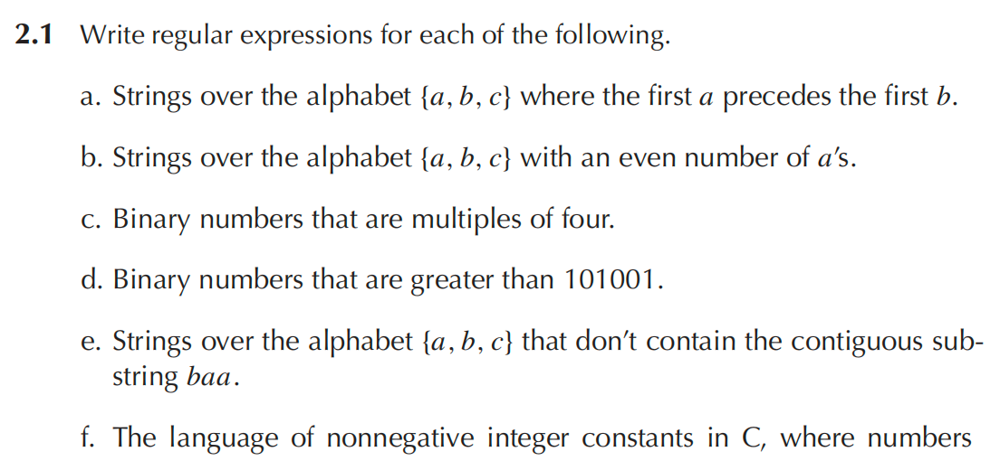
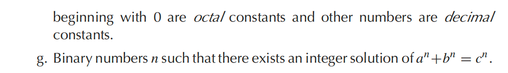
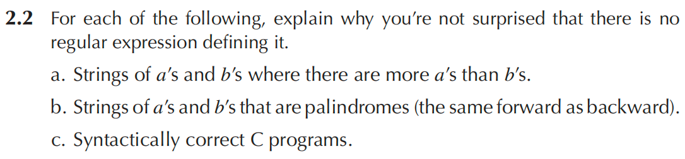
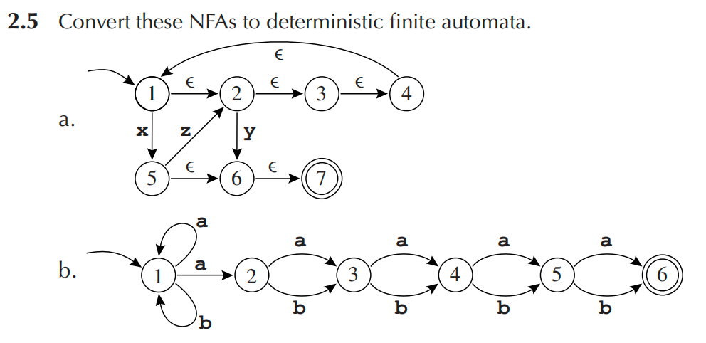
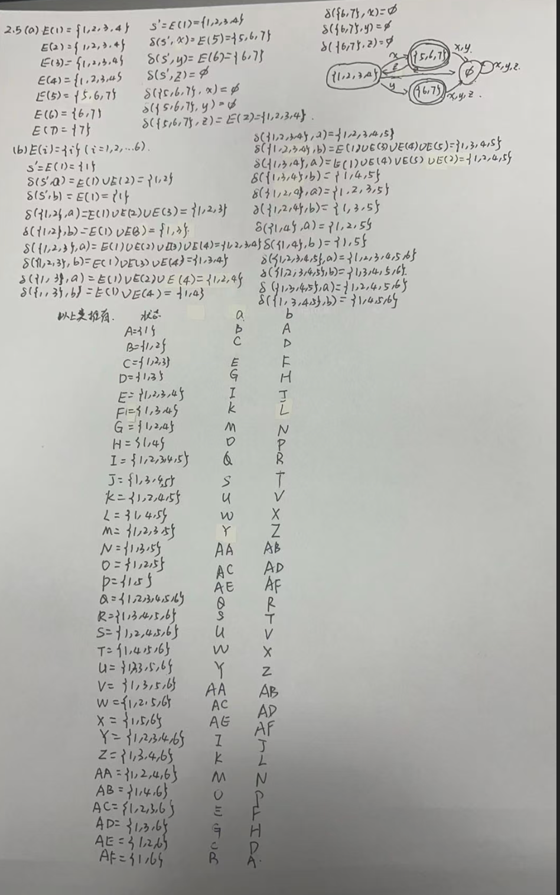
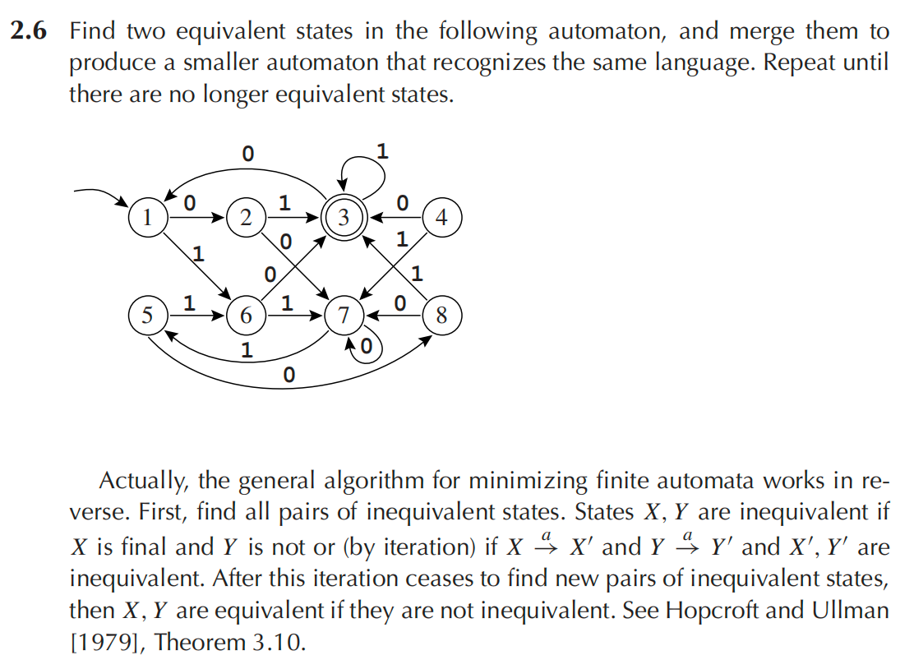
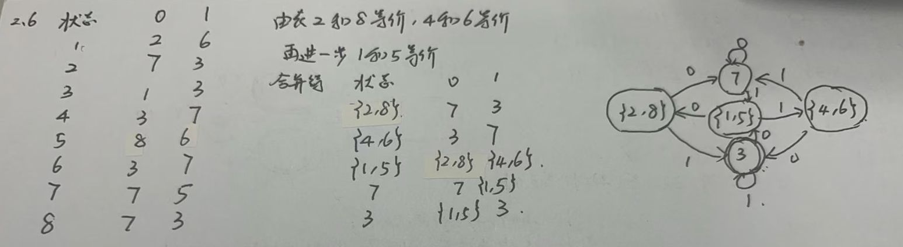

# Homework 1

（a）$c^*a(a|b|c)^*$

（b）$(b|c)^*(a(b|c)^*a(b|c)^*)^*$

（c）$1(1|0)^*00$

（d）$11(0|1)(0|1)(0|1)(0|1)\cup 1011(0|1)(0|1)\cup 10101(0|1)\cup 1(0|1)(0|1)(0|1)(0|1)(0|1)(0|1)(0|1)(0|1)^*$

（e）$(a|b|c)^*-(a|b|c)^*baa(a|b|c)^*$

（f）$0(0|1|2|3|4|5|6|7)^*\cup (1|2|3|4|5|6|7|8|9)(0|1|2|3|4|5|6|7|8|9)^*$

（g）$1\cup 10$

***

（a）该语言要求判断串中 a 的个数是否多于 b 的个数，这需要对两种字符进行计数和比较。有限自动机只有有限个状态，不能记录任意大的数量差，所以这个语言不是正则语言，因此不能用正则表达式表示。

（b）回文串要求一个串从左到右和从右到左完全相同。要识别回文，必须记住前半部分并和后半部分进行反向比较，而前半部分可能任意长。有限自动机没有足够的记忆能力，因此回文语言不是正规语言，不能用正则表达式表示。

（c）语法正确的 C 程序包含大量任意层数的嵌套结构，例如括号、花括号、语句块和表达式嵌套。检查这些结构是否正确匹配，需要比有限自动机更强的记忆能力。因此，语法正确的 C 程序集合不是正规语言，不能用正则表达式表示。

***

***

