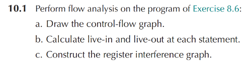
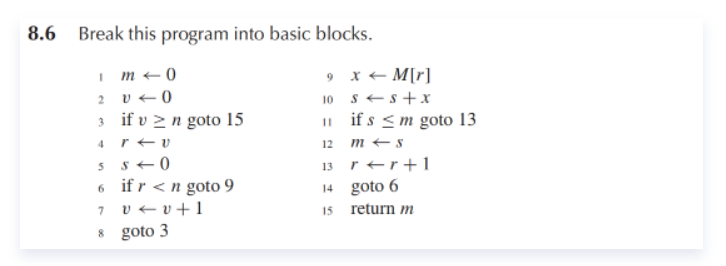

# Homework 10





（a）

```
1  -> 2
2  -> 3
3  -> 15, 4
4  -> 5
5  -> 6
6  -> 9, 7
7  -> 8
8  -> 3
9  -> 10
10 -> 11
11 -> 13, 12
12 -> 13
13 -> 14
14 -> 6
15 -> exit
```

其中：

```
3:  if v ≥ n goto 15 else goto 4
6:  if r < n goto 9 else goto 7
11: if s ≤ m goto 13 else goto 12
```

（b）每条语句的 `use` 和 `def`：

```
1   m <- 0              def = {m},     use = {}
2   v <- 0              def = {v},     use = {}
3   if v ≥ n goto 15    def = {},      use = {v, n}
4   r <- v              def = {r},     use = {v}
5   s <- 0              def = {s},     use = {}
6   if r < n goto 9     def = {},      use = {r, n}
7   v <- v + 1          def = {v},     use = {v}
8   goto 3              def = {},      use = {}
9   x <- M[r]           def = {x},     use = {r}
10  s <- s + x          def = {s},     use = {s, x}
11  if s ≤ m goto 13    def = {},      use = {s, m}
12  m <- s              def = {m},     use = {s}
13  r <- r + 1          def = {r},     use = {r}
14  goto 6              def = {},      use = {}
15  return m            def = {},      use = {m}
```

每条语句的 live-in 和 live-out 如下：

| **Statement** | **live-in**        | **live-out**       |
| ------------- | ------------------ | ------------------ |
| 1             | {n}                | {m, n}             |
| 2             | {m, n}             | {m, n, v}          |
| 3             | {m, n, v}          | {m, n, v}          |
| 4             | {m, n, v}          | {m, n, r, v}       |
| 5             | {m, n, r, v}       | {m, n, r, s, v}    |
| 6             | {m, n, r, s, v}    | {m, n, r, s, v}    |
| 7             | {m, n, v}          | {m, n, v}          |
| 8             | {m, n, v}          | {m, n, v}          |
| 9             | {m, n, r, s, v}    | {m, n, r, s, v, x} |
| 10            | {m, n, r, s, v, x} | {m, n, r, s, v}    |
| 11            | {m, n, r, s, v}    | {m, n, r, s, v}    |
| 12            | {n, r, s, v}       | {m, n, r, s, v}    |
| 13            | {m, n, r, s, v}    | {m, n, r, s, v}    |
| 14            | {m, n, r, s, v}    | {m, n, r, s, v}    |
| 15            | {m}                | {}                 |

（c）冲突边如下：

```
m -- n
m -- v
m -- r
m -- s
m -- x
n -- v
n -- r
n -- s
n -- x
v -- r
v -- s
v -- x
r -- s
r -- x
s -- x
```

因此最终的寄存器冲突图就是一个 `{m, v, n, r, s, x}` 的完全图
