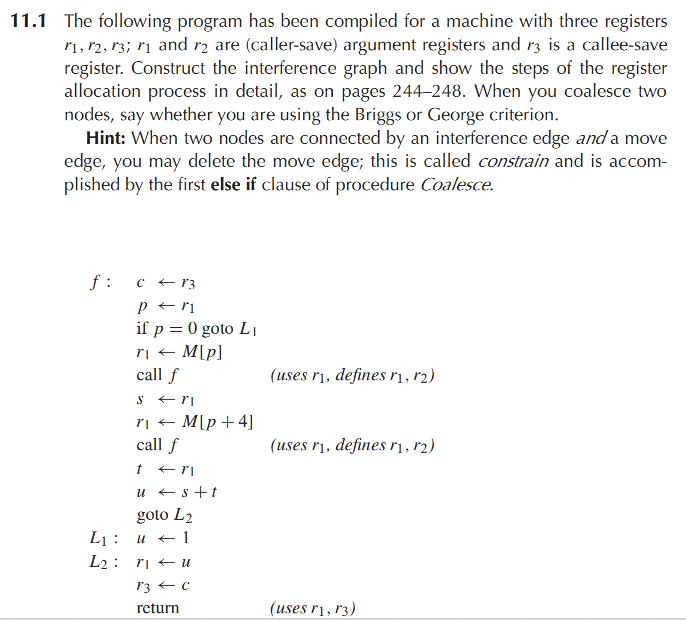
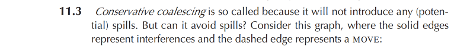
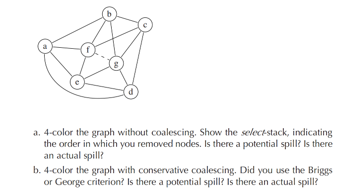

# Homework 11

主要冲突关系为：

\[
\begin{aligned}
c &: p,\ s,\ t,\ u,\ r_1,\ r_2\\
p &: c,\ s,\ r_1,\ r_2\\
s &: c,\ p,\ t,\ r_1,\ r_2\\
t &: c,\ s\\
u &: c
\end{aligned}
\]

其中 \(c,p,s\) 跨越函数调用，因此都与 caller-save 寄存器 \(r_1,r_2\) 冲突。

不能合并：

\[
p \leftarrow r_1
\]

因为 \(p\) 与 \(r_1\) 冲突，是 constrained move。

\[
s \leftarrow r_1
\]

因为 \(s\) 与 \(r_1\) 冲突，也是 constrained move。

可以合并：

\[
t \leftarrow r_1
\]

满足 George criterion，因此：

\[
t \equiv r_1
\]

\[
r_1 \leftarrow u
\]

满足 George criterion，因此：

\[
u \equiv r_1
\]

对于：

\[
c \leftarrow r_3,\qquad r_3 \leftarrow c
\]

不满足 George criterion，也不满足 Briggs criterion，因此不能合并。

合并后，\(c,p,s\) 两两冲突，并且都不能使用 \(r_1,r_2\)。

因此选择溢出：

\[
c,\ s
\]

保留：

\[
p \mapsto r_3
\]

设两个栈帧位置为：

\[
F_c,\quad F_s
\]

重写后：

\[
\begin{array}{ll}
f: & M[F_c] \leftarrow r_3\\
   & p \leftarrow r_1\\
   & \text{if }p=0\text{ goto }L_1\\
   & r_1 \leftarrow M[p]\\
   & \text{call }f\\
   & M[F_s] \leftarrow r_1\\
   & r_1 \leftarrow M[p+4]\\
   & \text{call }f\\
   & t \leftarrow r_1\\
   & s' \leftarrow M[F_s]\\
   & u \leftarrow s' + t\\
   & \text{goto }L_2\\
L_1: & u \leftarrow 1\\
L_2: & r_1 \leftarrow u\\
   & r_3 \leftarrow M[F_c]\\
   & \text{return}
\end{array}
\]

\[
p \mapsto r_3
\]

\[
t \mapsto r_1
\]

\[
u \mapsto r_1
\]

\[
s' \mapsto r_2
\]

因此：

\[
\boxed{
p:r_3,\quad t:r_1,\quad u:r_1,\quad s':r_2
}
\]

\[
\boxed{
c,\ s\text{ 溢出}
}
\]

\[
\begin{array}{ll}
f: & M[F_c] \leftarrow r_3\\
   & r_3 \leftarrow r_1\\
   & \text{if }r_3=0\text{ goto }L_1\\
   & r_1 \leftarrow M[r_3]\\
   & \text{call }f\\
   & M[F_s] \leftarrow r_1\\
   & r_1 \leftarrow M[r_3+4]\\
   & \text{call }f\\
   & r_2 \leftarrow M[F_s]\\
   & r_1 \leftarrow r_2+r_1\\
   & \text{goto }L_2\\
L_1: & r_1 \leftarrow 1\\
L_2: & r_3 \leftarrow M[F_c]\\
   & \text{return}
\end{array}
\]

最终分配满足 3 个寄存器限制，并在返回前恢复 \(r_3\)。

****

设寄存器数为：

\[
K=4
\]

图中实线为 interference edge，虚线 \(f-g\) 为 move edge。

## (a) 不进行 coalescing

原图中每个结点度数都是 4：

\[
\deg(a)=\deg(b)=\deg(c)=\deg(d)=\deg(e)=\deg(f)=\deg(g)=4
\]

由于没有结点满足 \(\deg < K\)，所以需要先选择一个 potential spill。

选择：

\[
g
\]

作为 potential spill，压入 select stack。

之后图中出现低度数结点，可以继续 simplify。一个合法的 select-stack 顺序为：

\[
g^*,\ b,\ c,\ d,\ a,\ e,\ f
\]

其中 \(g^*\) 表示 potential spill。

按反序染色，可以得到一种合法 4-coloring：

\[
\begin{aligned}
f &\mapsto 1\\
e &\mapsto 2\\
a &\mapsto 3\\
d &\mapsto 1\\
c &\mapsto 2\\
b &\mapsto 4\\
g &\mapsto 3
\end{aligned}
\]

因此：

\[
\boxed{\text{有 potential spill，但没有 actual spill}}
\]

---

## (b) 进行 conservative coalescing

虚线 move 为：

\[
f \leftrightarrow g
\]

将 \(f\) 和 \(g\) 合并为一个结点：

\[
fg
\]

合并后，\(fg\) 的邻居为：

\[
a,b,c,d,e
\]

其中高阶邻居少于 \(K=4\)，因此满足 **Briggs criterion**，可以保守合并。

合并后图中出现低度数结点。一个合法的 select-stack 顺序为：

\[
b,\ c,\ e,\ a,\ d,\ fg
\]

按反序染色，可以得到：

\[
\begin{aligned}
fg &\mapsto 1\\
d &\mapsto 2\\
a &\mapsto 3\\
e &\mapsto 4\\
c &\mapsto 3\\
b &\mapsto 2
\end{aligned}
\]

也就是：

\[
f \mapsto 1,\qquad g \mapsto 1
\]

因此最终一种合法染色为：

\[
\boxed{
f:g=1,\quad d=2,\quad a=3,\quad e=4,\quad c=3,\quad b=2
}
\]

所以：

\[
\boxed{\text{没有 potential spill，也没有 actual spill}}
\]
