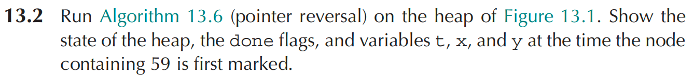
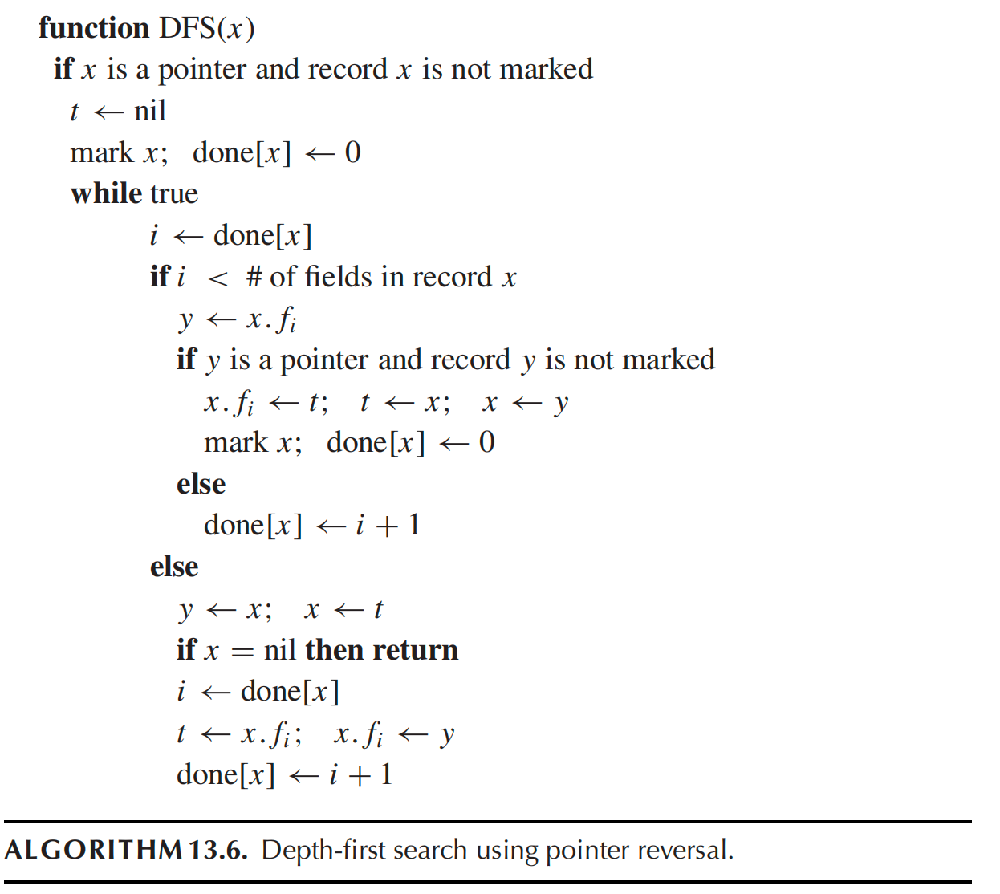
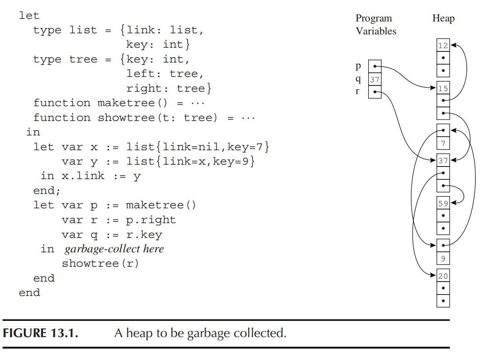

# Homework 12

假设从根变量按顺序扫描：

\[
p,\ q,\ r
\]

其中 \(p\) 指向结点 \(15\)，\(q=37\) 是整数，\(r\) 指向结点 \(37\)。

当结点 \(59\) 第一次被标记时，DFS 的访问路径为：

\[
15 \rightarrow 12 \rightarrow 15 \rightarrow 37 \rightarrow 59
\]

此时已经被标记的结点为：

\[
15,\ 12,\ 37,\ 59
\]

其他结点还没有被标记。此时各结点的 `done` 值为：

\[
\begin{aligned}
done[15] &= 2\\
done[12] &= 3\\
done[37] &= 1\\
done[59] &= 0
\end{aligned}
\]

含义是：

- 结点 \(15\) 已经处理完 key 和 left 字段，正在处理 right 字段；
- 结点 \(12\) 已经全部处理完；
- 结点 \(37\) 已经处理完 key 字段，正在处理 left 字段；
- 结点 \(59\) 刚刚被标记，还没有处理任何字段。

在结点 \(59\) 刚被标记时：

\[
\boxed{x = 59}
\]

\[
\boxed{y = 59}
\]

\[
\boxed{t = 37}
\]

其中 \(t\) 指向当前结点 \(59\) 的父结点，即结点 \(37\)。

此时由于 pointer reversal，部分指针被临时改写。

主要变化为：

\[
15.right = nil
\]

\[
37.left = 15
\]

其他已经恢复或尚未修改的指针包括：

\[
15.left = 12
\]

\[
37.right = 20
\]

\[
59.left = nil,\qquad 59.right = nil
\]

因此，在结点 \(59\) 第一次被标记时，临时反转路径为：

\[
59 \xrightarrow{t} 37 \xrightarrow{left} 15 \xrightarrow{right} nil
\]

当结点 \(59\) 第一次被标记时：

\[
\boxed{
x=59,\quad y=59,\quad t=37
}
\]

\[
\boxed{
done[15]=2,\quad done[12]=3,\quad done[37]=1,\quad done[59]=0
}
\]

堆中被临时修改的指针为：

\[
\boxed{
15.right=nil,\qquad 37.left=15
}
\]

已标记结点为：

\[
\boxed{
15,\ 12,\ 37,\ 59
}
\]