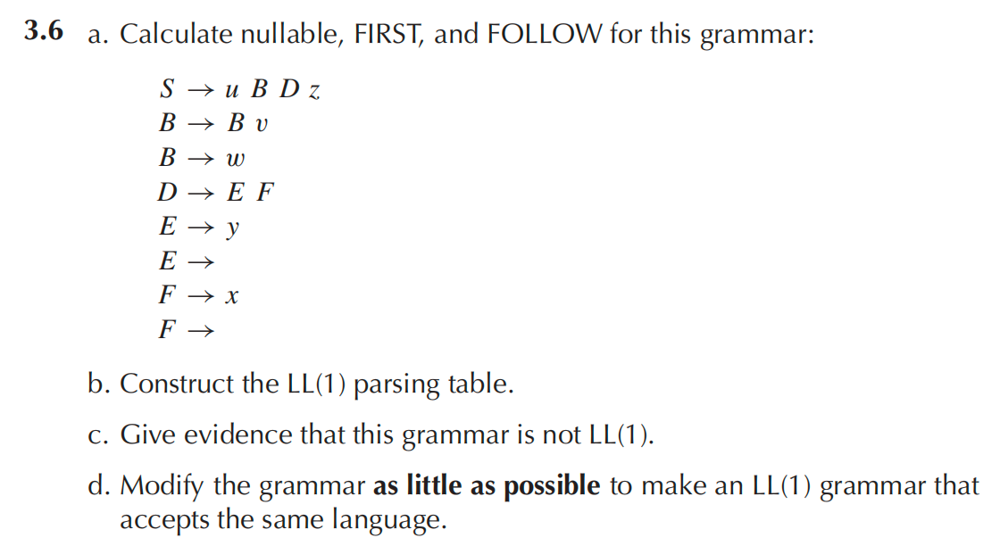

# Homework 2

（a）Nullable 集为 $\{D, E, F\}$

$\text{First}(S)=\{u\}, \text{First}(B)=\{w\}, \text{First}(E)=\{y,\epsilon\}, \text{First}(F)=\{x,\epsilon\}, \text{First}(D)=\{x,y,\epsilon\}$

由 $S\rightarrow uBDz$ 可得 $\text{First}(Dz)=\{x,y,z\}\subseteq\text{Follow}(B),\{z\}\subseteq\text{Follow}(D)$

由 $B\rightarrow Bv$ 可得 $\{v\}\subseteq\text{Follow}(B)$

由 $D\rightarrow EF$ 可得 $\text{First}(F)-\{\epsilon\}=\{x\}\subseteq\text{Follow}(E),\text{Follow}(D)\subseteq\text{Follow}(E),\text{Follow}(D)\subseteq\text{Follow}(F)$

综上 $\text{Follow}(B)=\{x,y,z,v\}, \text{Follow}(E)=\{x,z\}, \text{Follow}(F)=\{z\}, \text{Follow}(D)=\{z\}$

（b）

|      | x                      | y                 | z                      | u                   | v    | w                                 |
| ---- | ---------------------- | ----------------- | ---------------------- | ------------------- | ---- | --------------------------------- |
| S    |                        |                   |                        | $S\rightarrow uBDz$ |      |                                   |
| B    |                        |                   |                        |                     |      | $B\rightarrow Bv, B\rightarrow w$ |
| D    | $D\rightarrow EF$      | $D\rightarrow EF$ | $D\rightarrow EF$      |                     |      |                                   |
| E    | $E\rightarrow\epsilon$ | $E\rightarrow y$  | $E\rightarrow\epsilon$ |                     |      |                                   |
| F    | $F\rightarrow x$       |                   | $F\rightarrow\epsilon$ |                     |      |                                   |

（c）LL(1) 表格有重合，因此不是 LL(1)

（d）修改 $B\rightarrow Bv, B\rightarrow w$ 为 $B\rightarrow wB, B\rightarrow vB, B\rightarrow\epsilon$

