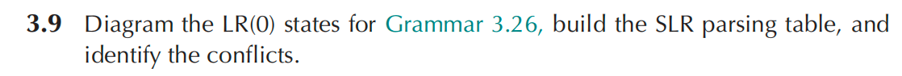
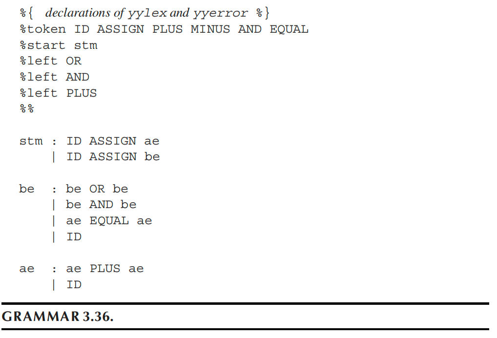
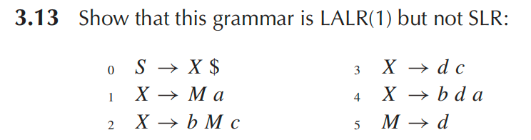
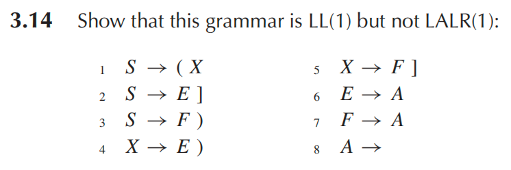

# Homework 3

$$
\begin{aligned}

I_0&: \quad \begin{cases} S' &\to \cdot stm\\ stm &\to \cdot ID\ ASSIGN\ ae\\ stm &\to \cdot ID\ ASSIGN\ be \end{cases} \\

I_1 = goto(I_0,ID)&: \quad \begin{cases} stm &\to ID\cdot ASSIGN\ ae\\ stm &\to ID\cdot ASSIGN\ be \end{cases} \\

I_2 = goto(I_1,ASSIGN)&: \quad \begin{cases} stm &\to ID\ ASSIGN\cdot ae\\ stm &\to ID\ ASSIGN\cdot be\\ be &\to \cdot be\ OR\ be\\ be &\to \cdot be\ AND\ be\\ be &\to \cdot ae\ EQUAL\ ae\\ be &\to \cdot ID\\ ae &\to \cdot ae\ PLUS\ ae\\ ae &\to \cdot ID \end{cases}\\

I_3 = goto(I_2,ID)&: \quad \begin{cases} be &\to ID\cdot\\ ae &\to ID\cdot \end{cases}\\

I_4 = goto(I_2,ae)&: \quad \begin{cases} stm &\to ID\ ASSIGN\ ae\cdot\\ be &\to ae\cdot EQUAL\ ae\\ ae &\to ae\cdot PLUS\ ae \end{cases}\\

I_5 = goto(I_2,be)&: \quad \begin{cases} stm &\to ID\ ASSIGN\ be\cdot\\ be &\to be\cdot OR\ be\\ be &\to be\cdot AND\ be \end{cases}\\

I_6 = goto(I_4,EQUAL)&: \quad \begin{cases} be &\to ae\ EQUAL\cdot ae\\ ae &\to \cdot ae\ PLUS\ ae\\ ae &\to \cdot ID \end{cases}\\

I_7 = goto(I_4,PLUS)&: \quad \begin{cases} ae &\to ae\ PLUS\cdot ae\\ ae &\to \cdot ae\ PLUS\ ae\\ ae &\to \cdot ID \end{cases}\\

I_8 = goto(I_5,OR)&: \quad \begin{cases} be &\to be\ OR\cdot be\\ be &\to \cdot be\ OR\ be\\ be &\to \cdot be\ AND\ be\\ be &\to \cdot ae\ EQUAL\ ae\\ be &\to \cdot ID\\ ae &\to \cdot ae\ PLUS\ ae\\ ae &\to \cdot ID \end{cases}\\

I_9 = goto(I_5,AND)&: \quad \begin{cases} be &\to be\ AND\cdot be\\ be &\to \cdot be\ OR\ be\\ be &\to \cdot be\ AND\ be\\ be &\to \cdot ae\ EQUAL\ ae\\ be &\to \cdot ID\\ ae &\to \cdot ae\ PLUS\ ae\\ ae &\to \cdot ID \end{cases}\\

I_{10} = goto(I_6,ID)=goto(I_7,ID)&: \quad ae \to ID\cdot\\

I_{11} = goto(I_6,ae)&: \quad \begin{cases} be &\to ae\ EQUAL\ ae\cdot\\ ae &\to ae\cdot PLUS\ ae \end{cases}\\

I_{12} = goto(I_7,ae)&: \quad \begin{cases} ae &\to ae\ PLUS\ ae\cdot\\ ae &\to ae\cdot PLUS\ ae \end{cases}\\

I_{13} = goto(I_8,be)&: \quad \begin{cases} be &\to be\ OR\ be\cdot\\ be &\to be\cdot OR\ be\\ be &\to be\cdot AND\ be \end{cases}\\

I_{14} = goto(I_8,ae)=goto(I_9,ae)&: \quad \begin{cases} be &\to ae\cdot EQUAL\ ae\\ ae &\to ae\cdot PLUS\ ae \end{cases}\\

I_{15} = goto(I_9,be)&: \quad \begin{cases} be &\to be\ AND\ be\cdot\\ be &\to be\cdot OR\ be\\ be &\to be\cdot AND\ be \end{cases}\\

I_{16} = goto(I_0,stm)&: \quad S' \to stm\cdot

\end{aligned}
$$
得到 Follow 集：$Follow(be)=\{\$,OR,AND\},Follow(ae)=\{\$,EQUAL,OR,AND,PLUS\}$，

记：

- $r_1: stm\to ID\ ASSIGN\ ae$
- $r_2: stm\to ID\ ASSIGN\ be$
- $r_3: be\to be\ OR\ be$
- $r_4: be\to be\ AND\ be$
- $r_5: be\to ae\ EQUAL\ ae$
- $r_6: be\to ID$
- $r_7: ae\to ae\ PLUS\ ae$
- $r_8: ae\to ID$

有解析表如下：

| **状态** | **ID** | **ASSIGN** | **OR** | **AND** | **EQUAL** | **PLUS** | **$** | **stm** | **be** | **ae** |
| -------- | ------ | ---------- | ------ | ------- | --------- | -------- | ----- | ------- | ------ | ------ |
| 0        | s1     |            |        |         |           |          |       | 16      |        |        |
| 1        |        | s2         |        |         |           |          |       |         |        |        |
| 2        | s3     |            |        |         |           |          |       |         | 5      | 4      |
| 3        |        |            | r6/r8  | r6/r8   | r8        | r8       | r6/r8 |         |        |        |
| 4        |        |            |        |         | s6        | s7       | r1    |         |        |        |
| 5        |        |            | s8     | s9      |           |          | r2    |         |        |        |
| 6        | s10    |            |        |         |           |          |       |         |        | 11     |
| 7        | s10    |            |        |         |           |          |       |         |        | 12     |
| 8        | s3     |            |        |         |           |          |       |         | 13     | 14     |
| 9        | s3     |            |        |         |           |          |       |         | 15     | 14     |
| 10       |        |            | r8     | r8      | r8        | r8       | r8    |         |        |        |
| 11       |        |            | r5     | r5      |           | s7       | r5    |         |        |        |
| 12       |        |            | r7     | r7      | r7        | s7/r7    | r7    |         |        |        |
| 13       |        |            | s8/r3  | s9/r3   |           |          | r3    |         |        |        |
| 14       |        |            |        |         | s6        | s7       |       |         |        |        |
| 15       |        |            | s8/r4  | s9/r4   |           |          | r4    |         |        |        |
| 16       |        |            |        |         |           |          | acc   |         |        |        |

该文法的 SLR 分析表中存在：

- Reduce/Reduce Conflict：状态 3
- Shift/Reduce Conflict：状态 12、13、15

****

首先证明不是 SLR：

由转移 $X\to\cdot bMc,X\to\cdot Ma$，得到 $Follow(M)=\{a,c\}$

初态中有：
$$
I_0: \quad \begin{cases} S'&\to \cdot S\\ S&\to \cdot X\$\\ X&\to \cdot Ma\\ X&\to \cdot bMc\\ X&\to \cdot dc\\ X&\to \cdot bda\\ M&\to \cdot d \end{cases}
$$
由 $I_0$ 经 d 转移得到状态：
$$
I_d: \quad \begin{cases} X&\to d\cdot c\\ M&\to d\cdot \end{cases}
$$
在这个状态中：

- 由 $X\to d\cdot c$ 可知，遇到 c 时应移进
- 由 $M\to d\cdot$ 可知，按 SLR 应在 $Follow(M)=\{a,c\}$ 上归约

于是，在符号 c 上同时出现：shift 和 reduce $M\to d$，因此该文法不是 SLR

再证明是 LALR，构造状态集和转移：
$$
\begin{aligned}

I_0&: \begin{cases} S'&\to \cdot S,\ \$\\ S&\to \cdot X\$, \ \$\\ X&\to \cdot Ma,\ \$\\ X&\to \cdot bMc,\ \$\\ X&\to \cdot dc,\ \$\\ X&\to \cdot bda,\ \$\\ M&\to \cdot d,\ a \end{cases}\\

I_1&: S' \to S\cdot,\ \$\\

I_2&: S \to X\cdot \$,\ \$\\

I_3&: X \to M\cdot a,\ \$\\

I_4&: \begin{cases} X&\to b\cdot Mc,\ \$\\ X&\to b\cdot da,\ \$\\ M&\to \cdot d,\ c \end{cases}\\

I_5&: \begin{cases} X&\to d\cdot c,\ \$\\ M&\to d\cdot,\ a \end{cases}\\

I_6&: S \to X\$\cdot,\ \$\\

I_7&: X \to Ma\cdot,\ \$\\

I_8&: X \to bM\cdot c,\ \$\\

I_9&: \begin{cases} X&\to bd\cdot a,\ \$\\ M&\to d\cdot,\ c \end{cases}\\

I_{10}&: X \to dc\cdot,\ \$\\

I_{11}&: X \to bMc\cdot,\ \$\\

I_{12}&: X \to bda\cdot,\ \$

\end{aligned}
$$
没有任何冲突，所以该语言是 LALR(1)

****

$First(A)=\{\varepsilon\},\quad First(E)=First(F)=\{\varepsilon\},\quad First(X)=\{),]\},\quad First(S)=\{(,),]\}$

因此预测分析表中：

- $M[S,(]=S\to (X,\quad M[S,]]=S\to E],\quad M[S,)]=S\to F)$

- $M[X,)]=X\to E),\quad M[X,]]=X\to F]$

其余非终结符 E,F,A 各自只有唯一选择，故各表项无冲突，所以该文法是 LL(1)。

在 LR(1) 项集中有两个同核状态：$I_1=\{E\to A\cdot,\ ],\ F\to A\cdot,\ )\},\qquad I_2=\{E\to A\cdot,\ ),\ F\to A\cdot,\ ]\}$

LALR 合并后得：$\{E\to A\cdot,\ \{),]\},\ F\to A\cdot,\ \{),]\}\}$

于是对 ) 和 ] 都同时可归约 $E\to A$ 与 $F\to A$，出现 Reduce/Reduce Conflict，故该文法不是 LALR(1)。