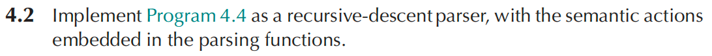
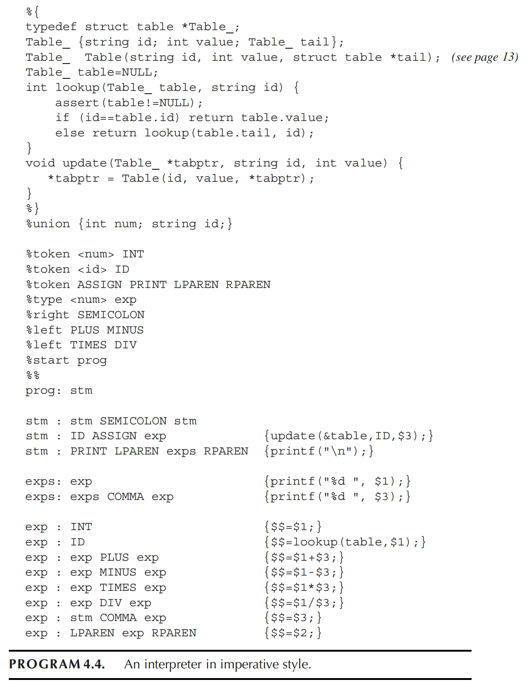

# Homework 4





```python
typedef struct table *Table_;
struct table {
    string id;
    int value;
    Table_ tail;
};

Table_ table = NULL;

int lookup(Table_ t, string id) {
    assert(t != NULL);
    if (id == t->id) return t->value;
    else return lookup(t->tail, id);
}

void update(Table_ *t, string id, int value) {
    *t = Table(id, value, *t);
}

Token tok;
int numVal;
string idVal;

void nextToken();

void match(Token t) {
    if (tok == t) nextToken();
    else error();
}

bool lookahead_is_ASSIGN();

void prog() {
    stm();
}

void stm() {
    simple_stm();
    if (tok == SEMICOLON) {
        match(SEMICOLON);
        stm();
    }
}

void simple_stm() {
    if (tok == ID) {
        string name = idVal;
        match(ID);
        match(ASSIGN);
        int v = exp();
        update(&table, name, v);
    } else if (tok == PRINT) {
        match(PRINT);
        match(LPAREN);
        exps();
        match(RPAREN);
        printf("\n");
    } else {
        error();
    }
}

void exps() {
    int v = exp();
    printf("%d ", v);
    while (tok == COMMA) {
        match(COMMA);
        v = exp();
        printf("%d ", v);
    }
}

int exp() {
    if (tok == PRINT || (tok == ID && lookahead_is_ASSIGN())) {
        simple_stm();
        match(COMMA);
        return exp();
    } else {
        return addexp();
    }
}

int addexp() {
    int v = mulexp();
    while (tok == PLUS || tok == MINUS) {
        Token op = tok;
        match(tok);
        int r = mulexp();
        if (op == PLUS) v = v + r;
        else v = v - r;
    }
    return v;
}

int mulexp() {
    int v = primary();
    while (tok == TIMES || tok == DIV) {
        Token op = tok;
        match(tok);
        int r = primary();
        if (op == TIMES) v = v * r;
        else v = v / r;
    }
    return v;
}

int primary() {
    if (tok == INT) {
        int v = numVal;
        match(INT);
        return v;
    } else if (tok == ID) {
        string name = idVal;
        match(ID);
        return lookup(table, name);
    } else if (tok == LPAREN) {
        match(LPAREN);
        int v = exp();
        match(RPAREN);
        return v;
    } else {
        error();
        return 0;
    }
}
```

