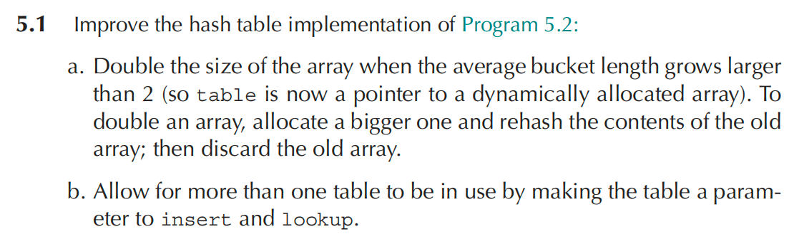
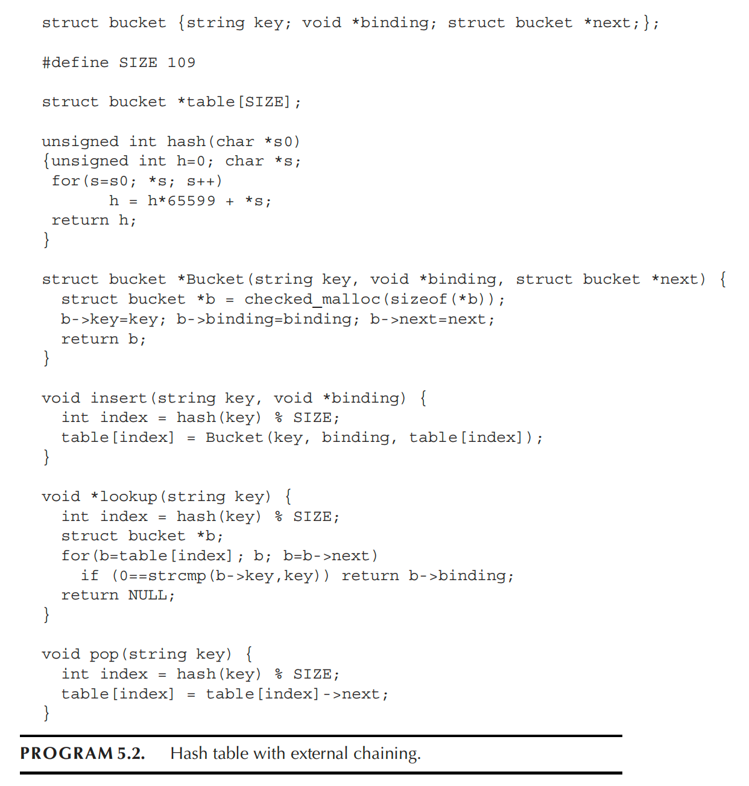

# Homework 5





(a) 当平均桶长大于 2 时，将数组大小加倍并重新散列

原程序中哈希表写成固定大小数组，因此桶数不变，随着元素增多，冲突会越来越多，链表越来越长，导致查找和插入效率下降。

设表中元素个数为 count，桶数组长度为 size，则平均桶长为 $\alpha=\frac{\text{count}}{\text{size}}$，当 $\alpha>2$ 时，将桶数组长度扩大为原来的 2 倍。由于元素位置由 $\text{hash}(\text{key})\bmod \text{size}$ 决定，所以扩容后必须对旧表中所有元素重新计算桶下标并插入到新数组中

(b) 允许同时使用多张表

原程序中的 table 是全局变量，因此 insert 和 lookup 默认只能操作这一张表，不方便同时维护多张哈希表。解决方法是把哈希表封装成一个抽象对象 Table，并把它作为参数传给各个操作函数

```c
typedef char *string;

struct bucket {
    string key;
    void *binding;
    struct bucket *next;
};

typedef struct table_ *Table;
struct table_ {
    int size;
    int count;
    struct bucket **buckets;
};

unsigned int hash(string s0) {
    unsigned int h = 0;
    char *s;
    for (s = s0; *s; s++)
        h = h * 65599 + *s;
    return h;
}

struct bucket *Bucket(string key, void *binding, struct bucket *next) {
    struct bucket *b = checked_malloc(sizeof(*b));
    b->key = key;
    b->binding = binding;
    b->next = next;
    return b;
}

Table Table_new(int size) {
    int i;
    Table t = checked_malloc(sizeof(*t));
    t->size = size;
    t->count = 0;
    t->buckets = checked_malloc(sizeof(struct bucket *) * size);
    for (i = 0; i < size; i++)
        t->buckets[i] = NULL;
    return t;
}

static void rehash(Table t) {
    int i, newSize = t->size * 2;
    struct bucket **newBuckets =
        checked_malloc(sizeof(struct bucket *) * newSize);

    for (i = 0; i < newSize; i++)
        newBuckets[i] = NULL;

    for (i = 0; i < t->size; i++) {
        struct bucket *b = t->buckets[i];
        while (b) {
            struct bucket *next = b->next;
            int index = hash(b->key) % newSize;
            b->next = newBuckets[index];
            newBuckets[index] = b;
            b = next;
        }
    }

    free(t->buckets);
    t->buckets = newBuckets;
    t->size = newSize;
}

void insert(Table t, string key, void *binding) {
    int index;
    if (t->count > 2 * t->size)
        rehash(t);

    index = hash(key) % t->size;
    t->buckets[index] = Bucket(key, binding, t->buckets[index]);
    t->count++;
}

void *lookup(Table t, string key) {
    int index = hash(key) % t->size;
    struct bucket *b;
    for (b = t->buckets[index]; b; b = b->next)
        if (0 == strcmp(b->key, key))
            return b->binding;
    return NULL;
}
```

