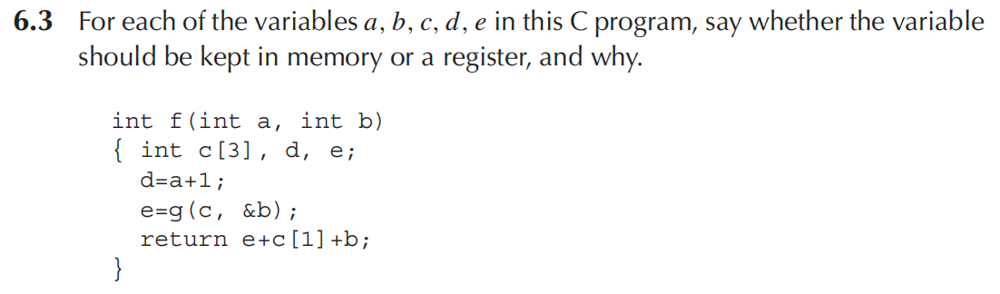
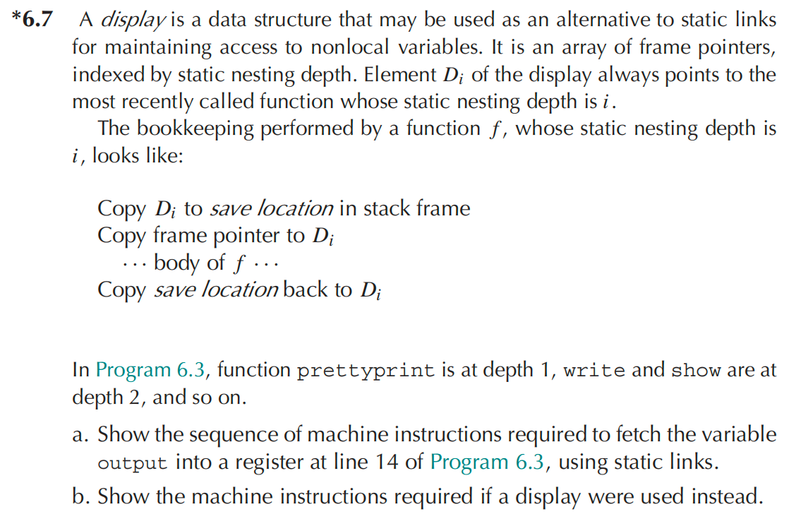
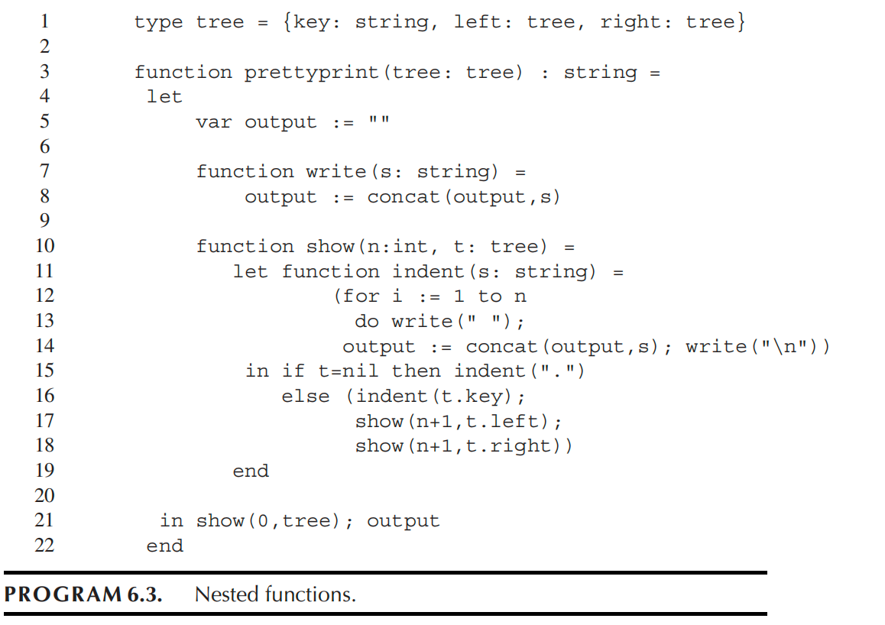

# Homework 6



- a 应该放在寄存器当中，作为函数参数进行传参

- b 应该放在内存当中，因为有函数 g 调用了 b 的地址，需要在内存中有一个位置才可能让其他函数做出一些修改读取

- c 应该放在内存当中，因为同理有函数 g 调用了 c 的地址，其次 c 是一个数组，需要在内存有一个连续的空间

- d 应该放在寄存器当中，因为它只是暂存 a+1 的结果

- e 应该放在寄存器当中，因为它只是保存了 g 函数的返回结果，并在后续参与计算

****





（a）indent 获取 output 到寄存器的顺序如下：

1. 获取 show 函数的 fp
2. 获取 show 函数的静态链接
3. 获取 prettyprint 函数的 fp
4. 获取 output

大致伪指令如下：

```assembly
LOAD r1, [fp + SL] 
LOAD r1, [r1 + SL]
LOAD r2, [r1 + OUT]
```

其中 SL 为静态链接相对 fp 的偏移，OUT 表示 output 相对 fp 的偏移

（b）使用 display，直接调用 D[1] 即可直接获得 prettyprint 的 fp

```assembly
LOAD r1, [D1]
LOAD r2, [r1 + OUT]
```