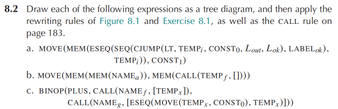
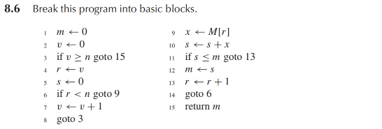
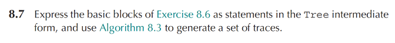

# Homework 8



（a）树形图如下：

```
                         MOVE
                       /      \
                    MEM       CONST 1
                     |
                    ESEQ
                  /      \
                SEQ      TEMP j
              /    \
          CJUMP    LABEL L_ok
```

其中 CJUMP 内容为 `CJUMP(LT, TEMP i, CONST 0, L_out, L_ok)`

根据规则 `MOVE(MEM(ESEQ(s, e)), x) => SEQ(s, MOVE(MEM(e), x))` 可以得到最终：

```
CJUMP(LT, TEMP i, CONST 0, L_out, L_ok)
LABEL L_ok
MOVE(MEM(TEMP j), CONST 1)
```

（b）树形图如下：

```
                         MOVE
                       /      \
                    MEM        MEM
                     |          |
                    MEM        CALL
                     |        /    \
                   NAME a  TEMP f   []
```

引入临时变量 `t2`，将右侧的 `CALL` 提出：

```
MEM(CALL(TEMP f, []))=>
ESEQ(
  MOVE(TEMP t2, CALL(TEMP f, [])),
  MEM(TEMP t2)
)
```

源式变为：

```
MOVE(
  MEM(MEM(NAME a)),
  ESEQ(
    MOVE(TEMP t2, CALL(TEMP f, [])),
    MEM(TEMP t2)
  )
)
```

由于左侧地址表达式 `MEM(NAME a)` 涉及内存访问，而右侧的 `CALL` 可能产生副作用，因此不能简单交换顺序。需要先把左侧地址表达式保存到临时变量 `t1` 中：

```
SEQ(
  MOVE(TEMP t1, MEM(NAME a)),
  SEQ(
    MOVE(TEMP t2, CALL(TEMP f, [])),
    MOVE(MEM(TEMP t1), MEM(TEMP t2))
  )
)
```

写成语句序列为：

```
MOVE(TEMP t1, MEM(NAME a))
MOVE(TEMP t2, CALL(TEMP f, []))
MOVE(MEM(TEMP t1), MEM(TEMP t2))
```

（c）树形图如下：

```
                             BINOP PLUS
                           /           \
                       CALL             CALL
                     /     \           /     \
                 NAME f   TEMP x   NAME g    ESEQ
                                             /    \
                                          MOVE    TEMP x
                                         /    \
                                    TEMP x   CONST 0
```

改写为：

```
MOVE(TEMP t1, CALL(NAME f, [TEMP x]))
MOVE(TEMP x, CONST 0)
MOVE(TEMP t2, CALL(NAME g, [TEMP x]))
BINOP(PLUS, TEMP t1, TEMP t2)
```

****



```
B1:
1   m <- 0
2   v <- 0
    goto 3
B2:
3   if v > n goto 15
    else goto 4
B3:
4   r <- v
5   s <- 0
    goto 6
B4:
6   if r < n goto 9
    else goto 7
B5:
7   v <- v + 1
8   goto 3
B6:
9   x <- M[r]
10  s <- s + x
11  if s < m goto 13
    else goto 12
B7:
12  m <- s
    goto 13
B8:
13  r <- r + 1
14  goto 6
B9:
15  return m
```



```
LABEL L1
MOVE(TEMP m, CONST 0)
MOVE(TEMP v, CONST 0)
JUMP(NAME L3)
LABEL L3
CJUMP(GT, TEMP v, TEMP n, L15, L4)
LABEL L4
MOVE(TEMP r, TEMP v)
MOVE(TEMP s, CONST 0)
JUMP(NAME L6)
LABEL L6
CJUMP(LT, TEMP r, TEMP n, L9, L7)
LABEL L7
MOVE(
  TEMP v,
  BINOP(PLUS, TEMP v, CONST 1)
)
JUMP(NAME L3)
LABEL L9
MOVE(TEMP x, MEM(TEMP r))
MOVE(
  TEMP s,
  BINOP(PLUS, TEMP s, TEMP x)
)
CJUMP(LT, TEMP s, TEMP m, L13, L12)
LABEL L12
MOVE(TEMP m, TEMP s)
JUMP(NAME L13)
LABEL L13
MOVE(
  TEMP r,
  BINOP(PLUS, TEMP r, CONST 1)
)
JUMP(NAME L6)
LABEL L15
MOVE(TEMP RV, TEMP m)
JUMP(NAME L_done)
```

能提取出 trace：

```
Trace 1: L1, L3, L4, L6, L7
Trace 2: L9, L12, L13
Trace 3: L15
```

