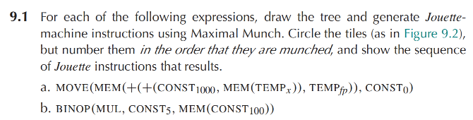

# Homework 9



（a）IR Tree 如下：

```
                         MOVE
                       /      \
                    MEM        CONST 0
                     |
                    PLUS
                  /      \
               PLUS      TEMP fp
             /      \
      CONST 1000    MEM
                     |
                   TEMP x
```

按照 Maximal Munch，从根节点开始选择最大 tile。编号表示 tile 被 munch 的顺序：

```
                         [1] STORE
                         MOVE
                       /      \
                    MEM        [5] CONST 0
                     |
                    [2] ADD
                    PLUS
                  /      \
              [3] ADDI   TEMP fp
              PLUS
             /      \
      CONST 1000    [4] LOAD
                    MEM
                     |
                   TEMP x
```

各 tile 对应关系为：

```
[1] MOVE(MEM(e1), e2)
    => STORE M[e1 + 0] <- e2
[2] BINOP(PLUS, e1, e2)
    => ADD
[3] BINOP(PLUS, CONST 1000, e)
    => ADDI
[4] MEM(TEMP x)
    => LOAD
[5] CONST 0
    => ADDI t <- r0 + 0
```

按照依赖顺序生成 Jouette 指令：

```
LOAD   t1 <- M[x + 0]          ; t1 = M[x]
ADDI   t2 <- t1 + 1000         ; t2 = M[x] + 1000
ADD    t3 <- t2 + fp           ; t3 = M[x] + 1000 + fp
ADDI   t4 <- r0 + 0            ; t4 = 0
STORE  M[t3 + 0] <- t4         ; M[M[x] + 1000 + fp] = 0
```

****

（b）IR Tree 如下：

                     MUL
                   /     \
             CONST 5     MEM
                          |
                       CONST 100

按照 Maximal Munch，从根节点开始选择最大 tile。编号表示 tile 被 munch 的顺序：

                     [1] MUL
                   /         \
             [2] CONST 5    [3] LOAD
                              MEM
                               |
                            CONST 100

各 tile 对应关系为：

```
[1] BINOP(MUL, e1, e2)
    => MUL
[2] CONST 5
    => ADDI t <- r0 + 5
[3] MEM(CONST 100)
    => LOAD t <- M[r0 + 100]
```

按照依赖顺序生成 Jouette 指令：

```
ADDI   t1 <- r0 + 5          ; t1 = 5
LOAD   t2 <- M[r0 + 100]     ; t2 = M[100]
MUL    t3 <- t1 * t2         ; t3 = 5 * M[100]
```

