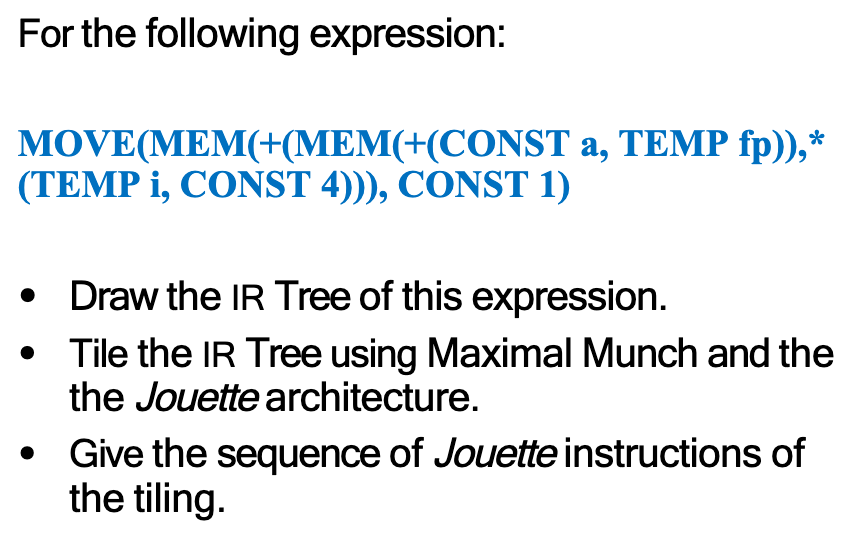

# Quiz 4



（1）

```
MOVE
├── MEM
│   └── PLUS
│       ├── MEM
│       │   └── PLUS
│       │       ├── CONST a
│       │       └── TEMP fp
│       └── MUL
│           ├── TEMP i
│           └── CONST 4
└── CONST 1
```

（2）

```
                         T1: STORE
                         MOVE
                       /      \
                    MEM       T6: CONST 1
                     |
                    T4: ADD
                    PLUS
                  /      \
            T2: LOAD      T5: MUL
               MEM        MUL
                |        /   \
              PLUS    TEMP i  T3: CONST 4
             /    \
        CONST a   TEMP fp
```

（3）假设 `TEMP fp` 已经存放在寄存器 `fp` 中，`TEMP i` 已经存放在寄存器 `i` 中，并使用 `t1, t2, ...` 表示编译器生成的临时寄存器，则 Jouette 指令序列如下：

```
LOAD  t1 <- M[fp + a]      ; t1 = M[fp + a]
ADDI  t2 <- r0 + 4         ; t2 = 4
MUL   t3 <- i * t2         ; t3 = i * 4
ADD   t4 <- t1 + t3        ; t4 = M[fp + a] + i * 4
ADDI  t5 <- r0 + 1         ; t5 = 1
STORE M[t4 + 0] <- t5      ; M[M[fp + a] + i * 4] = 1
```

