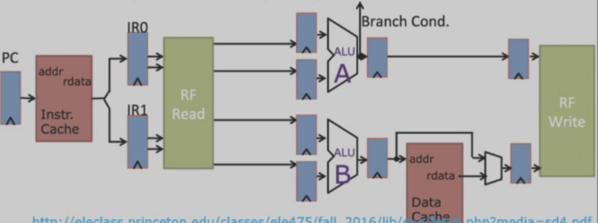
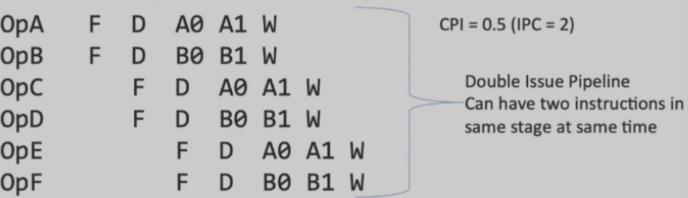
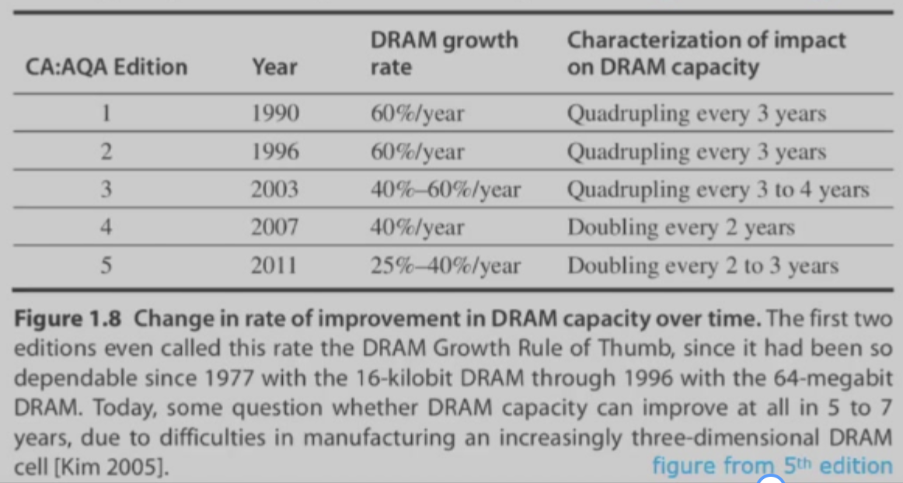

---
hide:
  #- navigation # 显示右
  #- toc #显示左
  - footer
  - feedback
# comments: true
--- 

# Chapter 01 : Fundamentals of Computer Design

!!! abstract "Abstract"

	感觉跟[计组](https://note.eternity1005.top/blog/Computer%20Science/Computer%20Organization/Chapter%201/)大差不差，第一章都在扯有的没的（x），基本上是整个课程的大纲概览，也提到了计组学的一些概念

## RISC-V Architecture

- RISC（Reduced Instruction Set Computer，精简指令集计算机）架构诞生于 1980s
- RISC-V 的指令相对更加简单
- RISC 提供了两个重要的性能技术：指令级并行（流水线以及多重指令问题）和缓存
***
### Pipelining

- 流水线将指令的执行分划为若干个阶段，在上一个指令执行完成之前就开始当前指令的执行
- 多指令的重叠执行
- CPI $\geq$ 1

***
### Multiple Instruction Issue

- 启动多个数据通路（Datapath）
- 并行执行多条流水线
- 每个时钟周期完成多于一个指令
- CPI < 1

!!! example "Example : 2-way superscalar"

	
	
	
***
### Data Processing & Storage

在没有 Cache 的情况下，永久存储（Permanent Storage）架构如下：

在有 Cache 的情况下，加速了数据的访问，即临时存储（Temporary Storage）：

***
## Processor Perf Growth

几十年来计算机处理器性能的提升图：

- 关于半导体的两大定律已经失效
    - **丹纳德缩放定律**（Dennard Scaling）
	    - 由于每个晶体管的尺寸较小，即使增加晶体管的数量，给定硅面积的功率密度也是恒定的
	    - 在 2004 年，该定律就失效了，因为电流和电压无法一直小下去，同时仍然保持集成电路的可靠性
    - **摩尔定律**（Moore's Law）： 1965 年预测芯片上的晶体管数量每年（1975 年修正为“每两年”）翻一倍，在 2015 年失效
***
## Multi-core Processor

- 多个高效处理器，而不是单个低效处理器
- 从指令级并行到数据级和线程级并行
***
### Amdahl's Law

- 多核并行要求对应用程序进行重组，这对程序员来说是一个新的重大负担
- 使用某种更快的执行模式所获得的性能改进受到可以使用更快模式的时间的限制

$$
\begin{aligned}
\text{Speedup}_{\text{overall}} &= \frac{\text{Execution Time}_{\text{old}}}{\text{Execution Time}_{\text{new}}} = \frac{1}{1-\text{Fraction}_{\text{enhanced}}+\frac{\text{Fraction}_{\text{enhanced}}}{\text{Speedup}_{\text{enhanced}}}}\\
&\stackrel{\text{limit}}{=} \frac{1}{1-\text{Fraction}_{\text{enhanced}}}
\end{aligned}
$$

- 根据上面的公式，如果有 10% 的任务是必须顺序执行的，那么需要至少 10 倍的 speedup
- 体现了 “Make Common Case Fast” 的设计思想

!!! example "Example"

	=== "Example 01"
	
		10% 的部分 speedup 为 20
		
		- $\text{Speedup}_{\text{overall}}=\frac{1}{1-0.1+\frac{0.1}{20}}=1.11$
	
	=== "Example 02"
	
		80% 的部分 speedup 为 1.6
		
		- $\text{Speedup}_{\text{overall}}=\frac{1}{1-0.8+\frac{0.8}{1.6}}=1.43$
***
## Classes of Computers

- 台式（Desktop）计算机
    - 第一类出现在市场的计算机，且仍然占据最大的市场
    - 需要考虑更高的性价比
    - 新的挑战：
	    - 以 Web 为中心的交互式应用程序
	    - 如何评估性能
- 服务器（Servers）
	- 提供更大规模、更可靠的文件和计算服务
    - 需要考虑的因素：
	    - 可靠性（Dependability），以防服务器故障导致的巨大损失
	    - 可扩展性（Scalability），通过扩大计算能力、内存和 I/O 带宽来应对日益增长的需求
	    - 吞吐量（Throughput），在单位时间内处理更多请求，按每分钟事务数或每秒服务的网页数计算
- 物联网（Internet of Things, IoT）/ 嵌入式（Embedded）计算机
    - 物联网通过传感器（Sensors）和执行器（Actuators）收集有用的数据，并与物理世界互动，具有最广泛的处理能力和成本
    - 处理器内核和专用电路的使用
	    - DSP，移动计算
    - 需要考虑的因素
        - （软 / 硬）实时性能
        - 严格的资源限制（内存大小、低功耗）
- 个人移动设备（Personal Mobile Device, PMD）
	- 一组具备多媒体用户界面的无线设备，能运行第三方软件，包括智能手机、平板
	- 具有台式计算机的许多特性
		- 基于网络和面向媒体
		- 能够运行第三方软件（APP），这是其与嵌入式计算机的主要区别
    - 需要考虑的因素：
        - 成本（更便宜的封装方式、减少或是去除散热风扇）
        - 响应能力（Responsiveness）和可预测性（Predictability）
	        - 实时性能（Real-time Performance）：每个应用程序段的最大执行时间
		        - e.g. 处理每个视频帧的时间应该受到限制，因为处理器必须很快接受并处理下一帧
	        - 软实时（Soft Real-time）
		        - 将某一事件的时间换成其他事件的时间
				- 容忍偶尔超过的事件时间限制，但不能太多
- 集群（Clusters）/ 仓储式（Warehouse-scaling）计算机（WSCs）
    - 软件即服务（Software as a Service, SaaS）包括搜索、社交网络、媒体分享、多媒体游戏、在线购物等，它促进了集群的发展
    - 集群：通过局域网连接的一组台式计算机或服务器，表现得像一台单个更大的计算机
    - 与服务器的区别在于 WSCs 利用了冗余
    - 强调交互式应用程序的大规模存储、可靠性和高互联网带宽
    - 与超级计算机（SuperComputer）的区别在于其强调浮点性能，能运行大型、通信密集型的聊天程序，一次可以运行数周
    - 需要考虑的因素：性价比、功率
***
## Parallelism

> 多任务同时工作，分为应用程序并行（Application）和硬件并行（Hardware Application）

### Application Parallelism

- 数据级并行（Data-Level Parallelism, DLP）：许多数据项同时被处理
	- 不同的处理器之间分发相同的数据
	- e.g. 对数组添加多个元素、矩阵乘法
- 任务级并行（Task-Level Parallelism, TLP）：工作的各项任务分别进行，但整体是并行的
	- 在相同的数据上同时进行不同的任务
	- e.g. 输入一个二进制串，一个处理器数 0 的个数，一个处理器计算其补码
	- 有点像 ADS 并行算法中的 [PRAM](https://note.eternity1005.top/blog/Computer%20Science/ADS/Chapter%2014/#pram) 
***
### Hardware Parallelism

硬件通过四种方式利用应用程序并行：

- 指令级并行（Instruction-Level Parallelism）：利用数据级并行
	- 最朴素的级别：流水线
		- 将一个任务分为几步，同时执行不同任务的不同步骤
	- 中等级别：推测执行
		- 提前做一些工作，以防结果被需要的时候再做（最简单的例子即 Branch Prediction）
- 矢量结构（Vector Architectures）& GPU & 多媒体指令集（Multimedia Instruction Sets）
	- 利用数据级并行
	- 并行地将一个指令应用到一个数据集（比如 GPU 重复矩阵运算）
- 线程级并行（Thread-Level Parallelism）
	- 既不利用数据级并行，也不利用任务级并行
	- 应用于允许并行线程之间交互的紧密耦合硬件模型中（例如多核处理器）
- 请求级并行（Request-Level Parallelism）
	- 利用利用程序员或操作系统指定的大部分解耦任务之间的并行性（例如 Google 的查询）
***
## Classes of Parallel Architectures

> 由 Flynn 按照指令流和数据流进行分类

- 单指令流单数据流（Single Instruction Stream, Single Data Stream, SISD）
	- 单处理器
	- 利用指令级并行
	- 如早期的单核 PC，超标量（Superscalar）、推测执行等
- 单指令流多数据流（Single Instruction Stream, Multiple Data Stream, SIMD）
	- 一条指令有多条数据流动，被多个处理器执行（如向量数据）
	- 利用数据级并行
	- 每个处理器都有数据存储器，但是只有一个指令存储器和一个控制处理器
- 多指令流单数据流（Multiple Instruction Stream, Single Data Stream, MISD）
	- 难以利用数据级并行
- 多指令流多数据流（Multiple Instruction Stream, Multiple Data Stream, MIMD）
	- 每个处理器获取自己的指令并对自己的数据进行操作
	- 利用任务级并行
***
## Computer Architecture

> 简单来说，计算机架构由指令集架构（ISA）、组织（Organization）和硬件（Hardware）组成

***
### Instruction Set Architecture（ISA）

> 指令集（Instruction Set Architecture, ISA）是程序员可见的指令集，是软件和硬件之间的分界
> 
> 在设计和执行指令集时，我们需要确定计算机的重要特性，在保持成本、功耗和可用性限制的同时，最大限度地提高性能和能效

- ISA 的七个维度：
    - ISA 的类别
	    - 大多数是具有寄存器或内存位置操作数的通用寄存器体系结构，分为以下两类：
	        - 寄存器-内存 ISA：许多指令能访问内存，例如 80x86
	        - 加载-存储 ISA：只能通过加载和存储指令访问内存，比如 ARMv8、RISC-V（从 1985 年之后发明的 ISA 都是该类别）
    - 内存地址：所有 ISA 都是字节地址（即一个字节是最小的数据单位，每个字节都有唯一的地址）
	    - 有些架构（比如 ARMv8）要求对象必须对齐（Aligned），但有些并不强求（例如 80x86 和 RISC-V），但是对齐可以提高访问速度
	- 操作数的类型和大小：整数有 8 位、16 位、32 位、64 位，浮点数有 32 位和 64 位，80x86 还支持 80 位
    - 寻址模式（Addressing Mode）
	    - 规定操作数的位置
        - RISC-V 寻址模式包括寄存器、立即数（Immediate，即一个常数确定地址）和偏移量（Displacement，即寄存器+偏移量确定地址）
        - 80x86 在 RISC-V 基础上增加了三个位移变化：
	        - 无寄存器（直接常数确定地址）
	        - 两个寄存器（用两个寄存器的值相加确定偏移量）
	        - 两个寄存器，但其中一个寄存器乘上常数（一般以字节为单位）
        - ARMv8 在 RISC-V 的基础上增加：
	        - PC 相对寻址
	        - 两个寄存器（用两个寄存器的值相加确定偏移量）
	        - 两个寄存器，但其中一个寄存器乘上常数（一般以字节为单位）
	        - 自动递增和自动递减
        
        
        
    - 运算（图片以 RISC-V 为例）：
	    - 数据传送
	    
		
		
	    - 算术逻辑
	    
	    
	    
	    - 控制
	    
	    
		
	    - 浮点数
	    
	    
	    
    - 控制流指令：包括条件分支、无条件跳转、过程调用和返回，都采用 PC 相对寻址
        - RISC-V 通过寄存器内容检测条件，而 80x86 和 ARMv8 则通过检测条件码（Condition Code）来判断条件
        - ARMv8 和 RISC-V 将返回地址保存在寄存器内，而 80x86 将返回地址放在栈（内存）内
    - 编码 ISA
        - ARMv8 和 RISC-V 的指令长度均为 32 位（定长）
        - 80x86 的指令是变长的，在 1-18 字节范围内
        
        
***
### Organization

- **组织 / 微架构**（Microarchitecture）：计算机设计的高级层面，包括内存系统和连接、CPU 的设计等
***
### Hardware

- **硬件 / 系统设计**：计算机系统内所有的硬件组件，包括逻辑实现、电路实现和物理实现
***
## Trends in Technology

### Bandwidth Over Latency

计算机的技术实现：

- 集成电路（Integrated Circuit Logic Technology）
- 半导体 DRAM（Semiconductor DRAM）
- 半导体闪存（Semiconductor Flash）
- 磁盘（Magnetic Disk Technology）
- 网络（Network Technology）

!!! note "技术实现"

	=== "Integrated Circuit Logic"
	
		- [摩尔定律（Moore's Law）](https://note.eternity1005.top/blog/Computer%20Science/Computer%20Architecture/Chapter%201/#processor-perf-growth)
	
	=== "Semiconductor DRAM"
	
		- 每个 DRAM 的容量每 3 年大约翻四倍
		
		
	
	=== "Semiconductor Flash"
	
		- 非挥发性的
		- EEPROM：电子可擦除性，可编程的只读内存
		- 在 PMD 的标准储存设备
		- 每个 Flash 的容量每两年大概翻一倍
		- 比 DRAM 便宜 8-10 倍
	
	=== "Magnetic Disk Technology"
	
		- 在 2004-2011 年间，密度每两年翻一倍
			- 最近每年提升少 5%
		- 比 Flash 便宜 8-10 倍，比 DRAM 便宜 200-300 倍
		- 供服务器和仓储式计算机储存
	
	=== "Network Technology"
	
		- 转换器（Switches）
		- 传输系统

上述技术实现性能体现在以下两个因素：

- **带宽**（Bandwidth）/ 吞吐量（Throughput）：一定时间内的工作总量
- **时延**（Latency）/ 响应时间（Response Time）：从开始到完成事件所经过的时间

***
### Scaling of Transistor Performance and Wires

- 特征尺寸（Feature Sizes）：晶体管在 x, y 维上的最小尺寸
- 特征尺寸越小，线路变得更短，但是电阻和电容变得更糟，因此时延会变得更长
- 此外还有功率耗散的问题

***
## Trends in Power and Energy in Integrated Circuits

!!! question "How to measure power?"

	- Power = Energy Per Unit Time
	- 1 W = 1 J/s
	- Energy to Execute a Workload = Avg Power $\times$ Execution Time

### Energy and Power Within a Microprocessor

- 能耗：
    - 当脉冲为 $0\rightarrow 1\rightarrow 0$ 或 $1\rightarrow 0\rightarrow 1$ 的转变时，所需能耗的方程为：
    
	$$
    \text{Energy}_{\text{dynamic}}\propto\text{Capacitive load}\times\text{Voltage}^2
    $$
    
    - 当脉冲为 $0\rightarrow 1$ 或 $1\rightarrow 0$ 的转变时，所需能耗的方程为：
    
    $$
    \text{Energy}_{\text{dynamic}}\propto\frac{1}{2}\times\text{Capacitive load}\times\text{Voltage}^2
    $$
    
- 功率：与 CMOS 相关，下面以第 2 种脉冲转变为例
    
    $$
    \text{Power}_{\text{dynamic}}\propto\frac{1}{2}\times\text{Capacitive load}\times\text{Voltage}^2\times\text{Frequency switched}
    $$
    
- 静态功率：与电流泄露相关，应用于需要长期保存数据的存储器（例如 SRAM）
    
    $$
    \text{Power}_{\text{static}}\propto\text{Current}_{\text{static}}\times\text{Voltage}
    $$
    

可以看到：

- 减小时钟频率可以降低功率，但无法降低能耗
	- 这是因为 Energy = Power $\times$ Execution-Time（前面的 Power 降低了，但是 Execution-Time 因为时钟频率的减小而增大）
- 减小电压可以显著降低功率和能耗

> 当下仍然有分配功率、散热、防止热点等挑战
***
### Improve Energy-Efficiency

- 什么都不做
	- 将不常用的模块的时钟关闭
- 动态电压频率缩放（Dynamic Voltage-Frequency Scaling, DVFS）
	- 在低活动频率期间降低时钟频率和电压
	
	
	
- 典型常见情况特别进行设计
	- 例如 PMD, 笔记本电脑，可以设计待机
	- 低功耗模式的内存和存储，以节省能源
- 超频-涡轮模式
	- 芯片在短时间内以更高的时钟速率运行，直到温度升高
- 暂停
	- 处理器只是整个能源成本的一部分，我们也可以考虑其他部分
	- 更快、更节能的进程，更快地完成任务，让系统的其他部分进入睡眠模式
***
## Trends in Cost

影响计算机成本的几个主要因素：

- **时间**（Time）：即便实现技术没有多大改进，制造计算机部件的成本也会随时间而降低
    - 学习曲线（Learning Curve）：随时间流逝，制造成本不断降低
    - 学习曲线可通过产出（Yields）测量：通过检测流程的制造设备的占比
- **产量**（Volume）
	- 每增加一倍的产量，耗费减少 10%
    - 减少了通过学习曲线所需的时间
    - 降低了成本，因为购买力和制造效率得到提升
    - 降低了研发成本
- **商品化**（Commoditization）
	- 供应商之间就它们的产效的竞争
    - 商品（Commodity）：由多个供应商大量销售的产品，而且基本上是相同的
***
### Integrated Circuit

每个晶圆（Wafer）上的晶片数量为：

$$
\text{Dies per wafer}=\frac{\pi\times(\frac{\text{Wafer diameter}}{2})^2}{\text{Die area}}−\frac{\pi\times\text{Wafer diameter}}{\sqrt{2\times\text{Die area}}}​
$$

其中晶片（Die）的成本为：

$$
\text{Cost of die}=\frac{\text{Cost of wafer}}{\text{Dies per wafer}\times\text{Die yield}}
​$$

上述公式只计算了晶圆上晶片的最大数量，而我们更希望知道晶圆上好的晶片的数量，即晶片产出（Die Yield）：

$$
\text{Die yield}=\text{Wafer yield}\times\frac{1}{(1+\text{Defects per unit area}\times\text{Die area})^N}​
$$

- N 表示加工 - 复杂度因子（Process-Complexity Factor），用于测量制造难度

集成电路的成本计算公式为：

$$
\text{Cost of integrated circuit}=\frac{\text{Cost of die} + \text{Cost of testing die} + \text{Cost of packaging and final test}}{\text{Final test yield}}
​$$
***
### Cost v.s. Price

- 成本（Cost）：制造产品所需的所有开支
- 价格（Price）：消费者愿意为产品支付的金额
- Price = Cost + Margin
	- 利润（Margin）：与单个项目无关的间接费用，即研发、营销、制造设备、税费等。
***
## Dependability

> 可靠性是指所提供服务的质量，用于评判是否可以合理地依赖某项服务

基础设施供应商提供服务水平协议（Service Level Agreements，SLA）或服务水平目标（Service Level Objectives，SLO）来保证他们的网络或电力服务是可靠的。因此我们可以用 SLA 来判断系统处于运行还是停机状态。可以将服务状态分为：

1. **服务实现**（Service Accomplishment）：按照 SLA 的说明提供服务
2. **服务中断**（Service Interruption）：提供的协议与 SLA 说明的不同

状态 1 $\rightarrow$ 2 的转变称为**故障**（Failures），2 $\rightarrow$ 1 的转变称为**恢复**（Restorations）。量化这些转变时，可以得到以下衡量计算机**可靠性**（Dependability）的方法：

- **模块可靠性**（Module Reliability）：从一个参考的初始时刻开始，对连续的服务实现的衡量
    - 平均故障时间（Mean Time to Failure, MTTF）：它的倒数即为故障率，可用 FIT（Failure in Time）表示
    - 平均修复时间（Mean Time to Repair, MTTR）
    - 平均故障间隔时间（Mean Time Between Failures, MTBF) = MTTF + MTTR
- **模块可用性**（Module Availability）：对实现和中断两种状态交替的服务实现的衡量，计算公式为：
	
	$$
	\text{Availability}=\frac{\text{MTTF}}{\text{MTTF}+\text{MTTR}}
	$$
	

??? question "Error, Fault 和 Failure"

	- Failure 的产生是因为 Error 的出现（模块的瑕疵）
	- Error 出现的原因是因为 Fault
	
	- 当 Fault 发生时，它会产生一个或多个潜在的 Error，当它被激活时就会生效；
	- 当 Error 实际影响交付的服务时，就会发生故障

解决故障的基本途径是利用**冗余**（Redundancy），包括：

- 时间上：重复运算，观察是否仍然是错误的
- 资源上：用其他部件替代故障的部件
- 具体操作可以见[计组：RAID](https://note.eternity1005.top/blog/Computer%20Science/Computer%20Organization/Appendix/#raid-redundant-arrays-of-inexpensive-disks)
***
## Measuring Performance

衡量计算机性能的指标有：

- **执行时间**（Execution Time）
    - 最直接的定义是使用挂钟（Wall-clock）时间 / 响应时间 / 耗时（Elapsed Time）：完成一项任务，包括存储器访问、内存访问、I/O 活动、操作系统开销等所需的时延
    - 在多编程（Multiprogramming）中，还得考虑 CPU 时间：处理器计算所需时间，不包括等待 I/O 或运行其他程序的时间
    - 评估系统性能的另一个方法是比较在某一工作量（Workload）（用户运行的程序和操作系统命令）下的执行时间
- **吞吐量**（Throughput）
	- 在给定一段时间内完成的工作量
***
### Benchmarks

- **基准测试**（Benchmarks）：用于评估计算机性能的程序
- **基准测试套件**（Benchmark Suite）：一组基准测试应用
	- 其中一个最成功的标准基准测试套件是 [SPEC](https://www.spec.org/)（标准性能评估公司 , Standard Performance Evaluation Corporation）

不同计算机类型的基准测试：

- 台式机：
    - 处理器密集型（Processor-intensive)/ 图形密集型（Graphics-intensive）基准测试
    - 整数 / 浮点数基准测试
- 服务器：
    - 面向处理器吞吐量的基准测试
    - SPECrate：用于测量请求级并行
    - 关于 I/O：文件服务器基准测试（SPECSFS）、Java 服务器基准测试
    - 事务处理 (TP) 基准测试：测量系统处理由数据库访问和更新构成的事务的能力
        - 事务处理委员会 (Transaction Processing Council, TPC) 尝试建立现实且公正的 TP 基准测试
***
### Report Performance

- 报告性能测量的指导原则应该是具备**可重复性**（Producibility）：列出其他实验者能够复现结果的一切条件
***
### Summarize Performance

- 总结性能测试结果的简单方法是：比较在基准测试组件的各项程序中执行时间的算术 / 加权平均值
- SPECRatio：参考计算机的执行时间 / 被测计算机的执行时间，有以下等式成立：

$$
\text{SPECRatio}=\frac{\frac{\text{Execution Time}_{\text{Reference}}}{\text{Execution Time}_A}}{\frac{\text{Execution Time}_{\text{Reference}}}{\text{Execution Time}_B}}=\frac{\text{Execution Time}_B}{\text{Execution Time}_A}=\frac{\text{Performance}_A}{\text{Performance}_B}
$$

- 由于 SPECRatio 是比率而非绝对执行时间，因此计算平均值时应采用几何平均值，即 $\text{Geometric mean}=\sqrt[n]{\prod\limits_{i=1}^n\text{sample}_i}$。使用几何平均值时确保两条重要的性质：
    - （时间）比率的几何平均值 = 几何平均值的比率
    - 几何平均值的比率 = 性能比率的集合平均值，因此与参考计算机的选择无关
***
## Quantitative Principles

- 利用并行（Parallelism）
- 利用局部性（Locality）：程序倾向于重复使用最近用过的数据和指令（一般来说一个程序会花 90%的时间在 10% 的代码上），可分为：
	- **时间局部性**（Temporal Locality）：最近被访问过的项很有可能在不久之后会被再次访问
	- **空间局部性**（Spatial Locality）：地址相邻的项被引用的时间比较相近
- 专注于**一般情况**（Common Case）
    - 有助于计算机在能耗、资源分配、性能、可靠性等方面的改善
    - 通常而言，一般情况比不常见的情况更简单，执行速度更快
- 阿姆达尔定律（Amdahl's Law）：通过使用某些更快的执行模式获得的性能提升会受制于快速模式在时间上的占比
	- 通常用加速比（Speedup）来衡量性能提升量，公式为：
	
	$$
	\begin{aligned}
	\text{Speedup}&=\frac{\text{Performance for entire task using the enhancement when possible}}{\text{Performance for entire task without using the enhancement}}\\
	&=\frac{\text{Execution Time for entire task without using the enhancement}}{\text{Execution Time for entire task using the enhancement when possible}}
\end{aligned}
	$$
	
	- 因此加速比取决于以下因素：
	    - 被提升的部分在原来计算机中的计算时间占比
	    - 使用增强模式后的提升量
	- 执行时间的公式：
	
    $$
	\text{Execution time}_\text{new}=\text{Execution time}_\text{old}\times((1−\text{Fraction}_\text{enhanced})+\frac{\text{Fraction}_\text{enhanced}}{\text{Speedup}_\text{enhanced}})
	$$
	
	
	- 总体加速比 = 执行时间之比
	
	$$
	\text{Speedup}_\text{overall}=\frac{\text{Execution time}_\text{old}}{\text{Execution time}_\text{new}}=\frac{1}{(1−\text{Fraction}_\text{enhanced}+\frac{\text{Fraction}_\text{enhanced}}{\text{Speedup}_\text{enhanced}})}
	$$
	
	- 推论：如果只改善任务的一小部分，那么对整个任务的提升至多不超过（1 - 该部分在整个任务的占比）的倒数​​
- 处理器性能方程，具体见[计组](https://note.eternity1005.top/blog/Computer%20Science/Computer%20Organization/Chapter%201/#cpu-time)

