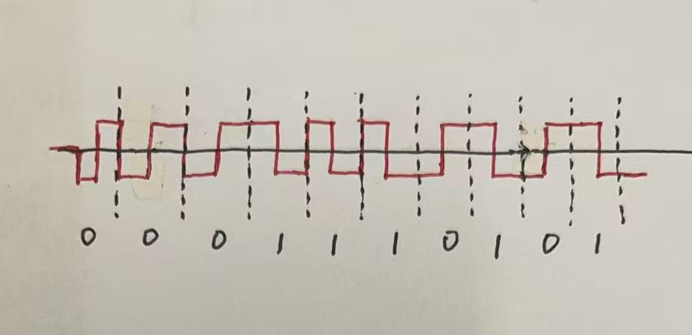

# Homework 4

> 1. A group of N stations share a 56-kbps pure ALOHA channel. Each station outputs a 1000-bit frame on an average of once every 100 sec, even if the previous one has not yet been sent (e.g. the stations can buffer outgoing frames). What is the maximum value of N?

$N_{\text{max}}=\frac{56\text{kbps}}{2e*10\text{bps}}\approx 1030$
***
> 2. Sketch the Manchester encoding for the bit stream: 0001110101.

***
> 3. Consider building a CSMA/CD network running at 1 Gbps over a 1-km cable with no repeaters. The signal speed in the cable is 200,000 km/sec. What is the minimum frame size in bytes?

最小帧大小为 $1\text{Gbps}\times \frac{1\text{km}}{200000\text{km/s}}\times 2=10000\text{bits}=1250\text{bytes}$
***
> 4. What is the baud rate of the standard 10-Mbps Ethernet?

以曼彻斯特编码传输时，每比特需要两个码元，因此波特率为 $10\text{Mbps}\times 2=20\text{Mbaud}$
***
> 5. The reason for binary exponential backoff in the classical Ethernet is that ___
> A. this algorithm is simple
> B. this algorithm is fast
> C. this algorithm is adaptive to network load
> D. this algorithm is scalable to network size

C. this algorithm is adaptive to network load
***
> 6. When binary exponential backoff is used, a random number between 0 and ________ is chosen and that number of slots is skipped
> A. 511
> B. 1023
> C. 2047
> D. 4095

B. 1023
***
> 7. ___ work at the physical layer while ___ work at the data link layer.
> A. Hubs, routers
> B. Hubs, switches
> C. Bridges, routers
> D. Repeaters, hubs

B. Hubs, switches
***
> 8. There is a 10 Mbps Ethernet switch with 10 ports each of which is connected to a single computer. Then every computer’s data rate is ___ Mbps.
> A. 1
> B. 2
> C. 10
> D. 100

C. 10
***
> 9. Which is not one of the important functions provided by bridges?
> A. reducing the collision domain
> B. increasing the data rate
> C. increasing the length of domain
> D. reducing the broadcast domain

D. reducing the broadcast domain
***
> 10. What kind of media used by 1000Base-F network?
> A. Coaxial Cable
> B. Twisted Pairs
> C. Fiber Optics
> D. Power Lines

C. Fiber Optics