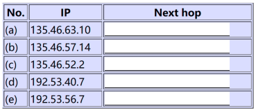
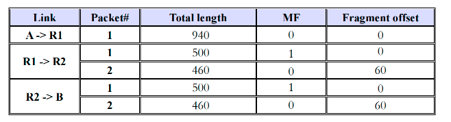
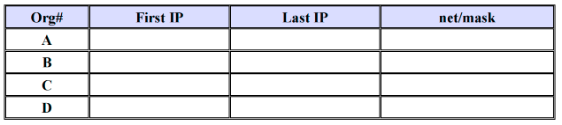

# Homework 5

> 1. Assuming that all routers and hosts are working properly and that all software in both is free of all errors, is there any chance, however small, that a packet will be delivered to the wrong destination?

存在这种可能性，当数据包在物理层上（如光纤）传输时，可能会受到电磁干扰或物理介质的影响，导致数据发生比特错误，且正好符合校验和未被检测出来，导致数据包投递错误地址

***

> 2. Convert the IP address whose hexadecimal representation is C22F1582 to dotted decimal notation.

194.47.21.130

***

> 3. A router has the following (CIDR) entries in its routing table:
>
> 
>
> For each of the following IP addresses, what does the router do if a packet with that address arrives?
>
> 

（a）159.48.0.1

（b）211.90.0.1

（c）220.20.0.1

（d）192.188.0.1

（e）220.20.0.1

***

> 4. A network on the Internet has a subnet mask of 255.255.240.0. What is the maximum number of address can be used for a single host?

240 转换为二进制为 11110000，剩余有 12 个 0，则总数为 $2^{12}=4096$ 个地址，但是全 0 和全 1 的地址被占用，因此有 4094 个地址分配给一台主机

***

> 5. Suppose that host A is connected to a router R1, R1 is connected to another router, R2, and R2 is connected to host B. Suppose that a TCP message that contains 900 bytes of data and 20 bytes of TCP header is passed to the IP code at host A for delivery to B. Show the Total length, MF, and Fragment offset fields of the IP header in each packet transmitted over the three links.Assume that link A-R1 can support a maximum frame size of 1024 bytes including a 14-byte frame header, link R1-R2 can support a maximum frame size of 512 bytes, including an 8-byte frame header, and link R2-B can support a maximum frame size of 512 bytes including a 12-byte frame header. Fill your answer in the blank.
>
> 

***

> 6. A large number of consecutive IP address are available starting at 198.16.0.0. Suppose that four organizations, A, B, C, and D, request 4000, 2000, 4000, and 8000 addresses, respectively, and in that order. For each of these, give the first IP address assigned, the last IP address assigned, and the mask in w.x.y.z/s notation.
>
> 

***

> 7. Which IP address is a loopback address?
>
>    A. 1.0.0.1
>
>    B. 192.168.0.1
>
>    C. 127.0.0.1
>
>    D. 172.0.0.1

C. 127.0.0.1

***

> 8. Suppose two hosts A and B have IP address 10.10.1.10 and 10.10.2.10 respectively. If they are in a same subnet, what is the subnet mask?
>
>    A. 255.0.0.0
>
>    B. 255.255.0.0
>
>    C. 255.255.255.0
>
>    D. 255.255.255.255

B. 255.255.0.0

***

> 9. A router has two IP interfaces, one IP address is 192.168.11.25/24, and the other IP address is ____ (assume use same subnet mask).
>
>    A. 192.168.13.0
>
>    B. 192.168.11.26
>
>    C. 192.168.13.255
>
>    D. 192.168.13.26

D. 192.168.13.26