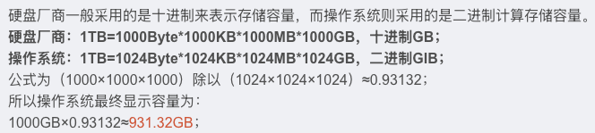
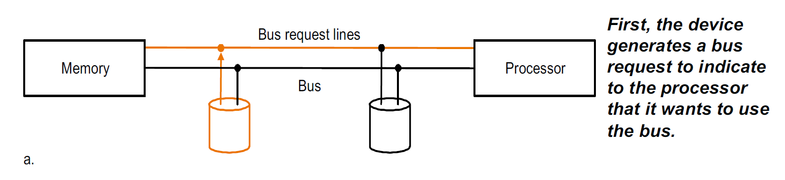
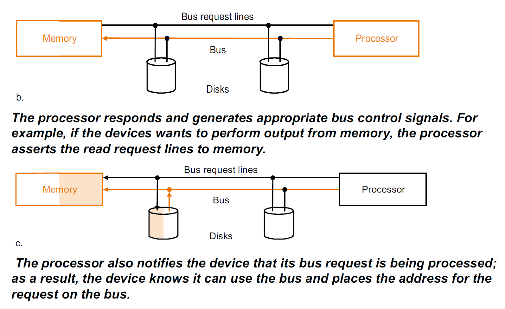
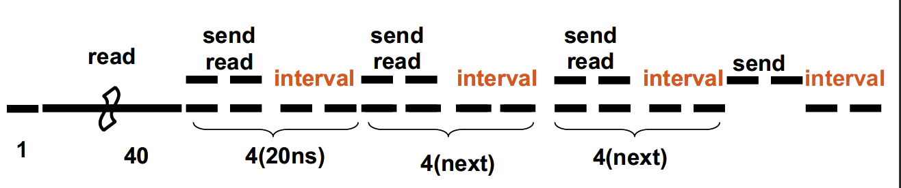
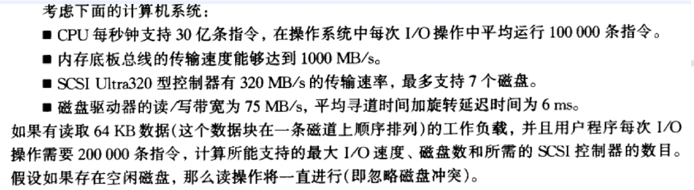
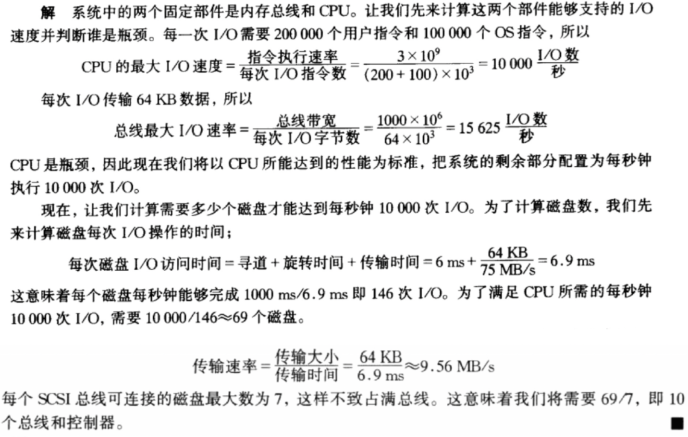

---
hide:
  #- navigation # 显示右
  #- toc #显示左
  - footer
  - feedback
comments: true
---
# Appendix : Storage, Networks and Other Peripherals

!!! abstract "考点"

	- 硬盘及其构成、相关计算（时间）
	- RAID
	- 数据总线及握手协议
	- I/O 和处理器通讯（轮询、中断、DMA）

!!! Abstract "写在前面"

	sdgg 说，因为出厂商都是以十进制来描述硬盘大小的，所以这一整章的 M,K 都表示 $10^6$ 和 $10^3$，并非我们认知中的 $2^{20}$ 和 $2^{10}$。
	
	
	
	所以实际上标着 1T 的硬盘实际上就只有 931G 是对的，因为电脑认的是二进制（学到了，sdgg 太腻害啦(✧∀✧)）

## Introduction

设计**输入/输出设备**(I/O Devices) 需要考虑一下因素：

- **可扩展性**（Expandability）
- **恢复力**（Resilience）
- **性能**（Performance）
    - I/O 设备的性能难以评估，在不同情况下需要用不同的方法测量
    - 决定因素：设备与系统之间的连接、内存层级、操作系统等
    - 衡量指标：
        - 吞吐量（Throughput）（即 I/O 的带宽（Bandwidth）），有两种衡量方式：
            - 特定时间内在系统内传输的数据
            - 单位时间内的 I/O 操作数
        - 响应时间

典型的 I/O 设备连接模型示意图如下：

I/O 设备的三大特性：

- 行为（Behavior）：输入（仅读一次）、输出（仅写一次，不可读）或存储（可重读或重写）
- 搭档（Partner）：I/O 设备的另一端可以是机器，也可以是人类
- 数据（传输）速率（Data Rate）：比如 I/O 设备与主存或处理器之间传输数据时的峰值速率

下表展示了不同 I/O 设备的三大特性的数据：

- [阿姆达尔定律（Amdahl's Law）](https://brucejqs.github.io/MyNotebook/blog/Computer%20Science/Computer%20Organization/Chapter%201/#pitfalls)
***
## Disk Storage and Dependability

磁盘主要分为两种：

- 软盘（Floppy Disks）
	- 容量较小
- 硬盘（Hard Disks）
	- 更大
	- 更高密度
	- 更高的数据传输速率
	- 不止一个盘
***
### The Organization of Hard Disk

硬盘主要的结构如下：

- 盘（Platters）：磁盘由一组盘片组成，每个盘片都有两个可记录的磁盘表面
- 轨道（Tracks）：每个磁盘表面都被划分为同心圆
- 扇区（Sectors）：每个轨道又被划分为扇区，扇区是可以读取或写入的最小单位

示意图如下：

***
### To Access Data of Disk

读取磁盘当中的数据分为以下几步：

- 寻找（Seek）：将读/写头放置在正确的轨道上
	- 寻找速度有所不同，平均寻找速度一般在 3-14 ms
- 旋转延迟（Rotational Latency）：等待所需扇区
	
	!!! example "Example"
	
		对于 5400 RPM（每分钟回转数，Revolution Per Minute）的磁盘来说，平均旋转延迟 $=\frac{0.5\text{ 转}}{5400\text{ RPM}}=\frac{0.5\text{ 转}}{5400\text{ RPM}/60\text{ 秒/分钟}}=0.0056s=5.6ms$
		
		- 这里分子取 0.5 转的原因是磁头只能朝一个方向转，最慢是转一圈，最快是不用转，因此平均下来一次期望转的圈数为 0.5 转
		
		对于 15000 RPM 的磁盘来说，平均旋转延迟 $=\frac{0.5\text{ 转}}{15000\text{ RPM}}=\frac{0.5\text{ 转}}{15000\text{ RPM}/60(\text{ 秒/分钟})}=0.0020s=2.0ms$
	
- 传输（Transfer）：把硬盘的数据搬到内存，当下的传输速率一般在 30-80 MB/s
- 磁盘控制（Disk Control）：检查数据访问是否合法

!!! example "Disk Read Time"

	对于一个每个扇区 512B、传输速率为 50 MB/s、寻找时间为 6ms、控制时间为 0.2ms 的磁盘来说，它的读取时间为：
	
	$$
	\begin{aligned}
	\text{Access Time}&=\text{Seek Time}+\text{Rotational Latency}+\text{Transfer Time}+\text{Controller Time}\\
	&=6ms+\frac{0.5}{10000\text{ RPM}}+\frac{0.5\text{ KB}}{50\text{ MB/s}}+0.2ms\\
	&=6+3.0+0.01+0.2=9.2ms
	\end{aligned}
	$$
	
***
### Flash Storage

见 [Chapter 5](https://brucejqs.github.io/MyNotebook/blog/Computer%20Science/Computer%20Organization/Chapter%205/#flash) 闪存的介绍
***
### Dependability, Reliability, Availability

系统传递给用户的服务（Service）具有两种状态：

- **服务实现**（Service Accomplishment）：传递的服务与指定的服务相同
- **服务中断**（Service interrupt）：传递的服务与指定的服务不同

从服务实现到服务中断的过程称为**失败**（Failures），从服务中断到服务实现的过程称为**恢复**（Restorations）。失败可以分为永久性的（Permenant）和间歇性的（Intermittent），其中前者较好诊断出来，而后者由于会在两个状态间振荡，因此不太好诊断。由此，我们引出了以下相关术语：

- 可靠性（Dependability）：提供服务的质量（包括连续提供服务的时间）
	- 每个模块都有一个理想的指定行为，其中服务规范是对预期行为的既定描述。当实际行为偏离指定行为时，会发生系统故障
- 可依赖性（Reliability）
	- $N$ 个硬盘的可依赖性 $=$ 一个硬盘的可依赖性$/N$
- **可用性**（Availability）：测量服务实现和中断状态交替的情况
	- 衡量服务实现的指标：**平均无故障时间**（Mean Time to Failure, **MTTF**)、**一年失败率**（Annual Failure Rate, **AFR**)（1 年内所有设备失败的比例）
	- 衡量服务失败的指标：**平均修复时间**（Mean Time to Repair, **MTTR**)、**平均故障间隔时间**（Mean Time Between Failures, **MTBF**)
	- $\text{MTBF} = \text{MTTF} + \text{MTTR}$
	- $\text{Availability} = \frac{\text{MTTF}}{\text{MTTF}+\text{MTTR}}$
	- 错误（Fault）：系统中某个部件（Component）的失败
	- 我们希望可用性能保持在相当高的水平，有以下方法能提升可用性：
		- 降低 MTTR：提供用于错误侦测、诊断和修复的工具
		- 提升 MTTF：
		    - 错误回避（Fault Avoidance）：通过构建避免错误发生
		    - 错误容忍（Fault Tolerance）：使用冗余来允许对服务的接受，尽管发生错误
		    - 错误预报（Fault Forecasting）：预测错误的存在和创造，允许部件在失败前被替换
***
### RAID: Redundant Arrays of Inexpensive Disks

**RAID**：独立/廉价硬盘冗余阵列 (Redundant Arrays of Inexpensive/Independent Disks)

- 用硬盘阵列取代一个容量更大的硬盘
- 文件会分散存储在多个硬盘（形成一个阵列）内
- 通过冗余（Redundancy）得到更高的数据可用性（即使某个磁盘坏了，我们还可以从别的硬盘中获取文件）
- 冗余的代价：
    - 容量损失：存储冗余信息
    - 带宽损失：更新冗余信息

有以下几种不同类型的 RAID：

!!! note "Types of RAID"

	=== "RAID 0"
	
		RAID 0 不使用冗余
		
		- 虽然数据分散在硬盘阵列里，但是未采用冗余来应对硬盘故障
		- 但是该方法对于大量的访问而言提升了表现，因为只需对磁盘操作一次
	
	=== "RAID 1"
		
		RAID 1 为硬盘镜像 / 投影（Disk Mirroring/Shadowing）
		
		
		
		- 每个磁盘都有一份对应的完整拷贝，称为**镜像**（Mirror)，因而该方法具备很高的可用性
		- 该方法牺牲了写操作的带宽：一次逻辑写操作 = 两次物理写操作；但是读操作可能得到优化
		- 由于是“完整拷贝”，所以它需要额外 100% 的容量开销，因而是最昂贵的方
	
	=== "RAID 3"
	
		RAID 3 为位交错奇偶校验硬盘（Bit-Interleaved Parity Disk）
		
		
		
		- 我们让某几个硬盘共用一个冗余的磁盘 P，P 的数据的每一位等于“这些硬盘对应位之和 mod 2”（即奇偶位（Parity））
		- 如果某个硬盘出现故障，可以用“磁盘 P - 其他正常的硬盘的数据之和”来还原因故障遗失的信息
	
	=== "RAID 4"

		RAID 4 为块交错奇偶校验（Block-Interleaved Parity）
		
		我们希望自己的盘有自己的错误检测，不需要校验盘来检验自己对不对，盘与盘之间没有依赖关系。事实上，硬盘的每个扇区都有一个错误检测字段
		
		
		
		- 把自己每个 Block 做了校验位，放到备份盘中
		- 该方法允许同步、独立地读取不同硬盘的数据
		- 对于小范围读操作而言，该方法表现不错
		- 采用小范围写算法：1 次逻辑写 = 2 次物理读 + 2 次物理写（每次写操作都会涉及到奇偶校验硬盘 P），成本较高。具体过程如下所示：
		
		
	
	=== "RAID 5"
	
		RAID 5 为高 I/O 速率交错奇偶校验（High I/O Rate Interleaved Parity）
		
		
		
		- 交错的奇偶校验块
		- 独立的读写操作
	
	=== "RAID 6"
	
		RAID 6 为 P+Q 冗余校验
		
		有 P, Q 两位，当单次错误纠正仍然无法满足要求时，可以从数据中再次计算得到奇偶校验位，以进行额外的信息检查，可以恢复出两个盘的内容。
***
## Buses and Other Connections between Processors Memory, and I/O Devices

***
### Bus Basics

> **总线**（Bus）：共用的通信连接（包含一根或多条线路）

- 总线包含两类线路：
    - 控制线路：信号的请求（Request）和确认（Acknowledgement），并表明数据线路上信息的类型
    - 数据线路：在源和目的之间传递信息（数据、地址、复杂命令等）
- 总线事务（Transaction）：发送地址，以及接收或发送数据 
    - 输出操作
    
    
    
    - 输入操作
    
    
    
- 总线类型：
	- 处理器 - 内存：较高的速度，个性化设计
	- 底板（Backplane）：高速，标准化设计（例如 PCI）
	- I/O：低速，不同设备，标准化（例如 SCSI）
	
	
	
	
***
### Synchronous vs. Asynchronous

- 同步总线：使用**时钟**和固定的协议，快而小，但是所有设备需要保持相同的运作速率，且为避免时钟偏斜（Clock Skew）问题，总线需要短一些
- 异步总线：不用时钟，而采用**握手**协议（Handshaking Protocol）——一种用于协调异步总线传输的串行步骤，具体过程如下：

1. 当 `ReadReq` 处于高电平时，内存从数据总线中读取地址，执行读操作，然后抬高 `Ack` 的电平，告诉设备它看到了 `ReadReq` 信号
2. I/O 设备看到 `Ack` 处于高电平后，将 `ReadReq` 置于低电平状态
3. 内存看到 `ReadReq` 处于低电平后，将 `Ack` 置于低电平状态
4. 当内存完成数据读取后，它将数据放在数据线路上，并抬高 `DataRdy` 的电平
5. I/O 设备看到 `DataRdy` 处于高电平后，将从总线中读取数据，然后抬高 `Ack` 电平来表明 I/O 设备完成对数据的读取
6. 内存看到 `Ack` 处于高电平后，将 `DataRdy` 置于低电平状态
7. I/O 设备看到 `DataRdy` 处于低电平后，将 `Ack` 置于低电平状态，表明完成了整个传输过程

!!! example "两者性能比较"

	=== "Question"
	
		假设同步总线时钟周期为 50ns，每条总线的传输需要一个时钟周期；异步总线每次握手需要 40ns。两种总线的数据宽度都为 32 位
		
		求出每种总线从一个 200ns 的内存当中读取数据的带宽
	
	=== "Answer"
	
		=== "Synchronous"
		
			对于同步总线，它执行以下步骤：
			
			- 将地址送给内存：50ns
			- 读取内存：200ns
			- 将数据送回设备：50ns
			
			所以需要的总时间为 300ns，带宽 $\text{Bandwidth}=\frac{4\text{ Bytes}}{300ns}=13.3\text{ MB/s}$
		
		=== "Asynchronous"
		
			对于异步总线来说，七个步骤有些可以同时进行，具体来说，Step1 结束时内存已经拿到地址了，这个过程中 Step234 可以同时做：
			
			- Step 1: 40ns
			- Step 2,3,4: $\max(2\times 40ns+40ns, 200ns)=200ns$
			- Step 5,6,7: $3\times 40ns=120ns$
			
			所以需要的总时间为 360ns，带宽 $\text{Bandwidth}=\frac{4\text{ Bytes}}{360ns}=11.1\text{ MB/s}$
		
		综上所述同步总线大约快 20%

***
### Bus Arbitration

- 如果不加任何控制，许多设备都期望获得对控制 / 数据总线的控制权，以便实现自己这部分的数据传递，这样显然会出乱子
- 因此需要用一个**总线控制器**（Bus master）来发起和控制所有的总线请求

!!! example "单个控制器在总线事务中的初始化"

	
	
	

我们有以下方法进行总线仲裁：

- 菊式链（Daisy Chain）仲裁（并不是很公平）
- 集中（Centralized）并行仲裁（需要一个仲裁者，例如 PCI）
- 自选（Self Selection）（例如 Macintosh 用的 NuBus）
- 冲突检测（Collision Detection）（例如以太网）

为设备分配总线需要考虑的因素：

- 总线优先级
- 公平性（Fairness）
***
### Increasing the Bandwidth

假设我们有一个具有如下特征的系统：

- 一个内存和总线系统，支持 4 到 16 字大小的块访问
- 一条 64 位同步总线，时钟频率为 200MHz，每次传输 64 位数据需要一个时钟周期，每次把地址传给内存需要一个时钟周期
- 每次总线操作之间需要两个时钟周期
- 从内存读取前 4 个字需要的时间为 200ns，每多读取 4 字需要 20ns，并且假设传输最近读取的数据和读取接下来的四个字操作可以同时进行

!!! question "Question"

	=== "Question"
	
		分别求出访问 4 字大小块用于传输和访问 16 字大小块用于传输时，读取 256 字数据的带宽和延迟。同时分别计算出每秒的有效总数事务数
	
	=== "Answer"
	
		=== "4 字大小块"
		
			每个块需要：
			
			- 1 个时钟周期把地址送给内存
			- $\frac{200ns}{5ns/cycle}=40$ 个时钟周期来读取内存
			- 2 个时钟周期把数据从内存送回来
			- 在每次总线操作之间需要 2 个时钟周期
			
			总共 45 个时钟周期，而总共有 $\frac{256}{4}=64$ 个块
			
			所以传输 256 个字需要 $45\times 64=2880$ 个时钟周期
			
			传输 256 个字的延迟为 $2880Cycles\times(5ns/cycle)=14400ns$
			
			所以总线带宽为 $(256\times 4)Bytes\times\frac{1\text{ second}}{14400ns}=71.11MB/s$
			
			每秒的总线事务数为 $64\text{transactions}\times\frac{1\text{ second}}{14400ns}=4.44M\text{ transactions/s}$
		
		=== "16 字大小块"
		
			第一个块需要：
			
			- 1 个时钟周期把地址送给内存
			- $\frac{200ns}{5ns/cycle}=40$ 个时钟周期来读取内存
			- 2 个时钟周期将数据传送回来，同时接下来 4 个字被读取
			- 在每次总线操作之间需要 2 个时钟周期
			
			
			
			根据上面的示意图，总共需要 $1+40+4\times 3+2+2=57$ 个时钟周期，而总共有 $\frac{256}{16}=16$ 个块
			
			所以传输 256 个字需要 $57\times 16=912$ 个时钟周期
			
			传输 256 个字的延迟为 $912Cycles\times(5ns/cycle)=4560ns$
			
			所以总线带宽为 $(256\times 4)Bytes\times\frac{1\text{ second}}{45600ns}=224.56MB/s$
			
			每秒的总线事务数为 $16\text{transactions}\times\frac{1\text{ second}}{4560ns}=3.51M\text{ transactions/s}$
		
		所以 16 字大小的块带宽比 4 字大小的块带宽高 3.16 倍

从上面例子我们可以得知，如果想要提高带宽，可以：

- 增大数据总线的宽度
- 使用分开的地址和数据块
- 传输多个字
***
## Interfacing I/O Devices to the Memory, Processor, and Operating System

I/O 系统的三大特征：

- 多个程序共用（Share）I/O 系统
- 通常使用**中断**（Interrupt）来实现 I/O 操作的信息传递（Communicate）
    - 必需的传递类型有：
        - OS 必须能够为 I/O 设备提供**命令**（Commands）
            - 内存映射 I/O：部分的内存地址空间会被分配给 I/O 设备，且 `lw` 和 `sw` 指令能够访问 I/O 端口
            - 特殊 I/O 指令
                - 输入：`in al, port`
                - 输出：`out port, al`
            - 命令端口、数据端口
                - 状态寄存器（记录完成位（Done Bit）、错误位（Error Bit）等）
                - 数据寄存器、命令寄存器
        - 当 I/O 设备完成操作或遇到错误时，必须**通知**（Notify）OS
        - 数据必须在内存和 I/O 设备之间传输
- 对 I/O 设备的底层控制较为复杂

处理器与 I/O 设备之间的通信：

- **轮询**（Polling）：处理器周期性地检查状态位，观察当前是否需要进行下一步 I/O 操作
    - 缺点：浪费大量的处理器时间
- **中断**（Interrupt）
    - 中断驱动的 I/O 模式，优点是并发操作（Concurrent Operation）
	
    
    
- **直接内存访问**（Direct Memory Access, DMA）：设备控制器直接向/从内存传输数据，不需要处理器的介入
	- DMA 传输模式
		- 首先处理器通过提供一些信息来设置 DMA 模式，具体包括：设备 ID、操作、待传输数据的内存源地址和目标地址、需要传输的字节数等
		- DMA 开始执行操作，并对总线进行仲裁。若某个请求需要在总线上多次传输数据，那么 DMA 单元生成下一个内存的地址，并发起下一次传输
		- 一旦 DMA 传输完成，控制器向处理器发起中断，随后检查是否发生错误
		
		

!!! example "比较三种通信方式的开销"

	假设：
	
	- 处理器的时钟频率为 500 MHz
	- 软盘以 16 位为单元传输数据给处理器，并且传输速度为 50KB/s
	- 硬盘以 4 字的块为单元传输数据，传输速度为 4MB/s
	- 没有错漏任何数据传输
	
	=== "轮询"
	
		=== "Question"
		
			假设：
			
			- 轮询操作需要的时钟周期数为 400
			- 轮询操作足够频繁，所有的数据都没有缺失
			- 所有设备大概率一直都非常忙碌（应该是被占用的意思）
			- 鼠标必须每秒钟轮询 30 次，确保我们没有错漏用户的任何动作
			
			求出 CPU 浪费在鼠标、软盘和硬盘的时间比例
		
		=== "Answer"
		
			对于鼠标来说：每秒为了轮询需要的时钟周期为 $30\times 400=12000\text{ Cycles}$，则浪费比例为 $\frac{12\times 10^3}{500\times 10^6}=0.002\%$
			
			对于软盘来说，每秒需要的轮询次数为 $\frac{50KB}{2B}=25K$，需要的时钟周期为 $25K\times 400=10\times 10^6$，则浪费比例为 $\frac{10\times 10^6}{500\times 10^6}=2\%$
			
			对于硬盘来说，每秒需要的轮询次数为 $\frac{4MB}{16B}=0.25M$，需要的时钟周期为 $0.25M\times 400=10\times 10^7$，则浪费比例为 $\frac{10\times 10^7}{500\times 10^6}=20\%$
			
			可以看出，对于鼠标来说，轮询是不会太大影响到处理器的性能的，但是对于硬盘来说就是不可接受的了
	
	=== "中断"
	
		=== "Question"
		
			假设每次数据传输，包括中断时间，加起来一共需要 500 个时钟周期
			
			如果硬盘只在 5% 的时间中传输数据，求出处理器浪费的时间比例
		
		=== "Answer"
		
			我们首先假设硬盘在 100% 的时间中传输数据，此时中断率和轮询率是一样的，对于硬盘来说每秒的时钟周期为 $0.25M\times 500=125\times 10^6\text{ Cycles Per Second}$，此时的浪费比例为 $\frac{125\times 10^6}{500\times 10^6}=25\%$
			
			实际上硬盘只在 5% 的时间中传输数据，那么浪费比例即为 $25%\times 5\%=1.25\%$
			
			我们可以看到，一个中断驱动的 I/O 设备如果并没有在传输数据时，是不需要 CPU 时间的。这便是终端驱动相对于轮询的优点。
	
	=== "DMA"
	
		=== "Question"
		
			假设：
			
			- DMA 传输的初始设置需要 1000 个时钟周期
			- DMA 结束后的中断处理需要 500 个时钟周期
			- 从磁盘中传输数据的平均大小为 8KB
			- 磁盘在 100% 的时间都在传输数据
			
			求出处理器浪费的时间比例
		
		=== "Answer"
		
			每次传输 8KB 的时间为 $\frac{8KB}{4MB/\text{second}}=2\times 10^{-3}\text{seconds}$
			
			那么每秒需要的时钟周期数为 $\frac{(1000+500)\frac{\text{Cycles}}{\text{Transfer}}}{2\times 10^{-3}\frac{\text{Seconds}}{\text{Transfer}}}=750\times 10^3\frac{\text{Clock Cycles}}{\text{Second}}$
			
			则浪费时间比例为 $\frac{750\times 10^3}{500\times 10^6}=0.2%$
			
			与轮询和中断驱动的 I/O 都不相同，DMA 可以被用于连接硬盘，而不会消耗单个 I/O 的所有处理器周期
***
## I/O Performance Measures

几类关于 I/O 的基准测试（Benchmark）：

- 超级计算机 I/O 基准测试
- 事务处理 I/O 基准测试
    - I/O 速率：每秒访问硬盘的数量（数据速率的倒数）
- 文件系统 I/O 基准测试：包括 MakeDir、Copy、ScanDir、ReadAll、Make 操作等
***
## Designing an I/O System

设计 I/O 系统的通用方法：

- 找到 I/O 系统最弱的连接，它是 I/O 通路上限制设计的一个组件。工作负载和配置限制都可以决定最弱链接的位置
- 通过配置该部件来维持所需带宽。确定系统其余部分的要求，并配置它们以支持此带宽

!!! example "Example"

	=== "Question"
	
		
	
	=== "Answer"
	
		

