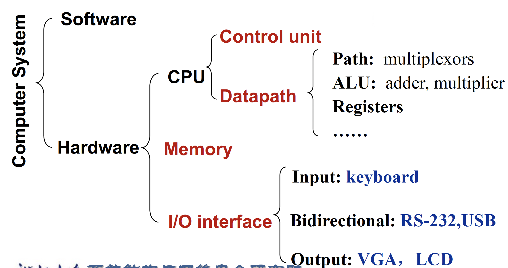
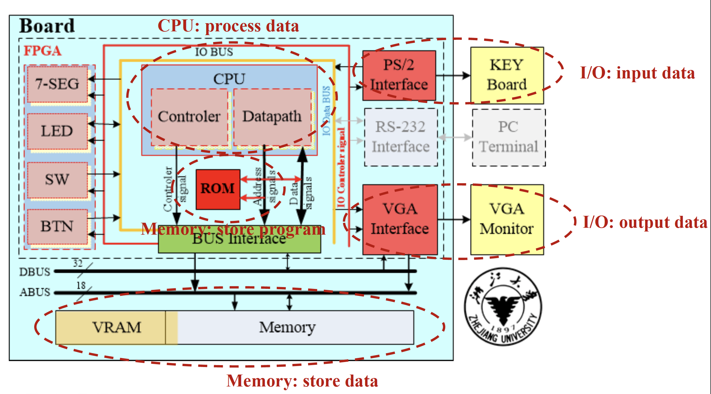
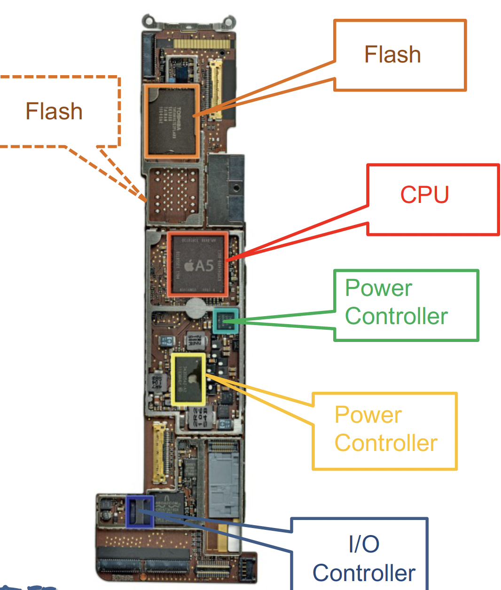
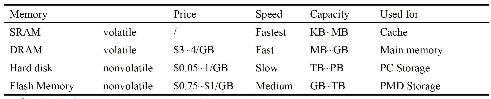
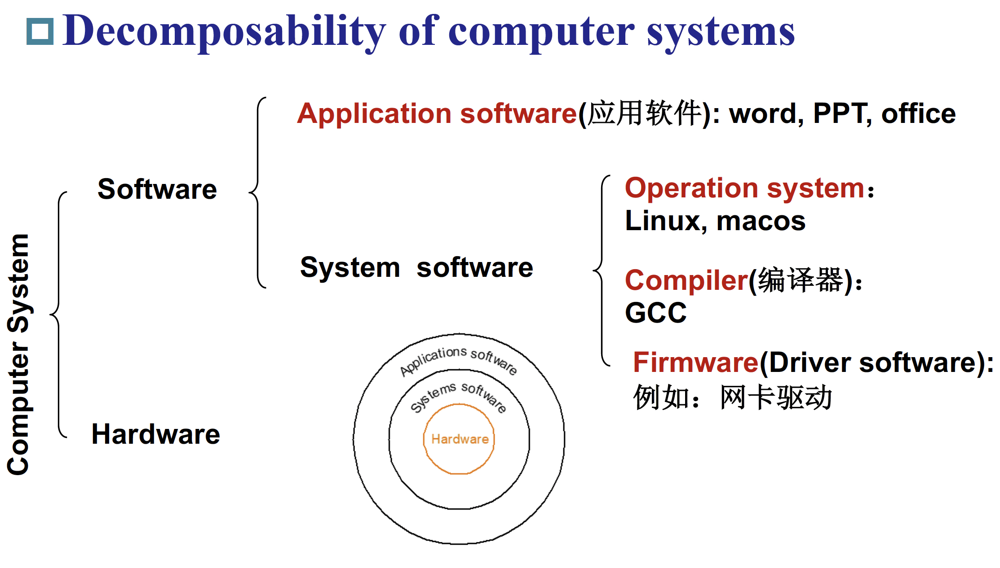
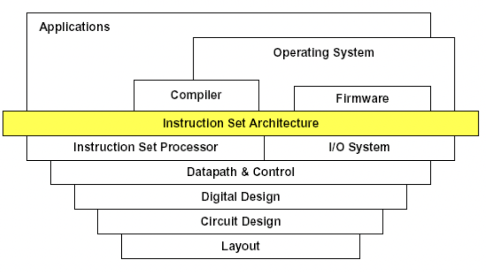
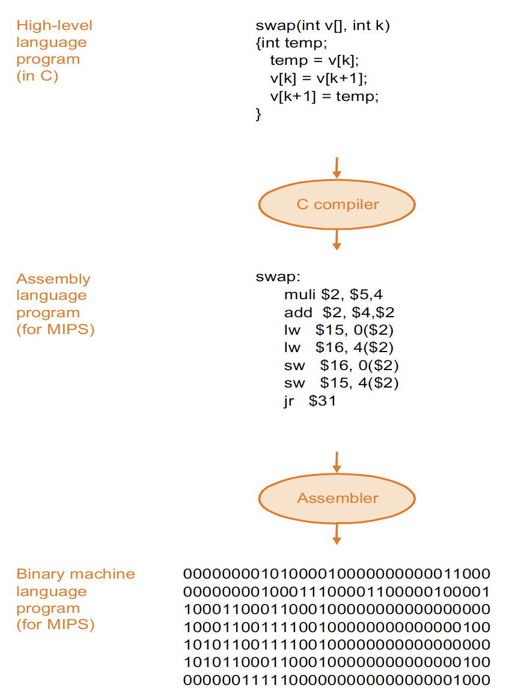
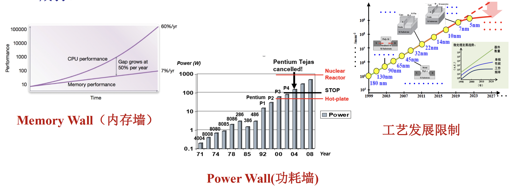

---
hide:
  #- navigation # 显示右
  #- toc #显示左
  - footer
  - feedback
comments: true
---  
# Chapter 01 : Computer abstractions and Technology
## Introduction
### Von Neumann Architecture（冯·诺依曼架构）

- 计算与存储分离
- 数据和指令放在同一个存储器

***
## Computer Organization
### Hardware

***
#### I/O Interfaces（Input/Output）

- I/O 主导该设备（直译过来不懂什么意思 qaq ，大概是 I/O 接口非常重要）
- 输入设备：一种向计算机提供信息的设备
	- 触摸屏
	- 前置摄像头
	- 麦克风
	- 陀螺仪
	- 蓝牙
- 输出设备：将计算机结果传达给用户或另一台计算机的设备
	- 扬声器
	- 触摸屏
	- 蓝牙
***
#### Logical Board

- 由集成电路组成：
	- CPU
	- Flash（闪存）
	- Power Controller
	- I/O Controller

***
#### CPU（Processor）

- 计算机的活跃部分，包含数据通路（执行数学运算）和控制通路（根据程序要求给予通路、内存、I/O 设备指令），执行数字加法，检测 I/O 设备激活需要的数字、信号等。
***
#### Memory

- 程序的存储区域，其中包含运行程序所需的数据
- Main Memory（主存）：易失性，用于在程序运行时保存它们。（例如 DRAM，SRAM）
- Second Memory：非易失性，用于在运行前后存储程序和数据。（例如闪存、磁盘）

***
### Software

***
#### Software Categorization

- 按照用途分类：
	- 系统软件（针对开发者）
	- 应用软件（针对用户）
- 操作系统：
	- 处理基本输入和输出操作
	- 分配存储和内存
	- 在同时使用计算机的多个应用程序之间共享计算机
- 编译器：翻译高级编程语言编写的程序
- Firmware（驱动）：专为硬件设计的软件

***
#### From a High-Level Language to the Language of Hardware

***
## How build processors?

### Integrated Circuits

- 主板核心由集成电路/芯片构成，集成电路驱动我们技术的进步
- 处理器和内存都是由集成电路组成的

### Manufacturing ICs

- 工艺的产量由如下公式定义：

$$
每晶片的价格 = \frac{每晶圆的价格}{每晶圆的晶片数\times 良率}
$$
$$
每晶圆的晶片数 \approx \frac{晶圆面积}{晶片面积}
$$
$$
工艺良率 = \frac{1}{(1+\frac{单位面积缺陷数\times 芯片面积}{2})^2}
$$

	- 晶圆的价格和面积是固定的
	- 缺陷的概率是由生产过程决定的
	- 芯片面积是由结构和电路设计决定的

!!! notes "Challenges of integrated circuits manufacturing"

	- 集成度越来越高，复杂度快速增加
	- 工艺尺寸达到物理极限，加工精度越来越高， 制造难度越来越大
	- 多个技术的集成：电子，光学，机械，计算机，每一个技术都难突破

!!! notes "Challenges of the processor"

	- 处理器和存储器性能的提高不成比例，“内存墙”问题日趋严重，“冯·诺依曼”架构面临挑战。
	- 单位面积功耗增大，散热问题日趋严峻，“功耗墙”问题凸显。
	- 受物理规律限制，摩尔定律面临失效，靠工艺进步获得的性能红利逐渐减弱。
	
	