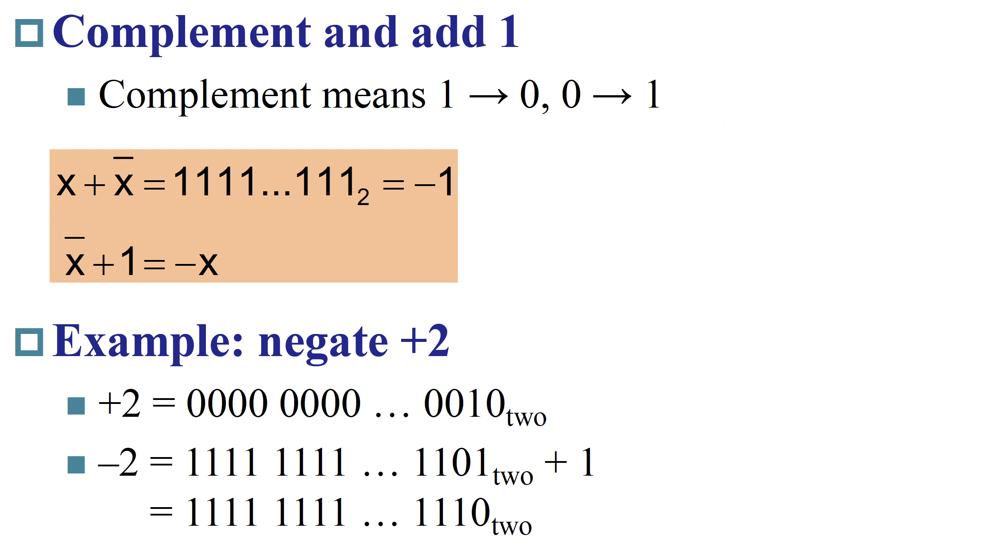
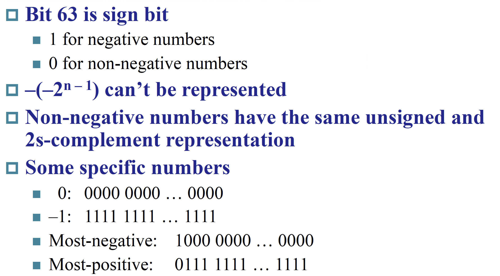
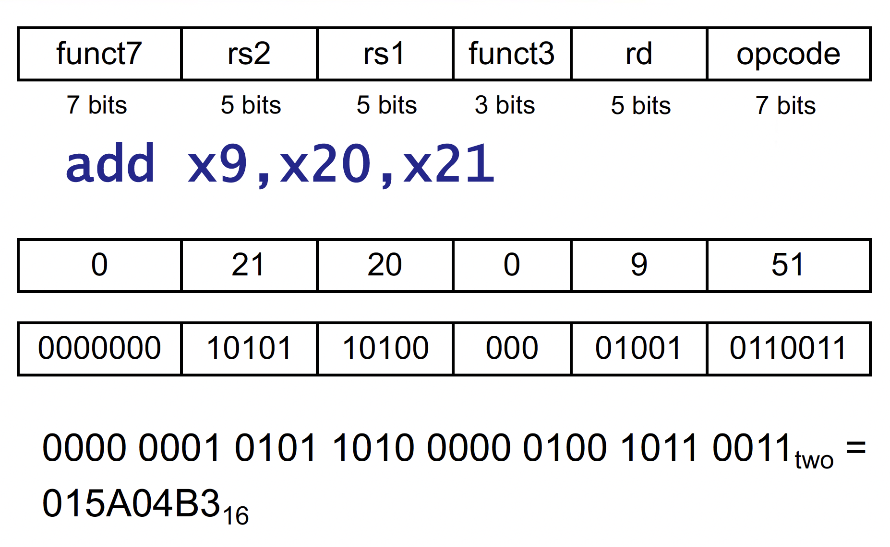
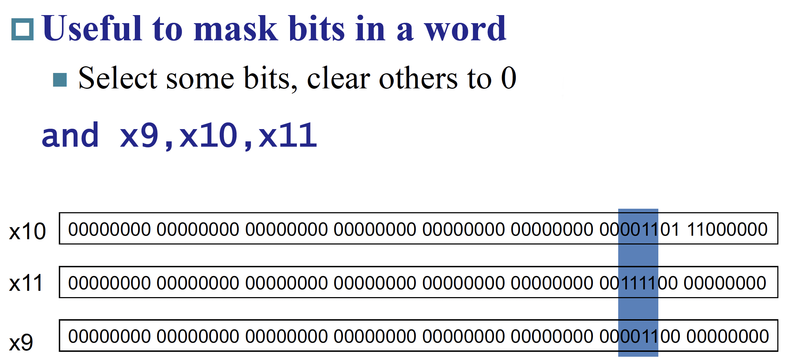
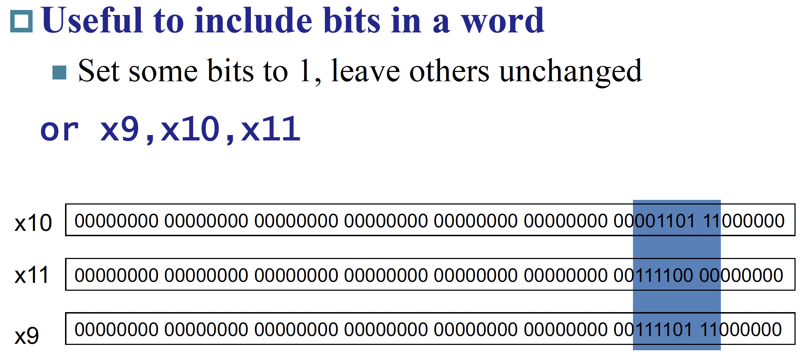
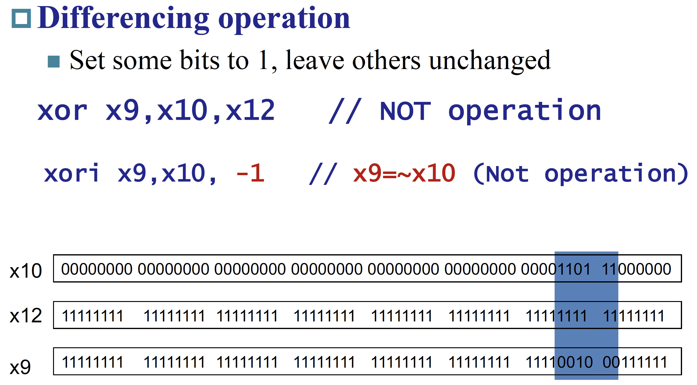
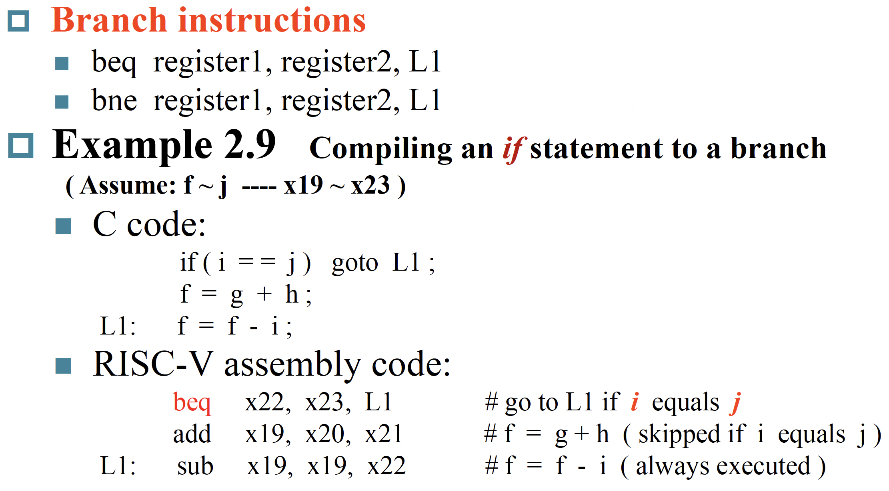
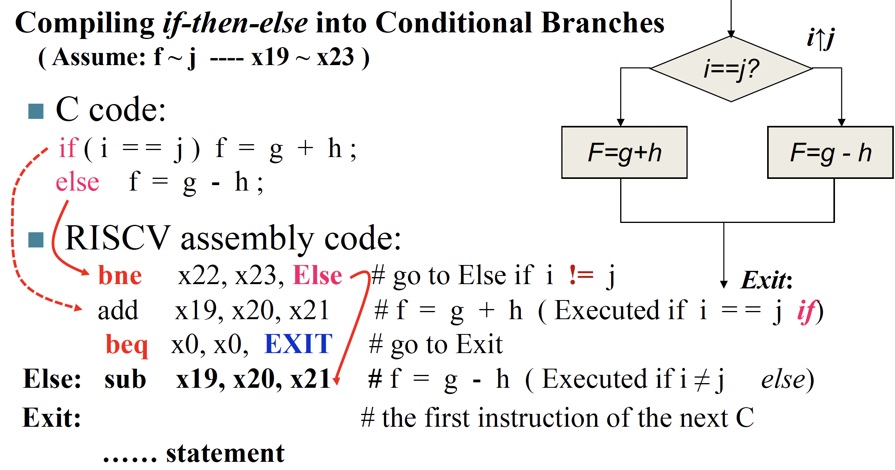
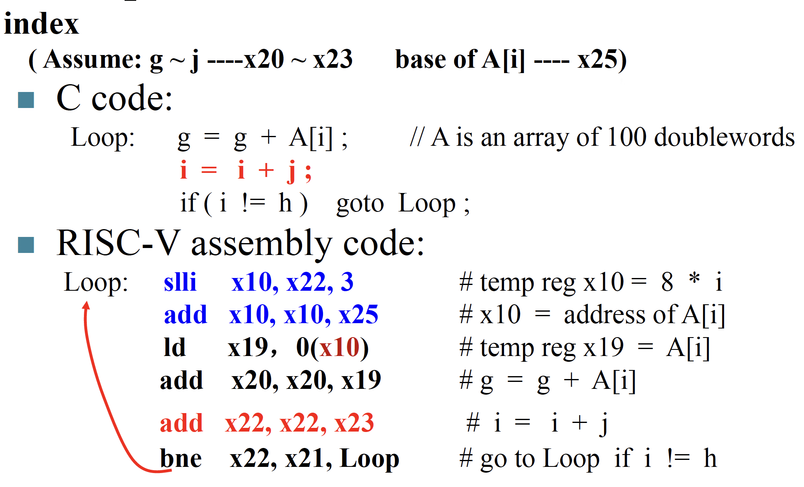
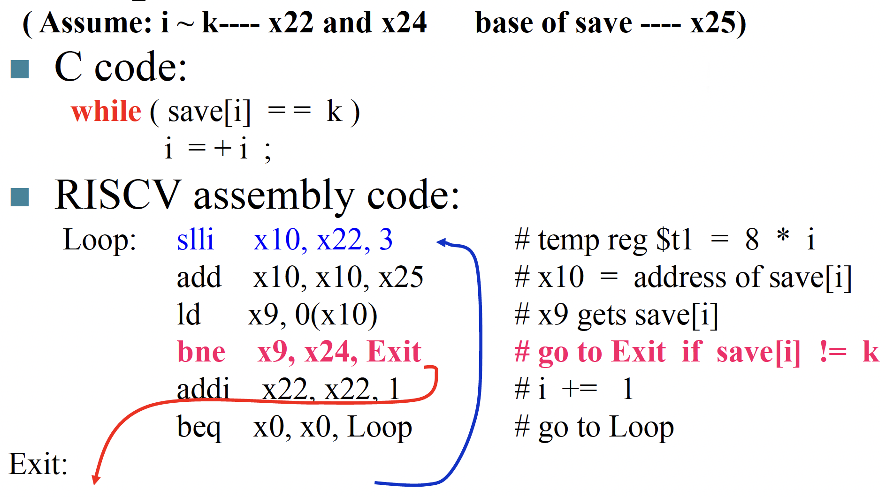

---
hide:
  #- navigation # 显示右
  #- toc #显示左
  - footer
  - feedback
comments: true
---  
# Chapter 2 : Instructions : Language of the Machine

## Introduction

***
## Operations of the Computer Hardware

- 设计原则 1：`Simplicity favors regularity`
	- 规律性使实现更简单
	- 简单性以更低的成本实现更高的性能
### Arithmetic

***
## Operands of the Computer Hardware

### RISC-V Registers

RISC-V architecture 提供 32 个数据寄存器，分别命名为 `x0` ~ `x31` ，每个寄存器的大小是 `64` 位。在 RISC-V architecture 中，一个 **word** 为 32 位，一个 **doubleword** 为 64 位。这些寄存器中的一部分有专门的用途。

RISC-V architecture 也提供一系列浮点数寄存器 `f0` ~ `f31` ，这不是我们讨论的重点。

- 设计原则 2：`Smaller is faster`

- 其中 "preserved on call" 的意思是，是否保证调用前后这些寄存器的值不变。

***
### Memory Operands

RISC-V architecture 的地址是 64 位的，地址为字节地址，因此总共可以寻址 264 个字节，即 261 个 dword (doubleword, 下同)，因为一个 dword 占 log2⁡648=3 位。

在一些 architecture 中，word 的起始地址必须是 word 大小的整倍数，dword 也一样，这种要求称为 **alignment restriction**。RISC-V 允许不对齐的寻址，但是效率会低。

RISC-V 使用 **little endian** 小端编址。也就是说，当我们从 0x1000 这个地址读出一个 dword 时，我们读到的实际上是 0x1000~0x1007 这 8 个字节，并将 0x1000 存入寄存器低位，0x1007 存入高位。

> 一个记忆方法是，如果你将地址横着写，即从左到右递增，那么对于大端来说是比较自然的，但是对于小端来说会比较不自然。以上面的 `0A0B0C0D` 为例子，大端为从低地址到高地址是 `0A` `0B` `0C` `0D`，而小端从低到高地址则是 `0D` `0C` `0B` `0A`。

RISC-V 支持 PC relative 寻址、立即数寻址 ( `lui` )、间接寻址 ( `jalr` )、基址寻址 ( `8(sp)` )：

- 寄存器和内存：

- 常数处理：

- 设计原则 3：`Make Common Case Fast`

***
## Signed and unsigned numbers

### 2's complement

$x+\overline{x}=111…111_2=−1$，因此 $−x=\overline{x}+1$。前导 0 表示正数，前导 1 表示负数。

因此在将不足 64 位的数据载入寄存器时，如果数据是无符号数，只需要使用 0 将寄存器的其他部分填充 (**zero extension**)；而如果是符号数，则需要用最高位即符号位填充剩余部分，称为符号扩展 (**sign extension**)。

即，在指令中的 `lw` , `lh` , `lb` 使用 sign extension，而 `lwu` , `lhu` , `lbu` 使用 zero extension。

!!! Operations

	=== "Signed Negation"
	
		
	
	=== "Sign Extension"
	
		
***
## Representing Instructions in the computer

> 在 RISC 指令集中，只有 load 系列和 store 系列指令能够访问内存。

RISC-V 的跳转指令的 offset 是基于当前指令的地址的偏移；这不同于其他一些汇编是基于下一条指令的偏移的。即如果是跳转语句 `PC` 就不 +4 了，而是直接 +offset。

`lw` , `lwu` 等操作都会清零高位。

RISC-V 指令格式如下：

其中 `I` 型指令有两个条目；这是因为立即数移位操作 `slli` , `srli` , `srai` 并不可能对一个 64 位寄存器进行大于 63 位的移位操作，因此 12 位 imm 中只有后 6 位能实际被用到，因此前面 6 位被用来作为一个额外的操作码字段，如上图中第二个 `I` 条目那样。其他 `I` 型指令适用第一个 `I` 条目。

另外，为什么 `SB` 和 `UJ` 不存立即数（也就是偏移）的最低位呢？（关注表格，可以发现只包括 `i[12:1]` 或者 `i[20:1]`，缺失 `i[0]`）因为，偏移的最后一位一定是 0，即地址一定是 2 字节对齐的，因此没有必要保存。

!!! Example

	
***
## Logical Operations

***
### Shift Operations

***
### Bit Operations

!!! Operations

	=== "AND"
	
		
	
	=== "OR"
	
		
	
	=== "XOR"
	
		

## Instructions for making decisions

### If & If-Else

!!! note "Branch Instructions"

	=== "If"
	
		
	
	=== "If-Else"
	
		

### Loops

!!! note "Loops"

	=== "循环访问数组"
	
		
	
	=== "While"
	
		

### Set on less than

### Others

### Basic Blocks

- 无跳转、分支等指令

## Supporting Procedures in Computer Hardware

- 简单来说，子函数执行完了，把应当有的结果返回给调用它的母函数继续执行

### Procedure Call Instructions

#### Registers for procedure calling

- `x5` - `x7` 以及 `x28` - `x31` 是 temp reg，如果需要的话 caller 保存；也就是说，不保证在经过过程调用之后这些寄存器的值不变。
- `x8` - `x9` 和 `x18` - `x27` 是 saved reg，callee 需要保证调用前后这些寄存器的值不变；也就是说，如果 callee 要用到这些寄存器，必须保存一份，返回前恢复。
- `x10` - `x17` 是 8 个参数寄存器，函数调用的前 8 个参数会放在这些寄存器中；如果参数超过 8 个的话就需要放到栈上（放在 `fp` 上方， `fp + 8` 是第 9 个参数， `fp + 16` 的第 10 个，以此类推）。同时，过程的结果也会放到这些寄存器中（当然，对于 C 语言这种只能有一个返回值的语言，可能只会用到 `x10` ）。
- `x1` 用来保存返回地址，所以也叫 `ra` 。因此，伪指令 `ret` 其实就是 `jalr x0, 0(x1)` 。
- 栈指针是 `x2` ，也叫 `sp` ；始终指向 **栈顶元素**。栈从高地址向低地址增长。
    - `addi sp, sp, -24` , `sd x5, 16(sp)` , `sd x6, 8(sp)` , `sd x20, 0(sp)` 可以实现将 x5, x6, x20 压栈。
- 一些 RISC-V 编译器保留寄存器 `x3` 用来指向静态变量区，称为 global pointer `gp` 。
- 一些 RISC-V 编译器使用 `x8` 指向 activation record 的第一个 dword，方便访问局部变量；因此 `x8` 也称为 frame pointer `fp` 。在进入函数时，用 `sp` 将 `fp` 初始化。
    - `fp` 的方便性在于在整个过程中对局部变量的所有引用相对于 `fp` 的偏移都是固定的，但是对 `sp` 不一定。当然，如果过程中没有什么栈的变化或者根本没有局部变量，那就没有必要用 `fp` 了。

#### Local Data on the Stack

#### Memory Layout

## Synchronization in RISC-V

![[Pasted image 20241028100913.png]]

!!! Example

	

## Translating and starting a program

### Producing an Object Module

### Link

### Loading a Program

### Dynamic Linking

### Lazy Linkage

![[Pasted image 20241028102104.png]]

### Starting Java Applications

## Arrays versus Pointers

## Real Stuff : MIPS Instructions

### Instruction Encoding

## Real Stuff : The Intel x86 ISA

### Basic x86 Registers

### Basic x86 Addressing Modes

### x86 Instruction Encoding

### Implementing IA-32

## Other RISC-V Instructions

## Fallicies and Pitfalls

## Summary

