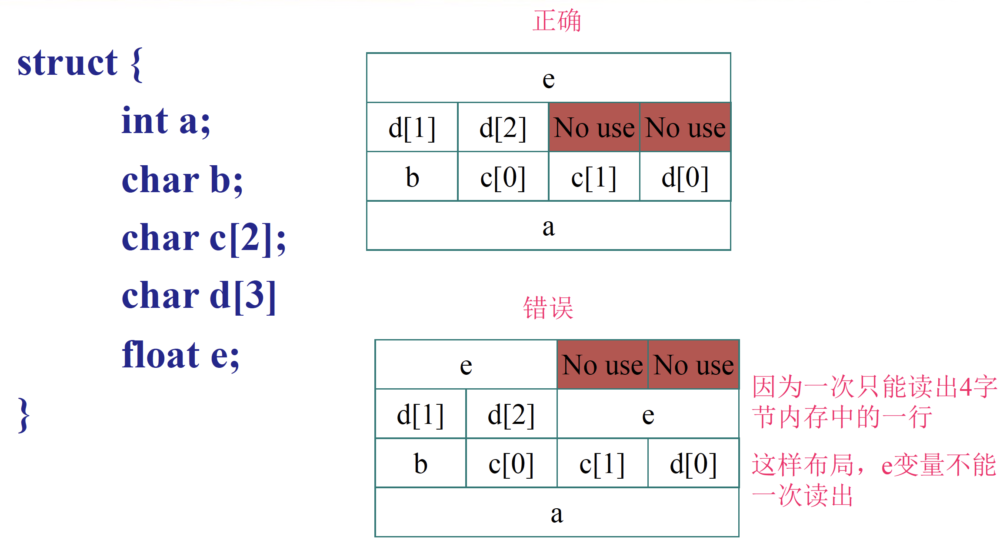
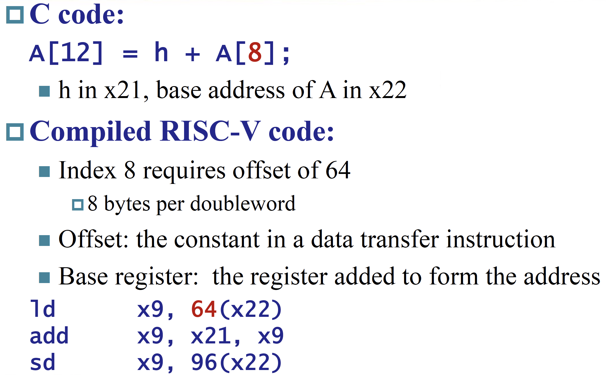

---
hide:
  #- navigation # 显示右
  #- toc #显示左
  - footer
  - feedback
comments: true
---  
# Chapter 2 : Instructions : Language of the Machine

## Introduction

**指令集**(Instruction Set)：一组能被特定架构理解的指令，常见的指令集有 RISC-V，Intel x86，MIPS。

当下计算机建立在两个关键原则（即存储程序概念，Stored-Program Concept）：

- 指令用数字来表示
- 程序就像数字一样存储在内存中，可用来被读取或写入


在 RISC-V 汇编语言中，用`//`表示注释，用法与 C,C++ 的相同。

设计原则：

- `Simplicity favors regularity`
	- 规律性（Regularity）使实现更简单
	- 简单性（Simplicity）以更低的成本实现更高的性能
- `Smaller is faster`
- `Good design demands good compromises`
- `Make Common Case Fast`
***
## Operations of the Computer Hardware

### Arithmetic

- 加法
    - `add`：寄存器 1 + 寄存器 2
    
	```
	add reg1, reg2, reg3    // (in C) reg1 = reg2 + reg3
	```
    
    - `addi`(Add Immediate)：寄存器 + 常量
    
    ```
    addi reg1, reg2, const  // (in C) reg1 = reg2 + const
    ```

- 减法
    - `sub`：寄存器 1 - 寄存器 2
    
	```
    sub reg1, reg2, reg3    // (in C) reg1 = reg2 - reg3
    ```
    
	- 注意：没有`subi`，但是可以通过`addi`一个负常数来实现

***
## Operands of the Computer Hardware

### RISC-V Registers

RISC-V architecture 提供 32 个数据寄存器，分别命名为 `x0` ~ `x31` ，每个寄存器的大小是 `64` 位。在 RISC-V architecture 中，一个 **word（字）** 为 32 位，一个 **doubleword（双字）** 为 64 位。这些寄存器中的一部分有专门的用途。

RISC-V architecture 也提供一系列浮点数寄存器 `f0` ~ `f31`。

之所以寄存器的个数不多，是因为过多的寄存器会增加电子信号的传播距离，从而导致时钟周期的延长。


- `x0` 的值恒为 0
- Preserved on call 意为是否保证调用前后这些寄存器的值不变。
- 将不常用的（或之后用到的）变量放入内存的过程被称为溢出寄存器 (Spilling Register)

由于寄存器的大小和数量有限，因此对于更复杂的数据结构（比如数组和结构体等），寄存器无法直接保存它们的内容。因此小规模的数据会放在寄存器内，而更大规模的数据则会存储在计算机的**内存**(memory) 中（这就需要有寄存器和内存之间的数据传输）。
***
### Memory Operands

由于对数据的各种操作只能在寄存器内完成，而无法在内存中实现，因此数据需要再寄存器和内存之间来回传递，来完成这一传递操作的指令被称为**数据传输指令**(Data Transfer Instructions)。要想访问内存中的某个字或双字，我们需要它们的**地址**(Address)，而这样的地址在内存（可以看作一个很大的一维数组）中作为索引使用，从 0 开始。

RISC-V architecture 的地址是 64 位的，地址为字节地址，每个地址对应一个字节，且内存存储的数据是双字宽度的，因此内存地址是 8 的倍数。总共可以寻址 $2^{64}$ 个字节，即 $2^{61}$ 个 dword (doubleword, 下同)，因为一个 dword 占 $\log_{2}\frac{⁡64}{8}=3$ 位。


在一些 architecture 中，word 的起始地址必须是 word 大小的整倍数，dword 也一样，这种要求称为 **alignment restriction**。RISC-V 允许不对齐的寻址，但是效率会低。

!!! note "Alignment Restriction"

	

RISC-V 使用 **little endian** 小端编址。也就是说，当我们从 0x1000 这个地址读出一个 dword 时，我们读到的实际上是 0x1000~0x1007 这 8 个字节，并将 0x1000 存入寄存器低位，0x1007 存入高位。


> 一个记忆方法是，如果你将地址横着写，即从左到右递增，那么对于大端来说是比较自然的，但是对于小端来说会比较不自然。以上面的 `0A0B0C0D` 为例子，大端为从低地址到高地址是 `0A` `0B` `0C` `0D`，而小端从低到高地址则是 `0D` `0C` `0B` `0A`。

RISC-V 支持 PC relative 寻址、立即数寻址 ( `lui` )、间接寻址 ( `jalr` )、基址寻址 ( `8(sp)` )：


RISC-V 有以下数据传输指令：

- `ld`（Load Doubleword）：加载指令，将数据从内存拷贝到寄存器当中

	```
	ld reg, offset(mem_base_addr)
	// reg: 寄存器
	// mem_base_addr: 一个保存内存基础地址的寄存器（可以理解为能访问到整个内存的头指针）
	// offset: 偏移量，是一个常数
	```

	- 内存数据的实际地址 = `mem_base_addr + offset`

- `sd`（Store Doubleword）：存储指令，将寄存器的数据拷贝到内存中

	```
	sd reg, offset(mem_base_addr)
	// reg: 寄存器
	// mem_base_addr: 内存基础地址寄存器
	// offset: 偏移量
	```

- `lbu`(Load Byte Unsigned)：加载 1 字节的数据，并看作无符号数
- `lb`(Load Byte)：`lbu`的符号数版本

!!! note "2's complement"

	$x+\overline{x}=111…111_2=−1$，因此 $−x=\overline{x}+1$。前导 0 表示正数，前导 1 表示负数。
	
	因此在将不足 64 位的数据载入寄存器时，如果数据是无符号数，只需要使用 0 将寄存器的其他部分填充 (**Zero Extension**)；而如果是符号数，则需要用最高位即符号位填充剩余部分，称为符号扩展 (**Sign Extension**)。
	
	在指令中的 `lw` , `lh` , `lb` 使用 sign extension，而 `lwu` , `lhu` , `lbu` 使用 zero extension。
	
	!!! Operations
	
		=== "Signed Negation"
		
			
		
		=== "Sign Extension"
		
			

!!! Example

	

寄存器和内存的区别：

- 寄存器存储空间小，内存存储空间大
- 各种操作与运算都只能在寄存器内完成
- 寄存器有着更快的运行速度和更高的吞吐量，使得访问寄存器内的数据更加迅速和方便，且访问寄存器的能耗更低；而访问内存需要 `load` 和 `store` 指令，那么就需要执行更多的指令
***
### Constant or Immediate Operands

- 一般的做法是将常数保存在一个寄存器当中，通过一个地址指针指向这个寄存器，然后通过 `add` 指令实现加法操作

	```
	ld x9, AddrConstant4(x3) //x9=constant 4
	add x22, x22, x9
	```

- 实际上我们可以引入一个新的概念：立即数（Immediate），这样就避免了加载指令（即通过操作 `addi x22, x22, 4` 即可实现）
- 不仅如此，对于常数 0，RISC-V 还特意定义了寄存器 x0
***
### Summary


***
## Logical Operations


***
### Shift Operations

- `sll`/`slli`，`srl`/`srli` 分别为逻辑左移/右移
	- 左移 $i$ 位相当于乘以 $2^i$，右移 $i$ 位相当于整除 $2^i$
	- 逻辑右移时最左边补 0
	- 不带`i`的指令表示根据寄存器的值确定移动位数，带`i`的指令表示用立即数确定移动位数
	
		```
		slli x11, x19, 4    // reg x11 = reg x19 << 4 bits
		```

- `sra`/`srai` 为算术右移，最左边补符号位 
***
### Bit Operations

!!! Operations

	=== "AND"
	
		
	
	=== "OR"
	
		
	
	=== "XOR"
	
		

## Instructions for making decisions

### If & If-Else

!!! note "Branch Instructions"

	=== "If"
	
		
	
	=== "If-Else"
	
		

### Loops

!!! note "Loops"

	=== "循环访问数组"
	
		
	
	=== "While"
	
		

### Set on less than


### Others


### Basic Blocks

- 无跳转、分支等指令


***
## Representing Instructions in the computer


> 在 RISC 指令集中，只有 load 系列和 store 系列指令能够访问内存。

RISC-V 的跳转指令的 offset 是基于当前指令的地址的偏移；这不同于其他一些汇编是基于下一条指令的偏移的。即如果是跳转语句 `PC` 就不 +4 了，而是直接 +offset。

`lw` , `lwu` 等操作都会清零高位。

RISC-V 指令格式如下：


其中 `I` 型指令有两个条目；这是因为立即数移位操作 `slli` , `srli` , `srai` 并不可能对一个 64 位寄存器进行大于 63 位的移位操作，因此 12 位 imm 中只有后 6 位能实际被用到，因此前面 6 位被用来作为一个额外的操作码字段，如上图中第二个 `I` 条目那样。其他 `I` 型指令适用第一个 `I` 条目。

另外，为什么 `SB` 和 `UJ` 不存立即数（也就是偏移）的最低位呢？（关注表格，可以发现只包括 `i[12:1]` 或者 `i[20:1]`，缺失 `i[0]`）因为，偏移的最后一位一定是 0，即地址一定是 2 字节对齐的，因此没有必要保存。

!!! Example

	
***
## Supporting Procedures in Computer Hardware

- 简单来说，子函数执行完了，把应当有的结果返回给调用它的母函数继续执行


### Procedure Call Instructions


#### Registers for procedure calling

- `x5` - `x7` 以及 `x28` - `x31` 是 temp reg，如果需要的话 caller 保存；也就是说，不保证在经过过程调用之后这些寄存器的值不变。
- `x8` - `x9` 和 `x18` - `x27` 是 saved reg，callee 需要保证调用前后这些寄存器的值不变；也就是说，如果 callee 要用到这些寄存器，必须保存一份，返回前恢复。
- `x10` - `x17` 是 8 个参数寄存器，函数调用的前 8 个参数会放在这些寄存器中；如果参数超过 8 个的话就需要放到栈上（放在 `fp` 上方， `fp + 8` 是第 9 个参数， `fp + 16` 的第 10 个，以此类推）。同时，过程的结果也会放到这些寄存器中（当然，对于 C 语言这种只能有一个返回值的语言，可能只会用到 `x10` ）。
- `x1` 用来保存返回地址，所以也叫 `ra` 。因此，伪指令 `ret` 其实就是 `jalr x0, 0(x1)` 。
- 栈指针是 `x2` ，也叫 `sp` ；始终指向 **栈顶元素**。栈从高地址向低地址增长。
    - `addi sp, sp, -24` , `sd x5, 16(sp)` , `sd x6, 8(sp)` , `sd x20, 0(sp)` 可以实现将 x5, x6, x20 压栈。
- 一些 RISC-V 编译器保留寄存器 `x3` 用来指向静态变量区，称为 global pointer `gp` 。
- 一些 RISC-V 编译器使用 `x8` 指向 activation record 的第一个 dword，方便访问局部变量；因此 `x8` 也称为 frame pointer `fp` 。在进入函数时，用 `sp` 将 `fp` 初始化。
    - `fp` 的方便性在于在整个过程中对局部变量的所有引用相对于 `fp` 的偏移都是固定的，但是对 `sp` 不一定。当然，如果过程中没有什么栈的变化或者根本没有局部变量，那就没有必要用 `fp` 了。


#### Local Data on the Stack


#### Memory Layout


## Synchronization in RISC-V


!!! Example

	

## Translating and starting a program


### Producing an Object Module


### Link


### Loading a Program


### Dynamic Linking


### Lazy Linkage

![[Pasted image 20241028102104.png]]

### Starting Java Applications


## Arrays versus Pointers


## Real Stuff : MIPS Instructions


### Instruction Encoding


## Real Stuff : The Intel x86 ISA

### Basic x86 Registers


### Basic x86 Addressing Modes


### x86 Instruction Encoding


### Implementing IA-32


## Other RISC-V Instructions


## Fallicies and Pitfalls


## Summary


