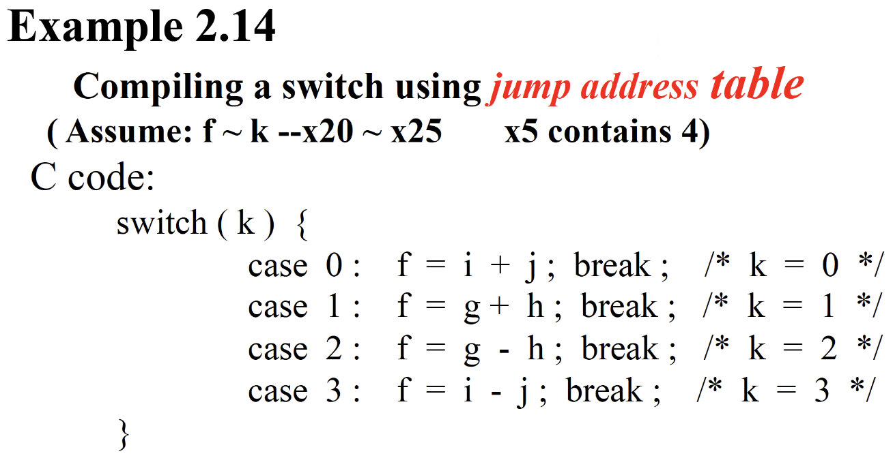

---
hide:
  #- navigation # 显示右
  #- toc #显示左
  - footer
  - feedback
comments: true
---  
# Chapter 2 : Instructions : Language of the Machine

## Introduction

**指令集**(Instruction Set)：一组能被特定架构理解的指令，常见的指令集有 RISC-V，Intel x86，MIPS。

当下计算机建立在两个关键原则（即存储程序概念，Stored-Program Concept）：

- 指令用数字来表示
- 程序就像数字一样存储在内存中，可用来被读取或写入


在 RISC-V 汇编语言中，用`//`表示注释，用法与 C,C++ 的相同。

设计原则：

- `Simplicity favors regularity`
	- 规律性（Regularity）使实现更简单
	- 简单性（Simplicity）以更低的成本实现更高的性能
- `Smaller is faster`
- `Good design demands good compromises`
- `Make Common Case Fast`
***
## Operations of the Computer Hardware

### Arithmetic

- 加法
    - `add`：寄存器 1 + 寄存器 2
    
	```asm
	add reg1, reg2, reg3    // (in C) reg1 = reg2 + reg3
	```
    
    - `addi`(Add Immediate)：寄存器 + 常量
    
    ```asm
    addi reg1, reg2, const  // (in C) reg1 = reg2 + const
    ```

- 减法
    - `sub`：寄存器 1 - 寄存器 2
    
	```asm
    sub reg1, reg2, reg3    // (in C) reg1 = reg2 - reg3
    ```
    
	- 注意：没有`subi`，但是可以通过`addi`一个负常数来实现
***
### Logical Operations


***
#### Shift Operations

- `sll`/`slli`，`srl`/`srli` 分别为逻辑左移/右移
	- 左移 $i$ 位相当于乘以 $2^i$，右移 $i$ 位相当于整除 $2^i$
	- 逻辑右移时最左边补 0
	- 不带`i`的指令表示根据寄存器的值确定移动位数，带`i`的指令表示用立即数确定移动位数
	
		```asm
		slli x11, x19, 4    // reg x11 = reg x19 << 4 bits
		```

- `sra`/`srai` 为算术右移，最左边补符号位 
***
#### Bit Operations

!!! Operations

	=== "AND"
	
		
	
	=== "OR"
	
		
	
	=== "XOR"
	
		
		
		- RISC-V 中没有 NOT 指令，因为它可以通过异或表示出来：任何数与 111...111 异或的结果即为该数取反后的结果
	
	- AND、OR、XOR 也有立即数版本的指令，分别为：`andi`、`ori`和`xori`
***
### Making Decisions

计算机与计算器的一大不同之处在于计算机具备决策的能力：它能够执行分支（条件）语句、循环语句等。在 RISC-V 汇编语言中，关于决策的指令格式均为：

```asm
inst rs1, rs2, L1
```

其中`rs1`、`rs2`是寄存器，`L1`是标签（跳转位置，也可以是立即数 imm，表示跳转到 PC+imm 的指令），`inst`是指令，比较的是补码值。

其分类如下：

- **条件分支**(conditional branch)：先检测值，根据检测结果决定是否将控制权转交给新地址上的语句的一类指令
- **无条件分支**(unconditional branch)：条件恒为真的条件分支，因此该语句一定会执行

有以下几种可用指令：

- `beq`(Branch If Equal)：如果寄存器`rs1`和`rs2`的值**相等**，那么跳转至带标签`L1`的语句
- `bne`(Branch If Not Equal)：如果寄存器`rs1`和`rs2`的值**不相等**，那么跳转至带标签`L1`的语句
- `blt`(Branch If Less Than)：如果寄存器`rs1`的值**小于**`rs2`的值，那么跳转至带标签`L1`的语句
    - `bltu`：无符号版本
- `bge`(Branch If Greater Than or Equal)：如果寄存器`rs1`的值**大于等于**`rs2`的值，那么跳转至带标签`L1`的语句
    - `bgeu`：无符号版本
***
#### If & If-Else & Case-Switch

!!! note "Branch Instructions"

	=== "If"
	
		
	
	=== "If-Else"
	
		
	
	=== "Case-Switch"
	
		对于`case/switch`语句，我们可以使用一张放有可选指令序列地址的表格（称为**分支地址表**，Branch Address Table），这样的话程序就可以根据条件判断的结果，通过表格的索引找到合适的指令序列。
		
		
		
		!!! Example
		
			=== "Question"
			
				
				
			=== "Answer"
			
				
#### Loops

!!! note "Loops"

	=== "循环访问数组"
	
		
	
	=== "While"
	
		

#### Set on less than

```asm
slt x5, x19, x20
```

这句指令意为如果 x19<x20，那么将 x5 赋值为 1

!!! Example

	
***
#### Basic Blocks

**基本块**（Basic Blocks）是一个没有内嵌分支（除了在末尾）且没有跳转目标（除非在开头）的指令序列。编译器通过识别出基本块可以进行编译的优化，高级处理器能够加速基本块的执行。

***
## Operands of the Computer Hardware

### RISC-V Registers

RISC-V architecture 提供 32 个数据寄存器，分别命名为 `x0` ~ `x31` ，每个寄存器的大小是 `64` 位。在 RISC-V architecture 中，一个 **word（字）** 为 32 位，一个 **doubleword（双字）** 为 64 位。这些寄存器中的一部分有专门的用途。

RISC-V architecture 也提供一系列浮点数寄存器 `f0` ~ `f31`。

之所以寄存器的个数不多，是因为过多的寄存器会增加电子信号的传播距离，从而导致时钟周期的延长。


- `x0` 的值恒为 0
- Preserved on call 意为是否保证调用前后这些寄存器的值不变。
- 将不常用的（或之后用到的）变量放入内存的过程被称为溢出寄存器 (Spilling Register)

由于寄存器的大小和数量有限，因此对于更复杂的数据结构（比如数组和结构体等），寄存器无法直接保存它们的内容。因此小规模的数据会放在寄存器内，而更大规模的数据则会存储在计算机的**内存**(memory) 中（这就需要有寄存器和内存之间的数据传输）。
***
### Memory Operands

由于对数据的各种操作只能在寄存器内完成，而无法在内存中实现，因此数据需要再寄存器和内存之间来回传递，来完成这一传递操作的指令被称为**数据传输指令**(Data Transfer Instructions)。要想访问内存中的某个字或双字，我们需要它们的**地址**(Address)，而这样的地址在内存（可以看作一个很大的一维数组）中作为索引使用，从 0 开始。
***
#### Address

RISC-V architecture 的地址是 64 位的，地址为字节地址，每个地址对应一个字节，且内存存储的数据是双字宽度的，因此内存地址是 8 的倍数。总共可以寻址 $2^{64}$ 个字节，即 $2^{61}$ 个 dword (doubleword, 下同)，因为一个 dword 占 $\log_{2}\frac{⁡64}{8}=3$ 位。


在一些 architecture 中，word 的起始地址必须是 word 大小的整倍数，dword 也一样，这种要求称为 **alignment restriction**。RISC-V 允许不对齐的寻址，但是效率会低。

!!! note "Alignment Restriction"

	

RISC-V 使用 **little endian** 小端编址。也就是说，当我们从 0x1000 这个地址读出一个 dword 时，我们读到的实际上是 0x1000~0x1007 这 8 个字节，并将 0x1000 存入寄存器低位，0x1007 存入高位。


> 一个记忆方法是，如果你将地址横着写，即从左到右递增，那么对于大端来说是比较自然的，但是对于小端来说会比较不自然。以上面的 `0A0B0C0D` 为例子，大端为从低地址到高地址是 `0A` `0B` `0C` `0D`，而小端从低到高地址则是 `0D` `0C` `0B` `0A`。

RISC-V 支持：

- 立即数寻址 (Immediate Addressing)：操作数为指令内的立即数
- 寄存器寻址（Register Addressing）：操作数为寄存器
- 基址寻址(Base Addressing)：操作数位于指定的内存位置上，该位置是寄存器和立即数之和
- **PC 相对寻址**(PC-Relative Addressing)：分支地址为 PC 和分支偏移量（立即数的 2 倍）之和

$$
\begin{aligned}
\text{Target address​}&=\text{PC}+\text{Branch offset}\\
&=\text{PC}+\text{immediate}\times2​
\end{aligned}
$$


- 虽然大部分的跳转地址离分支指令都比较近（根据 SPEC 测试，一半左右的分支指令跳转距离不超过 16 条指令），但是仍会存在一些跳转距离很远，超过 12 位地址的指令。这时汇编器会采取以下挽救措施：
    - 插入一条无条件分支指令，它的跳转地址即为目标跳转地址
    - 将原来条件分支指令的条件取反，让条件分支语句自行决定是否跳过无条件分支

!!! Example

	对于指令 `beq x10, x0, L1`，如果 `L1` 地址过远，这条指令会被替换成以下指令：
	
	```asm
	    bne x10, x0, L2
	    jal x0, L1
	L2:
	```

***
#### Data Transfer

RISC-V 有以下数据传输指令：

- `ld`（Load Doubleword）：加载指令，将数据从内存拷贝到寄存器当中

	```asm
	ld reg, offset(mem_base_addr)
	// reg: 寄存器
	// mem_base_addr: 一个保存内存基础地址的寄存器（可以理解为能访问到整个内存的头指针）
	// offset: 偏移量，是一个常数
	```

	- 内存数据的实际地址 = `mem_base_addr + offset`

- `sd`（Store Doubleword）：存储指令，将寄存器的数据拷贝到内存中

	```asm
	sd reg, offset(mem_base_addr)
	// reg: 寄存器
	// mem_base_addr: 内存基础地址寄存器
	// offset: 偏移量
	```

- `lbu`(Load Byte Unsigned)：加载 1 字节的数据，并看作无符号数
- `lb`(Load Byte)：`lbu`的符号数版本

> 在 RISC 指令集中，只有 load 系列和 store 系列指令能够访问内存。

!!! note "2's complement"

	$x+\overline{x}=111…111_2=−1$，因此 $−x=\overline{x}+1$。前导 0 表示正数，前导 1 表示负数。
	
	因此在将不足 64 位的数据载入寄存器时，如果数据是无符号数，只需要使用 0 将寄存器的其他部分填充 (**Zero Extension**)；而如果是符号数，则需要用最高位即符号位填充剩余部分，称为符号扩展 (**Sign Extension**)。
	
	在指令中的 `lw` , `lh` , `lb` 使用 sign extension，而 `lwu` , `lhu` , `lbu` 使用 zero extension。
	
	!!! Operations
	
		=== "Signed Negation"
		
			
		
		=== "Sign Extension"
		
			

!!! Example

	

寄存器和内存的区别：

- 寄存器存储空间小，内存存储空间大
- 各种操作与运算都只能在寄存器内完成
- 寄存器有着更快的运行速度和更高的吞吐量，使得访问寄存器内的数据更加迅速和方便，且访问寄存器的能耗更低；而访问内存需要 `load` 和 `store` 指令，那么就需要执行更多的指令
***
### Constant or Immediate Operands

- 一般的做法是将常数保存在一个寄存器当中，通过一个地址指针指向这个寄存器，然后通过 `add` 指令实现加法操作

	```asm
	ld x9, AddrConstant4(x3) //x9 = constant 4
	add x22, x22, x9
	```

- 实际上我们可以引入一个新的概念：立即数（Immediate），这样就避免了加载指令（即通过操作 `addi x22, x22, 4` 即可实现）
- 不仅如此，对于常数 0，RISC-V 还特意定义了寄存器 x0
***
### Summary


***
## Supporting Procedures in Computer Hardware

**过程**（Procedure）或函数（Function）：一种被存起来的子程序（Subroutine），基于提供的参数来执行一些特定的任务，它们更加容易理解，更加方便地重用。

在执行一个过程的时候，程序将会遵循以下步骤：

1. 将参数放在过程可以访问得到的地方
2. 将控制权转交给过程
3. 获取过程所需的存储资源
4. 执行目标任务
5. 将结果值放在调用程序访问得到的地方
6. 将控制权还给原主，因为一个过程可以被调用多次
***
### Procedure Call Instructions


***
#### Registers for procedure calling

在调用过程的时候，程序会用到以下寄存器：

- `x10` - `x17` 是 8 个参数寄存器，函数调用的前 8 个参数会放在这些寄存器中；如果参数超过 8 个的话就需要放到栈上（放在 `fp` 上方， `fp + 8` 是第 9 个参数， `fp + 16` 的第 10 个，以此类推）。同时，过程的结果也会放到这些寄存器中（当然，对于 C 语言这种只能有一个返回值的语言，可能只会用到 `x10` ）。
- `x1` 用来保存返回地址，所以也叫 `ra` 。因此，伪指令 `ret` 其实就是 `jalr x0, 0(x1)` 。
***
#### Local Data on the Stack

对于过程/函数，会出现一些局部变量，即任何被 Callee 用到的寄存器，在过程被唤起之前必须复原（Restore）它们的值（类似 C 语言中的内存释放），因此也类似 C 语言，我们也需要通过栈来保存这些数据：

- 在栈中，需要用一个**栈指针**(stack pointer) 来指向栈中最近被分配的地址，它起到了指示下一个溢出寄存器的位置，以及获取旧的寄存器的值的作用。
- 栈的两个常用操作是**压入**(push) 和**弹出**(pop)，分别表示存储数据和移除数据。
- 由于历史原因，栈的高位地址在先，低位地址在后，因此要把这个栈看作是一个倒放的容器：栈底在上方，从下方的开口将数据压入。


栈上所需要的寄存器如下：

- 栈指针为 `x2` ，也叫 `sp` ；始终指向 **栈顶元素**。栈从高地址向低地址增长。
    - `addi sp, sp, -24`（空出存储数据的栈空间） , `sd x5, 16(sp)` , `sd x6, 8(sp)` , `sd x20, 0(sp)` 可以实现将 x5, x6, x20 压栈。
- `x5` - `x7` 以及 `x28` - `x31` 是 Temporary Registers，父函数 Caller 需保证：子函数能随意使用，返回给父函数时，它们的值可以被改变。
- `x8` - `x9` 和 `x18` - `x27` 是 Saved Registers，子函数 Callee 需要保持这些寄存器在父函数调用子函数前的值；也就是说，如果 Callee 要用到这些寄存器，必须保存一份，返回前恢复。

- 一些 RISC-V 编译器保留寄存器 `x3` 用来指向静态变量区，称为 global pointer `gp` 。
- 一些 RISC-V 编译器使用 `x8` 指向 activation record 的第一个 dword，方便访问局部变量；因此 `x8` 也称为 frame pointer `fp` 。在进入函数时，用 `sp` 将 `fp` 初始化。
    - `fp` 的方便性在于在整个过程中对局部变量的所有引用相对于 `fp` 的偏移都是固定的，但是对 `sp` 不一定。当然，如果过程中没有什么栈的变化或者根本没有局部变量，那就没有必要用 `fp` 了。

下图为过程调用前、中、后的时候栈的情况：


***
#### Memory Layout

Linux 系统上 RISC-V 的内存分配示意图：


- 最底下的内存是保留的空间（不可访问）
- 第二层的内存用于存放 RISC-V 的机器码，称为**文本段**（Text Segment）
- 第三层的内存称为**静态数据段**（Static Data Segment），用于放置立即数和其他静态变量
- 最上层同时存放栈和动态数据（比如链表等），其中存放动态数据的数据结构称为**堆**(heap)。注意到栈和堆位于这块内存的两端，分别自顶向下和自底向上增长
    - C 语言中使用`malloc()`在堆中分配空间，使用`free()`释放堆内的空间。如果过晚释放空间，就会造成内存泄露问题；如果过早释放空间，就会造成悬空指针 (dangling pointers)（类似野指针）问题。
***
## Representing Instructions in the computer

### Types of Instructions

因为计算机当中所有的信息均由二进制位来表示，那么我们也应该将指令编码为二进制，记其为机器码（Machine Code）。

RISC-V 的指令将每条指令都编码为 32 位的 Word，体现了设计原则 "Simplicity favors regularity"

我们可以把每条指令当作一块块二进制数字构成的组合，而这单块的数字被称为**字段**（Field）。我们为字段赋予了一些名称，每个字段有不同的功能：

- `opcode`：指令要做的运算，可用这个字段区分各种类型的**指令格式**(instruction format)
- `funct3`：额外的`opcode`字段
- `funct7`：额外的`opcode`字段
- `rd`：寄存器目标操作数，保存运算的结果
- `rs1`：第一个寄存器源操作数
- `rs2`：第二个寄存器源操作数
- `immediate`：立即数，即常数（在 S-type 中会被拆成两半）

根据不同的 opcode 我们可以将指令分为 6 种类型，它们的字段构成如下：


!!! note "Types of Instructions"

	=== "R-Type"
	
		R 型指令一般用于算术、逻辑运算
		
		
	
	=== "I-Type"
	
		 I 型指令一般用于加载操作、涉及立即数的算术逻辑运算、<font color="red">`jalr`指令</font>
		 
		 
		 - I 型指令有两种分支，这是因为寄存器的大小为 64 位，也就是说对于移位操作 `slli`，`srli`和`srai`，它们最多只能移位 64 位，因此移位操作中`immediate`字段只有后 6 位能实际被用来存储移位的步数，前 6 位用来存储额外的`opcode`字段（`funct6`）
		 - 关于 `jalr` 指令，如果跳转地址（立即数）过大，超过了 20 位，那么可以先用 `lui` 指令将高 20 位数字放入临时寄存器中，然后再用 `jalr` 指令跳转到地址剩余的低位数字(临时寄存器)上
	
	=== "S-Type"
	
		S 型指令一般用于存储操作
		
		
	
	=== "U-Type"
	
		U 型指令一般用于与高位立即数相关的操作
		
		在大多数情况下，立即数不会很大（$\leq 2^{12}$），能够直接存在指令中；但如果超过 12 位，RISC-V 会用 `lui` (load upper immediate) 指令来处理这类较大的立即数。
		
		它可以加载立即数的**高 20 位**，将其放入寄存器中间的第 12 位到第 31 位，寄存器的低 12 位用 0 填充，高 32 位用第 31 位上的数字填充。
		
		例如，要将 32 位立即数赋给寄存器，可以先用`lui`指令将高 20 位赋给寄存器，之后用`addi` 指令将剩余的 12 位加到寄存器中。
		
		!!! Example
		
			=== "Question"
			
				如何将下列的 64 位立即数放入寄存器`x19`内？
				
				
			
			=== "Answer"
			
				先取这个立即数上第 12 位到第 31 位的数字，用指令`lui`将这些数字放入寄存器`x19`上的第 12 位到第 31 位
				
				```asm
				lui x19, 976  // 976 = 0000 0000 0011 1101 0000
				```
				
				然后将立即数的低 12 位加到寄存器上即可
				
				```asm
				addi x19, x19, 1280  // 1280 = 00000101 00000000
				```
	
	=== "SB-Type"
	
		SB 型指令一般用于条件分支语句
		
		
		
		- 可表示的地址范围为 -4096-4094，且都是 2 的倍数（因为立即数第一位恒为 0）
	
	=== "UJ-Type"
	
		UJ 型指令一般用于无条件分支语句（`jal`）
		
		- `rd`用于存放链接地址（即返回地址）


??? Question "为什么 `SB` 和 `UJ` 不存立即数（也就是偏移）的最低位呢？"

	关注表格，可以发现只包括 `i[12:1]` 或者 `i[20:1]`，缺失 `i[0]`
	
	这是因为，偏移的最后一位一定是 0，即地址一定是 2 字节对齐的，因此没有必要保存。
***
### Summary


***
## Synchronization in RISC-V

假设两个处理器 $P_1,P_2$​ 在同一片内存空间中工作，并且它们的工作顺序为：$P_1$​ 写入数据后，$P_2$​ 再读取数据。如果 $P_1$​ 和 $P_2$​ 没有**同步**（Synchoronize）好，那么就会产生**数据竞争**（Data Race） 的问题（结果取决于 $P_1$​ 和 $P_2$​ 的访问顺序，因此这个结果就是不确定的）。

避免这一问题的方法是**原子**读取 / 写入 (Atomic Read/Write) 内存操作，这种操作确保读和写之间不会有任何访问这块内存空间的行为。

有些处理器有专门实现原子操作的指令，比如原子交换 (Atomic Swap/Exchange)（实现寄存器和内存数据的交换）等。而 RISC-V 提供了一个指令对 (Instruction Pair) `lr.d`和`sc.d`：

- `lr.d`（Load-Reserved Doubleword）：
	- `lr.d rd, (rs1)` 将存储在寄存器`rs1`的内存地址上的数据加载到寄存器`rd`上，同时保留这块内存地址，除`sc.d`的其他指令不应该访问这块地址
- `sc.d`（Store-Conditional Doubleword）：
	- `sc.d rd, rs1, (rs2)` 将寄存器`rs1`上的数据放入存储在寄存器`rs2`的内存地址上，并且由寄存器`rd`指示该指令是否成功：若成功，则`rd = 0`，否则`rd`为一个非零值（表示有其他指令访问过这块内存空间）

!!! Example

	
	
	
***
## Translating and starting a program

下图展示了将一个 C 语言的程序（源代码）转化为存储在内存中的一个文件的过程：


这个过程一共涉及到以下装置：

- 编译器 (Compiler)：高级编程语言 -> 汇编语言
    - 有的编译器兼具汇编器的功能
- 汇编器 (Assembler)：
    - 伪指令 -> 指令
        - **伪指令**(Pseudo Instruction)：可以理解为汇编指令的扩展（或者缩写），形式上看似指令，而实际上并不存在这种指令，但汇编器会将其自动转化为实际存在的指令
        
        !!! Example
        
	        - `li reg, imm` 指令为加载立即数（Load Immediate），等价于 `addi reg, x0, imm`
			- `mv rd, rs` 指令为赋值（Move），等价于 `addi rd, rs, 0`
			- `j` 为指令 `jal` 的缩写
	
	-  可接受各种进制的数
    - 用**符号表**(symbol table) 存储标签名称和内存地址的对应关系，便于将标签转化为实际的地址
    - 基本的功能：汇编语言 -> 机器码，即汇编程序 -> **目标文件**(Object File)。在 UNIX 系统中，目标文件包含以下内容：
        - 目标文件头 (Object File Header)：描述目标文件中其他区域的大小和位置
        - 文本段 (Text Segment)：包含机器码
        - 静态数据段 (Static Data Segment)：包含程序生命周期中分配的数据（在 UNIX 中这个区域同时存放静态和动态数据）
        - 重定位信息 (Relocation Information)：根据程序被加载至内存的绝对地址来区分指令和数据
        - 符号表 (Symbol Table)
        - 调试信息 (Debugging Information)：简要描述模块的编译情况，使调试器能够将机器指令和 C 源文件关联起来，且能够读取其中的数据结构
    
		!!! Example
		
			
    
- 链接器 (Linker)
    - 对于多文件的编译，采取的做法是先编译、汇编单个的文件，然后将这些机器语言程序链接起来，这样可以尽可能减少重编译和重汇编的情况
    - 工作流程：
        - 将代码和数据模块以符号化的形式存在内存中
        - 弄清数据和指令标志对应的地址
        - 补充好内部和外部的引用
    - 经链接器加工后，最终生成一个可执行文件 (Executable File)，它与目标文件的区别在于后者存在不确定 (Unresolved) 的引用
- 加载器 (Loader)：将可执行文件放入内存或磁盘中，工作流程为：
    - 读取可执行文件头，得到文本段和数据段的大小
    - 创建一个指向足够容纳文本和数据的空间的地址
    - 将可执行文件的指令和数据拷贝到内存中
    - 将主程序的参数（如果有的话）放入栈中
    - 对寄存器进行初始化操作，并将栈指针指向第一个空闲的位置上
    - 跳转到启动例程，将参数拷贝到参数寄存器中，并调用程序的主例程。让主例程返回时，启动例程中止整个程序，附带`exit`系统调用

***
### Dynamic Linking

前面介绍的链接方法属于静态链接，虽然它能快速调用库函数，但它具有以下缺陷：不能及时更新库函数，会一次性加载所有库函数（即使很多库函数没被用到）。因此我们更多地会用到**动态链接库**(Dynamically Linked Libraries, DLL) 来克服这些缺陷——这种库可以在程序**运行时**被链接到程序里。

动态链接库有如下特征：

- 需要可重定位的过程代码
- 能够避免由静态链接获取所有库函数带来的占用存储空间过大的问题
- 能够自动获取最新版本的库
***
### Lazy Linkage

在原始版本的 DLL 中，程序和库都需要保留额外的信息，用于定位非局部的过程；加载器会运行一个动态的链接器，使用这些额外的信息找到合适的库并更新所有的外部引用。这种 DLL 的缺点是它仍然会一次性加载所有库函数。一种改进方法是使用**懒过程链接**(Lazy Procedure Linkage) 版本的 DLL，它能保证只有当程序调用库函数时，对应的库才会被链接到程序里。下图展示了这种版本的 DLL：


***
### Starting Java Applications


***
## Example : RISC-V in C

我们用 RISC-V 汇编语言来翻译一个用 C 语言写的冒泡排序函数。

!!! tip "C 语言翻译成汇编语言步骤"

	1. 为程序的每个变量分配相应的寄存器
	2. 为过程的主体部分书写代码
	3. 在过程调用期间保留要用的寄存器

先翻译子过程 `swap`（交换两个元素）：

=== "C"

	```c
	void swap(long long int v[], size_t k) {
	    long long int temp;
	    temp = v[k];
	    v[k] = v[k+1];
	    v[k+1] = temp;
	}
	```

=== "RISC-V"

	```asm
	swap:
	    slli x6, x11, 3      // reg x6 = k * 8
	    add  x6, x10, x6     // reg x6 = v + (k * 8)
	    ld   x5, 0(x6)       // reg x5 (temp) = v[k]
	    ld   x7, 8(x6)       // reg x7 = v[k + 1]
	    sd   x7, 0(x6)       // v[k] = reg x7
	    sd   x5, 8(x6)       // v[k+1] = reg x5 (tmp)
	    jalr x0, 0(x1)       // return to calling routine
	```

再翻译主程序 `sort`：

=== "C"

	```c
	void sort(long long int v[], size_t int n) {
	    size_t i, j;
	    for (i = 0; i < n; i++) {
	        for (j = i - 1; j >= 0 && v[j] > v[j + 1]; j--) {
	            swap(v, j);
	        }
	    }
	}
	```

=== "RISC-V"

	```asm
	// Saving registers
	sort:
	    addi sp, sp, -40      // make room on stack for 5 registers
	    sd   x1, 32(sp)       // save return address on stack
	    sd   x22, 24(sp)      // save x22 on stack
	    sd   x21, 16(sp)      // save x21 on stack
	    sd   x20, 8(sp)       // save x20 on stack
	    sd   x19, 0(sp)       // save x19 on stack
	
	// Procedure body
	// Move parameters
	    mv   x21, x10         // copy parameter x10 into x21
	    mv   x22, x11         // copy parameter x11 into x22
	
	// Outer loop
	    li   x19, 0           // i = 0
	for1tst: 
	    bge  x19, x22, exit1  // go to exit1 if i >= n
	
	// Inner loop
	    addi x20, x19, -1     // j = i - 1
	for2tst:
	    blt  x20, x0, exit2   // go to exit2 if j < 0
	    slli x5, x20, 3       // x5 = j * 8
	    add  x5, x21, x5      // x5 = v + (j * 8)
	    ld   x6, 0(x5)        // x6 = v[j]
	    ld   x7, 8(x5)        // x7 = v[j + 1]
	    ble  x6, x7, exit2    // go to exit2 if x6 < x7
	
	// Pass parameters and call
	    mv   x10, x21         // first swap parameter is v
	    mv   x11, x20         // second swap parameter is j
	    jal  x1, swap         // call swap
	
	// Inner loop
	    addi x20, x20, -1     // j for2tst
	    j for2tst             // go yo for2tst
	
	// Outer loop
	exit2: 
	    addi x19, x19, 1      // i++
	    j for1tst             // go to for1tst
	
	// Restoring registers
	exit:
	    ld   x19, 0(sp)       // restore x19 from stack
	    ld   x20, 8(sp)       // restore x20 from stack
	    ld   x21, 16(sp)      // restore x21 from stack
	    ld   x22, 24(sp)      // restore x22 from stack
	    ld   x1, 32(sp)       // restore return address from stack
	    addi sp, sp, 40       // restore stack pointer
	
	// Procedure return
	    jalr x0, 0(x1)        // return to calling routine
	```
***
## Arrays versus Pointers

事实上，用指针访问数组元素比用索引访问数组元素更快一些。它们分别具有如下特点：

- 数组索引
    - 需要根据数组基地址、当前索引和元素大小计算出数组元素的地址，而且每趟循环都需要更新和重新计算，有些麻烦
    - 虽然从理论上来说效率不高，但实际上编译器已经为我们做了一定的优化，比如用移位运算替代乘法运算，避免在循环内进行数组地址计算等
- 指针
    - 它直接指向内存地址（可以看到，在循环开始前就已经算好了），无需多余的计算步骤
***
## Fallicies and Pitfalls

- 更多强大的指令会带来更高的性能
    - 虽然更强大的指令意味着执行相同功能所需指令数更少，但同时也意味着这些指令会更加复杂，难以实现，这样反而影响所有指令的效率
- 直接用汇编语言编写的程序性能更高
    - 在现代的处理器中，编译器可能比人脑更擅长将高级语言代码转换为性能更优的汇编语言代码
    - 而且，对于人类来说，因为汇编代码量较大，所以会带来更多犯错的机会，且编写效率实在不高
- 指令集的向后兼容意味着无需改变现有的指令集
    - 以 x86 为例，虽然它做到了向后兼容，但它的指令数还是呈上升趋势
- 用字节表示地址的机器内，连续的字或双字地址的间距不是 1 而是 4（字节）
- 使用指向在定义过程外的自动变量的指针
    - 典型例子：某个过程返回一个指向局部数组的指针，但这个过程在返回后就没了，包括这个局部数组，因此这个指针指向一个没有任何意义的地方，如果动用这个指针，很可能会让整个程序崩溃
***
## Real Stuff : MIPS Instructions

- 32 位指令
- 32 个通用寄存器，其中一个寄存器的值始终为 0
- 只能通过加载和存储指令来访问内存数据
- 没有能够批量加载 / 存储多个寄存器的指令
- 寻址模式适用于各种大小的数据

RISC-V 和 MIPS 的不同之处有：

- 条件分支（除了相等和不等）：
    - RISC-V 仅仅比较两个寄存器的大小，而 RISC-V 还会用一个寄存器存储比较结果（1 或 0，对应真值）
    - MIPS 只有“小于”分支指令，该指令有符号数（`slt`）和无符号数（`sltu`）版本


***
### Instruction Encoding

RISC-V 和 MIPS 的指令格式比较如下：


***
## Real Stuff : The Intel x86 ISA

8086 指令集仅支持字节（8 位）和字（16 位，注意 RISC-V 的字是 32 位）类型的数据，而 80386 增加了 32 位地址和数据（双字，注意 RISC-V 的双字是 64 位）。

x86 指令与 RISC-V 的不同之处在于：

- x86 指令的算术和逻辑指令中，有一个操作数同时充当源和目标；而 RISC-V（以及 MIPS）会将源寄存器和目标寄存器区分开来
- x86 指令的其中一个操作数可以是内存，下面的表格展示了 x86 中所有可能的操作数搭配


***
### Basic x86 Registers

80386 指令集有 14 个寄存器，如下图所示：


***
### Basic x86 Addressing Modes

80386 的寻址模式如下图所示：


***
### x86 Instruction Encoding

下图为典型 x86 指令格式：


- 每条指令的开头（左侧）指明了指令要做的操作
- 有些指令存在一个 `Postbyte` 字段，它用来指明寻址模式

x86 的整数指令有以下几类：

- 数据传送指令
- 算术和逻辑指令
- 控制流
- 字符串指令

分别对应的常见指令有：


***
## Other RISC-V Instructions


拓展指令集内容：

- M：与乘除法相关的指令
- A：原子运算，包括前面提到过的`lr.d`和`sc.d`指令，以及它们的 32 位版本`lr.w`和`sc.w`等
- F：单精度浮点运算相关指令
- D：双精度浮点运算相关指令
- C：压缩的指令，只有 16 位宽
***
## Summary


