---
hide:
  #- navigation # 显示右
  #- toc #显示左
  - footer
  - feedback
# comments: true
---
# Chapter 03 : Arithmetic for Computer

!!! abstract "考点"

	- 数据表示（原码反码补码）
	- ALU 运算
		- 乘（V1-V3）除（V1-V2）法
		- 浮点数运算

## Introduction

### Signed and Unsigned Numbers Possible Representations

- Sign-magnitude（原码）
	- 二进制（开头第一个表示符号，0 正 1 负）
- 1's Complement Code（反码）
	- 在原码的基础上，符号位不动，其它位取反
- 2's Complement Code（补码）
	- 在反码的基础上，运算+1
	- 任何正数的原码=反码=补码，而负数都是通过补码表示的
- Biased Notation（移码）
	- 在补码的基础上，符号位取反
***
## Arithmetic

### Addition & Subtraction

- 加法即二进制竖式加法

- 减法有两种方式，一种是直接竖式减法，但在计算机中**不存在减法**，可以通过加补码的形式实现减法

***
### Overflow

- 在进行加减法时，由于硬件规模是有限的，我们可能遇到数据溢出的情况：

- 对于有符号加法，当正数和正数相加得到负数，或者负数和负数相加得到正数时，就可以判定溢出：

- 对于无符号加法，如果结果小于二者中任意一个，也可以判定溢出
- 当出现溢出情况时，硬件层面检测出溢出情况，并生成一个异常/中断指令，将这个指令的地址存储到一个特别的寄存器 EPC 里，然后跳转到 OS 中专门的程序中来处理这个溢出（异常处理）
***
### Constructing an ALU

- 两个建立 ALU（Arithmetic Logic Unit）的方法：
	- 逐渐扩展加法器的功能
	- 并行冗余选择

!!! notes "逐渐扩展加法器功能"

	=== "半加器"
	
		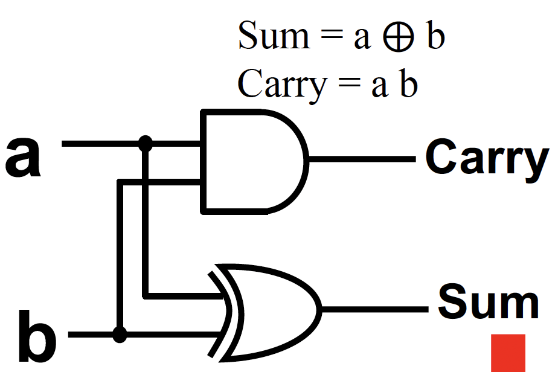
	
	=== "多个数相加"
	
		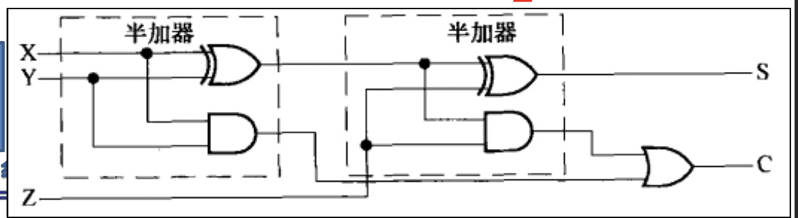
	
	=== "进位情况"
	
		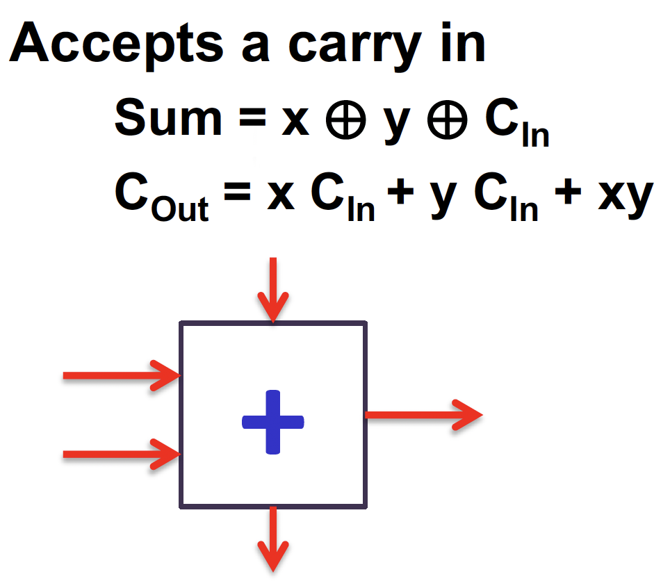
	
	=== "全加器"
	
		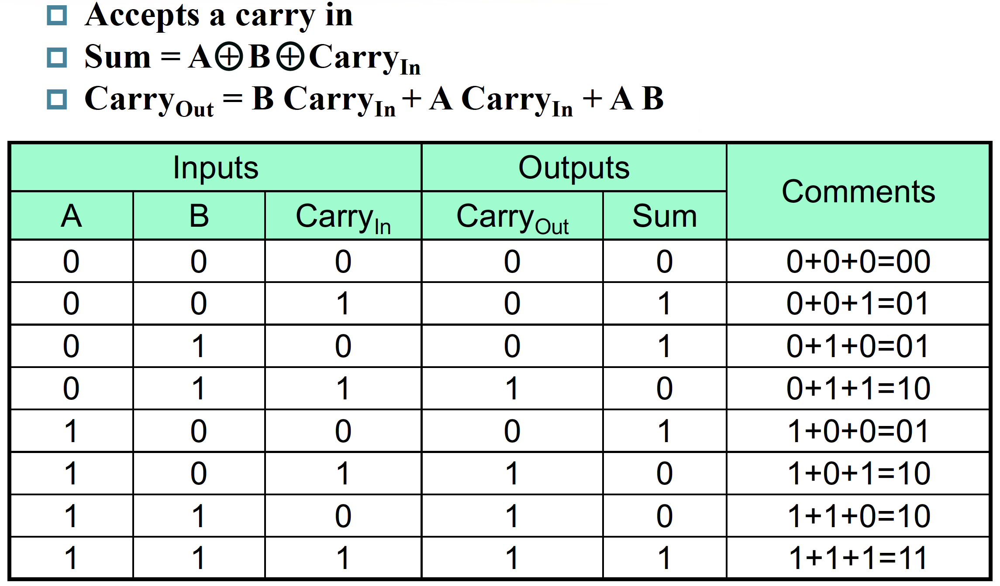
	
		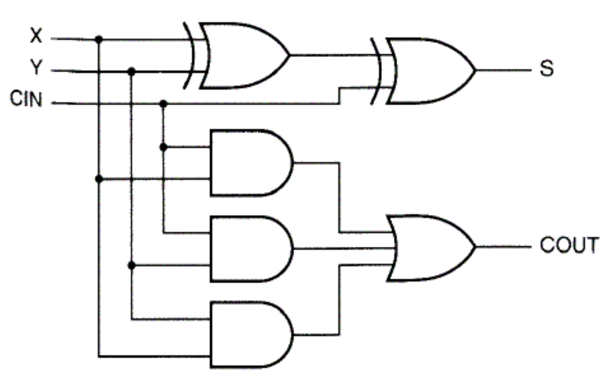

		- n 位加法，需要 n 个全加器
		
		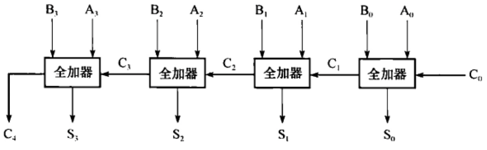
	
	=== "添加与、或运算"

		- 结合一个选择器，我们就可以构造一个支持与、或以及加法运算的 1 bit ALU：
		
		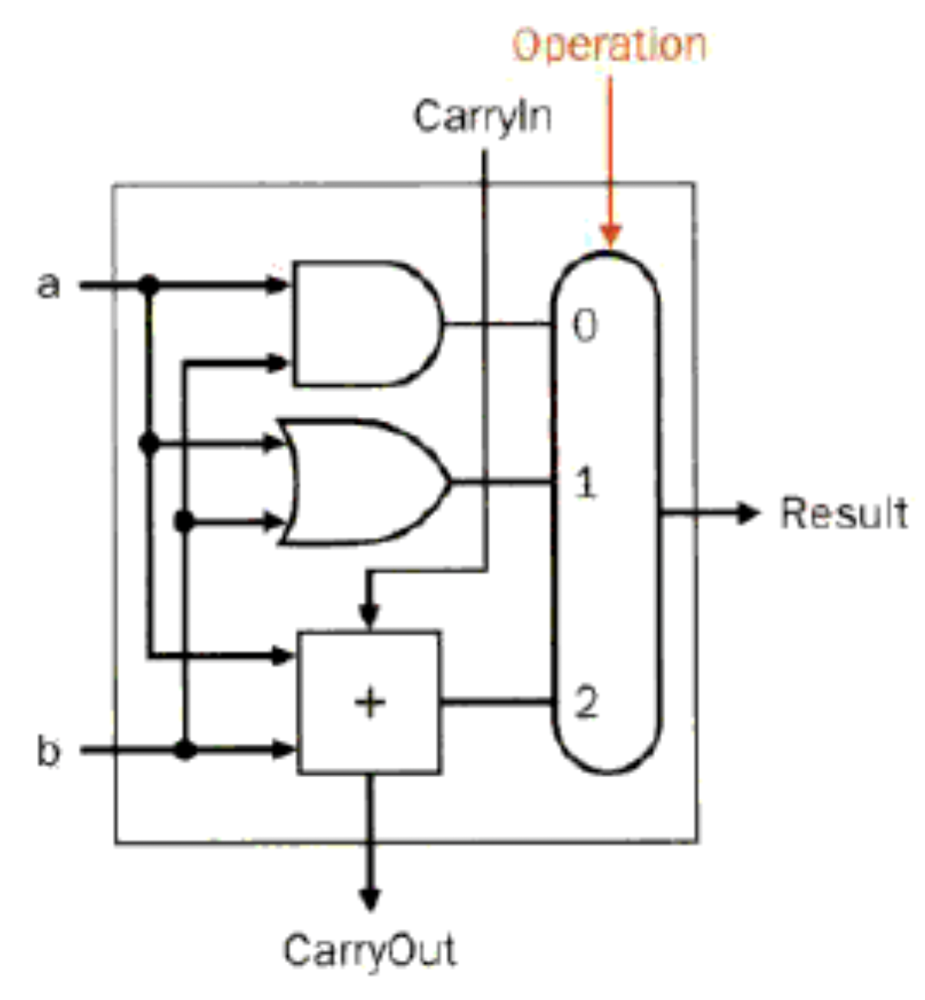
	
	=== "添加减法运算"
	
		- 结合之前所讲，减法即为加补码，对于一位的情况，反转 b 并将 CarryIn 设置为 1（即实现 b 的补码转换，如果有多位就将第一位加法器的 CarryIn 设置为 1）
	
		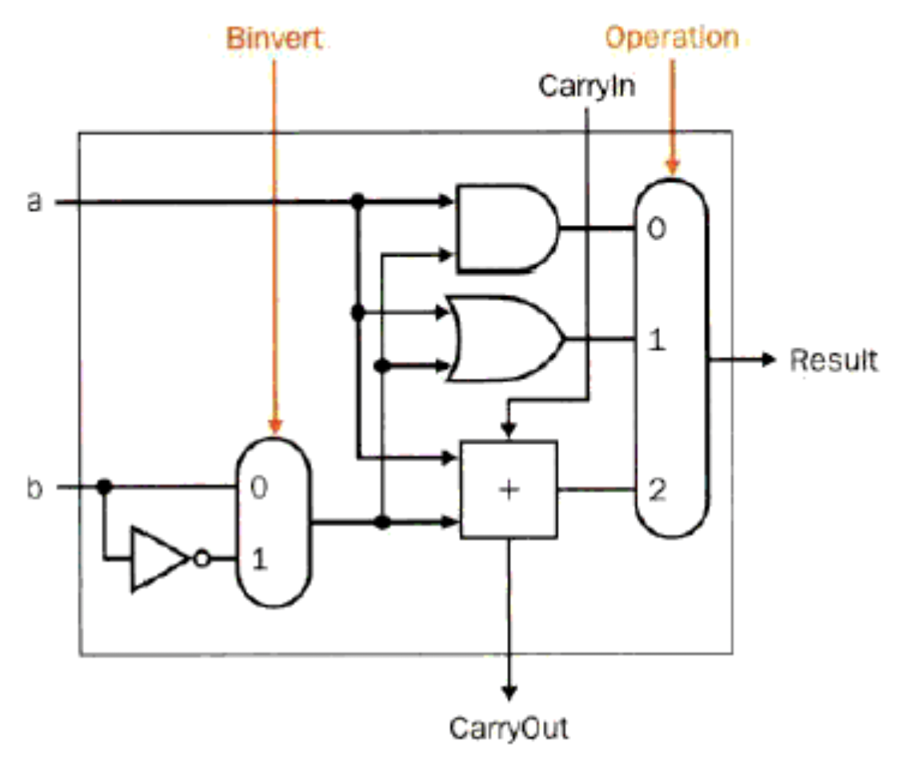
		
	=== "添加比较功能"
	
		为了实现 `slt rd, rs1, rs2` 这个操作（即实现比较操作）（SLT 即 Set Less Than），如果 `rs1 < rs2` ，那么将 `rd` 置为 `1` ，否则置为 `0` 。如何进行这一判断呢？很简单，`rs1 < rs2` 即 `rs1 - rs2 < 0`，也就是说如果 `rs1 - rs2` 结果的最高位是 `1` ，那么就说明 `rs1 < rs2` 。
		
		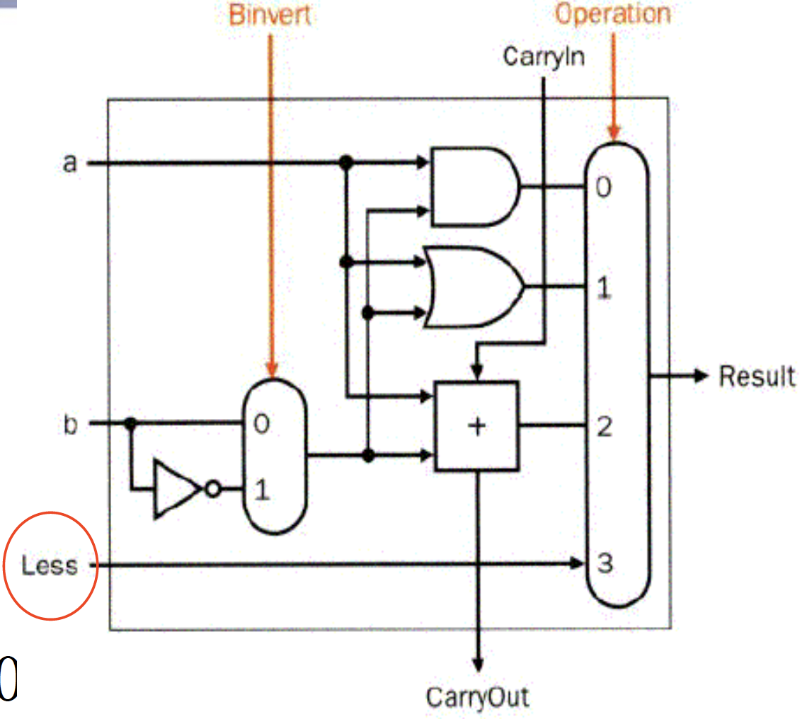
	
	=== "添加检测溢出功能"
	
		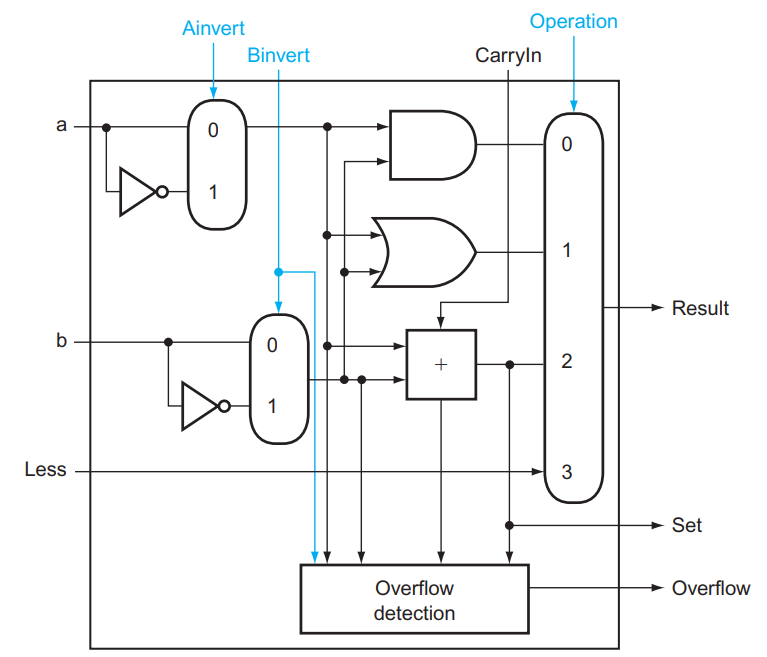
	
		注：图中的 Overflow Detection 被复杂化了，实际上可以通过 `CarryIn` 和 `CarryOut` 的异或完成

最终封装模块，可以得到完整的 32 位的 ALU 模块：

这里需要特别说明的是，对于 ALU31 这个 Set 线接到 ALU0 的 Less 而其余所有 ALU（包括 ALU31）的 Less 都置为 0 的原因在于 `slt` 这个操作的结果只有 0 或者 1，但是实际上我们通过减法运算的最高位是 0 还是 1 才能看出来，所以我们只能将其引到 ALU0，这样才能使得最终 ALU0~ALU31 呈现的 Less 结果是 0/1（否则留在 ALU31 结果就变成 $2^{31}/0$ 了） 

如果做减法或者 `slt` 的话，需要将 `Binvert` 和 ALU0 的 `CarryIn` 设成 `1` ，如果是加法的话这两个信号都是 `0` ；其他运算用不到这两个信号。因此这两个信号始终取值相等，我们可以将这两个信号合并为一个，称之为 `Bnegate` 。

对于 `beq` 和 `bne` 这样的指令，也需要进行减法运算判断是否为零，因此我们还可以添加一个检测 0 的模块，添加进 ALU 模块当中：

对于这样的一个 ALU，我们需要 4 bits 的 control lines，分别是 `Ainvert` , `Bnegate` 和 `Operation` (2 bits)。ALU 的符号和 control lines 的含义如下：

***
### Fast Adders

上面的 64 位加法的实现方式是通过 1 位加法器串联实现的，这种方式势必需要等待前一个加法器算出结果后才能算后一个的。这种多位加法器的实现称为行波加法器 **Ripple Carry Adder, RCA**。显然，这种实现方式比较慢。
***
#### Carry Look-ahead Adder, CLA

课本指出，RCA 缓慢的重要原因是后一个 adder 需要等前一个 adder 的 carry 结果；但我们不妨讨论出现 carry 的可能。第一种可能是，如果 a 和 b 都是 1，那么一定会 **生成** 一个 carry；另一种可能是，如果 a 和 b 中有且仅有一个是 1，那么如果传入的 carry 是 1，则这里也会 carry，即 carry 被 **传播** 了。

也就是说，$c_{out}=a⋅b+(a+b)⋅c_{in}$。我们记 **generate** $g=a⋅b$，**propagate** $p=a+b$，则有 $c_{out}=g+p⋅c_{in}$。所以，我们可以这样构造一个全加器：

所以，我们可以推导出如下关系：

$$
\begin{aligned}
c_1 &= g_0+(p_0·c_0)\\
c_2 &= g_1+(p_1·g_0)+(p_1·p_0·c_0)\\
c_3 &= g_2+(p_2·g_1)+(p_2·p_1·g_0)+(p_2·p_1·p_0·c_0)\\
c_4 &= g_3+(p_3·g_2)+(p_3·p_2·g_1)+(p_3·p_2·p_1·g_0)+(p_3·p_2·p_1·p_0·c_0)
\end{aligned}
$$

利用这个关系，我们可以构造这样一个四位加法器：

其实 CLA 的本质即为将可能的进位提前算出来，不需要等待前一位算出结果后再进位（这也是 Look-ahead 的来源），实现每位的加法器由串行转为并行，从而提高时间效率。

上面的 PFA, Partial Fully Adder，就是前面我们构造的新全加器的一部分。可以看到，通过这样的方式，我们可以加速加法的运算；但是注意到越到高位，门的 fan-in 就越大，因此不能一直增加的。所以对于更多位数的加法器，我们将上面这样构成的 4-bit CLA 再通过类似的方式串起来！

#### Carry Skip Adder

老师没讲，应该不考（x）
***
#### Carry Select Adder, CSA

老师还是没讲，应该还是不考（x）
***
## Multiplication

二进制乘法与十进制相同，都可以用竖式解决，我们需要看的是硬件方面如何实现。
***
### Multiplier V1

换句话来说，所谓的乘法实际上是根据 Multiplier（乘数） 的 0/1 来选择是否要将 Multiplicand（被乘数） 的对应位移结果加到 Product（乘积） 上。

64 bits 乘法器的硬件实现大致如下：

其流程如下：

1. 判断 Multiplier 寄存器的最低位是否是 1：
2. 如果是，则将 Multiplicand 寄存器的值加到 Product 寄存器里；
3. 如果否，进入下一步；
4. 将 Multiplier 寄存器的值右移一位（这是为了不断拿出每一位，相当于在枚举 Multiplier 的每一位），将 Multiplicand 寄存器的值左移一位（对应于和 Multiplier 的第几位乘得到的位移，类似在做竖式乘法）；
5. 判断是否做满 64 次，决定是否终止；
***
### Multiplier V2

可以发现，V1 中做了大量的 128 位加法，但是实际上被加过去的 Multiplicand 有效内容只有 64 位。V2 正是解决了这个问题。

- 和之前课件有所不同的是，这里的乘积变成了 129 位，是为了保留进位

其流程如下：

1. 判断 Multiplier 寄存器的最低位是否是 1：
2. 如果是，则将 Multiplicand 寄存器的值加到 Product 寄存器的左半部分里；
3. 如果否，进入下一步；
4. 将 Multiplier 寄存器的值右移一位，将 Product 寄存器的值右移一位；
5. 判断是否做满 64 次，决定是否终止；

它将 Multiplicand 寄存器换为了 64 位，而将位移操作转移到了 Product 寄存器中进行。这里最重要的一点就是，64 位加法只影响 Product 寄存器左侧的 64 位，而之后的右移操作则是 128 位。这样，虽然最低位的结果一开始会被放在 Product 寄存器的第 65 位里，但是在经过 64 次右移之后，它就出现在第一位了。于是，所有的 128 位加法都被 64 位加法替代，实现了加速。
***
### Multiplier V3

我们还发现，我们对 Multiplier 的右移是为了枚举最低位，但是为了实现这个枚举，我们每次都要做 64 位的右移；除此之外，在一开始的几次中，Product 的右半部分大部分没有意义，但是仍然在 128 位的右移中影响效率。仔细一看，我们能发现，我们每右移一次 Multiplier 寄存器，就会右移一次 Product 寄存器，而前者将导致 Multiplier 寄存器中出现一个没意义的 bit，后者将导致 Product 寄存器中消失一个没意义的 bit。

V3 正是抓住了这个点，直接将 Multiplier 存在了 Product 的低 64 位中。当我们从中取出最低位并经过一次判断后，这一位就不重要了，而恰好 Product 需要右移，就将这一位消除，方便我们下一次从最低位拿出下一个比特！

那么这么做的好处在哪里呢？首先，少了一个寄存器，节省了空间；其次，原本需要 Multiplier 寄存器和 Product 寄存器都做右移，现在只需要 Product 寄存器右移即可，减少了一个 64 位右移操作。

其流程如下：

1. 判断 Product 寄存器的最低位是否是 1：
2. 如果是，则将 Multiplicand 寄存器的值加到 Product 寄存器的左半部分里；
3. 如果否，进入下一步；
4. 将 Product 寄存器的值右移一位；
5. 判断是否做满 64 次，决定是否终止；
***
### Signed Multiplication

有符号数乘法主要是转化为无符号数乘法来做。首先存储两个数的符号，然后将它们转化为无符号数。接下来对两个无符号数做无符号乘法，最后根据之前存储的符号决定结果的符号并转化为有符号数。
***
#### Booth's Algorithm

Booth's Algorithm 是一个优化乘法的算法。

Booth's Algorithm 的主要思想在于，减少乘数中“`1`”的数量。具体来说，在我们原先的乘法策略中，每当乘数中有一位 `1` 时，都会需要一个加法（将位移后的被乘数累加到结果中）。但是，如果乘数中有较长的一串 `1` 时，我们可以将它转化为一个大数字减一个小数，如：`00111100 = 01000000 - 00000100`，此时 4 个 `1` 变为 2 个 `1`，我们就可以减少做加法的次数。

在实际执行过程中，Booth's Algorithm 主要遵循两位比特的模式进行操作。

>上面这张图实际上的表示是挪用了 V3 的乘法器。product 一列代表的是 product 寄存器，左一半一开始置 0，右一半一开始存放的是乘数，而上面提到的将被乘数加减累计到结果中的操作，也是对于左半部分来说的（**换句话来说就是用 V3 做 Booth's**）。需要提醒的是，在 Booth's Algorithm 中，两位识别是从第一位开始的，此时第一位作为两位中的高位，低位为 0，而后在下一轮中第一位作为低位，第二位作为高位，以此类推。

Booth's Algorithm 也能应用于负数。

仔细想想就会发现其实很合理，对于正数，其最高位一定是 `0`，因此不管怎么样它最终都会匹配到一个 `01` 的模式，来给一个 `1111..` 收尾。但是负数不然，负数的最高位是 `1`，这也意味着它最终不会执行所谓的 `01` 对应的加法操作来给 `111...` 收尾。
***
### Faster Multiplication

另一种提升乘法速度的方法是提升加法的速度。用多个 ALU 分层地进行加法运算。对于 64 位的乘法而言，第 1 层用到 32 个 ALU，每个 ALU 计算相邻 2 位的乘数分别与被乘数的乘积之和。这样得到的 32 个和在第二层的 16 个 ALU 中会被再一次汇总，如此下去，最终得到一个总的和。这样原本需要 64 次的加法时间，就缩短到 $\log⁡_{2}64=6$ 次，速度得到明显的提升。这种方法体现了**并行**运算的思想。

***
### RISC-V Multiplication

- `mul`：低 64 位乘法
	- 给出乘积的低 64 位
- `mulh`：高 64 位乘法
	- 给出乘积的高 64 位（假设所有运算数是有符号数）
- `mulhu`：无符号高 64 位乘法
	- 给出乘积的高 64 位（假设所有运算数是无符号数）
- `mulhsu`：有符号与无符号高 64 位乘法
	- 给出乘积的高 64 位（假设一个运算数是无符号数一个运算数是有符号数）
- 我们可以用 `mulh` 的结果来检查有没有 64 位的溢出
***
## Division

二进制除法与十进制相同，都可以用竖式解决。
***
### Division V1

其流程如下：

1. 用 Remainder 寄存器的值减去 Divisor 寄存器的值，并将结果放在 Remainder 寄存器
2. 检查 Remainder 寄存器内的值
    - 如果其值 $\geq 0$（看符号位的数字），将 Quotient 寄存器里的值左移一位，并将最右端的位设成 1（即竖式除法商多添一个 1）
    - 如果其值 $<0$，将 Divisor 寄存器的值加到 Remainder 寄存器的值来恢复 Remainder 寄存器原来的值；然后将 Quotient 寄存器里的值左移一位，并将最右端的位设成 0（即竖式除法商多添一个 0）
3. 将 Divisor 寄存器的值右移一位
4. 判断是否做满 64 次，决定是否终止；

***
### Division V2

类似乘法 V1-V3 的改进方法，除法也能共用寄存器， 将 Remainder 和 Quotient 合并在同一个 129 位寄存器当中，下面为改进后的逻辑电路图：

流程如下：

1. 将 Remainder 寄存器左移一位；
2. 将 Remainder 寄存器左半部分的值减去 Divisor 寄存器的值，并将结果放在 Remainder 寄存器的左半部分；
3. 判断 Remainder 的值（即根据符号位判断刚刚的减法运算是否小于 0）
	- 如果其值 $\geq 0$ ，那么将 Remainder 寄存器左移一位，并将最右边一位置为 1（即竖式除法商多添一个 1）
	- 如果其值 $<0$ ，那么将 Divisor 寄存器的值加到 Remainder 左半部分寄存器的值来恢复 Remainder 寄存器原来的值，将 Remainder 寄存器左移一位，并将最右边一位置为 0（即竖式除法商多添一个 0）；
4. 判断是否做满 64 次，决定是否终止；
5. 终止之前将 Remainder 寄存器的左半部分右移一位。

***
### Signed Division

和带符号乘法一样，带符号除法也是先将符号位提取出来，然后做无符号数除法，最后根据两个符号位决定商的符号位。

但有所不同的是，余数的值有所不同，它遵循以下规则：

- 余数的符号位和被除数的符号位相同
- 余数的绝对值不超过除数的绝对值

***
### Faster Division

我们不能像乘法运算那样，通过 ALU 的并行计算来提升除法速度，因为中间过程会用到很多减法运算，余数寄存器上的符号位是随时变化的，依赖于运算的顺序，所以只能在最后确定符号位，不能提前计算出来。

改进措施：[SRT Division](https://en.wikipedia.org/wiki/Division_algorithm#SRT_division)，在每一趟循环中尝试预测多个可能的商
***
### RISC-V Division

- `div,rem`：有符号求商，求余数
- `divu,remu`：无符号求商，求余数

值得注意的是，RISC-V 除法不会检测溢出和除 0 情况，只会按照定义给出结果，会比没有错误的除法更快。
***
## Floating Point Numbers

> 大部分处理器可能本身并不支持浮点运算，只不过在软件层面可以将浮点运算转换为整数运算。

### IEEE 754 Standard

我们将小数点左边只有 1 位数字的表示数的方法称为**科学记数法, scientific notation**，而如果小数点左边的数字不是 0，我们称这个数的表示是一个**规格化数, normalized number**。科学记数法能用来表示十进制数，当然也能用来表示二进制数。

IEEE 754 规定了一种浮点数标准：我们将浮点数表示为 $(−1)^S×F×2^E$  的形式，这里的 $F×2^E$ 是一个规格化数，而 $(−1)^S$ 用来表示符号位：$S$ 为 $0$ 说明该浮点数为正数，为 $1$ 则为负数；$F$ 和 $E$ 也用若干 bits 表示，分别表示尾数和指数，我们稍后讨论。也就是说，我们将其表示为 $1.\text{xxxxx}_2×2^{\text{yyyy}}$ 的形式。这意味着我们没法直接通过这种表达形式表示 $0$（为什么小数点左边是 $1$ 呢？因为二进制只有 $0$ 和 $1$，而规格化要求小数点左边不能为 $0$）。我们通过科学记数法调整了小数点的位置使其满足规格化的要求，因此我们称这种数的表示方法为**浮点, floating point**。

小数点的英文是 decimal point，但是我们这种表示方法不再是 decimal 的了，因此我们起个新名字：**二进制小数点, binary point**。

IEEE 754 规定了两种精度的浮点数格式，分别是 single precision 和 double precision（分别对应 C 语言中的 `float` 和 `double`），RISC-V 这两种都支持：

可以看到，fraction 的位数越多，浮点数的精度就越高；而 exponent 的位数越多，浮点数能保存的范围就越大。

那么对于 $(−1)^S×F×2^E$，$S$ 的二进制表示方法是显然的，仅需要一个 bit 就好了。那么 $F$ 和 $E$ 怎么表示呢？如我们之前所说，$F$ 就是 $1.\text{xxxxx}_2$ 的形式，这个 $1$ 是固定的，因此 $F$ 只需要保存 $.\text{xxxxx}$ 的部分就可以了（但是请注意，它的权重从左到右分别是 $2^{−1},2^{−2},...$）那么 $E$ 怎么办呢？注意到这个指数在实际使用中可能是正整数、负整数或 0，因此我们使用一个偏移，使得保存的是一个无符号整数，对单精度浮点数偏移 $127$，双精度浮点数偏移 $1023$（刚好是表示范围的一半！），也就是说我们保存的 `exponent` 其实是 $E+bias$ 的二进制。也就是说，对于这样的一个表示，其值是：

$$
(−1)^S⋅(1+\text{fraction})⋅2^{\text{exponent−bias}}
$$

对于 $0$ ，IEEE 754 有特别规定，用特殊的值保存它们：

在上表中：

- 第 1 条表示 0；
- 第 2 条表示非规格化数，这种数主要是为了用来表示一些很小的数，它的取值为 $(−1)^S⋅(0+\text{fraction})⋅2^{−\text{bias}}$；但是并非所有机器都支持这种表示，有的机器会直接抛出一个 exception。我们不考虑非规格数的存在；
- 第 3 条表示正常的浮点数；
- 第 4 条表示无穷大或者无穷小，出现在 exponent overflow 或者浮点数运算中非 0 数除以 0 的情况；
- 第 5 条表示非数，出现在 0/0, inf / inf, inf - inf, inf * 0 的情况

（如果数字过大不能表示，即 overflow，则结果置为 inf；如果数字过小不能表示，即 underflow，则结果置为 0。）

这两种表示法的范围和精度分别是多少呢？

- 范围
	- 能表示值的 **绝对值** 的范围是 $1.0_2×2^{1−\text{bias}}∼1.11…11_2×2^{11…11_2−1−\text{bias}}$，即 $1×2^{1−\text{bias}}∼(2−2^{-\text{Fra}})\times 2^{(2^{\text{Exp}}−1)−1−\text{bias}}$，其中 `Fra` 和 `Exp` 分别表示 fraction 和 exponent 的位数；
    - 单精度浮点数：$±1×2^{−126}∼±(2−2^{−23})×2^{127}\approx ±1.2×10^{−38}∼±3.4×10^{+38}$
    - 双精度浮点数：$±1×2^{−1022}∼±(2−2^{−52})×2^{1023}\approx ±2.2×10^{−308}∼±1.8×10^{+308}$

- 精度
    - $2^{-Fra}$
    - 单精度浮点数：$2^{−23}$（约为 $23\times\log_{10}2\approx 23\times 0.3\approx 6$ 位十进制小数位精度）
    - 双精度浮点数：$2^{−52}$（约为 $52\times\log_{10}2\approx 52\times 0.3\approx 16$ 位十进制小数位精度）

> 有时候题目里会出不同的浮点数表示法，让你比较精度，此时一般指的是，fraction + exponent 总位数相同的情况下，fraction 更多的一般更精确，也就是说这个精度更倾向于“能表示更多的小数位”。
***
### Floating-Point Addition

以 $1.000_2×2^{−1}−1.110_2×2^{−2}$ 为例， 浮点数的加减法分为以下几步：

1. Alignment: 指数对齐，**将小指数对齐到大指数**：$−1.110_2×2^{−2}=−0.111×2^{−1}$

    - 为什么是小对大？首先，小对大的过程是在小指数的 fraction 前补 `0`，可能导致末尾数据丢失；大对小的过程是在大指数的 fraction 后补 `0`，可能导致前面的数据丢失。在计算过程中，我们保持的精确位数是有限的，而在迫不得已丢去精度的过程中，让小的那个数的末几位被丢掉的代价比大的前几位丢失要小太多了；

2. Addiction Fraction 部分相加减：$1.000−0.111=0.001$
3. Normalization: 将结果规格化：$0.001×2^{−1}=1.000×2^{−4}$；同时需要检查是否出现 overflow 或者 underflow，如果出现则触发 Exception
4. Rounding: 将 Fraction 部分舍入到正确位数；舍入结果可能还需要规格化，此时回到步骤 3 继续运行

***
### Floating-Point Multiplication

分别处理符号位、exponent 和 fraction：

- 将两个 Exponent 相加并 **减去一个 bias**，因为 bias 加了 2 次
- 将两个 (1 + Fraction) 相乘，并将其规格化；此时同样要考虑 overflow 和 underflow；然后舍入，如果还需要规格化则重复执行
- 根据两个操作数的符号决定结果的符号

***
### Accurate Arithmetic

IEEE 754 标准提供了四种舍入模式 (rounding mode)：

- 向上取整
- 向下取整
- 截断取整
- round to nearest even

Round to nearest even 只对 0.5 有效，别的都和四舍五入一样。

其规定了浮点数额外添加 2 位，分别称为 **guard** 和 **round**，这两位数字保留了浮点数计算的中间过程，其主要目的是让计算结果的舍入更加的精确。

!!! Example 

	下面左图使用了 guard 和 round，右图没有使用。
	
	
	
	由于规定有效位数为 3 位，因此前者的最终计算结果为 2.37，从而可以看出 guard 和 round 确实能够提升浮点数计算的精度。

事实上加法只需要用到 guard，但是对于乘法，如果存在前导 0，需要将结果左移，这时候 round bit 就成了有效位，能避免精度的损失。

另外还有一个位叫 sticky bit，其定义是：只要 round 右边出现过非零位，就将 sticky 置 1，这一点可以用在加法的右移中，可以记住是否有 1 被移出，从而能够实现 "round to nearest even"。

RISC-V 浮点数相关汇编操作数和指令如下：

## Fallacies and Pitfalls

- 将一个数右移就相当于对这个数整除以 2
    - 这个结论对于无符号数是成立的，但是对于带符号数，如果整体向右移一位，符号位也会跟着右移，那么最高位就会变成 0，导致负数变成了正数
    - 解决方法：右移符号位 1 的时候，符号位左边的数均为 1，这样保证结果仍然是一个负数，但是这样实现的整除精度不是很高
-  浮点数没有结合律 (associative)，即对于浮点数 $a,b,c,c+(a+b)\not=(c+a)+b$

!!! Example 

	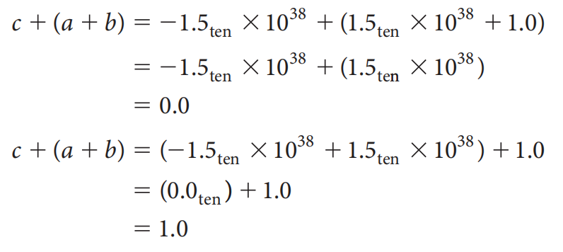
	
	上图第二行等号左边括号打错了（）
	
	可以看到，使用结合律后，计算结果就完全不一样了

- 适用于整数的并行计算也同样适用于浮点数
	- 并行计算的实现依赖于结合律，因此浮点数无法进行并行计算