---
hide:
  #- navigation # 显示右
  #- toc #显示左
  - footer
  - feedback
comments: true
---  
# Chapter 4 : The Processors

## Introduction

- CPU 性能因素
	- 指令数：由 ISA 和编译器决定
	- CPI 和 Cycle Time：由 CPU 硬件决定
***
### Instruction Execution Overview

- 对于每一个指令，从内存中取指和译码指令是两个最重要的事情
	- 取指：将带有编码的 PC（程序计数器）发给内存，从而得到内存中的指令
	- 译码：根据指令的特定字段，读取一到二个寄存器内的数据（除了`ld`指令只需一个寄存器外，其他大多数指令需要两个寄存器）
- 最简单的 CPU 需要实现如下指令：
	- 内存引用指令：`ld, sd...`
	- 算术逻辑指令：`add, sub, and, or...`
	- 条件分支指令：`beq...`
- 接下来根据指令集来进行如下操作：
	- 执行：使用 ALU 来进行数学逻辑运算、存取数据（地址运算，加法）、条件分支（判断条件，减法）
	- 写回/访存：访问内存（加载 $\rightarrow$ 读取数据，存储 $\rightarrow$ 写下数据）、将 ALU 或内存中的数据写入寄存器中、根据比较结果改变下一条需要执行的指令的地址（可能是 PC+4，也可能是指定的指令地址）

> 注：绝大多数指令只需四步即可完成，只有加载相关的指令需要五步。
***
### An Overview of Implementation


使用多路选择器的原因（顺序为从上到下）：

- 对于第一个多路选择器，我们需要选择下一条需要执行的指令到底是按照顺序的下一个指令（PC+4）还是因为跳转的某个指定的指令
- 对于第二个多路选择器，我们需要选择进行运算的数据是来自于 ALU 运算的结果还是内存中的数据
- 对于第三个多路选择器，对于不同类型的指令，ALU 需要选择运算数是来自寄存器（例如 R 型指令）还是立即数（例如 I 型指令）

那么对于多路选择器，我们也需要一个控制单元来决定选择哪个来源，而控制单元是根据输入的指令来作判断的。此外，控制单元还负责功能的控制，比如寄存器和内存的读写、是否进行分支操作等。最后整个大致图如下：


- 其中对于 Branch 只有当 ALU 输出为 0 控制单元为 1 时，表示为跳转地址，下一个要执行的指令即为指定的地址
***
## Logic Design Convention

在计算机当中，信息被编码为二进制，低电位为 0，高电位为 1，一条线一位（bit），多条线的信息就在多线总线（bus）被编码。

对于以上所出现的各类元件，我们可以分类如下：

- 组合元件：ALU，MUX 等，处理数据，输出可视为输入的一个函数
- 状态（时序）元件：内存、寄存器等，保存信息
***
## Building a Datapath

!!! Definition

	Datapath（数据通路）即为 CPU 中处理数据和地址的元件
	
	e.g. 寄存器、ALU、多路选择器、内存...
***
### Instruction Execution in RISC-V

- 取指：根据 PC 所给地址，从存储器中取出指令
	- 从指令内存中获取指令
	- 将 PC 寄存器指向下一条指令
- 译码 & 读取运算数：分析指令字段，读取一个或两个寄存器
	- 指令将会被译码为机器控制指令
	- 从寄存器中读取运算数
- 执行控制：ALU 运算 R 型指令的结果/访存指令的地址/beq 两源操作数是否相等
	- 控制对应 ALU 操作的执行
- 访存：
	- 从内存写/读数据
	- 仅限 `ld/sd` 指令
- 将结果写至寄存器：
	- 如果是 R 型指令，将 ALU 运算结果写到 `rd` 寄存器
	- 如果是 I 型指令，将内存数据写到 `rd` 寄存器
- 改变 PC 计数器

!!! Instructions

	=== "Fetch"
	
		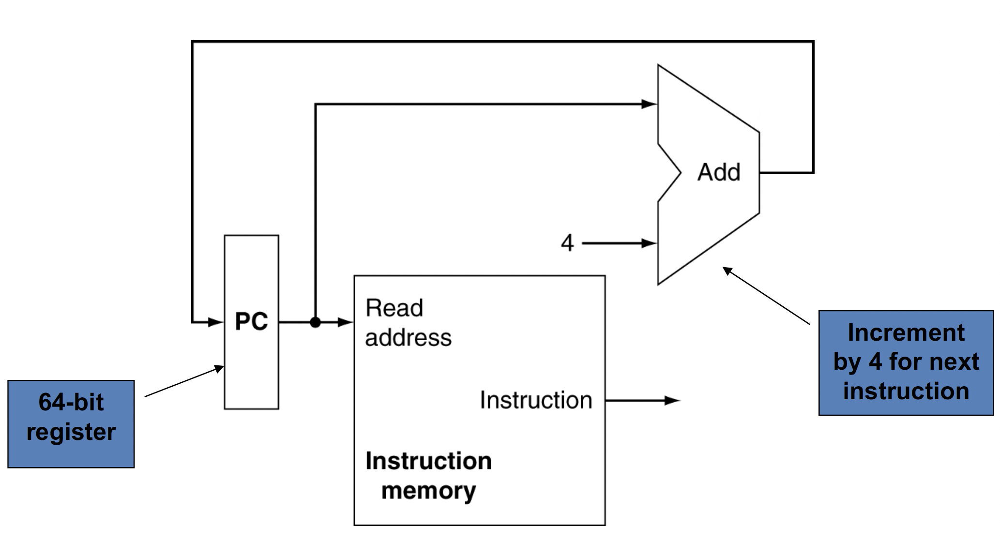
		
		- 内存单元：存储程序的指令，并根据地址提供对应的指令
		- 程序计数器 (Program Counter)：保存当前指令的地址
		- 加法器：PC 执行加 4 操作，使其获得下一条指令的地址
	
	=== "R-Format"
	
		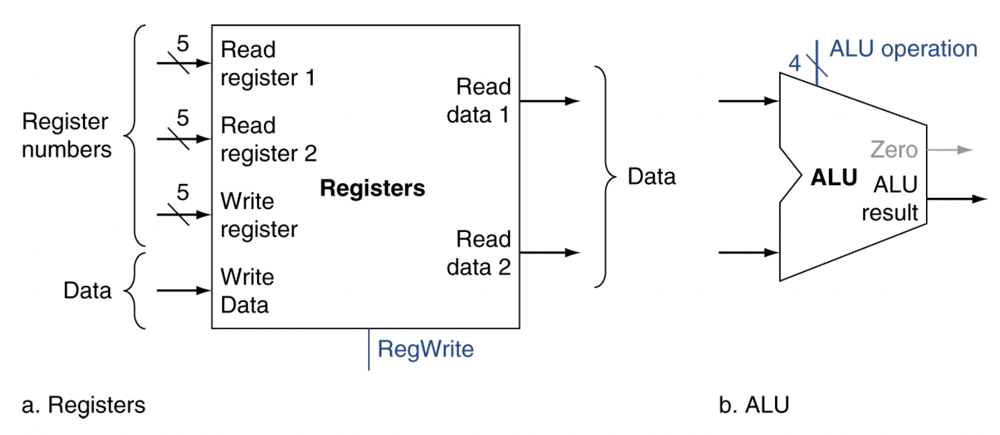
		
		- **寄存器堆**：存储了所有的寄存器，通过指定具体的寄存器编号来控制对应寄存器的读写
			- 寄存器编号为 5 位，因为一共只有 $2^5=32$ 个寄存器
			- R 型指令需要两个可读的（源）寄存器和一个可写的（目标）寄存器
			- 读取数据只需输入寄存器编号即可，而写入数据除了额外输入写入的数据外，还要受控制信号`RegWrite`的控制，只有在`RegWrite = 1`时才可以进行写操作
		- 64 位的 ALU
			- 如果 ALU 结果为 0，输出端`Zero = 1`，否则`Zero = 0`
			- 有 1 个 4 位的 ALU 运算的控制运算操作
	
	=== "Load/Store"
	
		除了 R 型指令需要的寄存器堆和 ALU 两个元件外，存取指令还需要以下两个元件：
		
		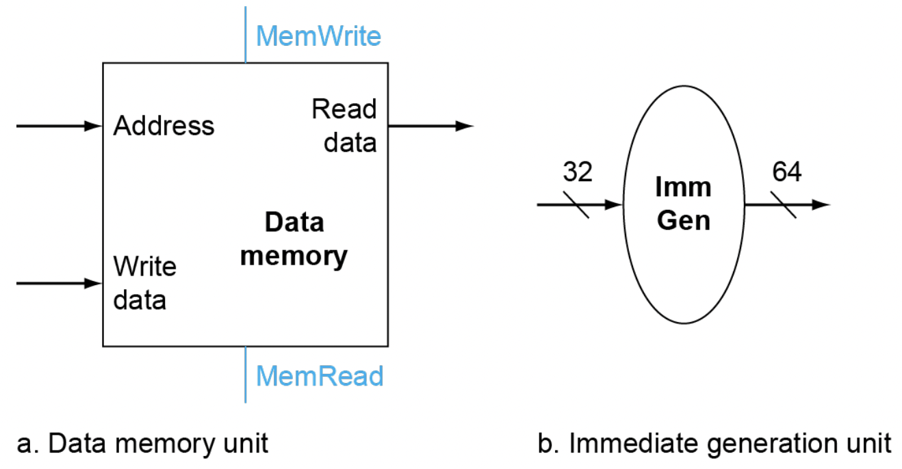
		
		- 数据内存单元
			- 内存同时具备读（`ld`）和写（`sd`）的控制输入
		- 立即数生成单元：从 32 位指令中提取出与立即数相关的位，将这些位按正确的顺序拼接起来，同时对其**符号扩展**至 64 位
	
	=== "Branch"
	
		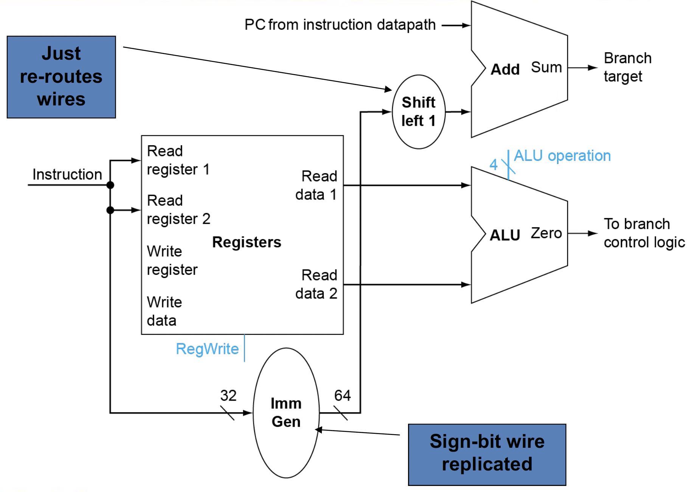
		
		- 用到的元件：寄存器堆（包含两个寄存器，表示被比较的两个数）、立即数生成器（地址偏移量）、两个 ALU（其中一个仅用于加法运算来计算跳转目标地址）
		- 该数据通路需要同时计算分支目标地址并检验寄存器内容
		- 一些细节问题：
			- 跳转地址的基 (base) 即为当前的分支指令的地址
			- 不要忘记：偏移量字段需左移一位！所以实际的偏移量是指定偏移量的两倍，且相邻偏移量相差 2
		- 我们仅用 ALU 的`Zero`输出来获取比较结果
***
### Composing the Elements

接下来我们将前面得到的数据通路元件组装起来。

基本的数据通路一个时钟周期执行一条指令，每个数据通路元件一次只能执行一个函数，因此我们需要将存储指令和存储数据的内存分开看待，由此形成指令存储器和数据存储器。

我们需要使用多路复用器，以便在不同指令中使用不同的数据源。


!!! note "各类指令的数据通路走向"

	=== "R-Type"
	
		- 数据通路示意图：
		
		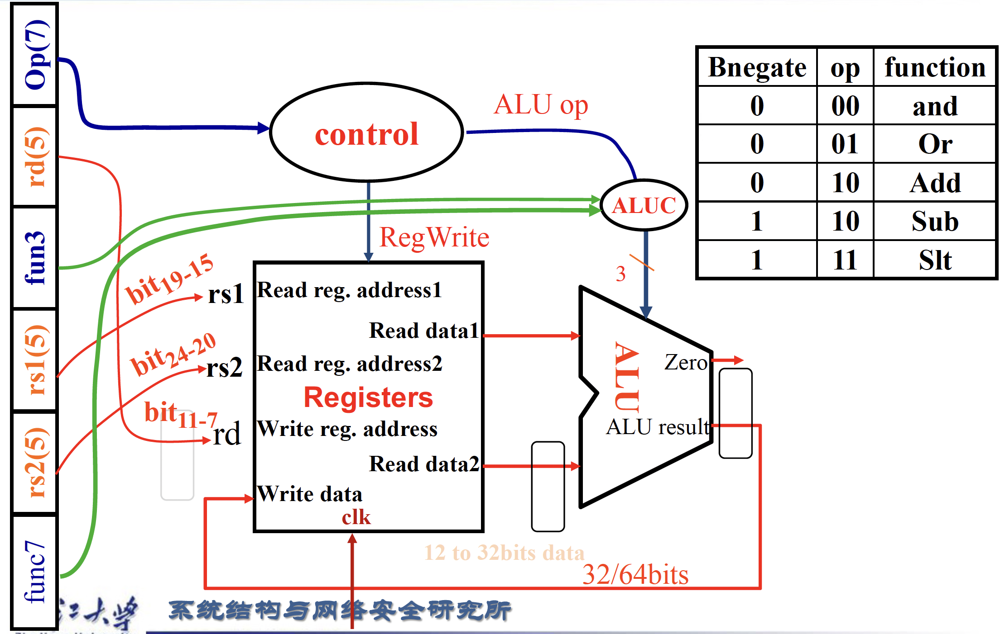
		
		- 走向示意图：
		
		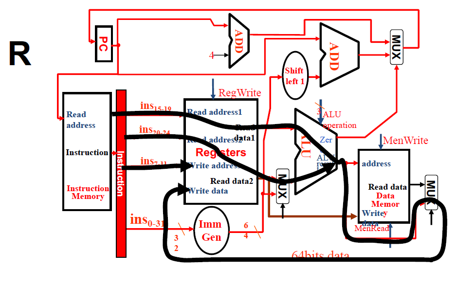
		
		- 大致过程：
			- 根据指令读取 `opcode` 确定指令类型为 R 型，赋值 RegWrite 为 1（即可以改变寄存器存储的值）
			- 根据指令读取 `func3, func7` ，联合 `opcode` 确定 ALU 操作类型
			- 根据指令读取 `rs1, rs2`（操作数寄存器）以及 `rd`（目标结果寄存器）
			- 两个操作数寄存器根据 ALU 操作类型进行运算
			- 得到的 ALU Result 写回目标结果寄存器当中
	
	=== "I-Type(ld)"
	
		- 数据通路示意图（这里 `rs1` 的 `bit 19-15` 指错地方了应该指向寄存器堆的 `rs1`，Memread 和 Memwrite 也打错了）：
		
		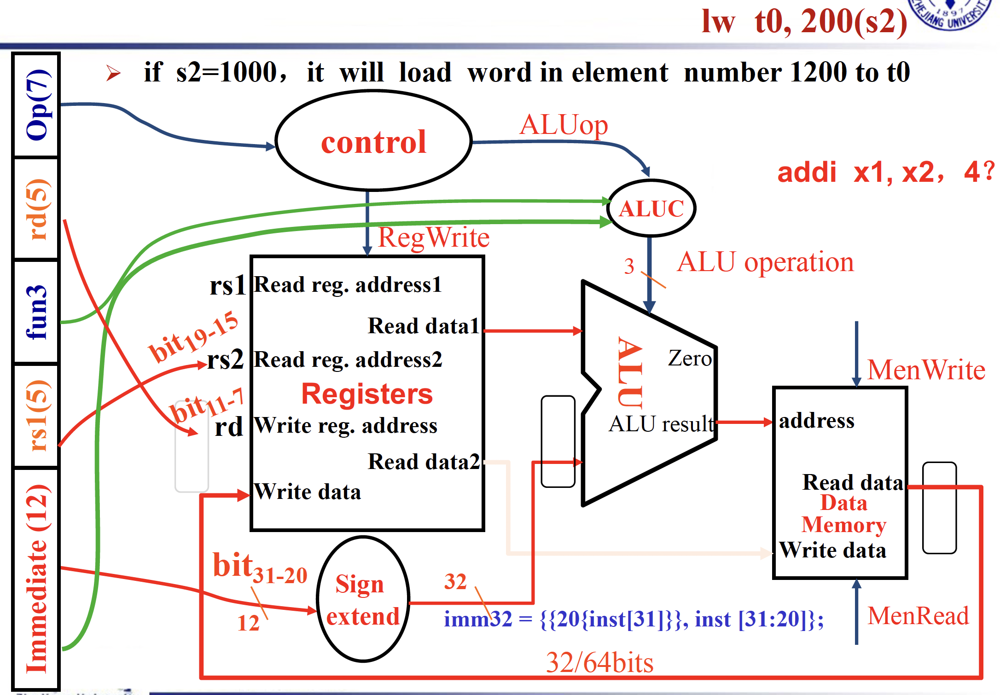
		
		- 走向示意图：
		
		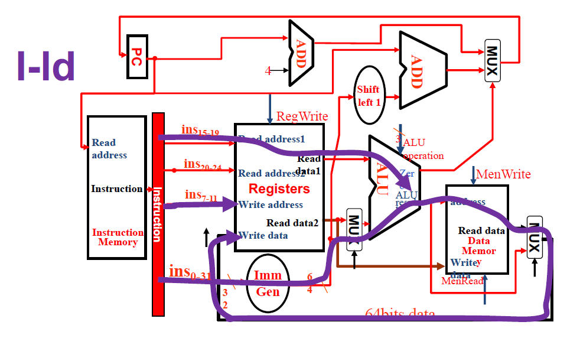
		
		- 大致过程：
			- 根据指令读取 `opcode` 确定指令类型为 I 型，赋值 RegWrite 为 1（即可以改变寄存器存储的值），Memwrite 为 0、Memread 为 1（不需要改变内存的值，只需要读取即可）
			- 根据指令读取 `func3, func7` ，联合 `opcode` 确定 ALU 操作类型
			- 根据指令读取 `rs1`（保存基础地址的寄存器），`rd`（目标寄存器）以及立即数 `immediate`（偏移量）
			- 基础地址和偏移量根据 ALU 操作类型进行运算（在这里是执行加法运算得到真正需要加载数据的地址）
			- 根据得到的 ALU Result，找到需要加载数据的地址，在内存当中读取出数据的值
			- 把读出来的值存回到目标寄存器当中
	
	=== "S-Type"
	
		- 数据通路示意图：
		
		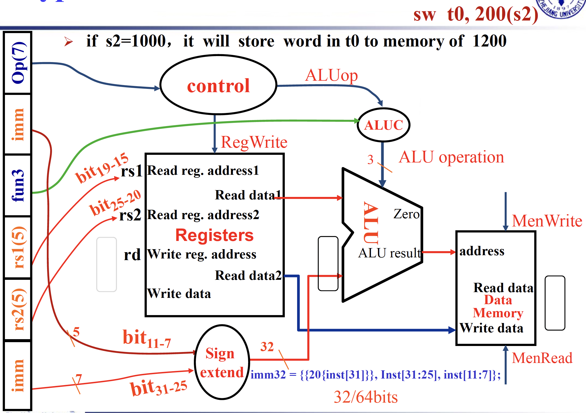
		
		- 走向示意图：
		
		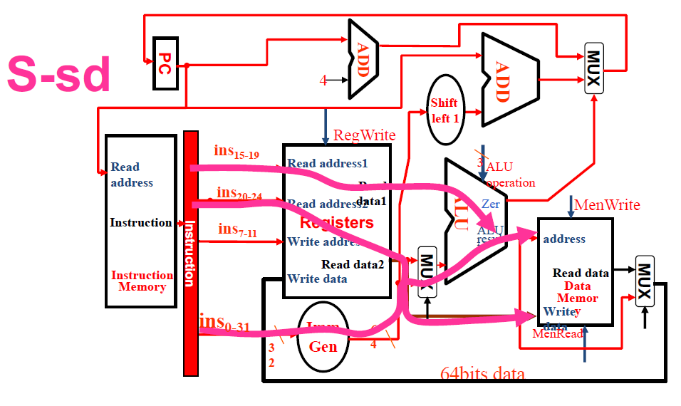
		
		- 大致过程：
			- 根据指令读取 `opcode` 确定指令类型为 S 型，赋值 RegWrite 为 0（不需要改变寄存器存储的值），Memwrite 为 1、Memread 为 0（这里我们需要把值存到内存当中，所以只写不读）
			- 根据指令读取 `func3` ，联合 `opcode` 确定 ALU 操作类型
			- 根据指令读取 `rs1, rs2`（保存基础地址的寄存器和保存要存的数据的寄存器）以及立即数 `immediate`（偏移量）
			- 基础地址和偏移量根据 ALU 操作类型进行运算（在这里是执行加法运算得到真正需要保存数据的地址）
			- 将数据存储到内存当中
	
	=== "SB-Type"
	
		- 数据通路示意图：
		
		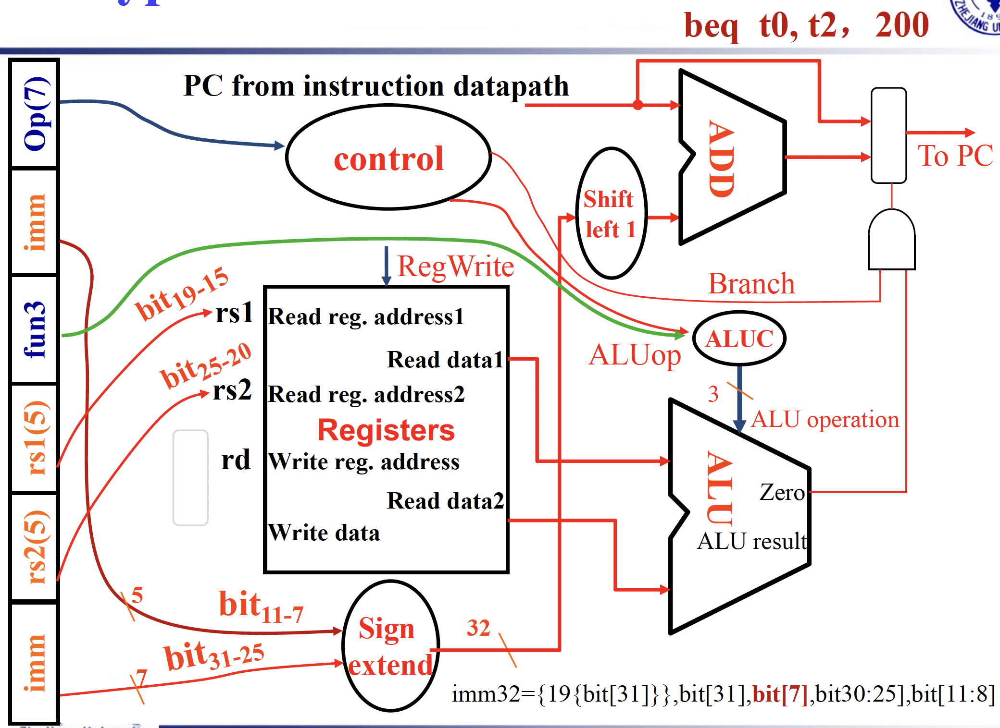
		
		- 走向示意图：
		
		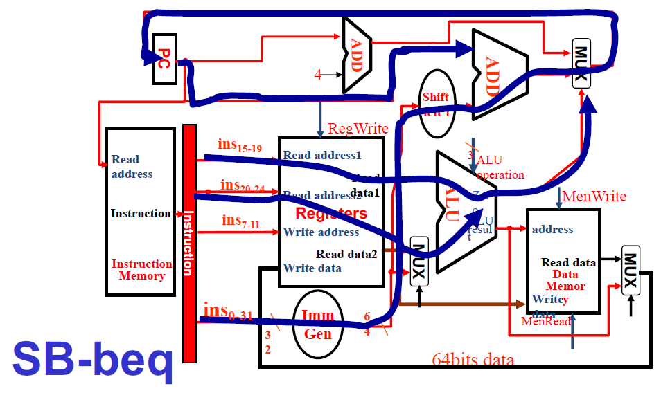
		
		- 大致过程：
			- 根据指令读取 `opcode` 确定指令类型为 SB 型，赋值 RegWrite 为 0（不需要改变寄存器存储的值），Branch 为 1（即激活跳转模块）
			- 根据指令读取 `func3` ，联合 `opcode` 确定 ALU 操作类型
			- 根据指令读取 `rs1, rs2`（需要进行比较的两个寄存器）以及立即数 `immediate`（偏移量）
			- 需要比较的两个寄存器进行 ALU 运算（这里应当为减法判断是否为 0）
			- 从指令数据通路中得到 PC 的值，与立即数相加得到跳转地址
			- 根据 ALU 运算结果是否为 0 决定下一条应当执行哪个指令（PC+4 还是 PC+偏移量），将结果传回给 PC
	
	=== "J-Type"
	
		- 数据通路示意图：
		
		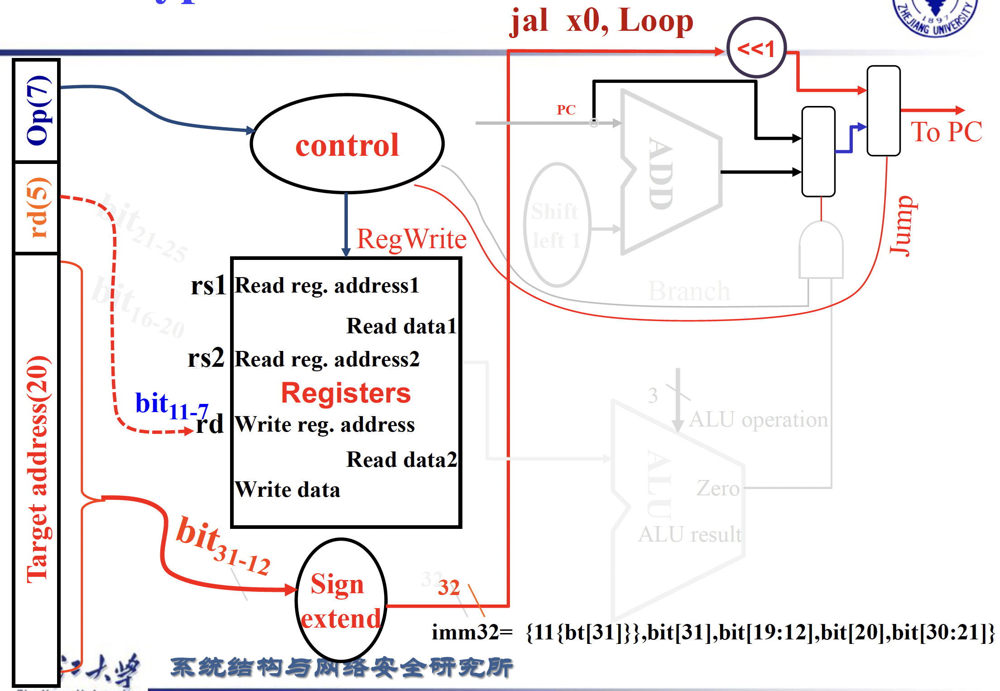
		
		- 走向示意图：
		
		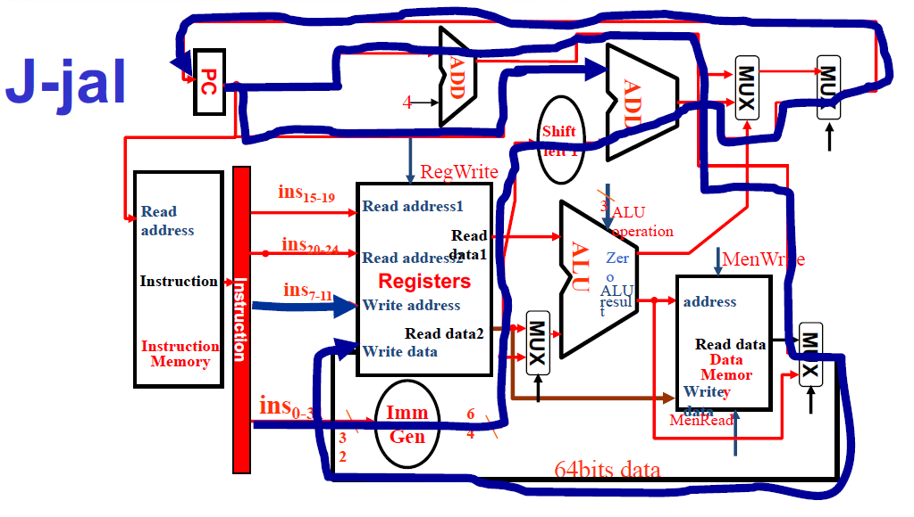
		
		- 大致过程：
			- 根据指令读取 `opcode` 确定指令类型为 J 型，赋值 RegWrite 为 1（因为要保存 `jal` 指令的下一条指令地址给 `ra` 寄存器，方便函数执行完跳回来），Jump 为 1（激活跳转模块）
			- 根据指令读取 `rd`（下一条指令的地址）以及跳转地址偏移量 `target address`
			- 从指令数据通路中得到 PC 的值，与跳转地址偏移量相加得到跳转地址
			- 将跳转地址传回给 PC
			- 将 PC+4 存储到寄存器堆中
***
## A Simple Implementation Scheme

>因为所有的信息（操作类型、数据去向等）都来自 32 位的指令，所以我们需要一个控制器（相当于是中枢）来将 32 位的指令处理成相对应的信号。

### Building Controller

#### ALU Symbol & Control

在所有的 8 个控制信号中，最重要的是 ALU 的控制信号（即上图的 `ALU operation` ），因为不管何种指令都需要用到这个元件，而且不同的指令会利用它达到不同的目的。

ALU 控制信号一共有 4 位：

- 其中 2 位分别来自指令中的 `funct3` 和 `funct7` 字段
- 另外 2 位则来自一个称为 `ALUOp` 的字段，它来自主控制单元 (Main Control Unit)，用于指定具体执行何种指令，不同的值对应不同的类型：
	- `00`：加载 / 存储
	- `01`：`beq` 指令
	- `10`：R 型指令

下表展示了 ALU 控制信号及对应的操作：

| **Opcode** | **ALUOp** |  **Operation**  | **Func7** | **Func3** | **ALU Function** | **ALU Control** |
|:----------:|:---------:|:---------------:|:---------:|:---------:|:----------------:|:---------------:|
|     ld     |    00     |  Load Register  |  XXXXXXX  |    XXX    |     Addition     |      0010       |
|     sd     |    00     | Store Register  |  XXXXXXX  |    XXX    |     Addition     |      0010       |
|    beq     |    01     | Branch On Equal |  XXXXXXX  |    XXX    |   Subtraction    |      0110       |
|   R-Type   |    10     |       And       |  0000000  |    111    |       And        |      0000       |
|   R-Type   |    10     |       Or        |  0000000  |    110    |        Or        |      0001       |
|   R-Type   |    10     |       Add       |  0000000  |    000    |     Addition     |      0010       |
|   R-Type   |    10     |       Sub       |  0100000  |    000    |   Subtraction    |      0110       |
|   R-Type   |    10     |       Slt       |  0000000  |    010    |       Slt        |      0111       |
|   R-Type   |    10     |       Srl       |  0000000  |    101    |       Srl        |      0101       |
|   R-Type   |    10     |       Xor       |  0000000  |    011    |       Xor        |      0011       |

其对应的真值表如下（x 表示 Don't Care 项）：


可以看到，我们并没有用主控制单元来直接控制所有需要控制的元件，比如用 ALU 控制（`ALUOp`）来控制 ALU，再由主控制单元改变 `ALUOp` 的值——这样的设计风格称为**多级控制**（Multiple Levels of Control），它的优势在于：

- 减小主控制单元的规模
- 减小对控制单元的潜在危害（负责某个功能的控制单元坏掉了并不会影响其他的控制单元），这对时钟周期有很大的影响
***
#### Signals For Datapath

接下来，我们还要处理剩余的 7 个控制信号，它们的作用如下：


- `RegWrite`、`MemRead`、`MemWrite`：它们在低电平的时候均无作用，高电平时会允许寄存器 / 内存的读写
- `ALUSrc`：低电平时 ALU 获取第 2 个寄存器的值，高电平时 ALU 获取立即数
- `PCSrc`：低电平时 PC 将会保存下一条连续指令的地址（PC + 4），高电平时 PC 将会保存分支目标地址
- `Jump`：低电平时 PC 将会保存 PC+4 或其他分支目标，高电平时 PC 将会保存跳转目标地址
- `MemtoReg`：低电平时将 ALU 的结果返回给目标寄存器，高电平时将内存中的数据传给目标寄存器

最后，我们将所有的控制信号交给主控制单元管理，一个完整的简易版单周期 CPU 的硬件框图如下所示：


对应的控制信号表（输入为 `Opcode` 的前 7 位）：

| **Input or Output** | **Signal Name** | **R-Format** | **ld** | **sd** | **beq** | **jal** |
|:-------------------:|:---------------:|:------------:|:------:|:------:|:-------:|:-------:|
|        Input        |      I[6]       |      0       |   0    |   0    |    1    |    1    |
|        Input        |      I[5]       |      1       |   0    |   1    |    1    |    1    |
|        Input        |      I[4]       |      1       |   0    |   0    |    0    |    0    |
|        Input        |      I[3]       |      0       |   0    |   0    |    0    |    1    |
|        Input        |      I[2]       |      0       |   0    |   0    |    0    |    1    |
|        Input        |      I[1]       |      1       |   1    |   1    |    1    |    1    |
|        Input        |      I[0]       |      1       |   1    |   1    |    1    |    1    |
|       Output        |     ALUSrc      |      0       |   1    |   1    |    0    |    X    |
|       Output        |    MemtoReg     |      00      |   01   |   X    |    X    |   10    |
|       Output        |    RegWrite     |      1       |   1    |   0    |    0    |    1    |
|       Output        |     MemRead     |      0       |   1    |   0    |    0    |    0    |
|       Output        |    MemWrite     |      0       |   0    |   1    |    0    |    0    |
|       Output        |     Branch      |      0       |   0    |   0    |    1    |    0    |
|       Output        |     ALUOp1      |      1       |   0    |   0    |    0    |    X    |
|       Output        |     ALUOp0      |      0       |   0    |   0    |    1    |    X    |
|       Output        |      Jump       |      0       |   0    |   0    |    0    |    1    |

得到逻辑电路图：


***
### Operation of the Datapath

> 图中的灰色部分表示没有用到的部分

!!! note "Operation of the Datapath"

	=== "R-Type"
	
		- 以 `add x1, x2, x3` 为例：
		
		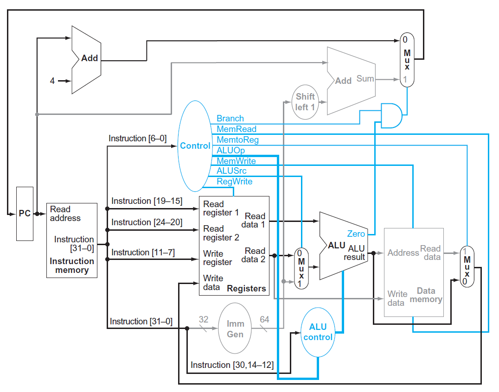
		
		- 执行指令的步骤：
		
			- 从指令内存中获取指令，并递增 PC
			- 从寄存器堆读取寄存器 `x2` 和 `x3`，同时主控制单元设置好对应的控制信号
			- ALU 根据操作码确定运算类型，然后对上步中读取的数据进行计算
			- 将 ALU 的计算结果写入目标寄存器 `x1`
	
	=== "Load"
	
		- 以 `ld x1, offset(x2)` 为例：
		
		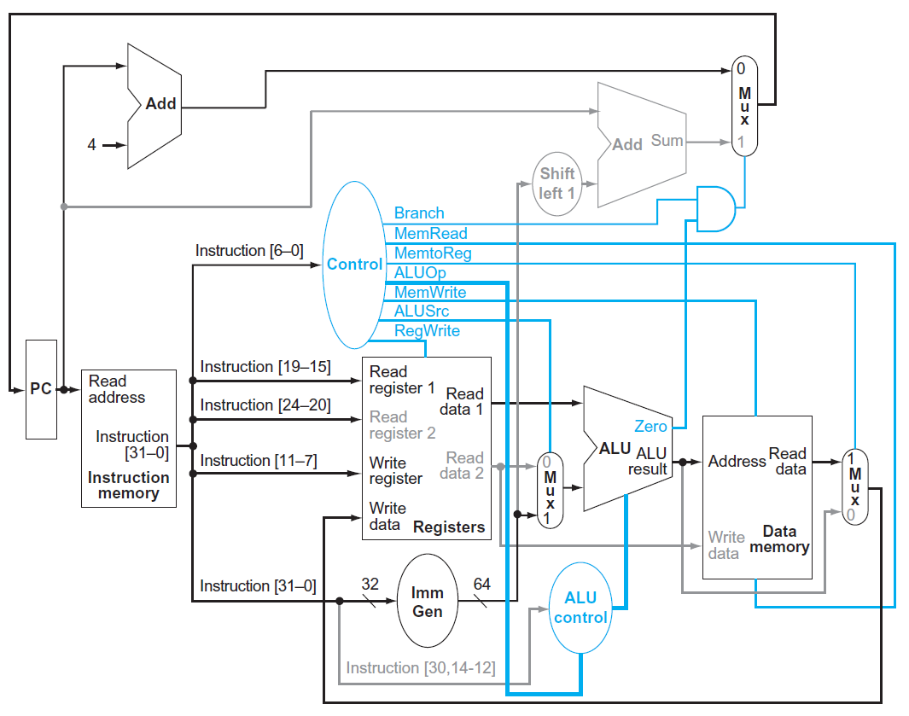
		
		- 执行指令的步骤：
		
			- 从指令内存中获取指令，并递增 PC
			- 从寄存器堆读取寄存器 `x2` 
			- ALU 计算寄存器 `x2` 的数据和符号扩展后的12位立即数之和，该结果作为数据的内存地址
			- 将对应的内存数据写入寄存器堆内（`x1`）
	
	=== "Store"
	
		- 以 `sd x1, offset(x2)` 为例：
		
		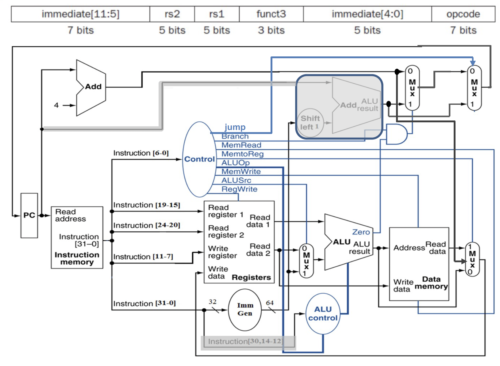
		
		- 执行指令的步骤：
		
			- 从指令内存中获取指令，并递增 PC
			- 从寄存器堆读取寄存器 `x2` 
			- ALU 计算寄存器 `x2` 的数据和符号扩展后的12位立即数之和，该结果作为数据的内存地址
			- 将 `x1` 中的值存入对应的内存数据中
	
	=== "Branch"
	
		- 以 `beq x1, x2, offset` 为例：
		
		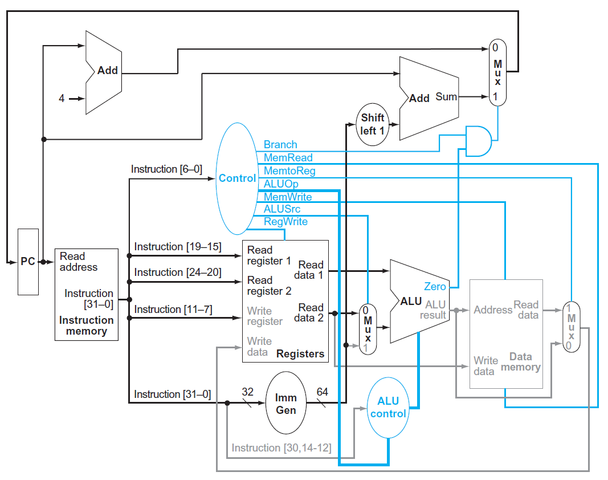
		
		- 执行指令的步骤：
		
			- 从指令内存中获取指令，并递增 PC
			- 从寄存器堆读取寄存器 `x1` 和 `x2`
			- ALU 将读取的两个数据相减；同时将 PC 的值与左移 1 位之后的立即数相加，得到分支目标地址
			- 通过 ALU 的`Zero`信号来决定如何更新 PC
	
	=== "Jump"
	
		- 以 `jal x1, procedure` 为例：
		
		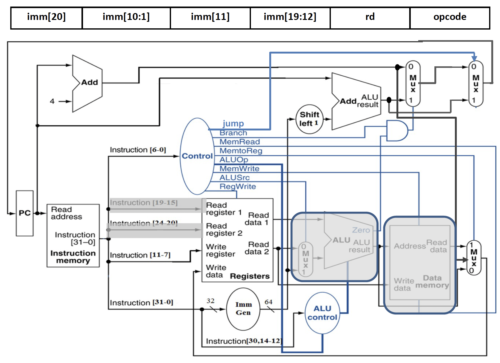
		
		- 执行指令的步骤：
		
			- 从指令内存中获取指令，并递增 PC
			- 将目标地址符号扩展
			- 将地址左移一位
			- 将结果加到 PC 当中，更新 PC

总结来说，不同类型的执行步骤如下表：

| **类型** | 取指                      | 译码              | 执行     | 访存          | 写回           |
| ------ | ----------------------- | --------------- | ------ | ----------- | ------------ |
| R-Type | 根据 PC 提供的地址，从指令存储器中取出指令 | 取 `rs1` 和 `rs2` | 逻辑运算   | /           | 将运算结果写回 `rd` |
| Load   | 根据 PC 提供的地址，从指令存储器中取出指令 | 取 `rs` 和扩展后的立即数 | 计算内存地址 | 读数据存储器，取得数据 | 将访存数据写回寄存器堆  |
| Store  | 根据 PC 提供的地址，从指令存储器中取出指令 | 取 `rs` 和扩展后的立即数 | 计算内存地址 | 写数据存储器      | /            |
| Branch | 根据 PC 提供的地址，从指令存储器中取出指令 | 取 PC 和分支偏移量     | 比较     | 地址写回 PC     | /            |
| Jump   | 根据 PC 提供的地址，从指令存储器中取出指令 | 取 PC 和扩展后的目标地址  | 计算内存地址 | 地址写回 PC     | /            |

可以看到，在单周期实现中：

- 每条指令都在一个时钟周期内完成，$CPI=1$
- 时钟周期取决于最长指令的执行时长（`ld` 指令使用全部 5 个阶段，其他指令虽然只用 4 个阶段，但仍然要花费5个阶段的时间）
***
## Pipelining

根据以上描述的，我们可以发现，因为规定每个时钟周期的长度一致，而时钟周期又取决于最长通路的执行时长（`ld` 指令需要 5 个阶段的执行时长）因此这样的 CPU 是十分低效的。

改进的方法是用流水线（Pipelining）的思想，所谓**流水线**，就是一种使多条指令能够被重叠执行的实现技术，类似工厂里的组装线。

!!! Example "类比"

	假设我们要洗一堆脏衣服，将这件事分为四个步骤：用洗衣机洗、用烘干机烘干、折叠衣物、放入衣柜，假定这四个步骤所花的时间是一样的。现在有四堆脏衣服要洗，如果一个时间段只完成一个步骤，那么整个过程如下所示（耗时为 16）：
	
	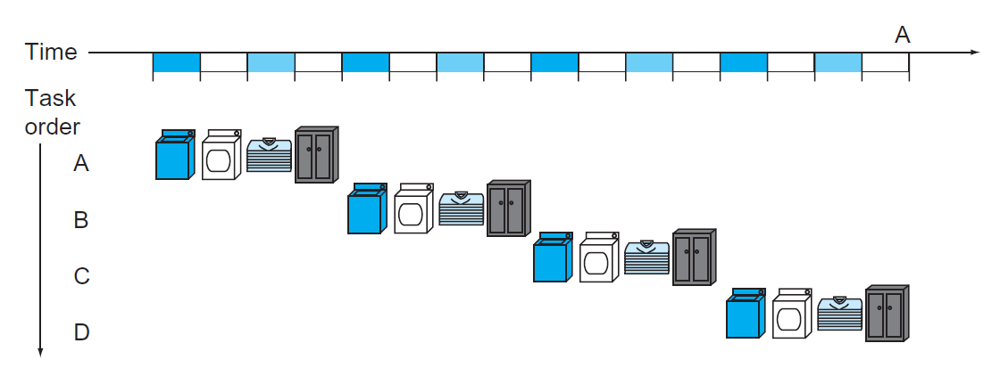
	
	但如果我们采用流水线的思想来洗这四堆衣物，那么整个过程所花的时间就会显著缩短（耗时为 7）：
	
	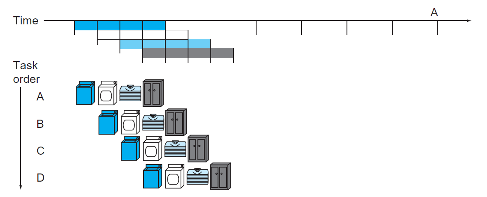
	
	可以发现，对于单个工作，流水线技术并没有缩短其运行时间；但是由于多个工作可以并行地执行，流水线技术可以更好地压榨资源，使得它们被同时而不是轮流使用，在工作比较多的时候可以增加整体的**吞吐率**（Throughput），从而减少了完成整个任务的时间。
	
	- 由于流水线开始和结束的时候并没有完全充满，开头和结尾部分的阶段仅执行部分任务（即整个系统没有满负荷运载），因此吞吐率不及原来的 4 倍（4 来自于例子中有 4 个步骤）；但是当工作数足够多的时候，吞吐率就几乎是原来的 4 倍了。

在 RISC-V 中，为了实现流水线指令的执行，需要将单个 RISC-V 指令划分为 5 个阶段：

- **IF（取指，Instruction Fetch）**：从内存中获取指令
- **ID（译码，Instruction Decode）**：读取寄存器，对指令进行译码
- **EX（执行，Execute）**：执行（算术 / 逻辑）运算或计算地址
- **MEM（访存，Memory）**：从数据内存中访问操作数
- **WB（写回，Write Back）**：将结果写回寄存器中

用图形符号来表示这五个阶段：


- 图形的左半边阴影表示写入，右半边阴影表示读取，全阴影表示两者皆有
- 之所以如此规定，是因为这里假设在一个时钟周期内，元件的前半个周期可以进行**写**操作，后半个周期可以进行**读**操作

本章讨论的流水线 CPU 均为这种五级流水线 CPU，即单个时钟周期内至多能并行执行五个阶段的 CPU。

!!! Example "比较流水线和单周期 CPU 的性能"

	假如规定内存访问、ALU 操作所花的时间为 200ps，寄存器读写所花时间为 100ps，且规定单周期 CPU 单个周期内只执行一条指令。各种指令的执行时间如下所示：
	
	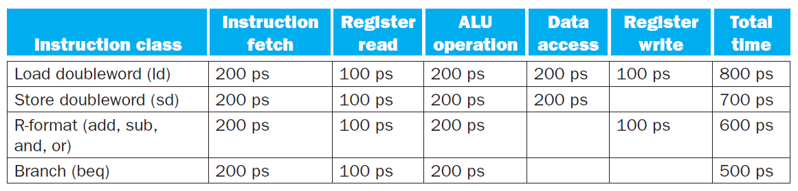
	
	现需要执行以下指令：
	
	```asm
	ld x1, 100(x4)
	ld x2, 200(x4)
	ld x3, 400(x4)
	```
	
	那么单周期 CPU 和流水线 CPU 执行这段指令所花的时间如下所示：
	
	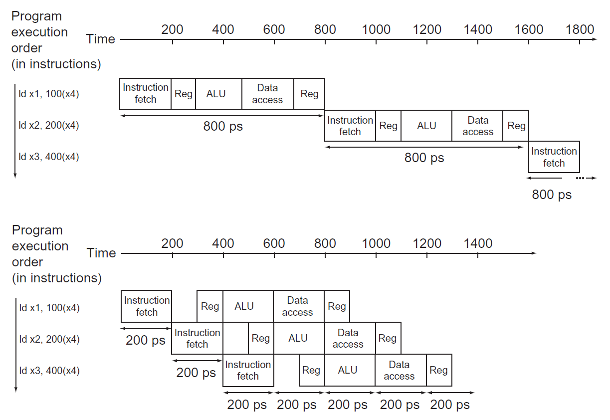
	
	- 对于单周期 CPU，因为周期的时长取决于执行时间最长的**指令**所花的时间，因此它的周期为 800ps。执行 3 个 `ld` 指令所花时间为 3 * 800 = 2400ps
	- 对于流水线 CPU，它将 `ld` 指令的执行分为五个阶段，它的周期时长则取决于执行时间最长的**阶段**所花的时间。因此即使内存读写时间为 100ps，但它也还是要执行 200ps。执行 3 个 `ld` 指令所花的时间为 7 * 200 = 1400ps

对于流水线和单周期 CPU 执行指令的总时间，我们有以下公式：

$$
\text{Time between instructions}_{\text{pipelined}}​=\frac{\text{Time between instructions}_{\text{nonpipelined}}}{\text{Number of pipe stages}}​​
$$

然而这个公式仅在理想条件下（每个阶段花费相同的时间），比如且指令数很多的情况下较为准确，否则计算结果与实际情况之间有不小的偏差。（比如上面的例子中只执行了 3 条指令，单周期和流水线 CPU 的执行时间之比并不等于阶段数；然而当执行 1,000,000 条指令时，执行时间之比就近似等于阶段数，这就是我们上面所说的吞吐率之比）

RISC-V 指令集的设计很好地适配了流水线执行：

- 所有的指令都是等长的（32 位），这便于取指和译码
- 指令格式少而规整，比如在不同指令中，源寄存器和目的寄存器字段位于同一位置上
- 只有加载和存储指令涉及到内存操作数
- 只在 Load 或 Store 指令中操作 Data Memory 而不会将存取的结果做进一步运算，这样就可以将 `MEM` 放在比较后面的位置；如果还能对结果做运算则还需要一个额外的阶段，此时流水线的变长并没有什么正面效果
***
### Graphical Representation

在介绍流水线 CPU 的过程中，经常会用到以下两种图示法来表示：

- 多时钟周期流水线图 (Multiple-Clock-Cycle Pipeline Diagrams)
    - 优势：对流水线指令的大致概括，使人一目了然
    - 电子元件表示法
    
	
	
	- 传统的文字表示法
	
	
	
- 单时钟周期流水线图 (Single-Clock-Cycle Pipeline Diagrams)
	- 优势：展现更多的实现细节，便于理解指令的执行原理
	
	
	
***
### Pipeline Datapath

为了实现流水线重叠执行每个阶段的指令，我们还需要在原来单周期 CPU 的数据通路上再做添加：

!!! Example

	对于一系列指令的情况：
	
	
	
	在这里我们有一个大前提：<font color="red">每部分的内存只能被一个指令访问，不能同时被多个指令访问</font>。
	
	这里要连续执行三个 `ld` 指令。可以看到对于每条指令，指令内存只用了一次（取指阶段），因为指令内存还要供后面的指令使用，但是指令剩余阶段的执行需要知道指令的内容，这样就造成了冲突。

对于上面的例子，我们需要用寄存器来保存尚在执行的指令。这样的寄存器称为**流水线寄存器**(Pipeline Registers)，这些寄存器位于各阶段之间的中间位置，用于保存指令执行各阶段产生的数据，供下一阶段使用。一共有 4 类这样的寄存器，分别称为 IF/ID, ID/EX, EX/MEM, MEM/WB，如下图所示：


接下来就以 Load 和 Store 指令为例来展现流水线寄存器协助流水线完成指令操作的过程：

!!! note "Process"

	=== "Load"
	
		=== "IF"
		
			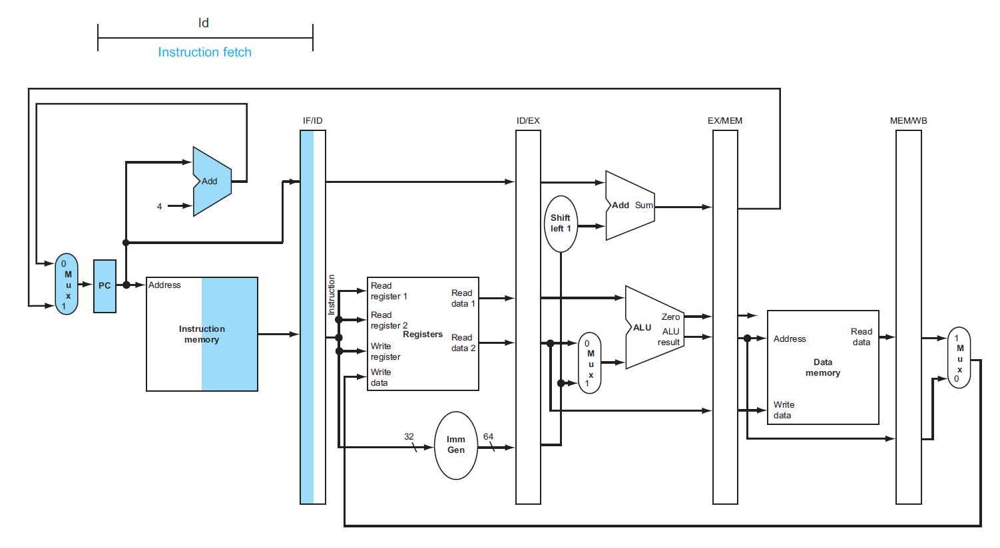
			
			这里我们需要将 PC 寄存器内的指令地址保存给流水线寄存器 IF/ID，这样才能继续执行下一条指令的读取。此时 CPU 还不知道当前指令的内容，因此需要及时保存。
		
		=== "ID"
		
			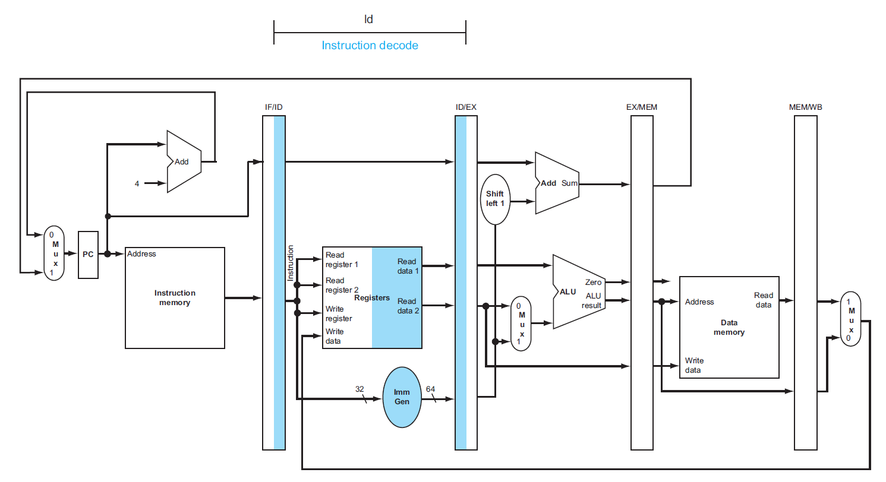
			
			这里除了要将指令地址传给流水线寄存器 ID/EX，还要将两个源寄存器的数据和立即数传给 ID/EX，因为它们很有可能在之后的阶段中用到
		
		=== "EX"
		
			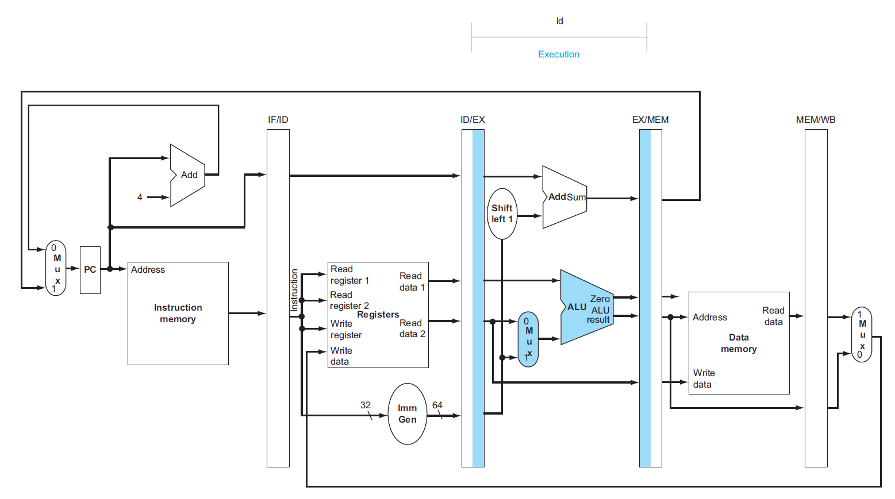
			
			这里我们需要将计算好的地址放入流水线寄存器 EX/MEM
		
		=== "MEM"
		
			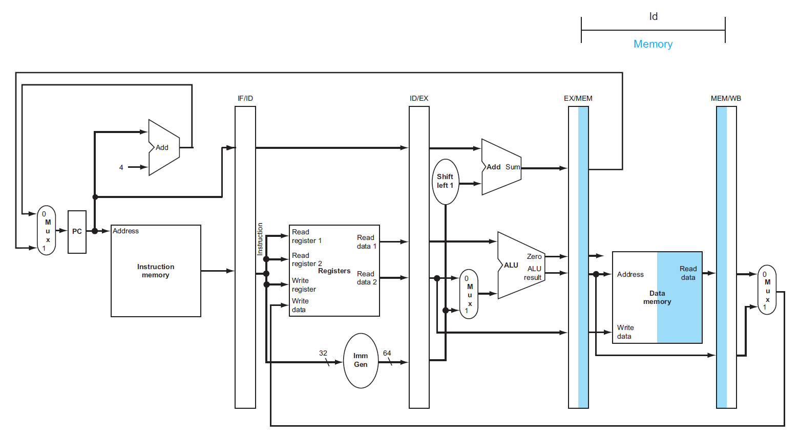
			
			这里我们需要从 EX/MEM 读取内存地址，将对应的内存数据写入流水线寄存器 MEM/WB 内
		
		=== "WB"
		
			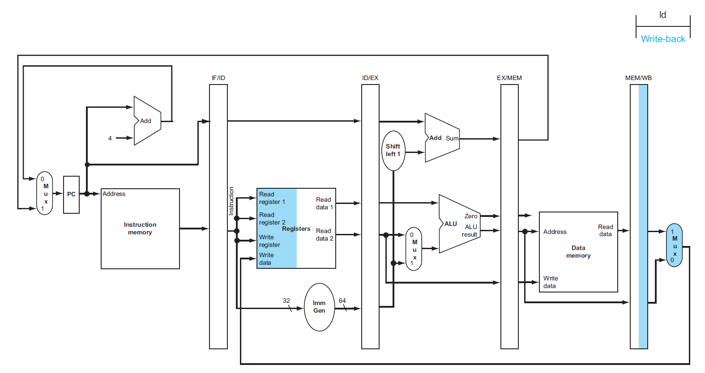
			
			从 MEM/WB 内读取数据，将其写入寄存器堆
			
	
	=== "Store"
	
		=== "IF & ID"
		
			前两步和加载指令基本一致，故略过（虽然在指令格式上有细微的差别，但在逻辑原理图中无法体现）
		
		=== "EX"
		
			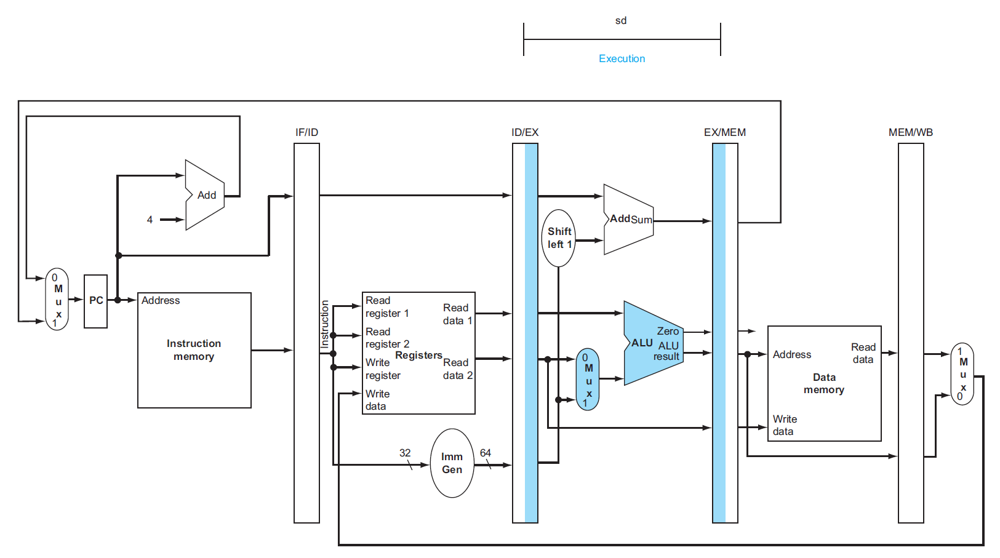
			
			EX/MEM 除了要保存计算出来的地址外，还要保存需要被写入内存的数据
		
		=== "MEM"
		
			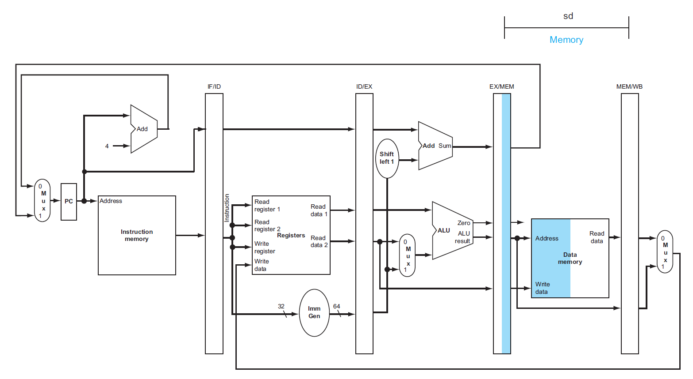
			
			将 EX/MEM 存储的数据，写入也是由它存储的内存地址对应的内存位置上。此阶段无需使用 MEM/WB 寄存器
		
		=== "WB"
		
			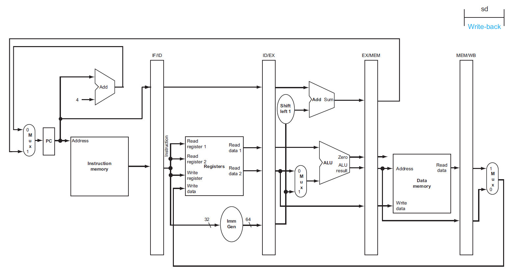
			
			存储指令无需写回这一步，因此无事发生。但这是个五级流水线 CPU，每条指令必须经历五个阶段，即五个时钟周期，所以即使啥也不做也要等这一段时钟周期结束才算完成

上面对于 Load 指令其实有个小 bug，我们忘记保存了目标寄存器的编号。因此在数据传输中我们还得一直传输目标寄存器的地址。下面给出修正过的数据通路原理图，其中蓝色部分为用于保存目标寄存器编号的部分。


***
### Pipeline Control

那么有了上面补充的数据通路，我们也需要基于单周期 CPU 补充相对应的控制：


- 由于在每个时钟周期内，PC 寄存器和流水线寄存器都要进行写操作，所以它们不需要用一个单独的写入信号来控制

综上所述流水线所需要的控制信号如下：

- 取指：无
- 译码：无
- 执行：`ALUOp`、`ALUSrc`，分别用于控制 ALU 运算和决定 ALU 第二个操作数用哪个（`rs2` or `imm`）
- 访存：`Branch`（包括`PCSrc`）、`MemRead`、`MemWrite`，分别对应`beq`指令、加载指令和存储指令
- 写回：`MemtoReg`

其控制信号表如下：


同样地，这些控制信号也需要用流水线寄存器来保存和传递，确保当前执行的指令接收正确的控制信号:


最后，我们给出补充完整的流水线 CPU 的原理图，包括了完整的数据通路和控制器：


***
### Pipeline Hazards

在流水线 CPU 的运行中，可能会遇到因为某些情况无法继续执行下条指令的情况，这类情况称为**流水线冒险**（Pipeline Hazards）。
***
#### Structure Hazards

结构冒险指的是因硬件不支持某些指令的组合（比如在同一时段访问同一资源的两条指令）而无法继续执行指令（例如多条加载 / 存储指令在同一个时钟周期对同一内存进行访问）

这大多体现在两个方面：一个是指令重叠的冲突（这个已经在 Datapath 当中通过添加 Pipeline Register 已经被解决了）；另一个是指令内部的冲突（即内存既要存储指令又要存储数据），我们通过分离内存将其应用于不同的存储用途（即指令内存和数据内存分离）
***
#### Data Hazards

数据冒险指的是指令尚未得到所需的数据而不得不停下来 (Stall)，直到获取数据后才可以继续执行的情况，常出现于整数和浮点数程序中。

更具体一点来说，是因为指令之间存在依赖关系，而且这些依赖关系在指令中出现得十分频繁。

对此，我们需要添加额外的硬件（称为**前递**（Forwarding）或**旁路**（Bypassing），下图用蓝色连线表示），从内部资源中检索指令所缺失的数据。


- 只有当目标阶段比源阶段发生的更晚，或位于同一时刻时，这种前递才是合法的（即这根蓝色连线从左上到右下，或是一根竖直的线）
***
上面的图给出的是两个 R 型指令的执行，只要加一个前递就能保证指令的连续执行。但是如果先执行加载指令，后执行依赖于该加载指令数据的指令，即使加了一个前递，CPU 还是不得不暂停一个时钟周期，这种情况称为**加载使用数据冒险**(Load-Use Data Hazard)，如下图所示：


- 这种暂停的操作则称为**流水线停顿**(Pipeline Stall)（或者叫做**冒泡**(Bubble)），上图中用蓝色的气泡图表示
- 虽然这种停顿能够解决此类数据冒险，但这么一停顿肯定会损失一些时间，所以如果可以的话，应尽量避免停顿。一种做法是：由硬件侦测加载使用数据冒险是否发生，若发生的话由软件<font color="red">重新为指令排序</font>（即在某些允许情况下交换指令顺序不改变程序功能），使其尽可能地减少停顿。

!!! Example

	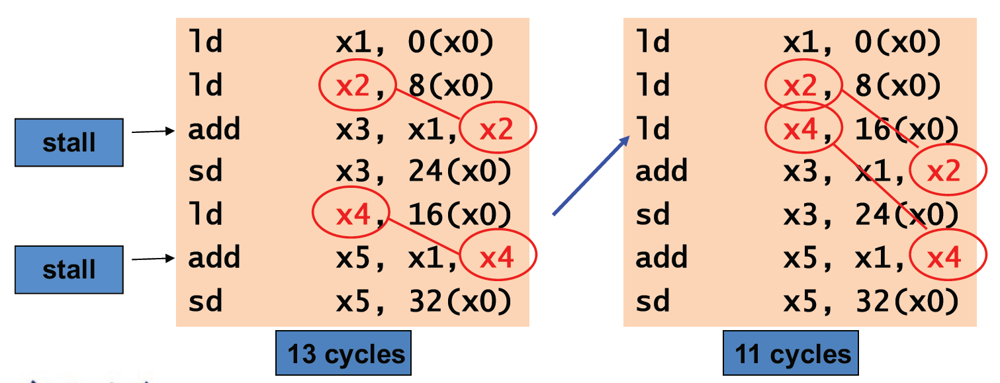

那么，从我们人类的角度来说（即大眼观察）是非常容易看出 Data Hazards 的，但是对于计算机来说该如何识别出 Data Hazards，从而执行操作避免这样的情况呢（即什么时候要采用 Forward 呢）？

!!! note "Detection"

	=== "Forwarding"
	
		给定以下指令段：
		
		```asm
		sub x2, x1, x3
		and x12, x2, x5
		or  x13, x6, x2
		add x14, x2, x2
		sd  x15, 100(x2)
		```
		
		可以看到，后面四条指令的输入均依赖于第一条指令的输出结果`x2`，所以很明显产生了数据冒险的问题，下面的多周期流水线图可以更清楚地显示这个问题：
		
		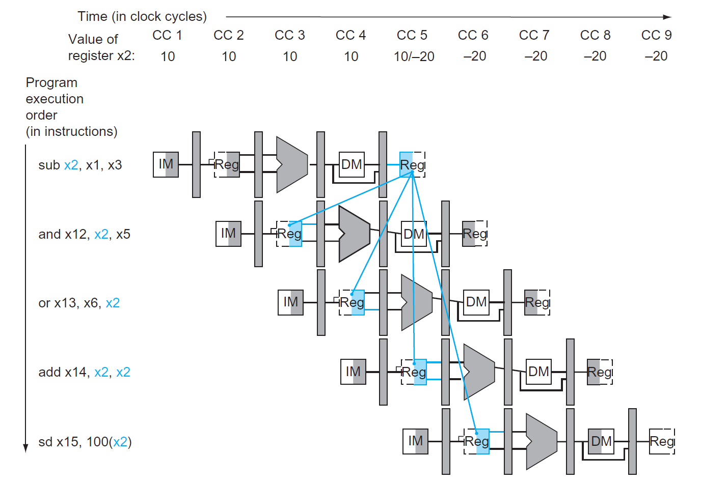
		
		可以看到，左边几根蓝线的方向是不对的，我们不可能将未来得到的数据传给过去要用到该数据的指令，所以 `and` 和 `or` 指令得到的是错误的 `x2`（其值为 10），而 `add` 和 `sd` 指令得到的 `x2` 是正确的（其值为 -20）。
		
		下面用符号化的语言归纳了两大类数据冒险的情况：
		
		- EX/MEM.RegisterRd = ID/EX.RegisterRs1(or ID/EX.RegisterRs2)
		- MEM/WB.RegisterRd = ID/EX.RegisterRs1(or ID/EX.RegisterRs2)
	
		其中等号的左右两边对应的是不同的指令的流水线寄存器，且等号右边对应的指令依赖于左边对应指令的结果。如果满足上述情况，等号左半边的寄存器的数据应当**前递**给等号右半边的寄存器。
		
		对于上例，`sub` 和 `add` 指令间的数据冒险属于第一类（EX/MEM.RegisterRd = ID/EX.RegisterRs1），而 `sub` 和 `or` 指令间的数据冒险属于第二类（MEM/WB.RegisterRd = ID/EX.RegisterRs2）。下图展示了正确实现前递的流水线图：
	
		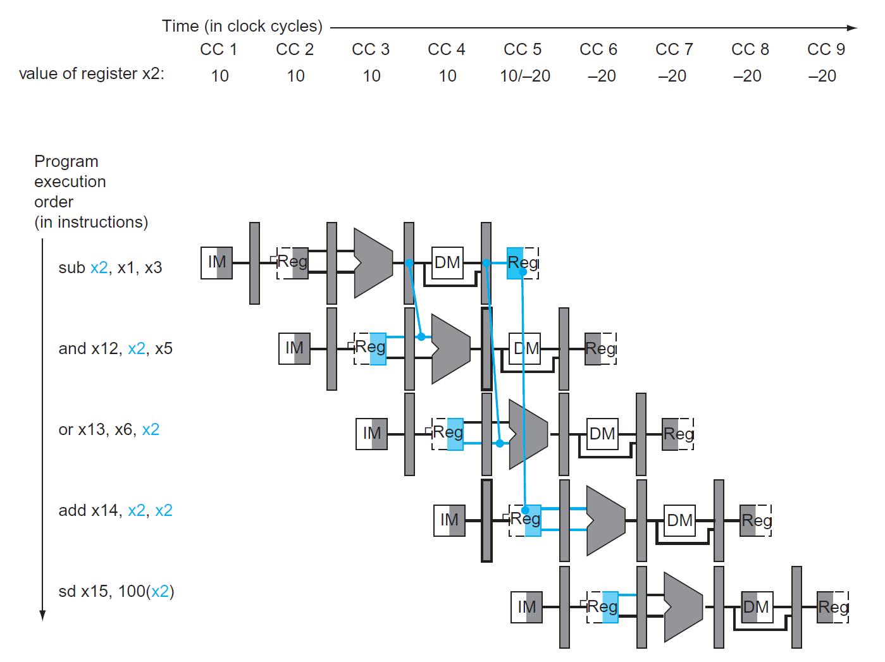
		
		上面的判断方法还存在一些小瑕疵：
	
		- 首先，并不是所有的指令都包含写入寄存器的操作，所以需要提前检测 `RegWrite` 信号是否为 1，若是则继续进一步的判断；否则就直接 pass 掉，不用担心数据冒险的问题
		- 其次，如果某个指令目标寄存器是 `x0` 的话，那么我们不希望将可能的非 0 结果（比如`addi x0, x1, 2`）前递给别的指令，避免带来不必要的麻烦，所以在依赖侦测前还得进行这一步的判断
		
		综上，我们进一步修正依赖侦测的判断条件，并且将数据冒险细分为**执行阶段 (EX) 冒险**和**访存阶段 (MEM) 冒险**两类，得到以下语句：
		
		```c
		// EX hazard
		if (EX/MEM.RegWrite && (EX/MEM.RegisterRd != 0)
		    && (EX/MEM.RegisterRd == ID/EX.RegisterRs1))
		        ForwardA = 10
		
		if (EX/MEM.RegWrite && (EX/MEM.RegisterRd != 0)
		    && (EX/MEM.RegisterRd == ID/EX.RegisterRs2))
		        ForwardB = 10
		
		// MEM hazard
		if (MEM/WB.RegWrite && (MEM/WB.RegisterRd != 0)
		    && !(EX/MEM.RegWrite && (EX/MEM.RegisterRd != 0)
		        && (EX/MEM.RegisterRd == ID/EX.RegisterRs1))
		    && (MEM/WB.RegisterRd == ID/EX.RegisterRs1))
		        ForwardA = 01
		
		if (MEM/WB.RegWrite && (MEM/WB.RegisterRd != 0)
		    && !(EX/MEM.RegWrite && (EX/MEM.RegisterRd != 0)
		        && (EX/MEM.RegisterRd == ID/EX.RegisterRs2))
		    && (MEM/WB.RegisterRd == ID/EX.RegisterRs2))
		        ForwardB = 01
		```
	
		其中第 12,13 和第 18,19 行是为了避免 MEM/WB.RegisterRd, EX/MEM.RegisterRd 和 ID/EX.RegisterRs1(2) 三者一起发生冲突，造成新的数据冒险问题（即 Double Data Hazards）
		
		!!! note "Double Data Hazards"
		
			我们考虑如下 RISC-V 指令段：
			
			```asm
			add x1, x1, x2
			add x1, x1, x3
			add x1, x1, x4
			```
			
			此时 `x1` 被多次调用
		
		- 这里设置了两个前递信号：`ForwardA` 和 `ForwardB`，它们实质上是 MUX 的控制信号，而这两个 MUX 分别用来决定参加 ALU 运算的两个操作数（默认均为 `00`）。下表展示的是不同 MUX 控制信号对应的功能：
		
		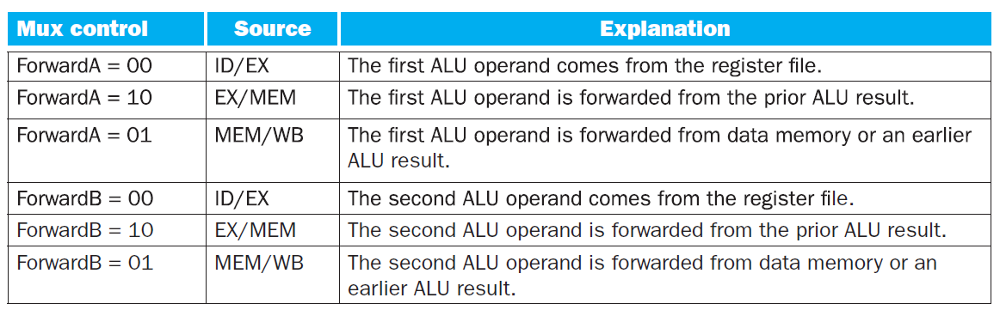
		
		最后加入前递单元后的整个流水线 CPU 如下：
		
		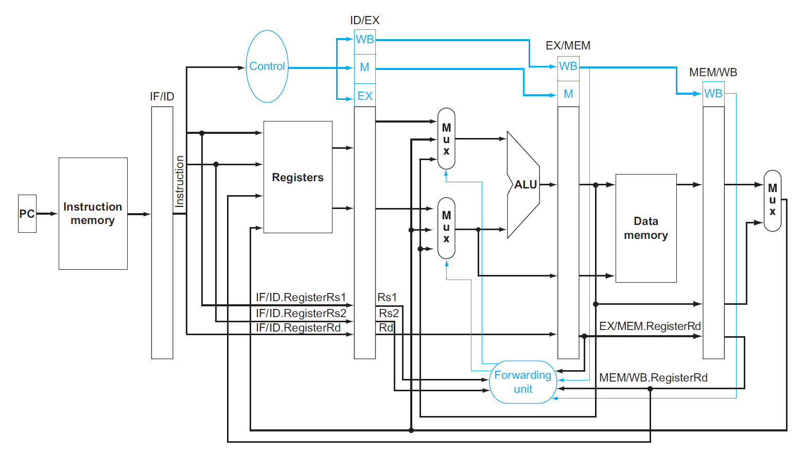
	
	=== "Stalling"
	
		虽然前递能够解决大多数情况下的数据冒险问题，但还是无法克服与加载指令相关的数据冒险问题。这里需要在原来的 CPU 中再加入一个**冒险侦测单元**(hazard detection unit)，用于发现合适的停顿时机。与上面的分析类似，我们也给出它的判断条件：
		
		```c
		if (ID/EX.MemRead &&        // MemRead represents load instruction
			((ID/EX.RegisterRd == IF/ID.RegisterRs1) || (ID/EX.RegisterRd == IF/ID.RegisterRs2)))
			    stall the pipeline       // the load instruction is stalled in the ID stage
		```
		
		具体来说要想停止流水线的运行，需要做到（这也是冒险侦测单元的三个输出）：
		
		- 停止 IF：不能改变 PC 寄存器的值（读取重复的指令），所以要为 PC 寄存器添加写信号 PCWrite
		- 停止 ID：不能改变 IF/ID 流水线寄存器的值（读取重复的值）所以要为该寄存器添加写信号 IF/IDWrite
		- 停顿的那段时间，虽然 CPU 仍然在运行，但实际上没有改变任何状态，这种情况称为**空操作**(nops)。为了保证所有元件状态不变，还需要确保所有的控制信号均为 0（事实上，只有 RegWrite 和 MemWrite 一定要设为 0，其他的控制信号是 don't care 的）
		
		下面展示添加了冒险侦测单元后的流水线 CPU 原理图：
		
		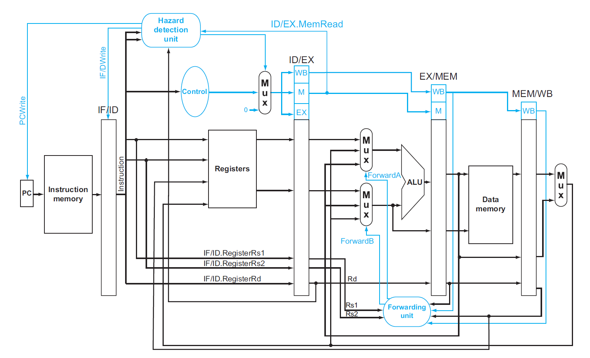

!!! Example

	对于以下指令段：
	
	```asm
	ld  x2, 20(x1)
	and x4, x2, x5
	or  x8, x2, x6
	add x9, x4, x2
	sub x1, x6, x7
	```
	
	如果只用前递来解决数据冒险的话，效果是这样的：
	
	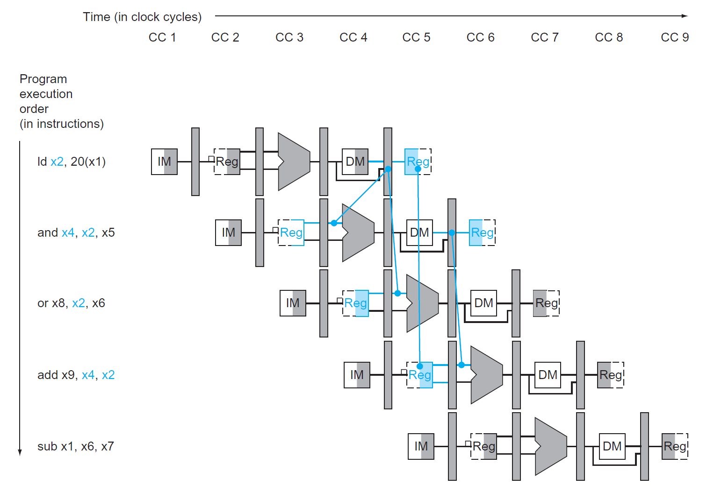
	
	可以看到，`ld` 和 `and` 指令间存在数据冒险问题。如果加入了冒险侦测单元的话，就能在执行加载指令时及时停顿整个流水线，从而避免了加载指令带来的数据冒险问题，最终效果如下所示：
	
	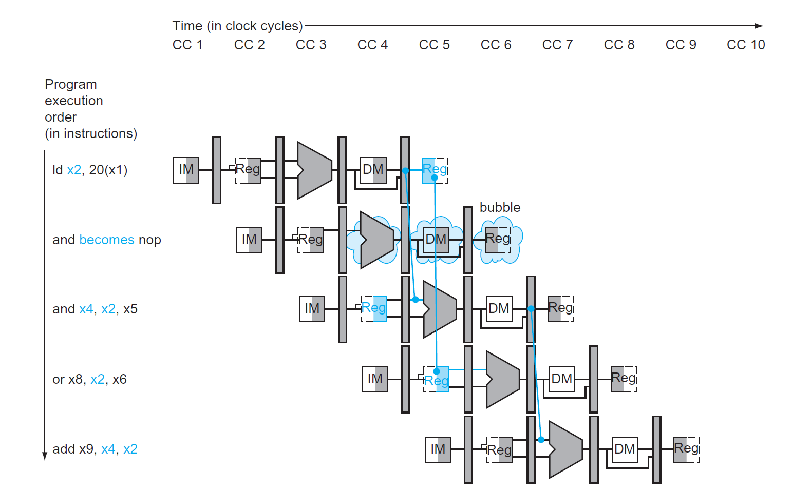
	
	- `nop` 表示 No Operation
***
#### Control Hazards

**控制冒险 / 分支冒险**指的是取到的指令并不是 CPU 所需要的，即指令地址的流向并不在 CPU 的预期内，例如 `beq` 指令在 IF 阶段中还不清楚它包含的跳转地址，因此在下个时钟周期还不能执行下一条指令，需要等 `beq` 指令到 MEM 阶段才能决定跳转地址，因为在 EXE 阶段结束后（即 MEM 阶段开始时），我们才会知道寄存器的比较结果，才能决定是继续执行下一条指令，还是跳转到指定地址。

但是，我们可以通过一系列改进，使得 `beq` 指令到 ID 阶段就能决定跳转地址（在后面会进行说明），但这不足以解决这个问题。


假设我们已经完成了改进，使 `beq` 指令到 ID 阶段就能决定跳转地址，接下来的一种简单的解决方法是停顿，让 `beq` 指令与下一条指令之间有一个固定的停顿（多等 1 个时钟周期，等待 ID 阶段完成以后再进行操作）。这样虽然是稳扎稳打的做法，但是效率太低了。


!!! note "Optimizing Methods" 

	=== "Static Branch Prediction"

		静态分支预测指的是预先假设每次执行 `beq` 指令后，都会跳转到下一条连续指令（`PC + 4`），而不是跳转到指定指令。
		
		
		
		- 如果预测正确，就无需停顿，可以连续地执行指令了（上图）
		- 而预测失败的话就要撤回那个错误的下条指令，这需要额外的一个时钟周期，其效果与停顿一样（下图）
		- 由于既能解决控制冒险，也保证了速度，因而这种方法实际用于 RISC-V 中
		
		对于静态分支预测来说，如果发生跳转的概率为 50%，且抛弃指令的成本较低，则这种优化方法能减少解决控制冒险的一半成本。
		
		抛弃指令的具体做法为：除了将控制信号置 0 外，还要**清除**(Flush) 前 3 个阶段的指令（因为在不优化的情况下此时分支指令进行到 MEM 阶段）。
		
		然而这种做法使得跳转分支的成本过高，为了降低成本，需要将条件分支的执行提到前面来。具体来说需要做到两件事：
		
		- **提前计算分支跳转地址**
		    - 实际上，PC 值和立即数字段已经存储在 IF/ID 寄存器内，所以只需要将分支地址的计算移到 ID 阶段即可，即在 ID 阶段添一个专门的分支加法器
		    - 虽然这个加法器可能会在任何指令执行到 ID 阶段时会进行加法运算，但是只有在条件分支指令时会用到它的计算结果
		- **提前进行分支跳转决策**（这里假设需要跳转分支）
		    - 要提前进行寄存器值的比较，需要额外的前递和冒险检测装置
		    - 在 ID 阶段新增一个相等检验单元 (Equality Test Unit)，用于比较两个寄存器的值，其判断结果会存在 ID/EXE 寄存器中
		    - 在下一个周期上，冒险侦测单元会获取 ID/EXE 的值（实现前递），发现有一个 `beq` 指令，且需要跳转分支，因此会先清除当前 IF 阶段的指令，并取得跳转后的指令
		        - 通过 IF.Flush 控制信号实现清除
		        - 此时的 ID 阶段执行空操作 
		    - 如果条件分支指令前有一条 ALU 指令，则条件分支指令需要停顿一个周期；如果前面是一条加载指令，则需要停顿两个周期
		
		!!! Example
		
			对于以下指令段：
			
			```asm
			36 sub x10, x4, x8
			40 beq x1, x3, 16    // PC-relative branch to 40 + 16 * 2 = 72
			44 and x12, x2, x5
			48 or  x13, x2, x6
			52 add x14, x4, x2
			56 sub x15, x6, x7
			...
			72 ld  x4, 50(x7)
			```
			
			下面给出在第 3 和第 4 个时钟周期内逻辑原理图：
			
			=== "第 3 个时钟周期"
			
				在第 3 个时钟周期，`beq` 指令的 ID 阶段结束，分支加法器计算跳转地址
				
				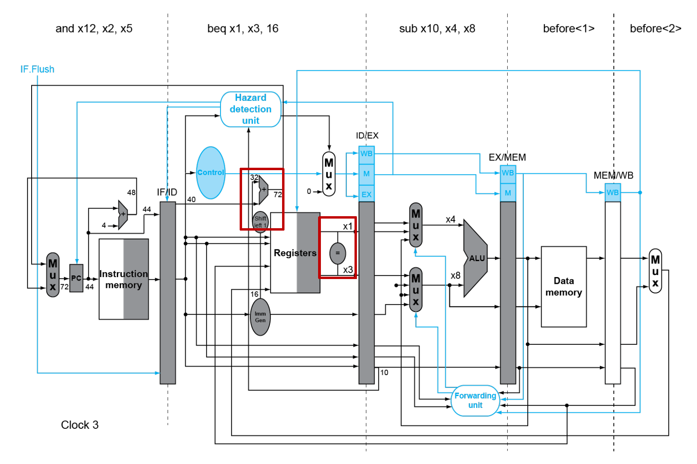
			
			=== "第 4 个时钟周期"
			
				在第 4 个时钟周期，冒险侦测单元判别需要跳转分支，通过 IF.Flush 控制信号实现清除，并且此时 ID 阶段执行 `nop`，IF 阶段就读入跳转指令。
				
				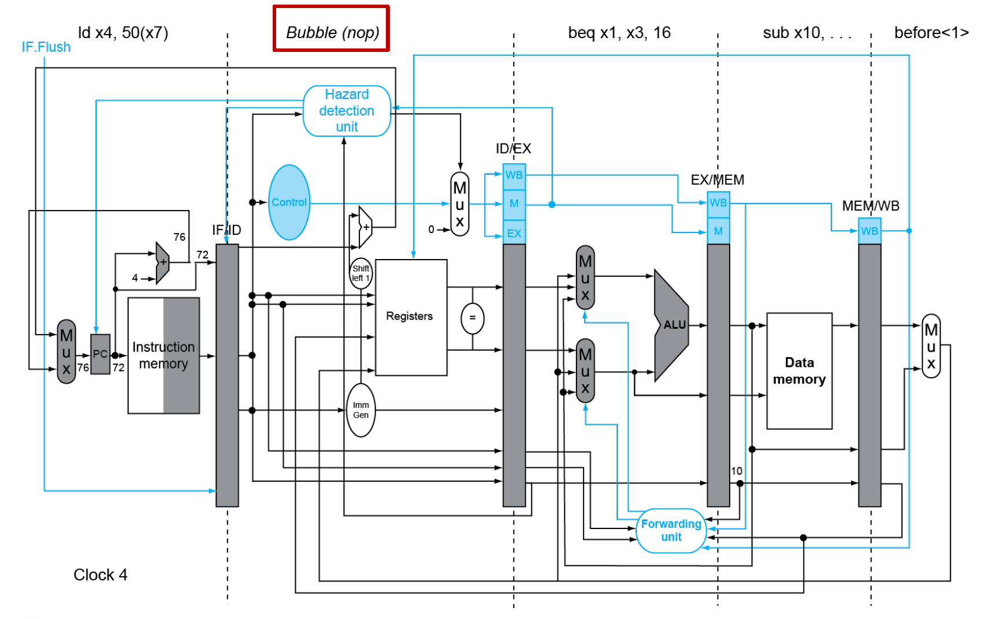
	
	=== "Dynamic Branch Prediction"
	
		虽然上述的静态分支预测足以应付五级流水线的控制冒险问题，但是对于更高级数，或更高要求的处理器，这种预测的失败成本还是太大，于是引入了**动态分支预测**(Dynamic Branch Prediction)——在程序执行过程中，根据上一条条件分支指令的运行结果来预测分支是否跳转。
		
		具体实现中，需要借助**分支预测缓存**(Branch Prediction Buffer)（或**分支历史表**，Branch History Table），它是一块由分支指令的低位地址来索引的很小的内存，包含 1 位或多位分支是否跳转的信息。
		
		- 对于最简单的 1 位缓存，可以仅用 0 和 1 区别上次的分支指令是否发生跳转。如果预测失败，则需要翻转这个比特。然而缺陷是即使几乎所有的分支指令都发生跳转（比如循环，只有最后不跳转），这种方法还是会有两次错误预测（一次在开头，一次在结尾）
		- 2 位缓存能够提高预测精度，虽然它需要 2 次预测错误才会改变预测值，但是对于执行一连串跳转情况一致的指令时这种方法的优势更大，下面给出对应的有限状态机图：
		
		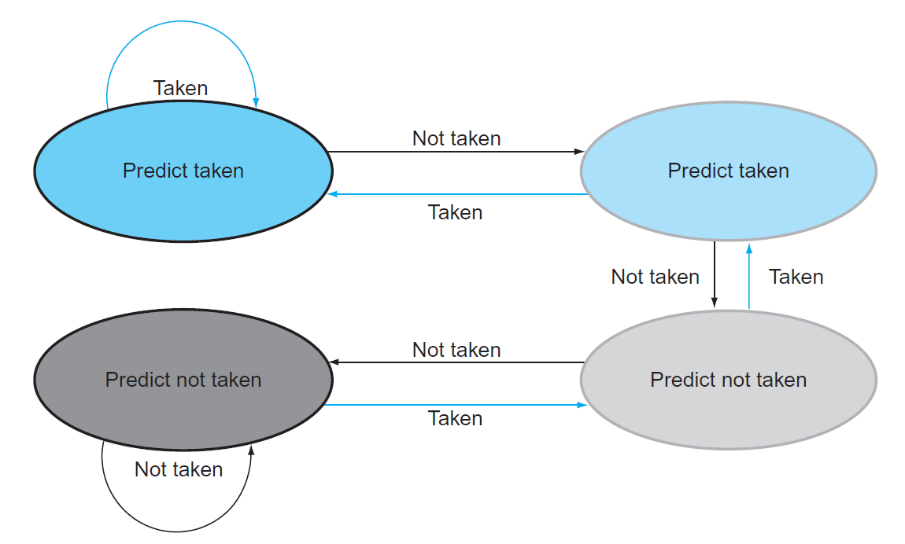
		
		- 其他更强大的预测器：
		    - 相关预测器 (Correlating Predictor)：结合特定分支指令的局部预测和近几条分支指令的全局预测来进行预测
		    - 锦标赛预测器 (Tournament Branch Predictor)：对于每个分支指令进行多种预测，用一个选择器来决定用哪种预测
***
根据指令执行的五个阶段，用虚线将单周期 CPU 的数据通路划分为五个部分：


不难发现，大多数指令在原理图的执行顺序为从左到右，但也有一些例外：

- 最后的写回阶段中，将内存的数据写入寄存器的线路方向是从右往左的（可能会导致数据冒险）
- PC 寄存器的输入数据（`PC + 4` 和指定分支地址）是从右往左传递给 PC 左边的 MUX 的（可能会导致控制冒险）