---
hide:
  #- navigation # 显示右
  #- toc #显示左
  - footer
  - feedback
comments: true
---

# Chapter 05 : Memory Hierarchy

!!! abstract "考点"

	- 局部性原则
	- Cache
		- 基本概念（Hit，Miss，Miss Penalty…）
		- 结构及映射机制（画图）
		- 相关计算（时间、空间）
		- 优化
	- 虚拟存储
		- Page Table
		- 相关计算（空间）
		- 优化（TLB）

## Memory Technologies

> 内存中常用的有四大工艺：SRAM、DRAM 、Flash 和 Disk
***
### SRAM

SRAM（静态随机访问存储器）具有如下特性：

- 它只有一个访问端口，具备读和写的能力
- 数据以一对反相门（Inverting Gates）来存储
- 尽管读和写的访问时间不同，访问任何数据所需的时间是固定的
- 由于无需刷新 (Refresh)，因此访问时间接近于处理器的周期时间，读写非常快
- 通常用 6-8 个晶体管表示一个位，用于防止读取对存储信息的干扰，也因此比 DRAM 占用更多空间
- 耗电少

!!! note "SRAM 相关结构"

	=== "Transistor"
	
		
	
	=== "Invertor(CMOS)"
	
		

### DRAM

DRAM（动态随机访问存储器）具有如下特性：

- 1 位数据以电荷的形式被存储在 1 个电容中
	- 因此需要周期性地对电容**刷新**（Refresh）以长时间保存电荷，具体做法就是读取并且写回该数据
- 比较小型，但是因为要不断刷新所以比 SRAM 慢很多（大概能慢 5 到 10 倍）
	- 为了减少刷新对访问时间的占用，DRAM 通过两级译码结构实现一次性刷新一整行的数据（这种行结构也有助于提升性能）
- 用 1 个晶体管对数据（电荷）进行访问（读 / 写）（晶体管用比 SRAM 少，因此更便宜）
- DRAM 内部被划分为多个**存储体**（Memory Bank），每个存储体都有一些**行缓冲器**（Row Buffer），这样可以实现对同一地址的同步访问
	- 假如有 n 个存储体，在一个访问时间内便能轮换访问 n 个存储体，使得带宽提升了 n 倍，这种轮换访问方法被称为地址交错 (Address Interleaving)
	
	

!!! note "DRAM 的读写操作"

	
		
	=== "Write"
	
		根据输入数据（0/1）将当前位线（Bit line）设置为高/低电平，并将当前字线（Word Line）设置为高电平对电容充电
	
	=== "Read"
	
		现将每一条位线都预充电（Precharge）到一个中间状态（即介于高电平和低电平之间），然后将字线设置为高电平对电容充电，每个电容或是向位线放电，或是由位线充电。放电位线电压就上升一点，充电位线电压就下降一点，由放大器（Sence Amplifier）检测到电压波动并输出结果（即原来电容存储的是 0 还是 1）

DRAM 的架构如下图所示：

DRAM 有如下类别：

- SDRAM（同步 DRAM）：通过一个时钟来消除同步内存和寄存器所需的时间
- DDR（Double Data Rate）DRAM：能在时钟的上升沿和下降沿中进行数据传输，从而提升了一倍的带宽 (Bandwidth)
- QDR（Quad Data Rate）DRAM：将 DDR DRAM 的输入和输出分开
- 双内联内存模块 (Dual Inline Memory Module)
***
### Flash

闪存（Flash Storage）具有如下特性：

- 是一种非易失性（即断电数据也不会丢失）、电子可擦除、可编程只读的半导体存储器 (EEPROM)
- 比磁盘快百倍到千倍
- 更小型、耗电更小，但也更贵（介于地盘和 DRAM）
- 写操作可能会磨损存储器内的数据
	- 在 1000 次访问后数据位会有所磨损
	- 因此它不适合作为 RAM/磁盘的替代
	- 为减缓磨损，闪存会用一个控制器来分散 (Spread) 写操作到被更少使用的区域，这称为**磨损均衡**(Wear Leveling)

闪存有如下几类：

- 或非闪存：每一个 Cell 像是一个或非门
	- 随机读写更快
	- 通常用于存储嵌入式系统的指令
- 与非闪存：每一个 Cell 像是一个与非门
	- 更为密集，但是以块为单位进行操作
	- 更为便宜
	- 通常用于存储 USB 密钥、媒体数据等
***
### Disk

磁盘（Disk）是一个非易失性、利用磁技术的存储器，由一组绕轴旋转的金属盘片（Platter）构成，盘片上覆有磁记录材料，通过一个读写头（Read-Write Head）来读写信息，整个驱动器被密封在磁盘内部

- 迹（Track）：磁盘表面上的同心圆
- 区（Sector）：构成迹的某个片段，是能够被读写的最小单位的信息
	- 每个区记录了区的 ID、数据和纠错码（Error Correcting Code, ECC，用于隐藏和记录错误）
- 柱面（Cylinder）：读写头下所有的迹（形成一个柱面）
- 磁材料上记录的序列：区号、间隔、包含纠错码的区信息、间隔、下个区的编号 ...
- 寻找（Seek）：定位读写头到要被访问的迹的过程
- 旋转时延（Rotation Latency）：将要访问的区旋转至读写头下所需的时间，通常假设为旋转时间的一半
- 传输时间（Transfer Time）

如果要访问其中的一个区，其大致步骤如下：

- 等待前一个访问
- 通过移动读写头寻找被访问的迹
- 旋转时延
- 数据传输
***
## Memory Hierarchy Introduction

内存层级中涉及到的一个重要思想是局部性原则（Principle of Locality），它由以下两部分组成：

- **时间局部性**（Temporal Locality）：如果内存的某个项目被用到过，那么在短时间内它很有可能被再次使用
    - 举例：循环中的指令很可能会被重复访问
- **空间局部性**（Spatial Locality）：如果内存的某个项目被用到过，与它地址邻近的项目很可能在不久后也会被使用
    - 举例：通常指令是按顺序执行的、按顺序访问数组元素

因此，结构化的内存被设计出来，便有了**内存层级**（Memory Hierarchy），它是一种多级的存储结构，其规定：越靠近处理器的内存，它的访问时间更短、存储空间更小、成本更高。

- 更靠近处理器的一级内存是离处理器更远的内存的一个子集，且所有的数据被存储在最底层的内存中
- 在一个时间段内，数据只能在相邻的两个内存层级之间进行传输（复制），因此在同一时间内我们仅关注相邻的两级内存结构

与内存层级相关的一些基本概念：

- 块 / 行 (Block/Line)：在两级内存结构中的最小信息单元（下图标出的蓝色方块）
- 字（Word）：Cache 与 CPU 之间进行信息交互的单元

	

- **命中**（Hit）：处理器所需的数据出现于本层内存中
    - **命中率**（Hit Rate/Ratio）：能够在本层内存中找到数据的次数占总次数的比例，通常作为层次结构的性能衡量指标之一
    - **命中时间**（Hit Time）：访问本层内存所需的时间，包括判断是否命中或缺失所需的时间
- **缺失**（Miss）：处理器所需的数据不存在于本层内存中，此时需要访问下层内存的内容并检索所需数据
    - **缺失率**（Miss Rate/Ratio）（$= 1 - \text{命中率}$）：未能在本层内存中找到数据的次数占总次数的比例
    - **缺失损失**（Miss Penalty）：从下层内存中获取所需数据块的时间，包括以下操作：访问数据块、将数据从下层传输到上层、将数据插入上层内存的合适位置、将数据块继续传给处理器
***
## The Basics of Cache

**缓存**（Cache）：在内存层级中表示介于处理器和主内存之间的层级，也可以指代任何借助局部访问优势的存储器。但本章内容所涉及到的缓存均指处理器内部的缓存。

利用上面我们所说的局部性原则，缓存的体现如下：

- 空间局部性：从主存中取回待访问数据时，会同时取回与其位置相邻的主存单元的数据
- 时间局部性：保存近期频繁被访问的主存单元的数据
***
### Access of Cache

Cache 的访问过程如下：

***
### Structure of Cache

Cache 的主要结构如下：

- Cache 被分成若干行，每行的大小与主存块相同
- Cache 每行包含四部分：
	- 标签 Tag 从 CPU 访问主存的地址中剥离得到（识别数据在 Cache 保存的具体数据块）
	- Data 是与主存交换的数据块
	- Valid 表示 Cache 中的数据是否有效（1 表示数据存在，0 表示不存在，初始均为 0）
	- Dirty 表示 Cache 中的数据是否为最新
***
### Address Mapping Mechanism in Cache

先考虑一种很简单的缓存，以及一个很简单的情况：假如处理器请求一个单字数据 $X_n$，缓存的内容发生了如下的变化：

由于原来缓存内只有数据 $X_1,X_2,…,X_{n−1}$，因此 $X_n$​ 不在缓存内，所以出现了缺失的情况，需要从更底层的内存中获取该数据，并且放在缓存中。那么我们如何得知数据是否在缓存中，且如何找到该数据呢？

我们很容易想到可以用地址映射来解决这个问题，让每个字数据基于内存地址进行定位，这能够确保每个字数据占据唯一的一块空间，帮助实现在Cache中快速查找数据，Cache 内部的映射机制大致如下：

不难发现，可能会存在不同字数据占据相同缓存块的情况，这里我们用**标签**（Tag）来区分数据。因为底层内存的空间更大，因此通常会用数据在底层内存的低位地址来表示在缓存中的地址，而**高位地址**就作为区分相同缓存块下不同数据的标签，如下图所示：

上面的图片中，缓存块数为 8，而内存块数为 32，因此字数据内存地址的低 3 位（因为 $8=2^3$）对应它在缓存中的地址（灰色和蓝色表示两类低位地址），而剩下的高 2 位则作为区分同一缓存块下的不同数据的标签。

最简单的一种映射被称为**直接映射缓存**（Direct-Mapped Cache)。可以用下面的公式计算字数据在缓存中的位置：

$$
\text{Cache Location} = (\text{Block address})\text{ modulo }(\text{Number of blocks in the cache})
$$

- 特别地（也是在一般情况下地），若 Cache 有 $2^n$ 个数据块，那么索引值即为主存块地址的最低 $n$ 位
- 在直接映射缓存当中，Cache 利用索引+标签+Valid+Dirty 位共同锁定目标：
	- 首先根据给出的主存块大小、Cache大小，从主存地址中剥离出字节偏移量字段、索引字段以及标签字段
	- 根据索引字段找到目标 Cache 行
	- 目标 Cache 行中的标签字段与剥离出的标签字段进行匹配，如果匹配成功则找到正确的数据
	- 判断 Valid 位、Dirty 位是否有效

!!! example "Example"

	我们对一个八块的缓存进行九次访问：
	
	
	
	下图展示了在访问过程中缓存内容的变化：
	
	
	
	不难发现，第 8 次访问（$18=(10010)_{\text{two}}$）与第 2 次访问（$26=(11010)_{\text{two}}​$）存在冲突，因为它们占据相同的缓存块。这种情况下，最近访问的数据将会占据该缓存块的位置（即覆写缓存块内已有的数据），这体现了时间局部性的思想。

下图展示了内存地址（假定为 64 位）与缓存位置之间的关系：

正如前面提到过的，我们可以将内存地址分为以下几部分：

- **标签字段**：用于区别相同缓存块下的不同数据
- **缓存索引**：用于选择缓存块
- 由于一个地址表示一个字节，并且在缓存中数据是以**字**（4 字节）为单位的，因此地址的低 2 位可以被忽略

!!! tip "计算直接映射缓存的空间大小"

	给定以下条件：
	
	- 64 位的内存地址
	- 共有 $2^n$ 个缓存块，因此用 $n$ 位地址来表示索引
	- 每个缓存块可容纳 $2^m$ 个字数据（即 $2^{m+2}$ 字节的数据），因此用 $m$ 位地址来表示字
	
	那么剩下用于表示标签字段的位数为 $64−(n+m+2)$ 位
	
	则缓存空间大小的计算公式为（单位为 bit）：
	
	$$
	\begin{aligned}
	& 2^n\times(\text{block size + tag size + valid field size})\\
	=& 2^n\times(2^m\times 32+(64-n-m-2)+1)\\
	=& 2^n\times(2^m\times 32+63-n-m)
	\end{aligned}
	$$
	
	对于上面给出的缓存，它有 $2^{10}$ 个缓存块（有 10 位索引位），每个缓存块仅有 $2^0$ 个字数据，因此它的标签位有 52 位。

- 在一般的命名传统中，我们仅用缓存存储的子数据大小来表示缓存。对于上面的缓存，由于它一共可容纳 1024 个字数据，即 4096 字节的数据，因此可以称其为 4 KiB 缓存。

!!! example "Examples"

	=== "Example 1"
	
		=== "Question"
		
			若一个缓存可容纳 16 KiB 的数据，且每个缓存块可容纳四个字数据（假定使用 64 位地址），那么该缓存所需的空间大小是多少呢？（单位：位）
		
		=== "Answer"
		
			- 先计算缓存块的个数：由题意缓存可容纳 4096 个字，又因每个块可装四个字，因此一共有 1024 个块
			- 标签位数为：64-10-2-2=50
			- 所以总的空间大小为：
			
			$$
			2^{10}×(4×32+50+1)=2^{10}×179=179\text{ Kibibits}=22.4\text{ KiB}
			$$
			
	
	=== "Example 2"
	
		=== "Question"
		
			给定一个缓存，它有 64 块，每块空间为 16 字节，请问内存字节地址为 1200 的数据所映射到的块的编号为多少？
		
		=== "Answer"
		
			- 每个缓存块仅容纳一个字数据
			- 该数据是内存中第 $\frac{1200}{16} = 75$ 个字数据
			- 对应块编号为 $75\text{ mod }64 = 11$
			- 实际上，内存地址在 1200-1215 之间的数据都会映射到这个缓存块上
***
### Handling Cache Hits and Misses

#### Read

!!! note "Handling Cache Read Hits and Misses"

	=== "Hit"
	
		由于这正是我们想要的，所以我们不需要进行任何多余操作
	
	=== "Miss"
	
		**缓存缺失**（Cache Miss）：处理器向缓存请求当前不存在于缓存中的数据，可分为**指令**缺失（Instruction miss）和**数据**缺失（Data Miss）两类，由处理器的控制单元和一个单独的控制器（初始化内存访问 + 重新填充缓存数据）共同处理。具体来说，指令缺失和数据缺失的处理方法是类似的。
		
		对于数据缓存缺失，从内存中对应的数据块拿到 Cache 当中读取对应内容即可。
		
		对于指令缓存缺失，其遵循停止 CPU $\rightarrow$ 从内存获取数据块 $\rightarrow$ 将其送到 Cache $\rightarrow$ 重启 CPU 的读操作的顺序，具体如下：
		
		1. 向内存发送原来的 PC 值（当前应该得是 PC-4 了因为我们已经执行过 PC+4 了，现在得倒推）
		2. 令主内存执行读取操作，并等待内存完成访问
		3. 将从内存中读到的数据放入缓存对应位置上，将内存地址的高位写入标签字段，并将 Valid 位置 1
		4. 重新执行第 1 步所对应的指令，此时处理器成功地在缓存中获取正确的指令
***
#### Write

!!! note "Handling Cache Write Hits and Misses"

	=== "Hit"
	
		对缓存进行写操作时需要考虑以下问题：执行存储指令时，我们会向缓存写入一个新的数据，但由于此时并没有改变底下内存的数据，因此内存和缓存的数据就存在不一致（Inconsistent）的现象。
		
		下面提供了两类解决方案：
		
		- **写穿**（Write-Through）：在更新缓存数据的同时也要更新底层内存对应的数据，这样能始终保证两者的一致性
		    - 这种方法简单粗暴，但是执行起来太慢了，因为每次向缓存写入数据就意味着要改变主内存的数据，而访问主内存的速度是很慢的，那 Cache 的开发就显得毫无意义了
		    - 补救措施：添加一个**写缓冲器**（Write Buffer），它保存那些需要写入主内存的数据，此时向缓存写入数据后只需对写缓冲器进行写操作即可，处理器仍可以继续执行
		    - 若缓冲器的内容被填满的话，处理器就不得不停下来，先让缓冲器向主内存写入数据、腾出一点空间后，它才能继续执行
		    - 然而，如果向主内存写入数据的速度慢于处理器产生写操作的速度，那么无论多大的缓冲器都没有用
		- **写回**（Write-Back）：执行写操作仅改变缓存的数据；当这个缓存块的数据要被新数据块取代覆盖时，则将原数据写入底层的内存中。此时 Dirty 位的作用就展现出来了，它记录了当前这个缓存数据块是否被写操作更新过，从而决定被覆盖前是否需要被写回内存
		    - 相比上一种方法，由于对同一个 block 通常会有多次写入，因此这种方式消耗的总带宽是更小的，提升了性能，但也变得更复杂
	
	=== "Misses"
	
		- **写分配**（Write-Allocate）：即像读缓存缺失一样先把数据块拿到缓存里再写入
		- **写外围**（Write Around/No Write Allocate）：考虑到既然本来就要去主内存，不如直接在里面写了，就不再拿到缓存里了
		- 写回只能使用写分配；一般来说，写穿使用写外围。
***
总的来说，直接映射机制处理 Cache 缺失情况如下图：

简单总结一下：

- 读缺失，我们就需要从内存获取数据存到缓存当中，考虑当前在缓存中的数据：
	- 需要被写回（即 Dirty=1）：先保存缓存当中的数据块，然后将内存当中的数据块更新到缓存当中，再将保存的数据块写回内存
	- 不需要被写回（即 Dirty=0，写穿）：直接把内存当中的数据块更新到缓存
- 写缺失，考虑是否需要写到缓存当中：
	- 需要写到缓存（即写分配）：考虑当前在缓存中的数据：
		- 需要被写回（即 Dirty=1）：先保存缓存当中的数据块，然后将内存当中的数据块更新到缓存当中，再将保存的数据块写回内存，最后修改缓存当中的数据块
		- 不需要被写回（即 Dirty=0）：直接把内存当中的数据块更新到缓存，然后修改缓存当中的数据块
	- 不需要写到缓存（即写外围）：直接修改内存当中的数据
***
!!! example "Example : Intrinsity FastMATH"

	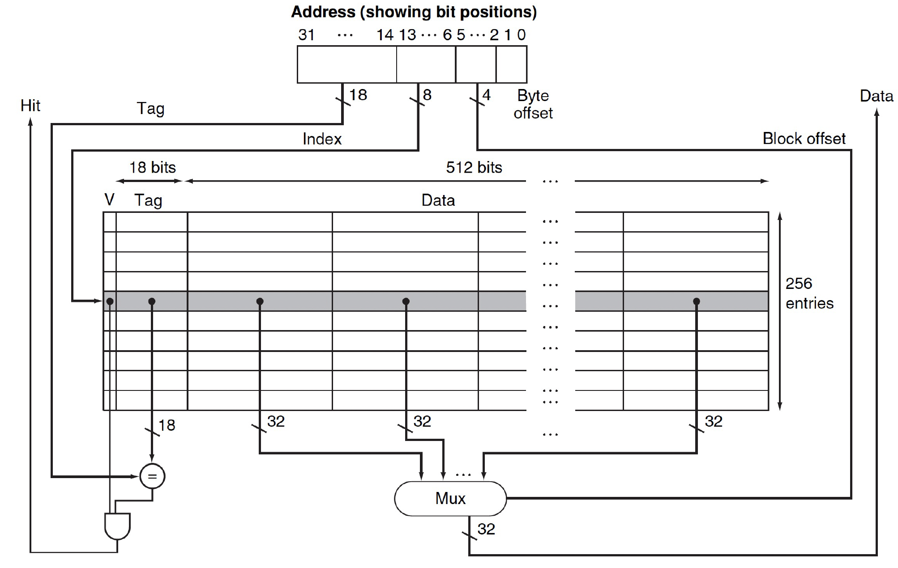
	
	- 嵌入式 MIPS 处理器
		- 12 级流水线
		- 每个时钟周期都可获取指令和数据
	- 缓存分离：将指令缓存和数据缓存分离
		- 每个缓存大小为 16KB：256 个数据块，每个数据块 16 个字
		- 数据缓存写穿/写回皆可
	- SPEC2000 缺失率
		- 指令缓存：0.4%
		- 数据缓存：11.4%
		- 加权平均：3.2%
***
## Measuring and Improving Cache Performance

### Measuring Cache Performance

我们使用 CPU 时间来评估缓存的表现，在第 1 章中，我们已经给出了 CPU 时间的计算公式。现在我们应当将缓存给考虑进去（因为缺失问题，缓存可能会引入额外的周期数），因此需要对原公式进行修改，得到以下公式：

$$
\begin{aligned}
\text{CPU Time}&=(\text{CPU execution clock cycles }+\text{ Memory-stall clock cycles})\times\text{Clock cycle time}\\
&=(\text{Instructions}\times\text{CPI}+\text{Instructions}\times\text{Miss Ratio}\times\text{Miss Penalty})\times\text{Clock cycle time}\\
&=(\text{Instructions}\times\text{CPI}+\text{Read-stall cycles}+\text{Write-stall cycles})\times\text{Clock cycle time}\\
\end{aligned}
$$

缺失问题可以来自读操作，也可来自写操作，对于 $\text{Read-stall cycles}$ 来说：

$$
\text{Read-stall cycles}=\frac{\text{Reads}}{\text{Program}}\times\text{Read miss rate}\times\text{Read miss penalty}
$$

对于 $\text{Write-stall cycles}$ 来说，我们假定使用写穿策略加上写缓冲器的设计，此时停顿的原因可分为两类：写缺失（要求我们在继续写操作前先获取该缓存块），以及写缓冲器停顿（缓冲器内容已满，需要向主内存倒入一些数据以腾出空间），用公式表示为：

$$
\text{Write-stall cycles​}=(\frac{\text{Writes}}{\text{Program}}\times \text{Write miss rate}\times\text{Write miss penalty})+\text{Write buffer stalls}​
$$

- 如果提供了足够深度的写缓冲器，且内存接受写操作的速度快于处理器生成写操作的速度，那么写缓冲器的停顿就变得很小，可以忽略不计
- 如果缓存块的大小仅仅只是一个字，那么 $\text{Write miss penalty}$ 为 0

在大多数采取写穿策略的缓存中，读和写的缺失损失大致相等。假如不计写缓冲器停顿时间，那么可以同时考虑读和写操作，即：

$$
\begin{aligned}
\text{Memory-stall clock cycles}&=\frac{\text{Memory accesses}}{\text{Program}}\times\text{Miss rate}\times\text{Miss penalty}\\
&=\frac{\text{Instructions}}{\text{Program}}\times\frac{\text{Misses}}{\text{Instructions}}\times\text{Miss penalty}
\end{aligned}
$$

!!! example "Examples"

	假设有一个这样的缓存：
	
	- 指令缓存的缺失率为 2%，数据缓存的缺失率为 4%
	- 若处理器在没有任何内存停顿的情况下，CPI = 2
	- 对于所有的缺失，缺失损失为 100 个时钟周期
	- 加载和写入数据的指令的频率为 36%
	
	=== "Example 1"
	
		=== "Question"
		
			一个带有不发生任何停顿的完美缓存的处理器比带此类缓存的处理器快了多少倍？
		
		=== "Answer"
		
			设 $I$ 为指令总数，那么有：
			
			$$
			\begin{aligned}
			\text{Instruction miss cycles}&=I\times2\%\times 100=2.00I\\
			\text{Data miss cycles}&=I\times36\%\times4\%\times 100=1.44I\\
			\text{Total memory-stall cycles}&=2.00I+1.44I=3.44I\\
			\text{CPI with stall}&=\text{CPI with perfect cache}+\text{Total memory-stalls}\\
			&=(2+3.44)I=5.44I
			\end{aligned}
			$$
			
			与未停顿的 CPI 取比值，有：
			
			$$
			\begin{aligned}
			\frac{\text{CPU Time with stalls}}{\text{CPU Time with perfect cache}}&=\frac{I\times\text{CPI}_{\text{stall}}\times\text{Clock cycle}}{I\times\text{CPI}_{\text{perfect}}\times\text{Clock cycle}}\\
			&=\frac{\text{CPI}_{\text{stall}}}{\text{CPI}_{\text{perfect}}}=\frac{5.44}{2}=2.72
			\end{aligned}
			$$
			
	=== "Example 2"
	
		=== "Question"
		
			在 Example 1 的基础上，如果我们通过将 CPI 从 2 提升为 1 来提升处理器的性能，结果又会如何？
		
		=== "Answer"
		
			$$
			\begin{aligned}
			\text{CPU with stall}&=\text{CPI with perfect cache}+\text{Total memory-stalls}\\
			&=(1+3.44)I=4.44I\\
			\therefore \frac{\text{CPU Time with stalls}}{\text{CPU Time with perfect cache}}&=\frac{\text{CPI}_{\text{stall}}}{\text{CPI}_{\text{perfect}}}=\frac{4.44}{1}=4.44
			\end{aligned}
			$$
			
			由上来看，内存停顿对 CPI 的影响占比从 $\frac{3.44}{5.44}=63\%$ 到 $\frac{4.44}{5.44}=77\%$
	
	=== "Example 3"
	
		=== "Question"
		
			在 Example 1 的基础上，如果我们通过将 Clock Rate 翻倍来提升处理器的性能，结果又会如何？
		
		=== "Answer"
		
			$$
			\begin{aligned}
			\text{Total miss cycles per instruction}&=(2\%\times200)+36\%\times(4\%\times200)=6.88\\
			\text{CPI with cache misses}&= 2+ 6.88=8.88\\
			\therefore \frac{\text{Performance with fast clock}}{\text {Performance with slow clock}}&=\frac{\text{Execution time with fast clock}}{\text {Execution time with slow clock}}\\
			&=\frac{I\times\text{CPI}_{\text{slow clock}}\times\text{Clock cycle}}{I\times\text{CPI}_{\text{fast clock}}\times\text{Clock cycle}/2}\\
			&=\frac{5.44}{8.88/2}=1.23
			\end{aligned}
			$$
			
			由上来看，更快的时钟只能提升到 1.2 倍的性能而非期望的 2 倍性能。

!!! warning "注意"

	从上面的 Example 2 和 3 能看出，如果只提升 CPU 的速度（比如提高 CPU 的时钟频率，降低周期数等等），而没有对内存系统进行相应的提升，那么反而会拉长 CPU 的执行时间，即降低 CPU 的性能。比如降低 CPU 的 CPI 值（无停顿），由于内存的停顿周期数不变，那么内存的停顿对实际 CPI 的影响占比就会增大，这意味着在相同的执行时间内，这类“改进后”的 CPU 反而遭遇更多的内存停顿，因而性能不佳。
***
### Improving Cache Performance

#### Solution 1 : Flexible Block Placement

事实上，为了减少 Cache 的缺失，除了直接映射机制，Cache 还有其他更灵活的映射机制，其对比如下：

- 直接映射机制：数据块只能放到 Cache 的唯一一个位置
	- 放置位置通常为数据地址 mod Cache 中数据块个数
- 全相联机制（Full Associative）：数据块能放到 Cache 的任何位置
	- 这种方式的好处是可以降低缺失率，坏处是每次需要跟所有数据块比较是否命中
	- 较为实际的做法是用比较器 (Comparator) 进行并行查找，提高查找速度，但显然会引入更大的硬件开销
	
	
	- 通常有三种策略来决定数据块放到哪个位置：
		- 随机替换（Random Replacement）：随机挑选一个幸运数据块覆盖掉（需要一个随机数生成器）
		- LRU（Least Recently Used）：选择上一次使用时间距离现在最远的那个数据块覆盖掉（需要一些额外的位用来记录信息）
		- FIFO（First In First Out）：选择进入时间最早的数据块覆盖掉（同样需要一些额外的位记录信息）
- 组相联机制（Set Associative）：每个数据块仍然会根据其地址确定其可以存放的缓存数据块，但是可以放的地方并不是一个，而是一组
	- 放置组号位置为地址 mod Cache 中的组数，在这个组中任意一个块放置
	- 如果一个组有 $n$ 个数据块，那么称这个 Cache 是 $n-$组相联
	- 实际上直接映射机制（$n=1$）和全相联机制（$n=m,m$ 为 Cache 的总数据块个数）是组相联机制的特例

三者的示意图如下：

!!! example "Example"

	=== "Question"
	
		假设有一个具有 4 个单字缓存块的缓存，有以下访问内存地址序列：0, 8, 0, 6, 8，分别计算在采用全相联、2-组相联和直接映射的置放方案时缓存的缺失次数。
	
	=== "Answer"
	
		=== "直接映射"
		
			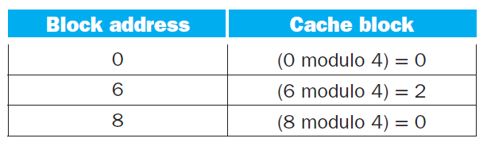
			
			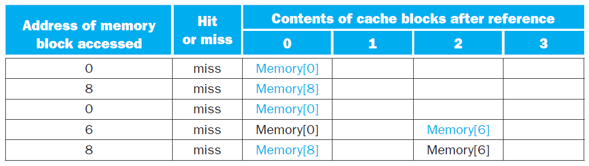
			
			缺失次数为 5
		
		=== "2-组相联"
		
			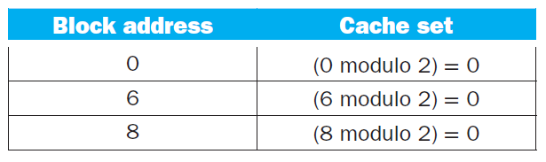
			
			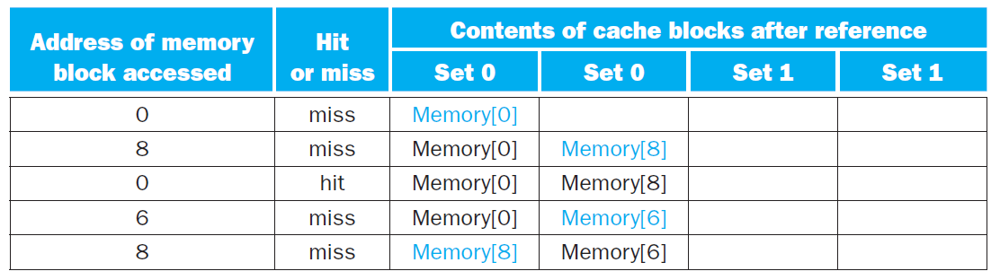
			
			缺失次数为 4
		
		=== "全相联"
		
			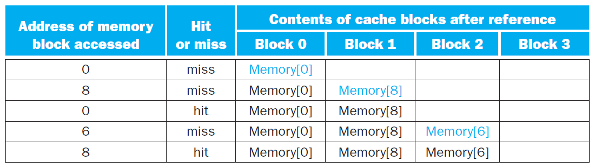
			
			缺失次数为 3

下图展示了一个缓存块大小为 16 字的 64KiB 缓存，在采用不同的置放方案后，数据缺失率的提升水平：

??? question "在组相联中该如何寻找缓存块？"

	与直接映射缓存一样，我们将内存地址划分为以下几个字段：
	
	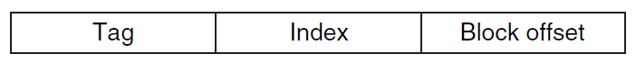
	
	- **标签**（Tag）：用于区分同一组内的不同缓存块
	    - 需要通过比较器实现并行查找，对于 $n$ 路组联合缓存，需要有 $n$ 个比较器，以及一个 $n-1$ 多路选择器
	- **索引**（Index）：用于区分不同的组
	    - 对于全联合缓存，它没有索引位，因为它只有一个组
	    - $n$ 位索引表示 $2^n$ 个组
	- 块偏移量（Block Offset）：表示单个缓存块的大小，块偏移量为 $x$ 表示大小为 $2^x$ 字节 $= 2^{x−2}$ 字
	
	!!! example "Example"
	
		=== "Question"
		
			假设一个缓存有 4K 个缓存块，每个块的大小为 4 个字，并且内存采用 32 位地址。请计算在直接映射、2-组相联、4-组相联以及全相联的置放方案下缓存的组数以及总的标签位数。
		
		=== "Answer"
		
			- 每个块的大小为 $16$ 字节，因此块偏移量为 $4$，那么标签位和索引位的位数之和为 $32 - 4 = 28$ 位
			- 直接映射：组数 = 块数 = $12$ 组，因此索引位数为 $\log_{⁡2}(4096)=12\text{bits}$，那么总标签位数为 $(28-12)\times 4K = 64\text{Kbits}$
			- 2-组相联：组数 = 块数 - $\log_{⁡2}(2) = 11$ 组，总标签位数为 $(28 - 11)\times 2\times 2K= 68\text{Kbits}$
			- 4-组相联：组数 = 块数 - $\log_{⁡2}(4) = 10$ 组，总标签位数为 $(28 - 10)\times 4\times 1K= 72\text{Kbits}$
			- 全相联：组数 = 1 组，总标签位数为 $28\times 4K\times 1 = 112\text{Kbits}$
			
			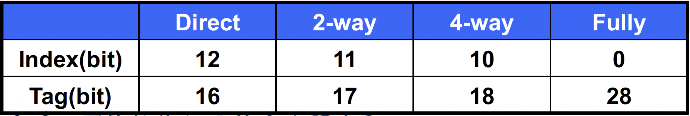

下面是一个 4-组相联缓存的原理图：

不难发现，访问一个联合缓存需要先选择某个组，然后在组内进行查找，这带来了因比较和选择而产生的延时成本，因此在选择置放方案时需要权衡好**缺失（Miss）成本**和**联合（Associativity）成本**。
***
在缓存中访问某个数据时，可能存在缺失的情况，即该数据的对应缓存块已经放了别的数据。不同的置放方案会有不同的处理策略：

- 直接映射：由于数据在缓存中的位置是唯一的，所以新访问的数据就直接替代原来缓存块内的数据
- 全联合：由于可以随机访问缓存的任一位置，因此每个缓存块的原始数据都有被新数据替代的可能
- 组联合：新来的数据可能替代它所在组内的任何缓存块中的数据
    - 通常采取**最早使用**（LRU）策略，即那些很久没有被访问过的数据会优先被新数据替代掉
    - 实现这一策略需要跟踪组内缓存块数据的使用情况，对于 2-组相联缓存来说只需额外保留 1 位即可，但对于更多分路的组相联，实现该策略就相对比较困难了
***
#### Solution 2 : Choosing Different Block Size

> 在直接映射机制下，Cache 利用率较低，块冲突率较高，应用于大容量的 Cache 当中。

想要降低缺失率（Miss Rate），一种可行的方法是**适当增加每个缓存块的大小**。然而，如果缓存块的空间过大，对于相同空间大小的缓存，那么该缓存的块数就会减小，那么就会产生更多的数据竞争问题，因此此时缺失率反而会升高。下图便展示了这一结果，其中不同曲线表示不同的缓存大小：

事实上，增大缓存块的空间还会增大缺失损失（Miss Penalty），因为更大的缓存块意味着更久的传输时间。如果缓存块过大，由于缺失率降低的效果不明显，且缺失损失会越来越大，因此最终会带来缓存性能的损失。

!!! tip "补充"

	下面给出一些减缓因增大缓存块而带来的缺失损失增大的方法：
	
	- 早重启（Early Restart）：当所需字数据还未返回时，令处理器继续执行后面的操作，而不是等下去。这种方法更适用于指令缓存中，但在数据缓存中表现效果不太好
	- 需求字优先/关键字优先（Requested/Critical Word First）：对内存进行组织，使得处理器请求的字数据得以优先进行传输，随后再传输其他不是那么重要的数据。该方法比早重启略快一些，但也有与前者同样的限制
***
#### Solution 3 : Designing the Memory System

我们可以通过改变内存系统的架构来支撑 Cache 的运作，一般来说，有以下三种架构：

!!! note "内存系统的三种架构"

	我们假设：
	
	- 需要 1 个时钟周期来传输地址
	- 每次 DRAM 访问需要 15 个内存总线时钟周期
	- 需要 1 个总线时钟周期来发送一个字的数据
	- 数据块大小为 4 个字
	- 每个字 4 字节
	
	=== "Basic Memory"
	
		基本的内存以一个字为宽度，示意图如下：
		
		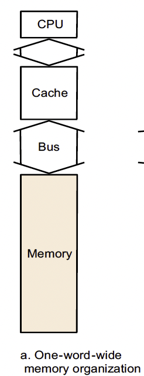
		
		那么传输一个字的数据需要 $1+15+1=17$ 个时钟周期，而缺失损失（即从内存传输一个数据块到 Cache 的时间）为 $1+4\times(1+15)=65$ 个时钟周期，则带宽（Bandwidth，即数据传输率，公式为传输数据位数/传输时间）为 $\frac{4\times 4}{65}\approx\frac{1}{4}$
		
		因为数据块大小为 4 个字，其中可能只有一个字对我们是有用的，其他的三个字是没用的，所以对于一个四个字为一个数据块的缓存来说，这样的内存系统是不太可行的。
	
	=== "Wider Main Memory"
	
		我们将内存的宽度变宽，示意图如下：
		
		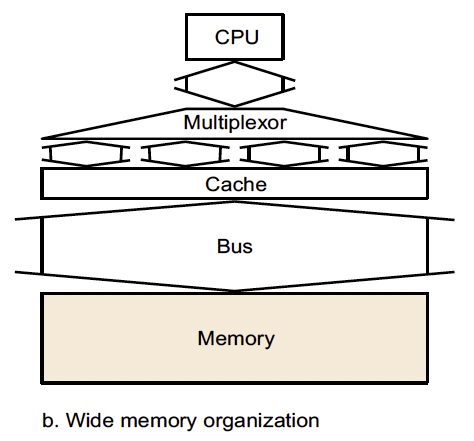
		
		如果对于一个两个字（64 位）为宽度的内存来说：
		
		- 缺失损失：$1+2\times(15+1)=33$ 个时钟周期
		- 带宽：$\frac{4\times 4}{33}=\frac{16}{33}\approx 0.48$
		
		对于一个四个字（128 位）为宽度的内存来说：
		
		- 缺失损失：$1+(15+1)=17$ 个时钟周期，这已经跟传输一个字的时间一样了
		- 带宽：$\frac{4\times 4}{17}=\frac{16}{17}\approx 0.98$
	
	=== "Four-way Interleaved Memory"
	
		我们将内存分成四个块进行存储，而访问是并行的，示意图如下：
		
		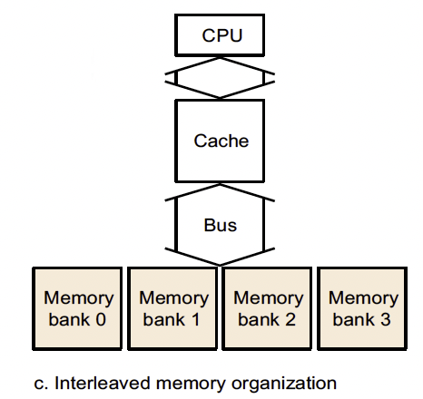
		
		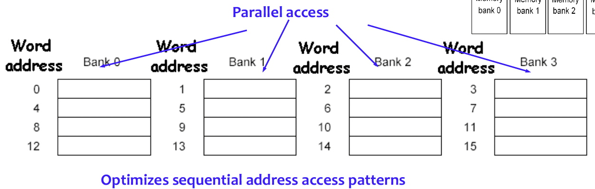
		
		- 缺失损失：$1+15+4\times 1=20$ 个时钟周期,几乎和传输一个字的时间一样了
		- 带宽：$\frac{4\times 4}{20}=0.8$
***
#### Solution 4 : Multilevel Caches

我们在 Cache 和 Memory 之间再添加一层 Cache，如下图所示：

如果在第一级 Cache 当中未命中，可以去访问第二级 Cache，如果第二级 Cache 命中，那么就避免了从主内存中拿数据块的情况，这样也能一定程度提高 Cache 的性能。

- 一般来说，第二级的 Cache 用的是 SRAM
- 而且，我们还能在两级的 Cache 接着用之前讲到的一下优化方法进行优化，主体大概是：
	- 优化第一级 Cache 的命中次数
	- 优化第二级 Cache 的缺失率

!!! example "Example"

	一台机器的 CPI 为 1.0，Clock Rate 为 5GHz，缺失率为 2%，DRAM 访问时间为 100ns，添加一个访问时间为 5ns 的二级 Cache 可以将缺失率降低到 0.5%
	
	对于主内存的缺失损失为 $\frac{100ns}{0.2ns}=500\text{ Clock cycles}$，那么当没有二级 Cache 的时候，$\text{CPI}=1+2\%\times 500=11.0$
	
	当有了二级 Cache 的时候，对于访问到二级 Cache 命中不需要访问主内存的情况，缺失损失为 $\frac{5ns}{0.2ns}=25\text{ Clock cycles}$，那么整体的 $\text{CPI}=1+2\%\times 25+0.5\% 500=4.0$
	
	整体处理速度翻了 $\frac{11.0}{4.0}=2.8$ 倍
***
#### Solution 5 : Software Optimization Blocking

从一定程度上来说，不同的算法（涉及不同的内存需求）和不同的编译器也在一定程度上会影响 Cache 的性能：

!!! Example "DGEMM via Blocking"

	一个非常经典的例子就是矩阵乘法：
	
	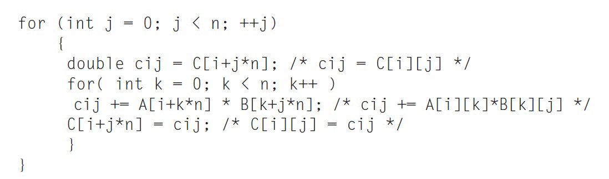
	
	根据线性代数我们知道可以将矩阵分块进行矩阵乘法，这在大规模数据中能保持一定的运算速度：
	
	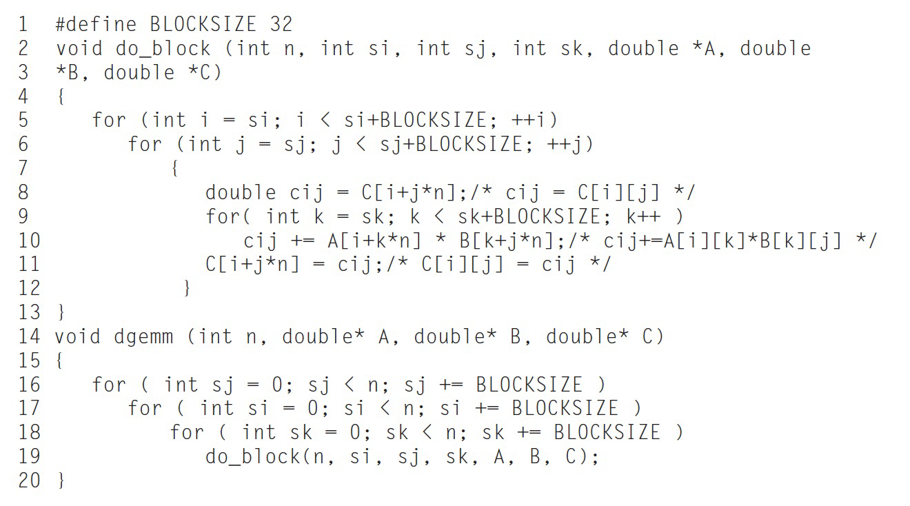
	
	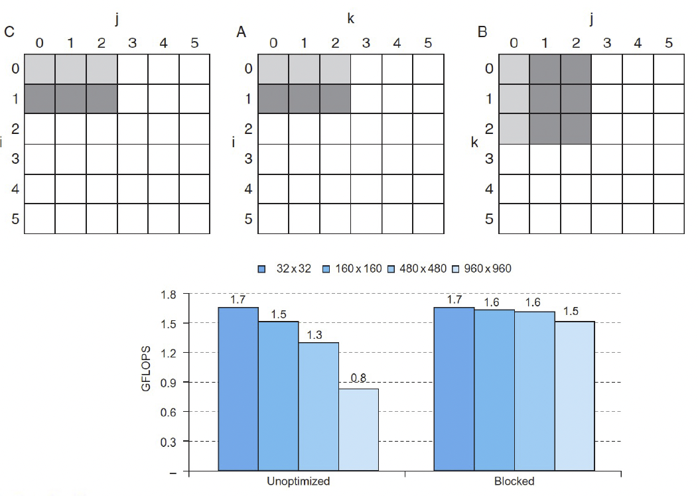
***
## Virtual Memory

> 主内存可以被看作下属存储（即磁盘）的“缓存”。或者，反过来说，我们把那些在主内存里放不下的内容存到磁盘里，这种技术被称为虚拟内存（Virtual Memory）技术

虚拟内存技术可以让多个程序之间高效、安全地共享内存，同时允许单个程序使用超过内存容量的内存（虽然 CPU 取数据时是从 Cache 中取的，但是它能访问到的数据的数目比 Cache 的容量要大）。以前，很多程序因为需要使用过大的内存而无法被运行，需要由程序员使用各种技巧使得程序能够被容纳下；但现在由于虚拟内存技术的广泛使用，这些程序都不成问题了。

如下图所示，实际上的主内存我们称之为物理内存（Physical Memory）中的地址称为物理地址,（Physical Addresses）；而我们给每一个程序内部使用到的内存另外编一套地址，称为虚拟地址（ Virtual Addresses）；虚拟内存技术负责了这两个地址之间的转换（Address Translation）

从这张图中我们也可以很容易地看出“虚拟内存技术可以允许单个程序访问超过物理内存大小限制的内存”的原因，即有一些内存可以被临时地存放在磁盘上，到被访问的时候再被放到物理内存中，就像  Cache 做的那样。
***
### Pages : Virtual Memory Blocks

虚拟存储技术和 Cache 的原理是一样的，但是一些术语的名字并不相同。对应于 Cache 中的 Block / Line，虚拟存储的内存单元称为页面（Page），当我们要访问的页面不在主存中而是在磁盘里，也就是 Miss，我们称之为一次 **Page Fault**。

!!! tip "Tips"

	- 在一些地方，Virtual Page 称为 Page，Physical Page 称为**帧, Frame**；我们的课本并未采用这种称呼。但无论如何，在看到单独出现的 _Page_ 时，应当参考上下文判断它是 Virtual 还是 Physical。
	- 在一些地方，Virtual Address 也被称为 Logical Address。

我们知道，访问磁盘相比于访问内存是非常慢的（相差大约十万倍），这个主要时延来自于磁盘转到正确的位置上的时间花费；所以我们希望一次读进来多一点从而来分摊这个访问时间。典型的页面大小从 4KiB ~ 64KiB 不等。

同时，从上面的图中，我们还可以注意到物理内存的存放并没有分组的概念，即用 Cache 的术语来说，主内存是全相联的。这是因为相比于查询时间长来说，去访问磁盘所多花的 Page Fault 更为可怕，所以说我们还是尽量去降低缺失率。

同样的道理，由于读写磁盘是非常慢的，需要访问下级内存的写穿策略并不合适，因此在虚拟内存技术中，我们采取写回的方式。

- 与高速缓存类似，我们在页表中会额外使用一个 Dirty Bit 来追踪某个页是否在被读入内存后被覆写，置位表示被覆写，这种被覆写的页被称为 Dirty Page
***
### Mapping Mechanism

和 Cache 的全相联相似地，我们不妨假设一个页面的大小是 4KiB，那么其页内的偏移 **Page Offset**（相当于 Cache 的 Byte Offset）就需要 12 位来表示；那么物理地址中除去后 12 位以外前面的部分就表征着它是属于哪一页的，我们称之为虚拟页码（Physical Page Number，相当于 Cache 的 Tag）。

而虚拟地址的形式与之类似，由若干位页码和若干位 Page Offset 组成。

之前提到，我们通过转换（Address Translation）可以找到虚拟页面对应的物理页面，因此当我们要访问一个虚拟地址时，将其虚拟页码通过转换变为物理页码（这种转换也会负责 Page Fault 的处理并给出正确的转换），而 Page Offset 表示的是在一页内的偏移，保持不变即可。这样我们就获得了这个虚拟地址对应的物理地址，也就是它在实际的主内存中存储的位置。如下图所示：

***
### Page Tables

那么虚拟内存是如何实现转换翻译的呢？我们知道全相联的一个重要问题就是如何去定位某一项，这里我们引入页表（Page Table）这种结构，它被存在主内存当中，每个进程都有一个自己的页表；同时硬件上有一个页表寄存器（Page Table Register）保存当前进程这个页表的地址。

使用页表时，我们根据虚拟页码找到对应页表条目（Page Table Entry, PTE）在页表中的偏移，然后与页表寄存器相加得到对应条目的物理地址，从中读取对应的条目。其实就是说，页表就是一个数组， `page_table[i]` 表示第 `i` 个 Virtual Page 对应的 Physical Page Number。

如下图所示，每个条目中包含了一个 Valid Bit 和物理页码。如果 Valid Bit = 1，那么转换完成；否则就触发 Page Fault。

当 Page Fault 触发时，由操作系统接管控制，处理完之后再将控制交还给进程。操作系统要做的事情是在下属存储中找到这一页面，将其放到主内存里（可能需要与当前主存中的某个页面交换），然后更新页表。

操作系统在创建进程时在磁盘 (或者闪存) 上创建一个虚拟地址空间那么大的空间，以便上述的交换；这个空间称为交换区（Swap Space）。下面的问题是操作系统如何在交换区中找到需要的页面。

我们可以看到，如果页表条目的 Valid Bit 为 0，那么后面的物理页码是没有用到的。我们可以利用这个字段存储对应页面被交换到了磁盘的哪个位置；或者另外开辟一个索引结构，在其中记录每个虚拟页码对应的磁盘位置。下图为利用页表条目中的物理页码存储交换位置的示意图（灰色部分就是交换空间内的元素）：

操作系统同时也创建了一个用于跟踪每个物理页使用进程或虚拟地址的情况的数据结构。当页错误发生时，如果主存中的每个页都被使用，那么操作系统必须选择其中一个要被替换的页，此时采取的策略是**LRU**（Least Recently Used, 最早使用），即替换很久没有被访问过的页（将这个被替换的页放入二级内存的交换空间中）。

由于采取精确的 LRU 策略过于复杂（需要记录每个页的使用情况），因此大多数的操作系统采用的是近似的 LRU 策略。RISC-V 额外引入了一个**引用位**（Reference/Use/Access Bit），用于记录页的访问情况，操作系统会周期性地清零和设置该位，这样就能在一个特定时间段内确定页的访问情况。
***
### Virtual Memory for Large Virtual Address

??? question "页表有多大？"

	假设：
	
	- 虚拟页码为 32 位
	- 页面大小为 4KB
	- 条目大小为 4 Bytes
	
	那么页表条目数为 $2^{32}$（这里 PPT 当中有错，虚拟页码位数即为页表条目数；如果说是虚拟地址为 32 位那么页表条目数才是 PPT 当中的 $2^{20}$）
	
	那么页表大小为 $2^{32}\times 4=2^{34}\text{ Bytes}=16\text{ GB}$

从上面的例子来看，一张页表的大小大的吓人，而每个进程都需要一张页表，如果直接存储这些页表是不现实的，所以需要采用一些技术来减小页表的存储。我们有以下方法：

- 保留一个限制寄存器，用于限制每个给定进程的页的大小（设置一个阈值），若虚拟页编号大于寄存器的阈值时，则在页表中新开一个条目。这个技术需要确保地址空间是单向扩展的
- 将页表分为两个单独的小页表（每个页表有单独的限制），一张页表从高地址向下扩展（对应堆结构），另一张页表从低地址向上扩展（对应栈结构）
    - 这样将地址空间划分为两段，此时高位地址用于决定使用哪个段。每个段的限制寄存器制定了当前段的大小。然而，应用程序还会认为是一个完整的段
    - 缺点：在非连续、稀疏的地址空间上表现不佳
- 对虚拟地址使用散列函数，这样得到的结构称为**逆页表**（Inverted Page Table），由于不再使用索引，因此查找起来就比较复杂
- 将每个页表当作一个页存放起来
- **使用多级页表减少页表所需存储空间**
***
#### Multi-Level Page Table

如我们之前所述，页表是一个数组，`page_table[i]` 中存储的是 Page Number 为 i 的 Page 所对应的 Frame Number。考虑我们的逻辑地址结构：

这样的逻辑地址结构需要一个存储 $2^p$ 个元素的 page table，即需要这么大的连续内存，这是非常大的消耗。我们考虑将 p 再分为 $p_1$ 和 $p_2$ ：

我们使用一个两级页表， `outer_page_table[i]`  中存储的是 $p_1$ 为 i 的 Inner Page Table，即 `inner_page_table[i][]` 的基地址；而 `inner_page_table[i][j]` 中存储的就是 $p_1$ 为 i，$p_2$ 为 j 的 Page 对应的 Frame Number，即 Page Number 为 $p_1p_2$（即没有分割时的 p）对应的 Frame Number。

这里，我们称 $p_1$ 为 **Page Directory Number** ，$p_2$ 为 **Page Table Number**，d 为 **Page Offset**。

这样做的好处：Hierarchical Paging 其实就是对页表的分页（Page the Page Table）。因此，它避免了页表必须处在连续内存的问题，这一问题在 p 比较大时尤其严重。

另外，这样做在一般情况下可以节省空间。我们之前提到，页表不一定会全部使用；并且由于逻辑地址是连续的，因此用到的页表项也是连续的，都排在页表的头部。因此如果我们采用了二级页表，那么许多排在后面的 Inner Page Table 将完全为空；此时我们可以直接不给这些 Inner Page Table 分配空间。这样我们可以节省很多空间。即使在最差的情况下，所有页表都被使用了，我们的页表所用的总条目数也只有 $2p_1+2^{p_1}⋅2^{p_2}=2p_1+2^{p_1+p_2}$ 个，只比单级页表结构多了 $2p_1$，是完全可以接受的。

类似地，我们可以设计更多级的页表。例如，64 位的逻辑地址空间使用二级页表就是不够的，否则它的页表就会长成这样：

这样 Outer Page 就会超级大。我们可以 Page the Outer Page：

这样，我们就建立了一个三级页表。

实际上，我们不必使用全部的 64 位，即我们不需要一个 64 位那么巨大的虚拟地址空间。AMD-64 支持 48 位的虚拟地址，ARM64 支持 39 位和 48 位的虚拟地址空间：

当然，使用多级页表的缺点在于地址转译的过程会变得更复杂。
***
### TLB

在使用页表时，要访问虚拟地址对应的物理地址，我们首先要根据页表寄存器和页码来找到页表在内存的位置，并在其中得到 Page 对应的 Frame Number，这需要一次内存访问；然后我们根据 Frame Number 和 Page Offset 算出真实的物理地址，并访问对应的字节内容。即，访问一个字节需要两次内存访问，这会加倍原本的内存访问的时间，这是难以接受的。

为了解决这个办法，我们再添加一个最近使用过的地址 Cache，称其为**转译 - 旁路缓冲器**（Translation-Lookaside Buffer, **TLB**）。小规模的 TLB 采用全相联，大规模的 TLB 相联程度会小一些。下图是一个全相联的 TLB 的例子：

- 其中 TLB 中的每个项的标签位保存了虚拟页编号，而数据位保存了物理页编号，同时也保留了页表中的几个状态位（合法位、引用位、脏位等）
- TLB 也可以在多级页表中使用，此时 TLB 只记录物理地址和来自最后一级页表的标签
- 如果访问 TLB 时出现**缺失**（Miss），那么还需要进一步判断这是否是一个 Page Fault，因此接下来要访问（最后一级）页表。如果在页表中都没找到，那么 Page Fault 就发生了。显然 TLB 缺失比页错误发生地更频繁些
	- 解决流程：使用异常机制——中断当前活跃的进程，将控制权转移给操作系统，之后继续执行被中断的进程
        - 使用寄存器 SPEC 保存被中断的指令，以便之后继续执行
        - TLB 缺失或页错误需要在当前时钟周期结束时及时声明，这样的话下一个时钟周期就会执行异常进程而非后面的正常指令，及时防止可能得写入操作带来的破坏
        - 有时操作系统会遇到处理多个异常的情况，如果不做特殊处理，后来的异常就会覆盖先前异常的状态，从而无法返回到对应的发生页错误的指令。因此需要对异常进行**启用**（Enable）或**禁用**（Disable），当处理一个异常时，应当禁用其他所有的异常，并用 SPEC 和 SCAUSE 寄存器保存状态，以便回到原来的指令。这时再启用其他的异常处理就不会造成破坏了。
        - 操作系统具体要做的事：
            - 使用虚拟地址查找页表，在二级内存中找到对应的页的位置
            - 选择要被替代的物理页，如果此页的 Dirty Bit 为 1，那么还需要先将它里面的内容写入二级内存中
            - 将从二级内存中读到的页写入这个被选中的物理页内
    - 上述是针对指令访问的问题，对于数据访问，页错误的异常将会更加难处理，因为这类页错误会发生在指令执行期间，并且在处理好异常之前指令无法继续执行下去，即使处理好之后该指令也得重新开始
- TLB 的大致规格
	
	
	
总体来说，加上了 TLB，整个读/写穿操作的流程图如下：

***
### Integration of Virtual Memory, TLBs and Caches

现在来看完整的内存层级，包括了虚拟内存、TLB 和高速缓存。需要注意的内容有：

- 高速缓存不能保存主存中没有的页，若出现这种情况，需要清除高速缓存中的对应内容，同时修改页表和 TLB，以维持正常的内存层级。此时若想在高速缓存中访问此页，就会出现页错误
- 失效问题可能会发生在三个部件中：TLB、页表和高速缓存
    - 根据上面例子给出的内存层级，有以下几种不同失效情况的组合：
    
    
    
    - 后面三种情况是不存在的，原因是 TLB 本身就是 Page Table 的子集，父集都缺失了子集不可能命中；如果当前页面都不在内存当中数据也不可能存在于缓存当中
    - 上表假设在高速缓存访问地址前，所有的内存地址被转译为物理地址，所以高速缓存使用的是物理的索引和物理的标签
***
### Protection in the Virtual Memory System

为了使操作系统能够实现对虚拟内存系统的保护，硬件必须提供至少以下三种基本的能力：

- 提供至少两种模式，对应于**用户进程**和**操作系统进程**（后者也称为超级管理员（Supervisor）进程或核（Kernel）进程）
- 提供一种处理器状态，使得用户进程只读不写，该状态可以用一个用户/超级管理员模式位来表示，表示处理器处于用户模式还是管理员模式。要实现写操作，需要使用一些只有在管理员模式下才能使用的特殊指令
- 提供一种能够在用户和管理员模式之间切换的机制
    - 用户$\rightarrow$管理员：**系统调用**（System Call），它是一种异常（Exception），通过特殊指令（比如 RISC-V 中的`ecall`）将控制权转移给超级用户者模式下的代码空间
    - 寄存器 SPEC 用于保存调用系统调用时的 PC 值
    - `sret`（Supervisor Exception Return）指令用于重置为用户模式，并回到 SPEC 所保存 PC 值所在的指令

有以下几种保护类型：

- **写入**保护：阻止某个进程向另一个进程或操作系统的地址空间写入数据（比如 TLB 用到写访问位来保护页）
- **读取**保护：进程不应随便读取别的进程的数据
    - 如果操作系统能够确保页表组织良好，使得独立的虚拟页映射到不相交的物理页，那么就可以确保一个进程不会读到另一个进程上
    - 将页表放入受保护的地址空间，使得只有操作系统能够修改页表，而用户无权修改