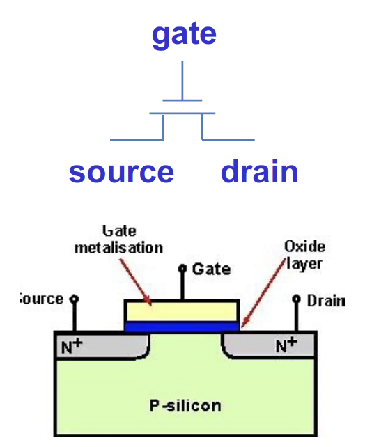
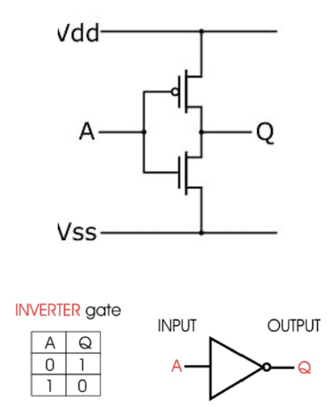
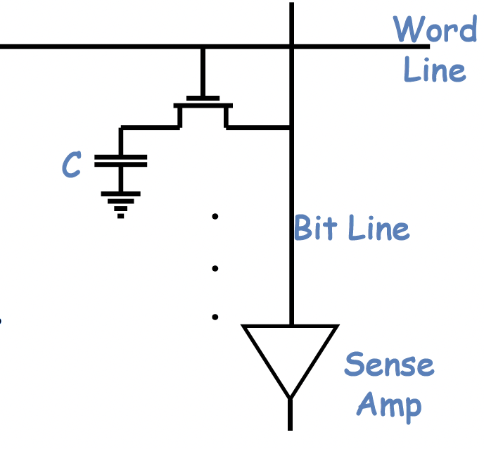
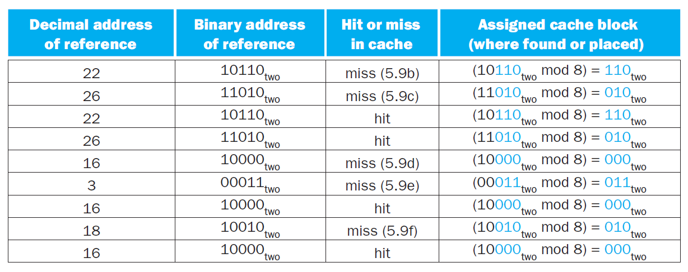
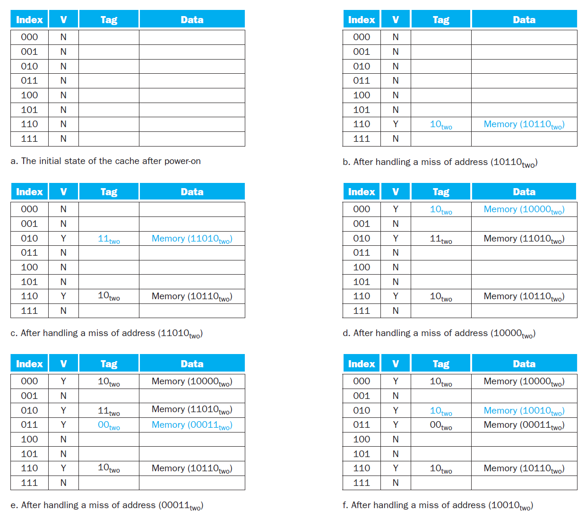

---
hide:
  #- navigation # 显示右
  #- toc #显示左
  - footer
  - feedback
comments: true
---

# Chapter 5 : Memory Hierarchy

## Memory Technologies

> 内存中常用的有四大工艺：SRAM、DRAM 、Flash 和 Disk
***
### SRAM

SRAM（静态随机访问存储器）具有如下特性：

- 它只有一个访问端口，具备读和写的能力
- 数据以一对反相门（Inverting Gates）来存储
- 尽管读和写的访问时间不同，访问任何数据所需的时间是固定的
- 由于无需刷新 (Refresh)，因此访问时间接近于处理器的周期时间，读写非常快
- 通常用 6-8 个晶体管表示一个位，用于防止读取对存储信息的干扰，也因此比 DRAM 占用更多空间
- 耗电少

!!! note "SRAM 相关结构"

	=== "Transistor"
	
		
	
	=== "Invertor(CMOS)"
	
		

### DRAM

DRAM（动态随机访问存储器）具有如下特性：

- 1 位数据以电荷的形式被存储在 1 个电容中
	- 因此需要周期性地对电容**刷新**（Refresh）以长时间保存电荷，具体做法就是读取并且写回该数据
- 比较小型，但是因为要不断刷新所以比 SRAM 慢很多（大概能慢 5 到 10 倍）
	- 为了减少刷新对访问时间的占用，DRAM 通过两级译码结构实现一次性刷新一整行的数据（这种行结构也有助于提升性能）
- 用 1 个晶体管对数据（电荷）进行访问（读 / 写）（晶体管用比 SRAM 少，因此更便宜）
- DRAM 内部被划分为多个**存储体**（Memory Bank），每个存储体都有一些**行缓冲器**（Row Buffer），这样可以实现对同一地址的同步访问
	- 假如有 n 个存储体，在一个访问时间内便能轮换访问 n 个存储体，使得带宽提升了 n 倍，这种轮换访问方法被称为地址交错 (Address Interleaving)
	
	

!!! note "DRAM 的读写操作"

	
		
	=== "Write"
	
		根据输入数据（0/1）将当前位线（Bit line）设置为高/低电平，并将当前字线（Word Line）设置为高电平对电容充电
	
	=== "Read"
	
		现将每一条位线都预充电（Precharge）到一个中间状态（即介于高电平和低电平之间），然后将字线设置为高电平对电容充电，每个电容或是向位线放电，或是由位线充电。放电位线电压就上升一点，充电位线电压就下降一点，由放大器（Sence Amplifier）检测到电压波动并输出结果（即原来电容存储的是 0 还是 1）

DRAM 的架构如下图所示：

DRAM 有如下类别：

- SDRAM（同步 DRAM）：通过一个时钟来消除同步内存和寄存器所需的时间
- DDR（Double Data Rate）DRAM：能在时钟的上升沿和下降沿中进行数据传输，从而提升了一倍的带宽 (Bandwidth)
- QDR（Quad Data Rate）DRAM：将 DDR DRAM 的输入和输出分开
- 双内联内存模块 (Dual Inline Memory Module)
***
### Flash

闪存（Flash Storage）具有如下特性：

- 是一种非易失性（即断电数据也不会丢失）、电子可擦除、可编程只读的半导体存储器 (EEPROM)
- 比磁盘快百倍到千倍
- 更小型、耗电更小，但也更贵（介于地盘和 DRAM）
- 写操作可能会磨损存储器内的数据
	- 为减缓磨损，闪存会用一个控制器来分散 (Spread) 写操作到被更少使用的区域，这称为**磨损均衡**(Wear Leveling)

闪存有如下几类：

- 或非闪存：每一个 Cell 像是一个或非门
	- 随机读写更快
	- 通常用于存储嵌入式系统的指令
- 与非闪存：每一个 Cell 像是一个与非门
	- 更为密集，但是以块为单位进行操作
	- 更为便宜
	- 通常用于存储 USB 密钥、媒体数据等
***
### Disk

磁盘（Disk）是一个非易失性、利用磁技术的存储器，由一组绕轴旋转的金属盘片（Platter）构成，盘片上覆有磁记录材料，通过一个读写头（Read-Write Head）来读写信息，整个驱动器被密封在磁盘内部

- 迹（Track）：磁盘表面上的同心圆
- 区（Sector）：构成迹的某个片段，是能够被读写的最小单位的信息
	- 每个区记录了区的 ID、数据和纠错码（Error Correcting Code, ECC，用于隐藏和记录错误）
- 柱面（Cylinder）：读写头下所有的迹（形成一个柱面）
- 磁材料上记录的序列：区号、间隔、包含纠错码的区信息、间隔、下个区的编号 ...
- 寻找（Seek）：定位读写头到要被访问的迹的过程
- 旋转时延（Rotation Latency）：将要访问的区旋转至读写头下所需的时间，通常假设为旋转时间的一半
- 传输时间（Transfer Time）

如果要访问其中的一个区，其大致步骤如下：

- 等待前一个访问
- 通过移动读写头寻找被访问的迹
- 旋转时延
- 数据传输
***
## Memory Hierarchy Introduction

内存层级中涉及到的一个重要思想是局部性原则（Principle of Locality），它由以下两部分组成：

- **时间局部性**（Temporal Locality）：如果内存的某个项目被用到过，那么在短时间内它很有可能被再次使用
    - 举例：循环中的指令很可能会被重复访问
- **空间局部性**（Spatial Locality）：如果内存的某个项目被用到过，与它地址邻近的项目很可能在不久后也会被使用
    - 举例：通常指令是按顺序执行的、按顺序访问数组元素

因此，结构化的内存被设计出来，便有了**内存层级**（Memory Hierarchy），它是一种多级的存储结构，其规定：越靠近处理器的内存，它的访问时间更短、存储空间更小、成本更高。

- 更靠近处理器的一级内存是离处理器更远的内存的一个子集，且所有的数据被存储在最底层的内存中
- 在一个时间段内，数据只能在相邻的两个内存层级之间进行传输（复制），因此在同一时间内我们仅关注相邻的两级内存结构

与内存层级相关的一些基本概念：

- 块 / 行 (Block/Line)：在两级内存结构中的最小信息单元（下图标出的蓝色方块）
- 字（Word）：Cache 与 CPU 之间进行信息交互的单元

	

- **命中**（Hit）：处理器所需的数据出现于本层内存中
    - **命中率**（Hit Rate/Ratio）：能够在本层内存中找到数据的次数占总次数的比例，通常作为层次结构的性能衡量指标之一
    - **命中时间**（Hit Time）：访问本层内存所需的时间，包括判断是否命中或失效所需的时间
- **缺失**（Miss）：处理器所需的数据不存在于本层内存中，此时需要访问下层内存的内容并检索所需数据
    - **缺失率**（Miss Rate/Ratio）（$= 1 - \text{命中率}$）：未能在本层内存中找到数据的次数占总次数的比例
    - **缺失损失**（Miss Penalty）：从下层内存中获取所需数据块的时间，包括以下操作：访问数据块、将数据从下层传输到上层、将数据插入上层内存的合适位置、将数据块继续传给处理器
***
## The Basics of Cache

**缓存**（Cache）：在内存层级中表示介于处理器和主内存之间的层级，也可以指代任何借助局部访问优势的存储器。但本章内容所涉及到的缓存均指处理器内部的缓存。

利用上面我们所说的局部性原则，缓存的体现如下：

- 空间局部性：从主存中取回待访问数据时，会同时取回与其位置相邻的主存单元的数据
- 时间局部性：保存近期频繁被访问的主存单元的数据
***
### Access of Cache

Cache 的访问过程如下：

***
### Structure of Cache

Cache 的主要结构如下：

- Cache 被分成若干行，每行的大小与主存块相同
- Cache 每行包含四部分：
	- 标签 Tag 从 CPU 访问主存的地址中剥离得到（识别数据在 Cache 保存的具体数据块）
	- Data 是与主存交换的数据块
	- Valid 表示 Cache 中的数据是否有效（1 表示数据存在，0 表示不存在，初始均为 0）
	- Dirty 表示 Cache 中的数据是否为最新
***
### Address Mapping Mechanism in Cache

先考虑一种很简单的缓存，以及一个很简单的情况：假如处理器请求一个单字数据 $X_n$，缓存的内容发生了如下的变化：

由于原来缓存内只有数据 $X_1,X_2,…,X_{n−1}$，因此 $X_n$​ 不在缓存内，所以出现了缺失的情况，需要从更底层的内存中获取该数据，并且放在缓存中。那么我们如何得知数据是否在缓存中，且如何找到该数据呢？

我们很容易想到可以用地址映射来解决这个问题，让每个字数据基于内存地址进行定位，这能够确保每个字数据占据唯一的一块空间，帮助实现在Cache中快速查找数据，Cache 内部的映射机制大致如下：

不难发现，可能会存在不同字数据占据相同缓存块的情况，这里我们用**标签**（Tag）来区分数据。因为底层内存的空间更大，因此通常会用数据在底层内存的低位地址来表示在缓存中的地址，而**高位地址**就作为区分相同缓存块下不同数据的标签，如下图所示：

上面的图片中，缓存块数为 8，而内存块数为 32，因此字数据内存地址的低 3 位（因为 $8=2^3$）对应它在缓存中的地址（灰色和蓝色表示两类低位地址），而剩下的高 2 位则作为区分同一缓存块下的不同数据的标签。

最简单的一种映射被称为**直接映射缓存**（Direct-Mapped Cache)。可以用下面的公式计算字数据在缓存中的位置：

$$
\text{Cache Location} = (\text{Block address})\text{ modulo }(\text{Number of blocks in the cache})
$$

- 特别地（也是在一般情况下地），若 Cache 有 $2^n$ 个数据块，那么索引值即为主存块地址的最低 $n$ 位
- 在直接映射缓存当中，Cache 利用索引+标签+Valid+Dirty 位共同锁定目标：
	- 首先根据给出的主存块大小、Cache大小，从主存地址中剥离出字节偏移量字段、索引字段以及标签字段
	- 根据索引字段找到目标 Cache 行
	- 目标 Cache 行中的标签字段与剥离出的标签字段进行匹配，如果匹配成功则找到正确的数据
	- 判断 Valid 位、Dirty 位是否有效

!!! example "Example"

	我们对一个八块的缓存进行九次访问：
	
	
	
	下图展示了在访问过程中缓存内容的变化：
	
	
	
	不难发现，第 8 次访问（$18=(10010)_{\text{two}}$）与第 2 次访问（$26=(11010)_{\text{two}}​$）存在冲突，因为它们占据相同的缓存块。这种情况下，最近访问的数据将会占据该缓存块的位置（即覆写缓存块内已有的数据），这体现了时间局部性的思想。

下图展示了内存地址（假定为 64 位）与缓存位置之间的关系：

正如前面提到过的，我们可以将内存地址分为以下几部分：

- **标签字段**：用于区别相同缓存块下的不同数据
- **缓存索引**：用于选择缓存块
- 由于一个地址表示一个字节，并且在缓存中数据是以**字**（4 字节）为单位的，因此地址的低 2 位可以被忽略

!!! tip "计算直接映射缓存的空间大小"

	给定以下条件：
	
	- 64 位的内存地址
	- 共有 $2^n$ 个缓存块，因此用 $n$ 位地址来表示索引
	- 每个缓存块可容纳 $2^m$ 个字数据（即 $2^{m+2}$ 字节的数据），因此用 $m$ 位地址来表示字
	
	那么剩下用于表示标签字段的位数为 $64−(n+m+2)$ 位
	
	则缓存空间大小的计算公式为（单位为 bit）：
	
	$$
	\begin{aligned}
	& 2^n\times(\text{block size + tag size + valid field size})\\
	=& 2^n\times(2^m\times 32+(64-n-m-2)+1)\\
	=& 2^n\times(2^m\times 32+63-n-m)
	\end{aligned}
	$$
	
	对于上面给出的缓存，它有 $2^{10}$ 个缓存块（有 10 位索引位），每个缓存块仅有 $2^0$ 个字数据，因此它的标签位有 52 位。

- 在一般的命名传统中，我们仅用缓存存储的子数据大小来表示缓存。对于上面的缓存，由于它一共可容纳 1024 个字数据，即 4096 字节的数据，因此可以称其为 4 KiB 缓存。

!!! example "Examples"

	=== "Example 1"
	
		=== "Question"
		
			若一个缓存可容纳 16 KiB 的数据，且每个缓存块可容纳四个字数据（假定使用 64 位地址），那么该缓存所需的空间大小是多少呢？（单位：位）
		
		=== "Answer"
		
			- 先计算缓存块的个数：由题意缓存可容纳 4096 个字，又因每个块可装四个字，因此一共有 1024 个块
			- 标签位数为：64-10-2-2=50
			- 所以总的空间大小为：
			
			$$
			2^{10}×(4×32+50+1)=2^{10}×179=179\text{ Kibibits}=22.4\text{ KiB}
			$$
			
	
	=== "Example 2"
	
		=== "Question"
		
			给定一个缓存，它有 64 块，每块空间为 16 字节，请问内存字节地址为 1200 的数据所映射到的块的编号为多少？
		
		=== "Answer"
		
			- 每个缓存块仅容纳一个字数据
			- 该数据是内存中第 $\frac{1200}{16} = 75$ 个字数据
			- 对应块编号为 $75\text{ mod }64 = 11$
			- 实际上，内存地址在 1200-1215 之间的数据都会映射到这个缓存块上

